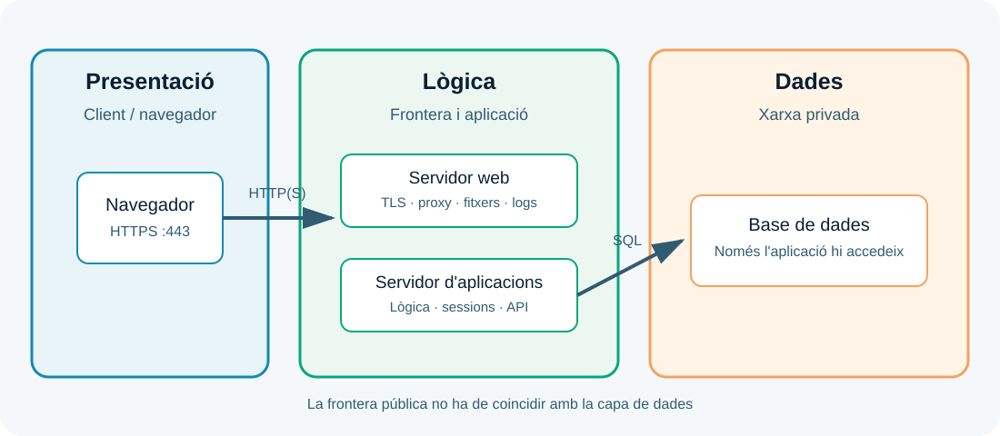
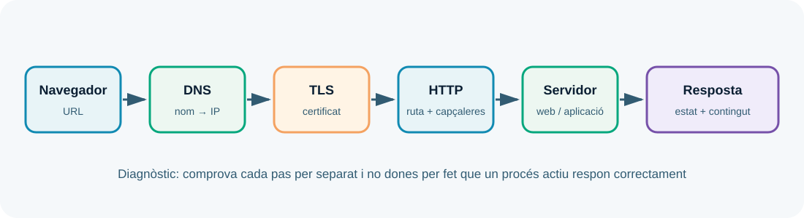
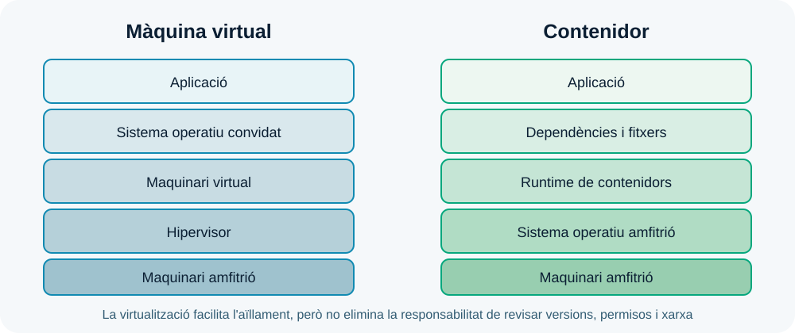
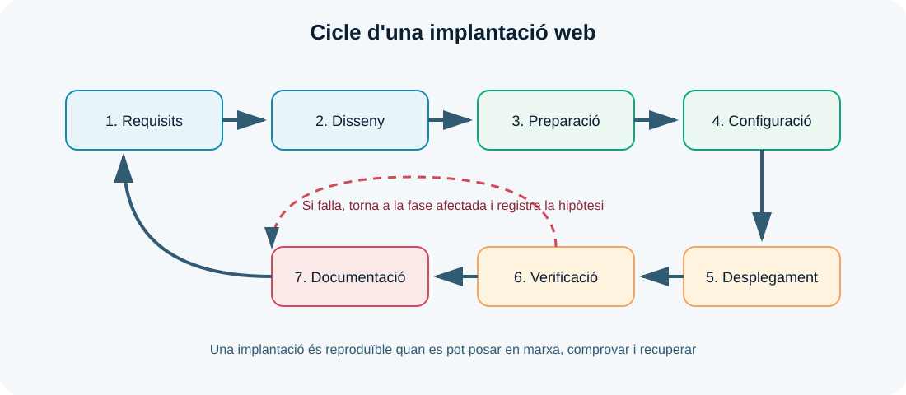

---
hide:
  - navigation
---
# UP1. Implantació d'arquitectures web

## Resultats d'aprenentatge treballats i ponderació

D'acord amb la **programació didàctica del mòdul 0614**, aquesta unitat de programació treballa principalment un únic resultat d'aprenentatge:

| RA | Resultat d'aprenentatge | Pes en la nota final del mòdul |
| --- | --- | ---: |
| **RA1** | **Implanta arquitectures web analitzant i aplicant criteris de funcionalitat.** | **10 %** |

Per tant, la qualificació obtinguda en aquesta UP contribueix amb un **10 % de la nota final del mòdul**. El 10 % és el pes del RA1 —i de la UP1— dins del mòdul complet; no és el percentatge d'una única prova o d'una única part de l'activitat.

### Criteris d'avaluació associats

La seqüenciació de la programació assigna a la UP1 els criteris **RA1.a, RA1.b, RA1.c, RA1.d, RA1.e, RA1.h i RA1.i**. En el conjunt del mòdul, el RA1 es concreta en aquesta distribució interna:

| Criteri | Què es comprova | Pes dins del RA1 |
| --- | --- | ---: |
| **RA1.a** | Analitzar aspectes generals de les arquitectures web, les seues característiques, avantatges i inconvenients. | 10 % |
| **RA1.b** | Descriure els fonaments i protocols del funcionament d'un servidor web. | 10 % |
| **RA1.c** | Realitzar la instal·lació i configuració bàsica de servidors web. | 10 % |
| **RA1.d** | Realitzar la instal·lació i configuració bàsica de servidors d'aplicacions. | 15 % |
| **RA1.e** | Realitzar la instal·lació i configuració bàsica de tecnologies de virtualització de servidors en el núvol i en contenidors. | 15 % |
| **RA1.f** | Realitzar proves de funcionament dels servidors i de les tecnologies de virtualització. | 10 % |
| **RA1.g** | Analitzar l'estructura i els recursos que componen una aplicació web. | 10 % |
| **RA1.h** | Descriure els requeriments del procés d'implantació d'una aplicació web. | 10 % |
| **RA1.i** | Documentar els processos d'instal·lació i configuració realitzats. | 10 % |

!!! info "Com interpretar els percentatges"
    Els percentatges de la taula anterior són la distribució interna del **RA1** i sumen el 100 % d'aquest RA. Com que el RA1 pesa un 10 % del mòdul, per exemple, el criteri RA1.d representa un 15 % del RA1, és a dir, un 1,5 % de la nota final del mòdul. La qualificació concreta s'obtindrà amb els instruments establits en la programació i amb les evidències de la UP1 i de la formació en empresa quan corresponga.

## Com estudiar aquesta unitat

Implantar una aplicació web significa preparar tots els elements necessaris perquè una persona puga accedir-hi, utilitzar-la i recuperar-la si alguna cosa falla. No és únicament copiar fitxers en un servidor: cal entendre l'arquitectura, configurar els serveis, protegir les comunicacions, comprovar el resultat i deixar una documentació que una altra persona puga seguir.

En aquesta unitat treballaràs la visió general que necessitaràs en la resta del mòdul. Més endavant estudiaràs amb profunditat els servidors web, els servidors d'aplicacions, la transferència d'arxius, els serveis de xarxa i el control de versions. Ara aprendràs a relacionar totes aquestes peces.

> **Pregunta guia:** quina arquitectura necessita una aplicació web i com podem demostrar que funciona?

Com que el mòdul és semipresencial, llegeix cada apartat amb un editor o terminal obert i intenta reproduir els exemples en un entorn local autoritzat. No cal memoritzar ordres aïllades: l'objectiu és saber què estàs comprovant, quina resposta esperes i com interpretaries una resposta incorrecta.

!!! note "Ruta recomanada d'estudi"
    1. Llegeix la teoria i dibuixa amb les teues paraules el recorregut d'una petició.
    2. Repassa el glossari i respon les preguntes de comprovació de cada bloc.
    3. Completa l'[activitat integradora de la UP1](up1/activitats/activitat-1-mapa-arquitectura.md).
    4. Fes l'[autoavaluació](up1/activitats/autoavaluacio.md) i torna als apartats que no pugues explicar sense mirar els apunts.

## Dades i resultats d'aprenentatge

| Element | Referència |
| --- | --- |
| Duració de referència | **7 hores al centre** + treball semipresencial |
| Producte final | Disseny justificat, desplegament local i informe de verificació |

En acabar la UP1, has de poder:

- explicar què és una arquitectura web i quines responsabilitats té cada component;
- comparar els models client-servidor, monolític, de tres capes i basat en serveis;
- descriure el recorregut d'una petició des de l'URL fins a la resposta;
- relacionar noms DNS, adreces IP, ports, protocols, rutes i codis d'estat;
- distingir servidor web, servidor d'aplicacions, base de dades i proxy invers;
- identificar l'estructura, les dependències i la configuració d'una aplicació;
- diferenciar màquines virtuals, contenidors i serveis gestionats;
- convertir necessitats d'un projecte en requisits tècnics verificables;
- instal·lar o posar en marxa un servei web local i comprovar-lo;
- documentar versions, ordres, proves, incidències i procediments de recuperació.

### Relació amb els criteris de RA1

| Criteri que es practica | On apareix en aquesta UP |
| --- | --- |
| Analitzar arquitectures web i els seus models | Apartats 1 i 2, diagrama de l'activitat |
| Identificar protocols, adreces i ports | Apartat 3 i proves de l'activitat |
| Reconèixer servidors web i d'aplicacions | Apartat 4 |
| Entendre virtualització i contenidors | Apartat 5 |
| Analitzar l'estructura i els recursos d'una aplicació | Apartat 6 |
| Definir requisits de desplegament | Apartat 7 |
| Verificar i documentar una implantació | Apartats 8 i 9 |

## 1. Què és una arquitectura web?

Una **arquitectura web** és la descripció dels components d'un sistema web, de les responsabilitats de cada component i de les comunicacions que els connecten. També explica on s'executen els components, quines dades manegen, quines fronteres de seguretat hi ha i com es comprovarà que el conjunt funciona.

Per exemple, quan una usuària consulta el catàleg d'una botiga, pot intervenir el navegador, un servei DNS, un tallafoc, un servidor web, un servidor d'aplicacions, una base de dades i un servei d'emmagatzematge d'imatges. Tots formen part de la mateixa funcionalitat encara que estiguen instal·lats en equips diferents.

Un diagrama útil no és una col·lecció de caixes amb noms de productes. Ha de respondre, com a mínim, aquestes preguntes:

1. Qui inicia la comunicació?
2. Quin component rep cada tipus de petició?
3. Quin protocol i quin port s'utilitzen?
4. On s'executa la lògica de negoci?
5. On es guarden les dades?
6. Quins components són accessibles des de la xarxa pública?
7. Què passa si un component deixa de funcionar?



### Components i responsabilitats

| Component | Responsabilitat principal | Exemple de resultat |
| --- | --- | --- |
| Client | Iniciar peticions i mostrar o consumir respostes. | Un navegador envia `GET /productes`. |
| DNS | Associar un nom amb una adreça o un altre recurs de xarxa. | `botiga.test` resol a `192.0.2.20`. |
| Servidor web | Rebre HTTP, publicar fitxers i derivar peticions. | Retorna `index.html` o fa proxy a l'aplicació. |
| Servidor d'aplicacions | Executar la lògica dinàmica i gestionar el flux de l'aplicació. | Calcula el preu i demana dades. |
| Base de dades | Persistir informació estructurada. | Retorna els productes disponibles. |
| Emmagatzematge | Conservar fitxers, pujades o còpies. | Desa una imatge o un fitxer exportat. |
| Logs i monitoratge | Deixar evidències i detectar problemes. | Registra una petició `404` o una fallada. |

La separació de responsabilitats facilita el manteniment. Si la pàgina no carrega, podem preguntar si falla la resolució DNS, la connexió, el servidor web, l'aplicació o la base de dades. Sense aquesta separació, qualsevol error sembla simplement «la web no funciona».

!!! question "Comprovació 1"
    En un diagrama, què aportaria indicar que la base de dades està en una xarxa privada i que el servidor web és l'únic component amb port públic?

## 2. Models d'arquitectura

Els models d'arquitectura són formes habituals d'organitzar les responsabilitats. No són receptes obligatòries. La millor opció depèn de la mida del projecte, el nombre d'usuaris, les dades, l'equip, el pressupost i la capacitat d'operar el sistema.

### 2.1. Model client-servidor

En el model **client-servidor**, un client sol·licita un recurs o una operació i un servidor respon. És el model bàsic d'una aplicació web: el navegador és el client i el sistema que escolta HTTP és el servidor.

És fàcil d'entendre i adequat per a un laboratori o una aplicació molt senzilla. Però «servidor» pot ocultar moltes responsabilitats: podria publicar fitxers, executar codi i guardar dades al mateix equip. Quan el sistema creix, convé separar-les.

### 2.2. Aplicació monolítica

En una aplicació **monolítica**, la major part de la funcionalitat es desplega com una única unitat. La interfície, la lògica i sovint l'accés a dades formen part del mateix projecte o procés.

Els avantatges són un desplegament inicial senzill, menys comunicacions de xarxa i una depuració directa. Els inconvenients són que un canvi petit pot requerir desplegar-ho tot, un error pot afectar moltes funcionalitats i l'escalat és menys selectiu.

Monolític no vol dir necessàriament desordenat ni insegur. Un monòlit ben estructurat pot ser una decisió molt adequada per a una primera versió.

### 2.3. Arquitectura de tres capes

La separació en **presentació, lògica i dades** és una forma didàctica i pràctica d'organitzar una aplicació:

- la **capa de presentació** mostra la informació o ofereix una API;
- la **capa de lògica** valida peticions, aplica regles i coordina operacions;
- la **capa de dades** consulta i persisteix informació.

Les capes són responsabilitats lògiques, no necessàriament tres màquines. En un laboratori poden conviure en un únic ordinador; en un entorn més gran poden estar separades en serveis o xarxes diferents.

### 2.4. Arquitectura basada en serveis

En una arquitectura basada en **serveis**, una funcionalitat o un domini pot executar-se com un servei independent i comunicar-se amb els altres mitjançant una API o missatges. Això pot permetre escalar o actualitzar una part sense desplegar tot el sistema.

També introdueix més complexitat: cal controlar més versions, xarxes, logs, permisos i possibles errors de comunicació. Dividir una aplicació en serveis sense una necessitat clara no és una millora automàtica.

| Model | Punt fort | Risc o cost |
| --- | --- | --- |
| Client-servidor | Simplicitat conceptual. | Pot amagar massa responsabilitats en un sol servidor. |
| Monòlit | Desplegament i depuració inicials fàcils. | Canvis i escalat afecten el conjunt. |
| Tres capes | Separa responsabilitats i facilita el manteniment. | Necessita més configuració i coordinació. |
| Serveis | Evolució i escalat independents. | Augmenta la complexitat operativa. |

**Criteri pràctic:** comença amb l'arquitectura més senzilla que complisca els requisits i deixa escrites les raons per les quals podria evolucionar.

## 3. El recorregut d'una petició web

Una URL conté informació que el client utilitza per localitzar un recurs:

```text
https://botiga.exemple.test:443/catalog/productes?id=12#detall
│       │                      │   │                 │
│       │                      │   └─ paràmetre      └─ fragment local
│       │                      └─ ruta
│       └─ domini i, opcionalment, port
└─ esquema o protocol
```

Quan el navegador obri `https://botiga.exemple.test/catalog`, el recorregut simplificat és el següent:

1. El navegador separa l'esquema, el domini, el port implícit i la ruta.
2. El sistema consulta la memòria cau i després el DNS per trobar l'adreça IP.
3. El client estableix una connexió amb el port del servei: habitualment `80/tcp` per HTTP o `443/tcp` per HTTPS.
4. En HTTPS, client i servidor negocien TLS i el servidor presenta un certificat.
5. El client envia una petició HTTP amb mètode, ruta, capçaleres i, si cal, un cos.
6. El servidor web selecciona la configuració adequada i serveix un fitxer o deriva la petició.
7. L'aplicació valida la petició, aplica la lògica i consulta altres serveis.
8. El servidor construeix la resposta i la retorna al client.
9. El navegador interpreta la resposta i pot fer noves peticions per a CSS, JavaScript, imatges o dades.



### 3.1. DNS no és una pàgina web

El **DNS** és un sistema distribuït de noms. La seua funció és permetre que usem noms memoritzables en lloc d'adreces IP. Un registre `A` associa un nom amb una adreça IPv4; un registre `AAAA`, amb una IPv6; un registre `CNAME`, amb un altre nom.

Quan el DNS falla, el navegador pot mostrar un error de resolució encara que el servidor web estiga encés. Per això el primer diagnòstic ha de separar «el nom no resol» de «el servei no respon».

### 3.2. IP, port i socket

Una **adreça IP** identifica una interfície dins d'una xarxa. Un **port** identifica el servei que escolta en aquell equip. La combinació d'adreça, port i protocol determina el punt de comunicació. Per exemple, `192.0.2.20:443/TCP` descriu un servei HTTPS concret.

El port que veu el client no sempre coincideix amb el port intern de l'aplicació. Un proxy pot rebre `443` i derivar la petició a `8080` en una xarxa privada. Aquesta diferència s'ha d'escriure al diagrama i a la documentació.

### 3.3. HTTP: peticions i respostes

HTTP és un protocol de petició-resposta. Alguns mètodes habituals són:

| Mètode | Ús habitual | Exemple |
| --- | --- | --- |
| `GET` | Consultar un recurs sense modificar-lo. | `GET /catalog` |
| `POST` | Enviar dades per crear o iniciar una operació. | `POST /contacte` |
| `PUT` | Substituir o actualitzar un recurs. | `PUT /usuaris/12` |
| `DELETE` | Sol·licitar l'eliminació d'un recurs. | `DELETE /fitxers/8` |
| `HEAD` | Consultar capçaleres sense descarregar el cos. | `HEAD /index.html` |

El **codi d'estat** resumeix el resultat:

- `2xx`: operació correcta, com `200 OK` o `201 Created`;
- `3xx`: redirecció, com `301` o `302`;
- `4xx`: problema atribuïble a la petició o a la identitat, com `404 Not Found` o `403 Forbidden`;
- `5xx`: error del servidor o d'un component intern, com `500` o `502`.

Un `200` només indica que el servidor ha retornat una resposta correcta segons HTTP. No garanteix que les dades siguen les esperades ni que totes les funcions de l'aplicació funcionen.

### 3.4. HTTPS i TLS

**HTTPS** és HTTP transportat sobre **TLS**. TLS proporciona:

- **confidencialitat**, perquè dificulta que tercers lligen el contingut;
- **integritat**, perquè permet detectar modificacions en trànsit;
- **autenticació del servidor**, mitjançant un certificat que el client valida.

Un certificat pot fallar perquè està caducat, perquè el nom no coincideix, perquè la cadena de confiança és desconeguda o perquè el rellotge del sistema és incorrecte. En un laboratori podem usar certificats locals, però hem d'explicar aquesta excepció i no convertir `-k` en una pràctica de producció.

Per observar les capçaleres i els codis de resposta en un entorn local:

```bash
curl -I http://127.0.0.1:8080
curl -v http://127.0.0.1:8080/ruta-inexistent
curl -vk https://127.0.0.1:8443
```

L'opció `-v` mostra el diàleg de connexió i `-k` desactiva la validació del certificat. Usa `-k` només quan estigues diagnosticant un certificat de laboratori i deixa constància de la raó.

!!! question "Comprovació 2"
    Si `getent hosts botiga.test` no retorna cap IP, té sentit començar revisant el procés de l'aplicació? Justifica l'ordre de les comprovacions.

## 4. Servidor web, proxy invers i servidor d'aplicacions

### 4.1. Servidor web

Un **servidor web** escolta peticions HTTP i retorna recursos web. Quan el recurs és estàtic, el servidor pot llegir un fitxer del directori publicat i enviar-lo directament. HTML, CSS, JavaScript, imatges, icones i fitxers de descàrrega són exemples de contingut estàtic.

A més, sol encarregar-se de seleccionar el lloc virtual, aplicar regles d'accés, limitar mides, registrar peticions i, sovint, finalitzar TLS. Nginx i Apache HTTP Server són exemples coneguts, però el concepte és independent del producte.

### 4.2. Servidor d'aplicacions

Un **servidor d'aplicacions** o runtime d'aplicació executa codi que canvia segons la petició, la sessió o les dades. Pot generar HTML, servir una API, validar usuaris, aplicar regles de negoci i obrir connexions amb una base de dades.

L'aplicació no hauria de confiar en què el client faça les validacions: el navegador pot ser manipulat. Les comprovacions importants s'han de repetir al servidor d'aplicacions.

### 4.3. Proxy invers

Un **proxy invers** rep la petició en nom d'un o més serveis interns. Des del punt de vista del client, és el servidor públic; des del punt de vista intern, selecciona el servei de destí.

```text
Client ── HTTPS :443 ──> Proxy invers ── HTTP :8080 ──> Aplicació
                              │
                              └── fitxers estàtics / logs / límits
```

Aquesta funció permet no exposar directament el port intern de l'aplicació, centralitzar TLS i aplicar regles comunes. Cal documentar les capçaleres reenviades, com `Host` o `X-Forwarded-For`, perquè una mala configuració pot afectar les redireccions, els logs o la identificació del client.

### 4.4. Base de dades i dependències

La base de dades conserva informació que ha de sobreviure al reinici de l'aplicació. El servidor d'aplicacions necessita credencials, una adreça de connexió, un port i sovint migracions d'esquema. Aquestes dades formen part de la configuració, però les contrasenyes són **secrets** i no han d'aparéixer en el repositori ni en captures públiques.

Una arquitectura sana limita la comunicació: el client arriba al proxy, el proxy arriba a l'aplicació i l'aplicació arriba a la base de dades. La base de dades no necessita un port accessible des d'Internet.

## 5. Estructura d'una aplicació web

Abans de desplegar, identifica què necessita realment el projecte. Una estructura típica pot incloure:

```text
projecte-web/
├── public/              # fitxers exposables al client
├── src/                 # codi font de l'aplicació
├── config/              # configuració no sensible o plantilles
├── tests/               # proves automàtiques o manuals
├── migrations/          # canvis de l'esquema de dades
├── .env.example         # noms de variables, sense secrets
├── Dockerfile o script  # instruccions de construcció
└── README.md            # instal·lació, ús i verificació
```

No totes les aplicacions tenen aquests directoris ni han de copiar aquesta estructura literalment. El que importa és distingir:

- **codi font**, que es transforma o executa;
- **recursos públics**, que es poden enviar al navegador;
- **dependències**, que cal instal·lar amb versions conegudes;
- **configuració**, que canvia segons l'entorn;
- **dades persistents**, que no s'han de perdre quan es recrea un contenidor;
- **secrets**, que s'han d'injectar de manera protegida;
- **proves i documentació**, que permeten comprovar i repetir el procés.

El resultat que es desplega s'anomena sovint **artefacte**: pot ser una carpeta de fitxers estàtics, un paquet, una imatge de contenidor o un fitxer compilat. L'artefacte ha de ser identificable amb una versió. Si no sabem quin codi s'ha publicat, tampoc podem investigar una incidència amb precisió.

## 6. Virtualització i contenidors

### 6.1. Màquina virtual

Una **màquina virtual (VM)** simula un ordinador amb processador, memòria, disc i xarxa virtuals. Un hipervisor administra aquests recursos i permet instal·lar un sistema operatiu convidat complet.

És útil quan cal provar una distribució diferent, simular diversos servidors o practicar una instal·lació que modifica el sistema operatiu. Té més consum de disc i memòria, i obliga a actualitzar i protegir també el sistema convidat.

### 6.2. Contenidor

Un **contenidor** aïlla un procés i les seues dependències utilitzant el nucli del sistema amfitrió. Una imatge descriu una plantilla immutable; un contenidor és una instància en execució d'aquesta imatge.

Els contenidors faciliten repetir un servei i evitar que les dependències d'un projecte contaminen el sistema principal. Però no són una frontera de seguretat absoluta. Cal revisar l'origen de la imatge, la versió, l'usuari del procés, els permisos, els ports exposats, les xarxes, els volums i els secrets.



### 6.3. Imatges, volums, xarxes i ports

- Una **imatge** és la base versionada a partir de la qual es crea un contenidor.
- Un **contenidor** és el procés i el seu entorn en execució.
- Un **volum** conserva dades fora del cicle de vida del contenidor.
- Una **xarxa** permet que els serveis es troben entre si sense publicar-los tots.
- Un **mapatge de ports** connecta un port de l'amfitrió amb un port del contenidor.

Exemple mínim per a un laboratori local:

```yaml
services:
  web:
    image: nginx:1.27-alpine
    ports:
      - "8080:80"
```

En aquest exemple, `8080` és el port de l'amfitrió i `80` és el port intern del servei. El navegador consulta `http://localhost:8080`. Fixar `nginx:1.27-alpine` fa que la pràctica siga més reproduïble que usar `latest`, encara que una implantació real també hauria de registrar el canvi i actualitzar la imatge de manera planificada.

## 7. Del problema als requisits de desplegament

Un **requisit** descriu una necessitat del sistema. Una **tecnologia** és una possible manera de satisfer-la. «Necessitem HTTPS» és un requisit tècnic o de seguretat; «utilitzarem Nginx» és una decisió. No convé començar triant productes abans d'entendre les necessitats.

### 7.1. Tipus de requisits

| Tipus | Pregunta que respon | Exemple verificable |
| --- | --- | --- |
| Funcional | Què ha de poder fer l'usuari? | El client pot consultar `/catalog`. |
| Tècnic | Quins runtimes, protocols o recursos necessita? | L'aplicació funciona amb PHP 8.3 i MariaDB. |
| Seguretat | Què s'ha de protegir? | La base de dades no té port públic. |
| Rendiment | Amb quina capacitat ha de respondre? | La pàgina principal respon en menys de 2 s en el laboratori. |
| Disponibilitat | Com es recupera d'una fallada? | El servei es pot reiniciar i les dades persisteixen. |
| Operatiu | Com s'instal·la, actualitza i observa? | Hi ha ordres, logs i procediment de retorn. |

Un requisit és millor quan és concret, observable i té una prova associada. «Ha de ser ràpid» és ambigu; «ha de respondre en menys de dos segons amb 10 peticions consecutives en l'entorn definit» és mesurable, encara que el valor s'haurà d'acordar amb el projecte.

### 7.2. Matriu requisit–prova

La matriu següent connecta necessitat, implementació i evidència:

| ID | Requisit | Decisió | Prova i evidència |
| --- | --- | --- | --- |
| R1 | Publicar la pàgina inicial | Servidor web en `8080` | `curl -I`; captura o sortida guardada |
| R2 | No exposar la base de dades | Xarxa privada i sense port públic | Llista de ports i regla de xarxa |
| R3 | Recuperar el servei | Configuració reproduïble | Aturada, arrencada i resposta correcta |
| R4 | No publicar credencials | Variables de l'entorn o gestor de secrets | Revisió del repositori i configuració fictícia |

Aquesta matriu evita que la documentació es limite a descriure el que s'ha fet: també demostra que el que s'ha fet respon a una necessitat.

## 8. Instal·lació, configuració i posada en marxa

Instal·lar un servei és fer disponibles els fitxers i dependències. Configurar-lo és indicar-li com escoltar, què publicar, amb quin usuari funcionar, a quins serveis connectar i com registrar errors. Posar-lo en marxa és iniciar el procés i verificar que ha carregat la configuració esperada.

Abans de començar, anota:

- sistema operatiu i versió;
- eina de desplegament i versió;
- nom i versió de la imatge o del paquet;
- ports utilitzats i possibles conflictes;
- directori o volum de dades;
- variables necessàries, sense escriure els valors secrets;
- ordre d'inici, ordre d'aturada i ubicació dels logs.

Després de posar en marxa el servei, comprova tres nivells diferents:

1. **Procés:** el servei està actiu?
2. **Xarxa:** hi ha un procés escoltant al port esperat?
3. **Aplicació:** la ruta retorna el contingut i el codi d'estat esperats?

Un procés actiu no demostra que l'aplicació funcione. Pot escoltar en una interfície equivocada, publicar un directori buit, tenir una dependència trencada o retornar errors a una ruta concreta.

## 9. Verificació i diagnòstic d'errors

Verificar és comparar el comportament real amb un resultat esperat. Cada prova ha d'indicar una entrada, una acció, un resultat esperat, el resultat obtingut i una evidència.

| Prova | Acció | Resultat esperat | Si falla, revisa |
| --- | --- | --- | --- |
| Resolució | `getent hosts nom.test` | Apareix una IP | DNS, fitxer hosts o nom escrit |
| Port | `ss -lnt` o eina equivalent | El port està escoltant | Procés, configuració i conflicte de port |
| HTTP | `curl -I URL` | Estat i capçaleres esperats | Servidor web, ruta i permisos |
| Contingut | Obrir una ruta concreta | Es mostra el recurs correcte | Directori publicat i artefacte |
| Error controlat | Demanar una ruta inexistent | `404` i log coherent | Configuració de logs i gestió d'errors |
| Recuperació | Aturar i iniciar el servei | Torna a respondre | Ordres, dependències i persistència |



Quan una prova falla, no canvies moltes coses alhora. Formula una hipòtesi, modifica un únic element, repeteix la prova i registra el resultat. Aquest mètode permet aprendre de la incidència i evita solucionar-la per casualitat.

!!! example "Exemple de diagnòstic"
    Si `curl http://localhost:8080` retorna `502 Bad Gateway`, la connexió fins al servidor web probablement existeix. La investigació ha de continuar entre el proxy i l'aplicació: procés intern, port de destinació, xarxa, logs i compatibilitat de la configuració. No començaries revisant el DNS si estàs consultant `localhost`.

## 10. Documentació d'una implantació

La documentació tècnica ha de permetre que una altra persona reproduïsca el desplegament sense dependre de la memòria de qui l'ha fet. Ha de ser prou concreta per executar-la i prou explicativa per entendre les decisions.

Una fitxa o README de la UP1 hauria d'incloure:

1. **Context i objectiu:** què es desplega i per a qui.
2. **Diagrama:** components, fluxos, protocols, ports i xarxes.
3. **Prerequisits:** sistema, eines, versions i permisos.
4. **Estructura del projecte:** codi, recursos, configuració, dades i proves.
5. **Passos d'instal·lació:** ordres en l'ordre correcte i resultat esperat.
6. **Configuració:** variables necessàries i exemple sense secrets.
7. **Proves:** data, acció, resultat esperat, resultat real i evidència.
8. **Incidències:** símptoma, hipòtesi, solució i prevenció.
9. **Recuperació:** com reiniciar, restaurar o tornar a la versió anterior.
10. **Limitacions:** què encara no resol la implantació i quin seria el següent pas.

Una captura de pantalla pot ser una evidència útil, però no substitueix l'ordre, la versió i el resultat textual. Tampoc s'han de capturar contrasenyes, tokens, claus privades, adreces personals o dades reals.

## 11. Cicle complet d'implantació

Una implantació responsable segueix un cicle que es pot repetir:

```text
Requisits → Disseny → Preparació → Configuració → Desplegament
     ↑                                                   ↓
     └──── Documentació ← Verificació ← Observació ←─────┘
```

Si la verificació detecta un problema, tornem a la configuració o al disseny amb una hipòtesi concreta. Si els requisits canvien, no n'hi ha prou amb afegir una ordre: cal revisar l'arquitectura, les proves i la documentació.

El desplegament es considera preparat quan:

- l'artefacte i les versions estan identificats;
- els ports, les xarxes i les dependències són coneguts;
- el servei arrenca amb els passos documentats;
- les rutes principals tenen proves amb resultat esperat;
- els logs permeten investigar errors;
- les dades persistents tenen una estratègia de conservació;
- hi ha un procediment de reinici o retorn;
- no s'han publicat secrets ni dades personals.

!!! warning "Seguretat del laboratori"
    Practica només en màquines, xarxes i dominis autoritzats. No òbrigues ports del router ni publiques el servei en Internet. Utilitza dades fictícies, usuaris de laboratori i certificats de prova. Les ordres i els exemples d'aquesta UP s'han d'adaptar a l'entorn indicat pel professorat.

## 12. Glossari essencial

| Terme | Definició |
| --- | --- |
| Artefacte | Resultat versionat que es pot desplegar: fitxers, paquet o imatge. |
| Backend | Part del sistema que executa la lògica i accedeix a serveis o dades. |
| Client | Programa que inicia una petició a un servei. |
| Contenidor | Procés aïllat amb les dependències necessàries per executar una aplicació. |
| DNS | Sistema que resol noms de xarxa i altres registres. |
| Endpoint | Ruta o punt d'accés d'una aplicació o API. |
| Host virtual | Configuració que permet servir un lloc segons el nom sol·licitat. |
| Log | Registre d'esdeveniments d'un sistema o servei. |
| Port | Número que identifica un servei dins d'un equip i un protocol. |
| Proxy invers | Servei que rep peticions externes i les deriva a serveis interns. |
| Requisit | Necessitat del sistema que es pot implementar i verificar. |
| Secret | Informació sensible, com una contrasenya, un token o una clau privada. |
| TLS | Protocol que protegeix comunicacions i permet validar el servidor. |
| Volum | Espai de dades que es conserva independentment del cicle d'un contenidor. |

## Activitat única de la UP1

La UP1 té una sola activitat qualificable: el [cas integrador de disseny, desplegament i verificació](up1/activitats/activitat-1-mapa-arquitectura.md). Aquesta activitat reuneix el mapa d'arquitectura, la fitxa de requisits, la posada en marxa d'un servei i la documentació de les proves.

L'[autoavaluació](up1/activitats/autoavaluacio.md) és material d'estudi i preparació; serveix per detectar dubtes, però no és una segona activitat qualificable.

### Resum de la UP1

Una arquitectura explica components, responsabilitats, comunicacions, dades i fronteres de seguretat. Implantar vol dir preparar una versió concreta, configurar els serveis, posar-los en marxa, verificar-los i documentar com repetir o desfer el procés. Si no pots dibuixar el flux, justificar les decisions i aportar proves, encara no has acabat d'entendre el desplegament.
