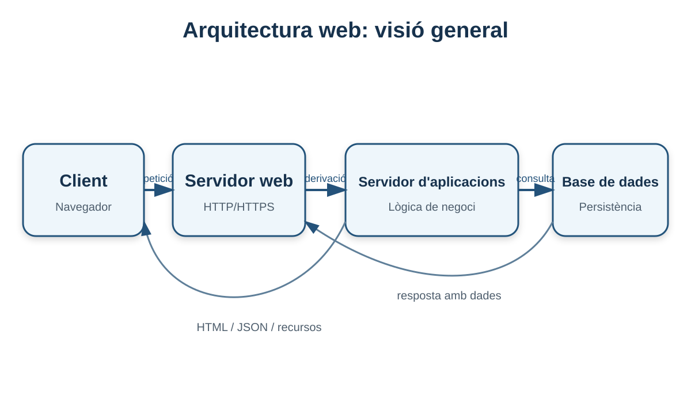
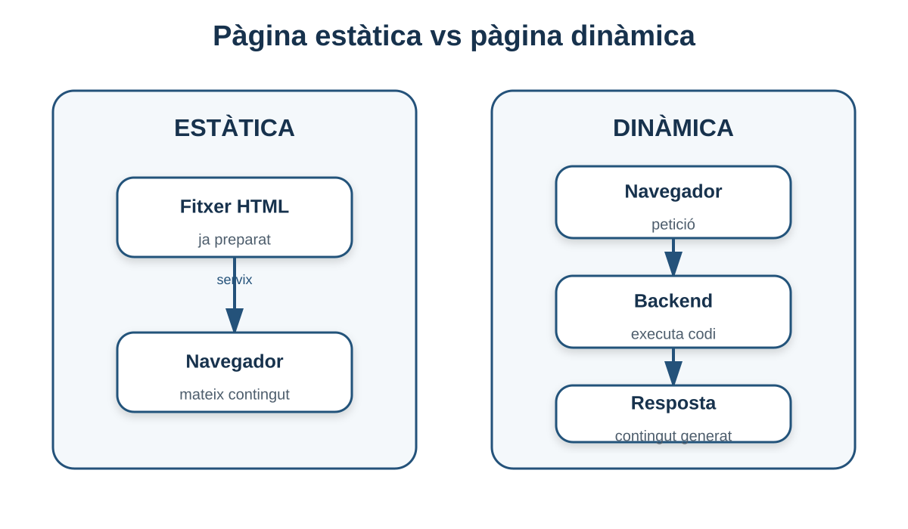
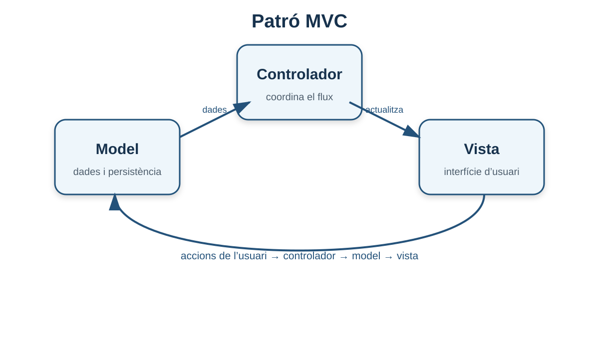

# 1. Aspectes generals de les arquitectures web

**Criteri relacionat: RA1.a**

En aquest primer bloc construirem el mapa general de la unitat. Abans d'instal·lar cap servidor hem d'entendre **què és una arquitectura web, quines peces hi intervenen i per què una aplicació web moderna no és simplement un conjunt de fitxers HTML**.

## 1.1 Què és una arquitectura web?

Una **arquitectura web** és la forma en què s'organitzen els components d'un lloc o d'una aplicació web: quins elements hi intervenen, on s'executa cadascun, com es comuniquen i com es reparteixen les responsabilitats.

Dit d'una altra manera, l'arquitectura respon preguntes com:

- Qui rep una petició d'un navegador?
- Qui genera la resposta?
- On s'executa la lògica de negoci?
- On es guarden les dades?
- Com es comunica cada component amb la resta?
- Què passa si el sistema ha d'atendre milers d'usuaris?



En una arquitectura web apareixen habitualment tecnologies com **HTML, CSS i JavaScript** en el client, llenguatges o plataformes de backend en el servidor i protocols com **HTTP/HTTPS** per transportar les peticions i les respostes.

!!! info "Arquitectura no és sinònim de tecnologia"
    Dir que una aplicació té una arquitectura de tres capes no significa que obligatòriament utilitze Apache, Java o PostgreSQL. L'arquitectura descriu sobretot **funcions i relacions**. Les tecnologies concretes poden canviar.

## 1.2 El model client-servidor

La major part de la web es basa en el model **client-servidor**.

- El **client** inicia una petició. Normalment és un navegador, però també podria ser una aplicació mòbil, una altra API o una eina com `curl`.
- El **servidor** escolta peticions, les processa i retorna una resposta.

```text
CLIENT                                        SERVIDOR
Navegador                                      Web
   │                                             │
   │  1. GET /productes/42 HTTP/1.1             │
   ├────────────────────────────────────────────>│
   │                                             │
   │                  2. Processament            │
   │                                             │
   │  3. HTTP/1.1 200 OK + HTML/JSON            │
   │<────────────────────────────────────────────┤
   │                                             │
```

El punt important és que **el client i el servidor tenen responsabilitats diferents**. El navegador no necessita conéixer com està guardat un producte en la base de dades; només necessita demanar-lo i interpretar la resposta.

### Un exemple quotidià

Quan entres en una botiga en línia:

1. el navegador demana la pàgina d'un producte;
2. el servidor rep la petició;
3. la part de backend busca el producte;
4. pot consultar una base de dades;
5. genera HTML o JSON;
6. el servidor retorna la resposta;
7. el navegador la representa.

Aquesta separació és una de les idees fonamentals del desenvolupament i del desplegament web.

## 1.3 Servidor com a màquina i servidor com a programari

La paraula **servidor** pot referir-se a dues coses diferents:

1. **La màquina servidor:** ordinador físic, màquina virtual o instància cloud on s'executen serveis.
2. **El programari servidor:** procés que escolta peticions, com Apache HTTP Server o Tomcat.

Per exemple, una mateixa màquina Ubuntu pot executar alhora:

- Apache en el port 80/443;
- Tomcat en el port 8080;
- PostgreSQL en el port 5432;
- SSH en el port 22.

Per això, quan diem “el servidor respon”, convé preguntar-nos: **parlem de la màquina o del servei?**

!!! warning "Error conceptual habitual"
    Un servidor web no és necessàriament un ordinador dedicat exclusivament a servir pàgines. És, principalment, un **programari que ofereix un servei**.

## 1.4 Pàgines web estàtiques

Una pàgina estàtica s'emmagatzema al servidor pràcticament tal com serà enviada al navegador.

Exemple:

```text
/var/www/html/
├── index.html
├── contacte.html
├── css/
│   └── estils.css
└── img/
    └── logo.png
```

Si el client demana `/contacte.html`, el servidor localitza el fitxer i l'envia.

```text
Navegador ── GET /contacte.html ──> Servidor web
Navegador <──── contacte.html ───── Servidor web
```



### Característiques

- El contingut només canvia quan es modifica el fitxer.
- És fàcil de servir i necessita pocs recursos.
- No necessita obligatòriament una base de dades.
- És adequada per a documentació, pàgines informatives o webs amb contingut poc variable.
- Pot escalar molt bé perquè el servidor només ha de lliurar fitxers.

### Exemple

Una web amb l'horari d'un centre que només s'actualitza una vegada al trimestre podria estar formada exclusivament per HTML, CSS, JavaScript i imatges.

No necessitaria un backend per generar cada visita.

## 1.5 Pàgines web dinàmiques

En una web dinàmica, el contingut pot variar segons:

- l'usuari autenticat;
- dades d'una base de dades;
- l'hora o la data;
- paràmetres de la URL;
- una cerca;
- accions de l'usuari;
- informació procedent d'altres serveis.

### Dinamisme al client

JavaScript s'executa al navegador i pot modificar la pàgina sense tornar a carregar-la completament.

Exemples:

- mostrar o ocultar un menú;
- validar un formulari;
- actualitzar un contador;
- demanar dades a una API amb `fetch()`;
- canviar el DOM.

### Dinamisme al servidor

El servidor pot executar codi per generar la resposta.

Exemples:

- comprovar credencials;
- recuperar productes d'una base de dades;
- calcular el total d'una comanda;
- generar una factura;
- decidir si un usuari té permís per veure una ruta.

### Flux complet

```text
1. Navegador
      │
      │ GET /productes/42
      ▼
2. Servidor web
      │
      │ passa la petició
      ▼
3. Aplicació / backend
      │
      │ SELECT ...
      ▼
4. Base de dades
      │
      │ dades del producte
      ▼
3. Aplicació genera resposta
      │
      ▼
2. Servidor web
      │
      │ HTTP 200 + HTML/JSON
      ▼
1. Navegador
```

!!! tip "Idea clau"
    Una pàgina dinàmica **no implica necessàriament una recàrrega completa**. La part dinàmica pot estar al servidor, al client o en tots dos llocs.

## 1.6 De pàgina web a aplicació web

Una **aplicació web** utilitza tecnologies web per oferir funcionalitats pròpies d'una aplicació a través d'un navegador.

Alguns exemples serien:

- correu electrònic web;
- aula virtual;
- gestor de tasques;
- plataforma de banca electrònica;
- botiga en línia;
- gestor de continguts;
- editor de documents.

La frontera entre “web” i “aplicació web” no sempre és estricta. En general, parlem d'aplicació quan hi ha **interacció, processament, dades i estat** més enllà de mostrar informació.

## 1.7 Frontend i backend

### Frontend

És la part amb què interactua l'usuari.

S'executa principalment al navegador i sol estar formada per:

- **HTML:** estructura;
- **CSS:** presentació;
- **JavaScript:** comportament i interactivitat.

### Backend

És la part que s'executa al servidor i gestiona:

- lògica de negoci;
- autenticació i autorització;
- accés a bases de dades;
- integració amb serveis externs;
- generació de respostes.

```text
            FRONTEND                    BACKEND
┌─────────────────────────┐    ┌──────────────────────────┐
│ Navegador               │    │ Servidor                 │
│                         │    │                          │
│ HTML + CSS + JavaScript │───>│ API / lògica de negoci  │
│                         │<───│ accés a dades            │
└─────────────────────────┘    └──────────────────────────┘
```

!!! example "DAWShop"
    En DAWShop, el frontend mostra els productes. Quan l'usuari prem **Comprar**, el navegador envia una petició al backend. El backend comprova l'estoc, registra la comanda i retorna el resultat.

    El navegador **no hauria d'accedir directament a la base de dades**.

## 1.8 Arquitectura d'una, dues i tres capes

Parlar de **capes** és una manera d'organitzar responsabilitats.

### Una capa

Tots els elements estan molt units o en el mateix entorn.

Pot ser suficient per a sistemes molt senzills o demostracions, però és poc flexible.

### Dues capes

Una divisió típica és:

```text
Client  <────>  Servidor + dades
```

El client es comunica directament amb un servidor que concentra gran part del treball.

### Tres capes

És una de les arquitectures més habituals conceptualment:

```text
┌──────────────┐
│ Presentació  │  Navegador / frontend
└──────┬───────┘
       │
┌──────▼───────┐
│ Aplicació    │  Lògica de negoci
└──────┬───────┘
       │
┌──────▼───────┐
│ Dades        │  Base de dades
└──────────────┘
```

Avantatges d'aquesta separació:

- facilita el manteniment;
- permet escalar cada capa de manera independent;
- redueix l'acoblament;
- facilita aplicar controls de seguretat;
- permet canviar una tecnologia sense substituir-ho tot.

!!! note "Capes lògiques i màquines físiques"
    Tres capes no significa obligatòriament tres ordinadors. En un laboratori, les tres capes poden estar en una sola màquina. En producció, una mateixa capa pot ocupar desenes de servidors.

## 1.9 Arquitectura monolítica i serveis separats

Com a context, una aplicació pot empaquetar moltes funcionalitats en una sola unitat de desplegament. Açò se sol anomenar **monòlit**.

```text
Navegador
   │
   ▼
┌─────────────────────────┐
│ Aplicació monolítica    │
│ usuaris + catàleg +     │
│ comandes + pagaments    │
└────────────┬────────────┘
             ▼
         Base de dades
```

En sistemes més grans, algunes funcionalitats poden separar-se en serveis independents. No és necessari aprofundir ara en microserveis; només has de recordar que **una arquitectura pot evolucionar quan augmenten la complexitat i les necessitats de desplegament**.

## 1.10 Avantatges de les aplicacions web

Les aplicacions web tenen avantatges importants:

- la part principal s'instal·la i s'actualitza al servidor;
- es poden usar des de diferents sistemes operatius;
- l'accés es realitza normalment amb un navegador;
- faciliten la distribució d'actualitzacions;
- poden centralitzar les dades;
- poden donar servei a usuaris ubicats en llocs diferents.

## 1.11 Inconvenients i limitacions

També tenen inconvenients:

- solen dependre de la xarxa;
- una caiguda del servidor pot afectar molts usuaris;
- la latència de la xarxa influeix en l'experiència;
- requereixen protegir comunicacions i dades;
- exposar un servei a Internet augmenta la superfície d'atac;
- el servidor ha de suportar la càrrega dels usuaris concurrents.

!!! question "Pensa-ho"
    Si una aplicació de gestió només funciona dins d'una empresa, continua sent una aplicació web?

    Sí. No és necessari que un servei siga públic a Internet. Pot funcionar en una **intranet** i continuar utilitzant arquitectura i protocols web.

## 1.12 El patró MVC

El patró **Model - Vista - Controlador (MVC)** ajuda a separar responsabilitats dins del programari.



### Model

Representa les dades i les regles associades.

Exemples:

- `Usuari`;
- `Producte`;
- `Comanda`.

### Vista

Representa allò que veu l'usuari.

Pot ser:

- HTML generat al servidor;
- una plantilla;
- una interfície web que rep dades d'una API.

### Controlador

Rep una acció o petició i coordina què s'ha de fer.

Exemple:

```text
GET /productes/42
        │
        ▼
Controlador de productes
        │
        ▼
Model → busca producte 42
        │
        ▼
Vista → mostra el producte
```

!!! tip "Per recordar MVC"
    **Model = dades i regles**, **Vista = presentació**, **Controlador = coordinació de la petició**.

MVC no és l'única arquitectura possible, però és útil per entendre la necessitat de **separar responsabilitats**.

## 1.13 Exemple complet: què passa en DAWShop?

Suposa que l'usuari visita:

```text
https://dawshop.local/productes/42
```

A alt nivell:

1. el navegador localitza el servidor;
2. envia una petició HTTP/HTTPS;
3. el servidor web rep la petició;
4. la petició arriba a l'aplicació;
5. el controlador identifica que es demana el producte `42`;
6. el model recupera les dades;
7. l'aplicació prepara la resposta;
8. el servidor la retorna;
9. el navegador representa la interfície.

En els següents apartats estudiarem cadascun d'aquests passos amb més detall.

## 1.14 Errors conceptuals habituals

### “Frontend és el que està bonic i backend és la base de dades”

No. El frontend és el programari que s'executa principalment al client. El backend inclou la lògica del servidor. La base de dades és un component diferent.

### “Una pàgina amb JavaScript sempre necessita backend”

No. Un lloc pot usar molt JavaScript i continuar sent completament estàtic si no necessita processament al servidor.

### “Una aplicació dinàmica sempre genera HTML al servidor”

No. El backend pot retornar **JSON** i el frontend construir la interfície al navegador.

### “Tres capes significa tres servidors”

No. Les capes són una separació lògica de responsabilitats.

## 1.15 Què has de saber abans de continuar

- [ ] Explicar què és una arquitectura web.
- [ ] Diferenciar client i servidor.
- [ ] Diferenciar pàgina estàtica i dinàmica.
- [ ] Explicar què fan frontend, backend i base de dades.
- [ ] Interpretar una arquitectura de tres capes.
- [ ] Explicar el sentit del patró MVC.
- [ ] Identificar avantatges i inconvenients de les aplicacions web.

## 1.16 Autoavaluació

Intenta respondre sense mirar els apunts.

1. Quina diferència hi ha entre un **servidor com a màquina** i un **servidor com a programari**?
2. Una web formada per HTML, CSS i JavaScript pot ser estàtica? Justifica la resposta.
3. Per què un navegador no hauria d'accedir directament a la base de dades d'una aplicació?
4. Quines responsabilitats té el backend?
5. En una arquitectura de tres capes, quines són les tres responsabilitats principals?
6. Quina diferència hi ha entre el Model i el Controlador en MVC?

<details>
<summary><strong>Orientació de les respostes</strong></summary>

1. La màquina és l'equip o entorn d'execució; el programari servidor és el procés que ofereix un servei.
2. Sí. JavaScript pot executar-se completament al navegador sense necessitar generació dinàmica al servidor.
3. Per separació de responsabilitats, seguretat i control de la lògica de negoci.
4. Processar peticions, aplicar lògica, autenticar, autoritzar, accedir a dades i generar respostes.
5. Presentació, lògica d'aplicació i dades.
6. El Model representa dades/regles; el Controlador rep accions i coordina el flux.

</details>

---

!!! success "Idea clau del bloc"
    Una aplicació web és un conjunt de components que cooperen. Abans de pensar en Apache, Tomcat o qualsevol producte, has de poder identificar **client, capa web, lògica d'aplicació i dades**.

[Índex de la UP1](index.md) · [Següent: fonaments i protocols](02-fonaments-protocols.md)
