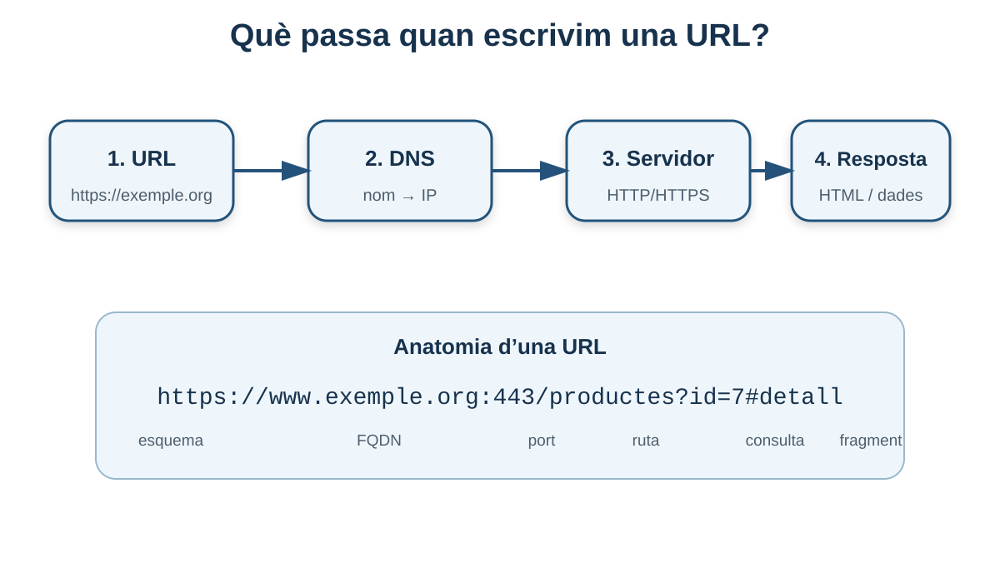
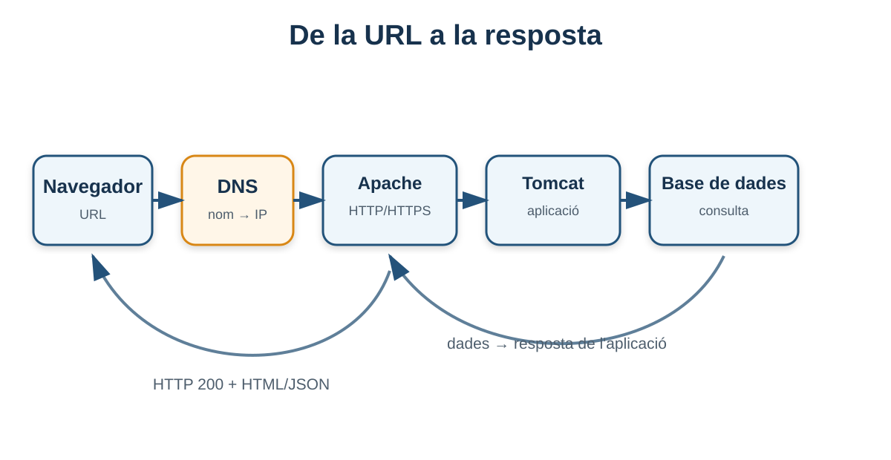

# 2. Fonaments i protocols dels servidors web

**Criteri relacionat: RA1.b**

En el bloc anterior hem vist les peces generals d'una arquitectura. Ara ens centrarem en la pregunta més important per entendre la web:

> **Què ocorre tècnicament quan un client demana un recurs a un servidor?**

Per contestar-la necessitem entendre el paper del **servidor web**, el protocol **HTTP**, els noms **DNS**, les **URL** i els ports de xarxa.

## 2.1 Què és un servidor web?

Un **servidor web** és un programari que escolta peticions de clients, principalment mitjançant HTTP o HTTPS, i retorna respostes.

Pot servir:

- HTML;
- CSS;
- JavaScript;
- imatges;
- fonts;
- vídeos;
- fitxers descarregables;
- respostes generades per una aplicació;
- dades en JSON o XML.

```text
Client                         Servidor web
  │                                 │
  │ ---- petició HTTP/HTTPS ------> │
  │                                 │
  │ <------- resposta HTTP -------- │
  │                                 │
```

El servidor web pot entregar directament un fitxer o pot actuar com a porta d'entrada cap a altres components.

!!! example "Dues respostes diferents"
    Si demanes `/logo.png`, Apache podria llegir el fitxer del disc i retornar-lo directament.

    Si demanes `/api/productes/42`, Apache podria redirigir la petició a una aplicació que consulte una base de dades abans de generar la resposta.

## 2.2 Servidor físic, virtual i cloud

El programari web necessita un sistema on executar-se. Aquest sistema pot ser:

- un servidor físic;
- una màquina virtual;
- un contenidor;
- una instància en un proveïdor cloud;
- el teu propi ordinador durant el desenvolupament.

El principi és el mateix: el procés ha d'estar **en execució**, escoltar en una **adreça/port** i ser **accessible** per al client.

## 2.3 Recursos d'un servidor

El material base destaca quatre recursos principals: CPU, RAM, emmagatzematge i xarxa.

| Recurs | Per què importa? | Exemple de problema |
|---|---|---|
| **CPU** | Processa peticions i executa programari. | L'aplicació consumeix el 100% i augmenta la latència. |
| **RAM** | Manté processos, cachés i dades temporals. | El sistema es queda sense memòria i comença a usar swap. |
| **Emmagatzematge** | Guarda sistema, fitxers, logs, aplicacions i dades. | El disc s'ompli pels logs i el servei deixa de funcionar correctament. |
| **Xarxa** | Transporta peticions i respostes. | L'ample de banda o la latència limita l'experiència de l'usuari. |

### No sempre el problema és “falta de potència”

Una aplicació lenta pot tindre CPU lliure i, en canvi, estar esperant una consulta de base de dades, una API externa o el disc.

Per això el rendiment s'ha d'analitzar **de principi a fi**.

## 2.4 Funcions habituals d'un servidor web

Un servidor web modern pot oferir moltes funcions.

### 1. Servir contingut estàtic

```text
GET /css/estils.css
```

El servidor localitza el fitxer i el retorna.

### 2. Allotjament virtual

Un mateix servidor pot atendre diversos dominis:

```text
www.empresa-a.com ─┐
                   ├──> mateix Apache
www.empresa-b.com ─┘
```

La configuració decideix quin contingut servir segons el nom demanat.

### 3. Logs

Els servidors registren informació com:

- IP del client;
- data i hora;
- ruta demanada;
- codi HTTP;
- errors de configuració.

Els logs són imprescindibles per diagnosticar problemes.

### 4. Control d'accés

Poden restringir l'accés a determinades rutes o recursos.

### 5. Reescriptura i redirecció

Una ruta visible com:

```text
/productes/42
```

pot transformar-se internament o redirigir-se a una altra ubicació.

### 6. Proxy invers

El servidor web pot rebre la petició pública i enviar-la a un backend intern.

```text
Internet
   │
   ▼
Apache :443
   │
   ▼
Tomcat :8080
```

Aquesta idea serà important al bloc de Tomcat.

## 2.5 Rendiment: què significa que un servidor siga ràpid?

Dir “aquest servidor és ràpid” és massa ambigu. Necessitem mètriques.

| Mètrica | Significat |
|---|---|
| **RPS** | Peticions processades per segon. |
| **CPS** | Connexions acceptades per segon. |
| **Latència** | Temps que tarda una operació o comunicació. |
| **Temps de resposta** | Temps des de la petició fins a rebre la resposta. |
| **Throughput** | Quantitat de dades transferides per unitat de temps. |
| **Concurrència** | Nombre d'usuaris o operacions simultànies. |

### Exemple

Dos servidors poden processar 1.000 RPS, però:

- el servidor A respon en 40 ms;
- el servidor B respon en 700 ms.

Tenen el mateix nombre de peticions per segon en una prova concreta, però l'experiència de l'usuari no és la mateixa.

!!! note "El temps total té moltes parts"
    Aproximadament:

    ```text
    temps percebut = DNS + connexió + xarxa + servidor web + backend + BBDD + transferència + navegador
    ```

## 2.6 HTTP: el llenguatge bàsic de la web

**HTTP (Hypertext Transfer Protocol)** és el protocol d'aplicació que defineix com un client envia una petició i com un servidor retorna una resposta.

El model és molt simple:

```text
PETICIÓ  →  PROCESSAMENT  →  RESPOSTA
```

Aquesta simplicitat és la base de pràcticament tot el que farem en desplegament.





## 2.7 Anatomia d'una petició HTTP

Exemple:

```http
GET /productes/42?idioma=va HTTP/1.1
Host: dawshop.local
Accept: application/json
User-Agent: Mozilla/5.0
Authorization: Bearer eyJ...
```

Analitzem-la.

### Línia de petició

```http
GET /productes/42?idioma=va HTTP/1.1
```

Conté:

- `GET`: mètode;
- `/productes/42?idioma=va`: recurs i paràmetres;
- `HTTP/1.1`: versió del protocol.

### Capçaleres

```http
Host: dawshop.local
Accept: application/json
```

Les **headers** aporten metadades sobre la petició.

Per exemple:

- quin host s'està demanant;
- quin format accepta el client;
- credencials;
- cookies;
- tipus de contingut enviat.

### Cos de la petició

Alguns mètodes poden enviar dades en el cos.

```http
POST /api/usuaris HTTP/1.1
Host: dawshop.local
Content-Type: application/json

{
  "nom": "Aina",
  "email": "aina@example.org"
}
```

## 2.8 Mètodes HTTP més habituals

| Mètode | Ús habitual | Exemple |
|---|---|---|
| **GET** | Consultar un recurs. | Veure un producte. |
| **POST** | Crear o enviar informació. | Crear una comanda. |
| **PUT** | Substituir/actualitzar un recurs. | Actualitzar un perfil complet. |
| **PATCH** | Modificar parcialment. | Canviar només l'adreça. |
| **DELETE** | Eliminar un recurs. | Esborrar un element. |
| **HEAD** | Com GET però sense cos de resposta. | Comprovar metadades. |
| **OPTIONS** | Consultar opcions de comunicació. | Saber mètodes admesos/CORS. |

!!! warning "El mètode no és seguretat"
    Que una operació utilitze `POST` en lloc de `GET` **no la fa segura**. La seguretat depén d'HTTPS, autenticació, autorització, validació i altres controls.

## 2.9 Anatomia d'una resposta HTTP

```http
HTTP/1.1 200 OK
Content-Type: application/json
Content-Length: 52

{
  "id": 42,
  "nom": "Teclat mecànic"
}
```

### Línia d'estat

```http
HTTP/1.1 200 OK
```

Indica versió i resultat.

### Capçaleres

Exemples:

- `Content-Type`;
- `Content-Length`;
- `Cache-Control`;
- `Set-Cookie`;
- `Location`.

### Cos

Pot contindre HTML, JSON, una imatge, un PDF o qualsevol altre recurs.

## 2.10 Codis d'estat HTTP

Els codis s'agrupen per famílies.

### 1xx — Informació

Respostes intermèdies.

### 2xx — Èxit

| Codi | Significat habitual |
|---|---|
| `200 OK` | Operació correcta. |
| `201 Created` | Recurs creat. |
| `204 No Content` | Correcte, però sense cos de resposta. |

### 3xx — Redirecció

| Codi | Significat habitual |
|---|---|
| `301 Moved Permanently` | Redirecció permanent. |
| `302 Found` | Redirecció temporal habitual. |
| `304 Not Modified` | El client pot utilitzar la còpia en caché. |

### 4xx — Error del client

| Codi | Significat habitual |
|---|---|
| `400 Bad Request` | Petició incorrecta. |
| `401 Unauthorized` | Falta autenticació vàlida. |
| `403 Forbidden` | No es permet l'accés. |
| `404 Not Found` | Recurs no trobat. |
| `405 Method Not Allowed` | Mètode no admés. |

### 5xx — Error del servidor

| Codi | Significat habitual |
|---|---|
| `500 Internal Server Error` | Error intern genèric. |
| `502 Bad Gateway` | Un proxy ha rebut una resposta incorrecta del backend. |
| `503 Service Unavailable` | Servei temporalment no disponible. |
| `504 Gateway Timeout` | El backend ha tardat massa a respondre. |

!!! tip "Per diagnosticar"
    El codi HTTP és una primera pista. Un `404` orienta cap a ruta/recurs; un `403` cap a permisos o autorització; un `502` cap a la comunicació entre proxy i backend.

## 2.11 HTTP és un protocol sense estat

HTTP tracta cada petició com una operació independent. Per si sol, el protocol no “recorda” que dues peticions pertanyen al mateix usuari.

Per mantindre estat s'utilitzen mecanismes com:

- cookies;
- sessions;
- tokens;
- informació emmagatzemada al client o al servidor.

Exemple:

```text
1. POST /login
2. servidor valida l'usuari
3. servidor retorna una cookie o token
4. peticions següents inclouen eixa informació
```

## 2.12 HTTP/1.1, HTTP/2 i HTTP/3

No necessitem aprofundir en el funcionament intern, però sí entendre que HTTP ha evolucionat.

- **HTTP/1.1:** versió clàssica encara molt present.
- **HTTP/2:** millora l'eficiència de múltiples peticions sobre una connexió.
- **HTTP/3:** utilitza QUIC sobre UDP en lloc de la combinació tradicional TCP + TLS.

Per al desenvolupador, la semàntica general de mètodes, URL i codis d'estat continua sent familiar.

## 2.13 HTTP i HTTPS

**HTTPS** és HTTP protegit mitjançant TLS.

Aporta principalment:

- **confidencialitat:** tercers no poden llegir fàcilment el trànsit;
- **integritat:** ajuda a detectar modificacions;
- **autenticació del servidor:** el certificat ajuda a comprovar la identitat del domini.

Ports habituals:

```text
HTTP  → 80
HTTPS → 443
```

!!! warning "Producció"
    Una aplicació que gestione credencials o dades sensibles no hauria de transmetre-les per HTTP sense xifrar.

## 2.14 Ports: com sap el sistema quin servei ha de rebre la connexió?

Una IP identifica un host, però un mateix host pot executar molts serveis. El **port** ajuda a identificar el servei de destinació.

Exemple:

```text
192.168.1.50:22    → SSH
192.168.1.50:80    → Apache HTTP
192.168.1.50:443   → Apache HTTPS
192.168.1.50:8080  → Tomcat
```

Quan la URL usa el port per defecte, normalment no s'escriu:

```text
https://dawshop.local
```

és equivalent conceptualment a:

```text
https://dawshop.local:443
```

## 2.15 DNS: noms comprensibles per a persones

Els clients necessiten saber a quina adreça IP han de connectar-se. **DNS (Domain Name System)** permet resoldre noms com:

```text
www.exemple.org
```

cap a una IP.

Flux simplificat:

```text
Usuari escriu www.exemple.org
          │
          ▼
Resolució DNS
          │
          ▼
203.0.113.10
          │
          ▼
Connexió al servidor
```

### Per què és útil?

Sense DNS hauríem de recordar IPs. A més, un domini pot continuar sent el mateix encara que la infraestructura canvie d'IP.

## 2.16 FQDN

Un **FQDN (Fully Qualified Domain Name)** és el nom complet d'un host dins del sistema DNS.

Exemple:

```text
www.dawshop.example.org
```

Podem interpretar-lo de dreta a esquerra:

```text
org
└── example
    └── dawshop
        └── www
```

En entorns de laboratori podem utilitzar noms locals i associar-los manualment a una IP mitjançant el fitxer `hosts`.

## 2.17 URL: l'adreça d'un recurs

Una **URL (Uniform Resource Locator)** identifica com i on accedir a un recurs.

Exemple:

```text
https://www.dawshop.local:443/productes/42?idioma=va#detall
```

Parts:

```text
https:// www.dawshop.local :443 /productes/42 ?idioma=va #detall
└─┬───┘ └────────┬────────┘ └┬┘ └─────┬──────┘ └───┬────┘ └──┬──┘
 esquema          host        port      ruta         query    fragment
```

### Esquema

`http` o `https` indica com comunicar-se.

### Host

Nom DNS o IP del servidor.

### Port

Opcional si s'utilitza el port per defecte.

### Ruta

Recurs sol·licitat.

### Query string

Paràmetres de consulta.

### Fragment

Referència dins del document. Normalment el fragment no s'envia al servidor HTTP; l'utilitza el client.

## 2.18 URL i URI

En molts contextos es parla de **URI** com a terme general per identificar recursos i de **URL** quan, a més, s'indica com localitzar-los.

Per a aquesta unitat, el més important és saber **interpretar correctament una URL** i entendre com participa en una petició HTTP.

## 2.19 El recorregut complet: de la URL a la pàgina

Suposa que escrius:

```text
https://dawshop.example/productes/42
```

### Pas 1. El navegador interpreta la URL

Identifica:

- esquema: HTTPS;
- host: `dawshop.example`;
- port implícit: 443;
- ruta: `/productes/42`.

### Pas 2. Resolució DNS

El navegador/sistema necessita la IP del host.

```text
dawshop.example → 203.0.113.20
```

### Pas 3. Connexió

El client estableix comunicació amb la IP i el port corresponent.

### Pas 4. TLS

Com que és HTTPS, s'estableix una sessió xifrada i es valida el certificat segons la configuració del client.

### Pas 5. Petició HTTP

```http
GET /productes/42 HTTP/1.1
Host: dawshop.example
```

### Pas 6. El servidor web decideix què fer

Pot:

- retornar un fitxer;
- redirigir;
- rebutjar l'accés;
- actuar com a proxy;
- enviar la petició a una aplicació.

### Pas 7. Backend i dades

L'aplicació pot consultar la base de dades.

### Pas 8. Resposta HTTP

```http
HTTP/1.1 200 OK
Content-Type: text/html
```

### Pas 9. El navegador processa el contingut

Interpreta HTML i després sol·licita recursos addicionals: CSS, JavaScript, imatges, fonts, etc.

Per tant, carregar “una pàgina” pot implicar **desenes o centenars de peticions HTTP**.

## 2.20 Com observar HTTP des del navegador

Les eines de desenvolupament del navegador permeten veure la pestanya **Network / Xarxa**.

Allí pots observar:

- URL;
- mètode;
- codi d'estat;
- temps;
- headers;
- cos de petició;
- resposta;
- tipus de recurs.

!!! tip "Exercici d'autoestudi"
    Obri qualsevol web, activa les eines de desenvolupament i recarrega la pàgina. Ordena les peticions per tipus i intenta localitzar:

    - el document HTML principal;
    - un CSS;
    - un JavaScript;
    - una imatge;
    - alguna petició que retorne JSON.

## 2.21 Errors conceptuals habituals

### “DNS envia la pàgina web”

No. DNS només ajuda a trobar l'adreça associada a un nom. Després el client es comunica amb el servidor web.

### “HTTP és Internet”

No. HTTP és un protocol d'aplicació que funciona sobre una pila de xarxa més àmplia.

### “404 significa que el servidor està apagat”

No. Si reps un `404`, **el servidor ha respost**. El problema és que no ha trobat el recurs demanat.

### “HTTPS oculta la URL completa al navegador”

El navegador coneix la URL perquè necessita fer la petició. HTTPS protegeix el trànsit durant la comunicació; no significa que la informació deixe de ser visible per als extrems legítims.

## 2.22 Què has de saber abans de continuar

- [ ] Definir servidor web.
- [ ] Explicar el model petició-resposta.
- [ ] Interpretar una petició HTTP senzilla.
- [ ] Interpretar una resposta HTTP senzilla.
- [ ] Conéixer els principals mètodes HTTP.
- [ ] Reconéixer les famílies de codis 2xx, 3xx, 4xx i 5xx.
- [ ] Explicar la funció de DNS.
- [ ] Descompondre una URL.
- [ ] Explicar què és un FQDN.
- [ ] Entendre la funció dels ports 80, 443 i 8080 en els exemples de la unitat.

## 2.23 Autoavaluació

1. Per què necessitem un port si ja coneixem la IP del servidor?
2. Quina diferència hi ha entre `GET` i `POST` en el seu ús habitual?
3. Què indica un codi `403`? I un `404`?
4. Per què rebre un `500` demostra que hi ha hagut comunicació amb el servidor?
5. Quina funció realitza DNS abans d'una petició HTTP?
6. Descompon aquesta URL: `https://api.exemple.org:8443/v1/usuaris?id=8`.
7. Per què carregar un únic document HTML pot generar moltes peticions?
8. Quina diferència conceptual hi ha entre HTTP i HTTPS?

<details>
<summary><strong>Orientació de les respostes</strong></summary>

1. Una IP identifica l'host; el port identifica el servei concret dins d'eixe host.
2. GET s'utilitza habitualment per consultar; POST per enviar informació o crear/processar una operació.
3. `403`: accés prohibit; `404`: recurs no trobat.
4. Perquè el servidor o l'aplicació ha rebut la petició i ha generat una resposta d'error intern.
5. Traduir/resoldre el nom del host cap a una adreça utilitzable per a la connexió.
6. HTTPS; host `api.exemple.org`; port `8443`; ruta `/v1/usuaris`; query `id=8`.
7. L'HTML referencia CSS, JS, imatges, fonts i altres recursos que el navegador demana per separat.
8. HTTPS encapsula/protegeix HTTP mitjançant TLS.

</details>

---

!!! success "Idea clau del bloc"
    Quan alguna cosa no funciona, pensa en la cadena: **nom → DNS → IP → port → servidor web → ruta → backend → resposta HTTP**. Saber en quin punt falla és molt més útil que memoritzar una ordre aïllada.

[Anterior: arquitectures web](01-arquitectures-web.md) · [Índex de la UP1](index.md) · [Següent: estructura i recursos](03-estructura-recursos.md)
