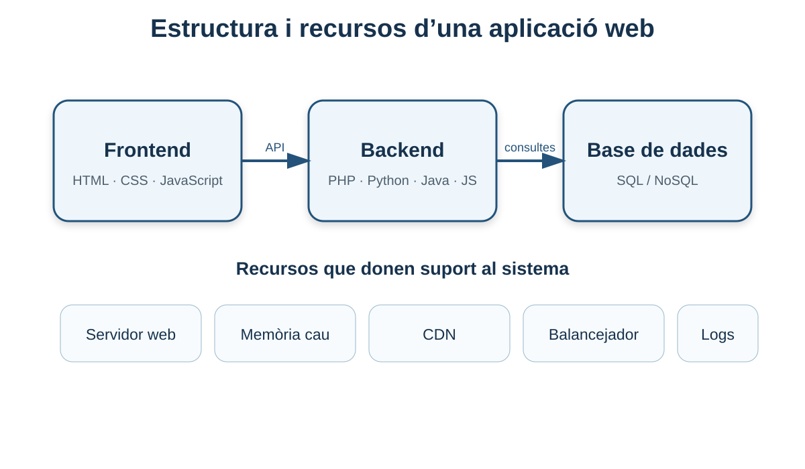
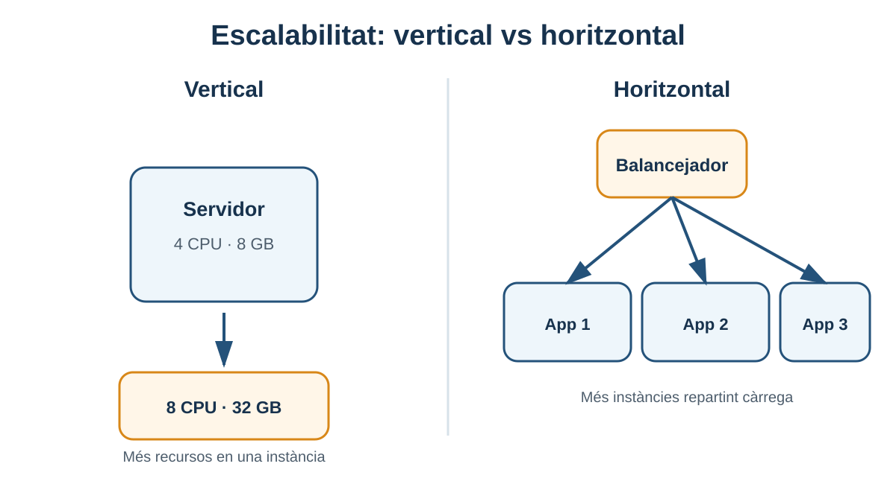

---
hide:
  - navigation
title: "3. Estructura i recursos de les aplicacions web"
description: "Frontend, backend, bases de dades, API, caché, CDN, balanceig, proxy invers, seguretat i monitoratge."
---

# 3. Estructura i recursos de les aplicacions web

**Criteri relacionat: RA1.g**

En aquest bloc passarem de la idea general d'arquitectura a una pregunta més concreta:

> **Quines peces necessita una aplicació web real per funcionar i quina funció té cadascuna?**

El material base divideix l'estructura principal en **frontend, backend i base de dades**, i afegeix recursos d'infraestructura com servidor web, servidor d'aplicacions, caché, CDN, balancejadors, seguretat i monitoratge.



## 3.1 Una aplicació web és un sistema, no un únic programa

Quan desenvolupem una aplicació en local és fàcil pensar que “l'aplicació” és només el nostre projecte. En producció, en canvi, normalment depén de més components.

Un sistema senzill pot tindre:

```text
Navegador
   │
   ▼
Servidor web
   │
   ▼
Aplicació backend
   │
   ▼
Base de dades
```

Un sistema més exigent podria afegir:

```text
                  ┌──────────── CDN ────────────┐
                  │                             │
Usuari ──> Proxy / balancejador ──> Servidors web
                                      │
                                      ▼
                                  Backend
                                   │    │
                              Caché    BBDD
                                   │
                              Monitoratge
```

No totes les aplicacions necessiten totes aquestes peces. El treball d'arquitectura consisteix també a **no complicar el sistema més del necessari**.

## 3.2 Frontend

El **frontend** és la part que s'executa principalment en el dispositiu de l'usuari i amb la qual aquest interactua.

### HTML: estructura

HTML descriu l'estructura del document:

```html
<article class="producte">
  <h2>Teclat mecànic</h2>
  <p>79,90 €</p>
  <button>Comprar</button>
</article>
```

### CSS: presentació

CSS controla com es presenta el document:

```css
.producte {
  border: 1px solid #ccc;
  padding: 1rem;
}
```

### JavaScript: comportament

JavaScript permet afegir interactivitat i comunicar-se amb el backend.

```javascript
const resposta = await fetch('/api/productes/42');
const producte = await resposta.json();
console.log(producte);
```

!!! note "Frontend no significa necessàriament framework"
    React, Vue o Angular són opcions possibles, però una aplicació també pot tindre un frontend perfectament funcional amb HTML, CSS i JavaScript sense framework.

## 3.3 Què és responsabilitat del frontend?

Habitualment:

- presentar informació;
- recollir entrada de l'usuari;
- fer validacions de comoditat;
- enviar peticions al servidor;
- gestionar navegació i estat visual;
- mostrar errors i resultats.

Però hi ha una regla important:

!!! warning "No confies en el client per a decisions de seguretat"
    Una validació JavaScript pot millorar l'experiència, però un usuari pot modificar o evitar eixe codi. Les comprovacions importants s'han de repetir al servidor.

Per exemple, que el frontend impedisca introduir una quantitat negativa no eximeix el backend de validar-la.

## 3.4 Backend

El **backend** és la part que s'executa al servidor i aplica la lògica de l'aplicació.

Pot estar desenvolupat amb diferents tecnologies:

- Java;
- JavaScript/Node.js;
- Python;
- PHP;
- C#;
- Ruby;
- altres.

El llenguatge concret no canvia les responsabilitats bàsiques.

### Tasques habituals

- rebre peticions;
- validar dades;
- autenticar usuaris;
- comprovar permisos;
- aplicar regles de negoci;
- consultar o modificar la base de dades;
- comunicar-se amb serveis externs;
- generar la resposta.

### Exemple de lògica de negoci

L'usuari demana comprar 3 unitats.

El servidor pot haver de:

1. comprovar que l'usuari està autenticat;
2. comprovar que el producte existeix;
3. comprovar que hi ha almenys 3 unitats;
4. calcular preu i impostos;
5. registrar la comanda;
6. reduir l'estoc;
7. retornar confirmació.

Això és més que “consultar una base de dades”: és **lògica de negoci**.

## 3.5 API: la frontera entre components

Una **API (Application Programming Interface)** defineix com un component pot demanar funcionalitat o dades a un altre.

En una aplicació web és habitual que el frontend es comunique amb el backend mitjançant una API HTTP.

```text
Frontend                       API backend
   │                               │
   │ GET /api/productes/42         │
   ├──────────────────────────────>│
   │                               │
   │ { id: 42, nom: ..., preu:...} │
   │<──────────────────────────────┤
```

### REST

REST és un estil molt habitual per dissenyar APIs basades en recursos i HTTP.

Exemples:

```text
GET    /api/productes
GET    /api/productes/42
POST   /api/productes
PATCH  /api/productes/42
DELETE /api/productes/42
```

### GraphQL

GraphQL és una altra opció. Permet que el client especifique quines dades necessita en una consulta.

No és necessari dominar-lo en aquesta UP. El que sí has d'entendre és que **frontend i backend necessiten un contracte de comunicació**.

## 3.6 Formats de dades: JSON i XML

Una API pot retornar diferents formats. Actualment JSON és molt habitual.

```json
{
  "id": 42,
  "nom": "Teclat mecànic",
  "preu": 79.90
}
```

XML també continua existint en molts sistemes:

```xml
<producte>
  <id>42</id>
  <nom>Teclat mecànic</nom>
  <preu>79.90</preu>
</producte>
```

El format no és el protocol: **HTTP transporta** la resposta i JSON/XML descriuen **com estan estructurades les dades**.

## 3.7 Base de dades

La base de dades permet conservar informació de manera persistent.

Exemples de dades:

- usuaris;
- contrasenyes transformades de manera segura;
- productes;
- comandes;
- factures;
- sessions;
- configuració.

### Bases de dades relacionals (SQL)

Exemples:

- PostgreSQL;
- MySQL;
- MariaDB;
- SQL Server.

Organitzen la informació habitualment en taules relacionades.

```text
USUARIS                  COMANDES
┌────┬──────────┐         ┌────┬───────────┐
│ id │ nom      │         │ id │ usuari_id │
├────┼──────────┤         ├────┼───────────┤
│  1 │ Aina     │<────────│ 17 │     1     │
└────┴──────────┘         └────┴───────────┘
```

### Bases de dades NoSQL

Exemples:

- MongoDB;
- Cassandra;
- Redis, encara que Redis s'utilitza sovint més com a magatzem en memòria/caché.

Poden representar dades de manera més flexible segons el producte i el cas d'ús.

!!! tip "No hi ha una base de dades 'millor' universal"
    L'elecció depén del tipus de dades, consistència requerida, consultes, volum, escalabilitat, equip i operació.

## 3.8 Servidor web

El servidor web rep peticions HTTP/HTTPS i pot:

- servir fitxers estàtics;
- gestionar Virtual Hosts;
- terminar TLS;
- aplicar redireccions;
- escriure logs;
- actuar com a proxy invers cap al backend.

Exemples del material:

- Apache HTTP Server;
- Nginx.

## 3.9 Servidor d'aplicacions

Un **servidor d'aplicacions** proporciona un entorn d'execució i gestió per a aplicacions de servidor.

En l'ecosistema Java, el material treballa amb **Apache Tomcat**.

La separació conceptual és:

```text
Servidor web  → rep i gestiona HTTP
Servidor d'aplicacions → executa la lògica de l'aplicació
```

En la pràctica les fronteres poden solapar-se: Tomcat també pot atendre HTTP directament, i molts frameworks incorporen el seu propi servidor HTTP.

## 3.10 Servidor web vs servidor d'aplicacions

| Aspecte | Servidor web | Servidor d'aplicacions |
|---|---|---|
| Funció principal | Atendre HTTP i servir/proxyar recursos. | Executar lògica d'aplicació. |
| Exemple | Apache, Nginx. | Tomcat, WildFly, WebLogic. |
| Contingut estàtic | Molt habitual. | Possible, però no és el seu únic objectiu. |
| Lògica de negoci | Normalment delegada. | Sí. |
| Integració amb runtime | No sempre. | Part essencial. |

## 3.11 Caché

Una **caché** guarda temporalment informació que costa més obtindre o calcular.

Exemple:

Sense caché:

```text
100 peticions → 100 consultes costoses a BBDD
```

Amb caché:

```text
1a petició → BBDD → guardar resultat
següents → recuperar resultat de caché
```

Eines habituals:

- Redis;
- Memcached;
- caché del mateix servidor web;
- caché del navegador;
- CDN.

### El problema de la invalidació

Si el preu d'un producte canvia, una caché antiga no hauria de continuar mostrant el preu anterior indefinidament.

Per això una caché necessita polítiques:

- temps de vida (`TTL`);
- invalidació;
- actualització;
- clau correcta.

## 3.12 CDN

Una **CDN (Content Delivery Network)** disposa de servidors distribuïts geogràficament per acostar contingut als usuaris.

És especialment útil per a:

- imatges;
- vídeos;
- CSS;
- JavaScript;
- fitxers grans;
- contingut cachejable.

```text
Usuari València ──> node pròxim de CDN
Usuari Tòquio    ──> node pròxim de CDN
                     │
                     └── origen de l'aplicació
```

La CDN pot reduir latència i descarregar treball del servidor d'origen.

## 3.13 Proxy invers

Un **proxy invers** rep peticions en nom d'un o més servidors interns.

```text
Internet
   │
   ▼
┌────────────────┐
│ Proxy invers   │
│ Apache/Nginx   │
└───────┬────────┘
        │
    ┌───┴────┐
    ▼        ▼
Backend A  Backend B
```

Pot servir per a:

- ocultar els servidors interns;
- centralitzar HTTPS;
- balancejar càrrega;
- aplicar regles comunes;
- exposar diversos serveis amb un únic punt d'entrada.

## 3.14 Balancejador de càrrega

Un **balancejador** distribueix peticions entre múltiples instàncies.

```text
                 ┌──> App 1
Client → LB ─────┼──> App 2
                 └──> App 3
```

Per què?

- augmentar capacitat;
- evitar dependre d'una única instància;
- facilitar manteniment;
- repartir trànsit.

### Escalabilitat vertical i horitzontal

**Vertical:** donar més CPU/RAM a una màquina.

```text
4 GB RAM → 16 GB RAM
```

**Horitzontal:** afegir més instàncies.

```text
1 servidor → 3 servidors
```

Els balancejadors són una peça clau quan escalem horitzontalment.



## 3.15 Seguretat com a recurs transversal

La seguretat no és una caixa al final del diagrama; afecta tots els components.

Exemples:

- HTTPS i certificats;
- firewall;
- autenticació;
- autorització;
- permisos de fitxers;
- gestió de secrets;
- actualitzacions;
- segmentació de xarxa;
- còpies de seguretat.

!!! example "DAWShop"
    La base de dades no necessita ser accessible directament des d'Internet. Pot acceptar connexions només des del backend. Aquesta decisió arquitectònica redueix exposició.

## 3.16 Monitoratge i observabilitat

Una aplicació desplegada no deixa de necessitar atenció.

Hem de poder saber:

- està disponible?
- quanta CPU/RAM consumeix?
- quantes peticions rep?
- quant tarda a respondre?
- quants errors 5xx produeix?
- la base de dades respon correctament?
- l'espai en disc està arribant al límit?

### Logs

Registres d'esdeveniments.

### Mètriques

Valors numèrics al llarg del temps.

### Alertes

Avisos quan una condició supera un llindar.

Exemples citats al material base:

- Nagios;
- Prometheus.

## 3.17 Recursos humans

El material també destaca un aspecte que sovint s'oblida: una aplicació necessita **persones capaces d'instal·lar-la, configurar-la i mantindre-la**.

Una arquitectura tècnicament excel·lent però impossible d'operar per l'equip pot ser una mala arquitectura per a una organització concreta.

Per això, en seleccionar tecnologia també hem de considerar:

- experiència de l'equip;
- documentació;
- suport;
- facilitat d'actualització;
- cost operatiu.

## 3.18 Com avaluar els recursos necessaris

Abans del desplegament podem fer-nos una sèrie de preguntes.

### Hardware

- Quants usuaris s'esperen?
- Quanta memòria necessita l'aplicació?
- Quant espai ocuparan dades i logs?
- Quin trànsit de xarxa tindrem?

### Software

- Quin sistema operatiu?
- Quin runtime?
- Quin servidor web?
- Quina base de dades?
- Quines versions són compatibles?

### Operació

- Qui farà actualitzacions?
- Qui revisarà alertes?
- Com es faran backups?
- Com es recuperarà el servei després d'un error?

## 3.19 DAWShop: arquitectura mínima i arquitectura ampliada

### Versió de laboratori

```text
┌──────────────────────── Ubuntu Server ────────────────────────┐
│                                                              │
│ Apache :80  ───> Tomcat :8080 ───> PostgreSQL :5432          │
│                                                              │
└──────────────────────────────────────────────────────────────┘
```

Tot en una màquina. És fàcil d'entendre i administrar.

### Versió més pròxima a producció

```text
                 Internet
                    │
                    ▼
                 HTTPS
                    │
              Proxy / LB
              /         \
          App 1         App 2
             \           /
               Redis
                 │
             PostgreSQL
                 │
         backups + monitoratge
```

Més components poden aportar capacitat o disponibilitat, però també augmenten la complexitat.

!!! tip "Principi d'enginyeria"
    No afegisques Redis, un balancejador o una CDN només perquè “són professionals”. Cada component ha de resoldre una necessitat concreta.

## 3.20 Errors conceptuals habituals

### “API és sinònim de backend”

No exactament. Una API és una **interfície de comunicació**. El backend pot oferir una API, però també conté lògica interna no exposada directament.

### “Redis és una base de dades com PostgreSQL i serveix per al mateix”

No. Tenen models i usos molt diferents. Redis s'utilitza sovint com a emmagatzematge en memòria o caché.

### “La CDN executa necessàriament el backend”

No. La funció clàssica d'una CDN és distribuir i cachejar contingut, encara que les plataformes edge modernes poden oferir funcionalitats addicionals.

### “Més servidors = millor arquitectura”

No. Més components també signifiquen més configuració, més punts de fallada i més manteniment.

## 3.21 Què has de saber abans de continuar

- [ ] Explicar frontend, backend i base de dades.
- [ ] Explicar per què frontend i backend es comuniquen mitjançant una API.
- [ ] Diferenciar HTTP de JSON.
- [ ] Diferenciar servidor web i servidor d'aplicacions.
- [ ] Explicar la funció d'una caché.
- [ ] Explicar la funció d'una CDN.
- [ ] Explicar proxy invers i balanceig de càrrega.
- [ ] Identificar seguretat i monitoratge com a recursos transversals.
- [ ] Avaluar recursos de hardware, software i humans.

## 3.22 Autoavaluació

1. Quina diferència hi ha entre frontend i backend?
2. Per què una validació JavaScript no és suficient per protegir el backend?
3. Quina diferència hi ha entre una API i JSON?
4. Quina funció té una caché i quin problema pot introduir?
5. Què resol una CDN?
6. Què fa un proxy invers?
7. Quan necessitaríem un balancejador?
8. Per què una base de dades no hauria d'estar exposada a Internet sense necessitat?
9. Explica la diferència entre escalabilitat vertical i horitzontal.

<details>
<summary><strong>Orientació de les respostes</strong></summary>

1. El frontend s'executa principalment al client i presenta la interfície; el backend s'executa al servidor i aplica la lògica.
2. El client està sota control de l'usuari i es pot modificar o evitar.
3. API és la interfície/contracte de comunicació; JSON és un format de representació de dades.
4. Redueix treball repetit i latència, però pot servir dades antigues si no s'invalida correctament.
5. Apropa contingut als usuaris i descarrega l'origen.
6. Rep peticions públiques i les envia als serveis interns adequats.
7. Quan volem repartir trànsit entre diverses instàncies o millorar disponibilitat/capacitat.
8. Per reduir superfície d'atac; normalment només el backend necessita comunicar-s'hi.
9. Vertical = més recursos a una instància; horitzontal = més instàncies.

</details>

---

!!! success "Idea clau del bloc"
    Una aplicació desplegada és un **ecosistema de recursos**. El teu treball és entendre la responsabilitat de cada peça i poder justificar per què està present en l'arquitectura.

[Anterior: fonaments i protocols](02-fonaments-protocols.md) · [Índex de la UP1](index.md) · [Següent: requisits del desplegament](04-requisits-desplegament.md)
