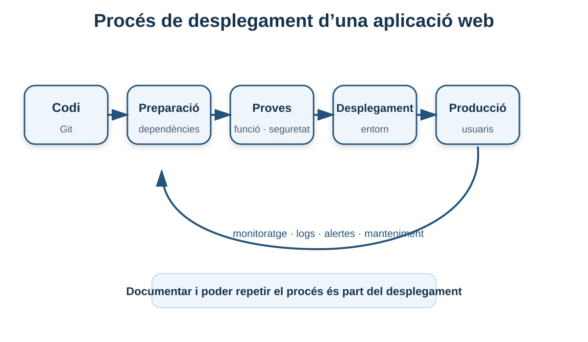
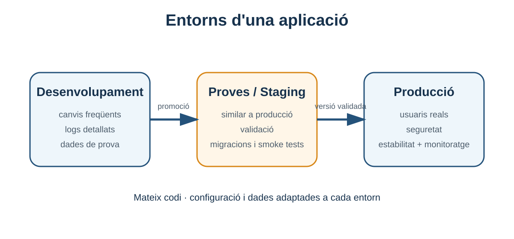

# 4. Requisits del procés de desplegament

**Criteri relacionat: RA1.h**

Desplegar una aplicació no és copiar una carpeta a un servidor i esperar que funcione. Un desplegament correcte implica preparar **infraestructura, programari, configuració, dades, seguretat, proves, monitoratge i documentació**.



## 4.1 Què significa desplegar una aplicació?

El **desplegament** és el procés que porta una versió del programari des del seu estat de desenvolupament fins a un entorn on pot ser executada pels usuaris previstos.

Això pot implicar:

- preparar un servidor;
- instal·lar dependències;
- copiar o descarregar el codi/artefacte;
- definir variables de configuració;
- preparar la base de dades;
- configurar domini i HTTPS;
- iniciar serveis;
- comprovar que funcionen;
- habilitar monitoratge;
- documentar el procediment.

!!! warning "Desplegar no és només instal·lar"
    Una aplicació pot estar perfectament instal·lada i, tanmateix, no estar preparada per a producció perquè no té backups, logs, HTTPS, variables correctes o un procediment de recuperació.

## 4.2 Abans del desplegament: conéixer l'aplicació

Abans de tocar el servidor necessitem saber què requereix el programari.

Preguntes bàsiques:

- Quin sistema operatiu suporta?
- Quin runtime necessita?
- Quina versió de Java, Node.js, PHP o Python?
- Necessita una base de dades?
- Quin motor i quina versió?
- En quin port escolta?
- Quines variables d'entorn necessita?
- Necessita escriure fitxers al disc?
- Quanta memòria consumeix?
- Té dependències externes?
- Com es comprova que està saludable?

Una bona aplicació hauria de documentar aquests requisits.

## 4.3 Requisits de hardware

El material base destaca CPU, RAM, emmagatzematge i connectivitat.

### CPU

Ha de ser suficient per al volum de processament esperat.

Factors:

- nombre de peticions;
- cost de la lògica;
- compressió;
- xifrat TLS;
- processos en segon pla.

### RAM

S'utilitza per:

- processos del sistema;
- servidor web;
- servidor d'aplicacions;
- JVM;
- cachés;
- base de dades.

Una aplicació Java pot funcionar amb poca memòria en un laboratori i necessitar molt més en producció.

### Emmagatzematge

No només hem de calcular el codi de l'aplicació. També:

- base de dades;
- uploads;
- logs;
- backups locals temporals;
- paquets i actualitzacions.

### Xarxa

Hem de considerar:

- ample de banda;
- latència;
- connectivitat amb la base de dades;
- accés a serveis externs;
- ports oberts;
- firewall.

## 4.4 Requisits de software

Exemple per a una aplicació Java:

```text
Sistema operatiu: Ubuntu Server 24.04
Servidor web:     Apache HTTP Server
Runtime:          JDK 17/21 segons aplicació
App server:       Tomcat 10.1.x
Base de dades:    PostgreSQL
```

No és suficient dir “necessita Java”. Una aplicació pot ser incompatible amb determinades versions.

!!! tip "Versions explícites"
    En documentació de desplegament és millor escriure `Tomcat 10.1.x` o `PostgreSQL 16` que simplement “Tomcat” o “PostgreSQL”. Facilita reproduir l'entorn.

## 4.5 Entorns: desenvolupament, proves i producció

El material base diferencia tres entorns fonamentals.

### Desenvolupament

Pensat perquè el programador treballe ràpidament.

Característiques possibles:

- logs detallats;
- recàrrega automàtica;
- dades fictícies;
- serveis locals;
- configuració permissiva.

### Proves / staging

Ha d'assemblar-se a producció tant com siga raonable.

Serveix per:

- validar una versió;
- executar proves d'integració;
- comprovar migracions;
- provar el procés de desplegament.

### Producció

És l'entorn dels usuaris reals.

Prioritats:

- estabilitat;
- seguretat;
- disponibilitat;
- rendiment;
- còpies de seguretat;
- monitoratge.

```text
Codi
 │
 ▼
Desenvolupament ──> Proves/Staging ──> Producció
     ràpid               similar            estable
```



!!! warning "No uses producció com a entorn de proves"
    Provar canvis directament sobre dades i usuaris reals converteix qualsevol error en una incidència real.

## 4.6 Configuració separada del codi

Una mateixa aplicació pot necessitar configuracions diferents segons l'entorn.

Exemple:

```text
Desenvolupament:
DB_HOST=localhost
LOG_LEVEL=debug

Producció:
DB_HOST=db-interna
LOG_LEVEL=info
```

És millor evitar codificar aquestes dades directament al programa.

## 4.7 Variables d'entorn

Les **variables d'entorn** permeten injectar configuració sense modificar el codi.

Exemple conceptual:

```bash
export APP_PORT=8080
export DB_HOST=10.0.0.20
export DB_NAME=dawshop
```

L'aplicació llig els valors en iniciar-se.

Avantatges:

- mateixa versió del codi en diferents entorns;
- menys configuració hardcoded;
- automatització més senzilla;
- facilita contenidors i pipelines.

## 4.8 Secrets

Una variable d'entorn pot contindre informació sensible, però això no significa que qualsevol manera de definir-la siga segura.

Secrets típics:

- contrasenyes de BBDD;
- tokens API;
- claus privades;
- secrets JWT;
- credencials de correu.

### Què no fer

```javascript
const DB_PASSWORD = "supersecret123";
```

si el fitxer es puja al repositori.

### Bones pràctiques conceptuals

- no versionar secrets;
- limitar qui pot llegir-los;
- rotar-los si es filtren;
- usar gestors de secrets quan l'entorn ho requerisca;
- evitar mostrar-los en logs.

## 4.9 Configuració de seguretat

El material base inclou certificats SSL/TLS, firewall, autenticació, autorització i xifrat de dades sensibles.

### HTTPS

Protegeix la comunicació client-servidor.

### Firewall

Permet limitar ports i orígens.

Exemple conceptual:

```text
Internet → 443 HTTPS      PERMÉS
Internet → 5432 PostgreSQL BLOQUEJAT
Backend  → 5432 PostgreSQL PERMÉS
```

### Autenticació

Respon a:

> Qui eres?

### Autorització

Respon a:

> Què tens permís per fer?

Un usuari pot estar autenticat però no autoritzat a entrar al panell d'administració.

## 4.10 Principi de mínim privilegi

Cada usuari o servei hauria de tindre **només els permisos que necessita**.

Exemples:

- Apache no necessita ser administrador del sistema;
- l'usuari de l'aplicació no hauria de poder modificar qualsevol fitxer;
- l'usuari de BBDD de l'aplicació no ha de ser necessàriament superusuari;
- la base de dades no ha d'acceptar connexions des de qualsevol IP.

Aquesta idea redueix l'impacte d'un possible error o atac.

## 4.11 Preparar la base de dades

Una aplicació que usa dades necessita una configuració correcta.

### Connexió

Hem de definir:

- host;
- port;
- base de dades;
- usuari;
- credencials;
- opcions TLS si correspon.

### Migracions

Quan una versió nova canvia l'esquema de dades, podem necessitar migracions.

Exemple:

Versió 1:

```text
usuaris(id, nom, email)
```

Versió 2:

```text
usuaris(id, nom, email, telefon)
```

El desplegament ha d'incloure el canvi de l'esquema de manera controlada.

### Còpies de seguretat

Abans d'una migració important és especialment prudent tindre una còpia recuperable.

!!! warning "Backup no verificat = backup no fiable"
    No és suficient generar fitxers de còpia. Cal comprovar que el procediment de restauració funciona.

## 4.12 Dades de desenvolupament i dades reals

No hauríem de copiar dades personals de producció a un entorn de desenvolupament sense control.

Per a proves és preferible:

- generar dades fictícies;
- anonimitzar dades quan siga necessari;
- limitar accessos.

A més de ser una qüestió tècnica, pot tindre implicacions de privacitat i compliment normatiu.

## 4.13 Proves abans del desplegament

El material base destaca diverses categories.

### Proves funcionals

Comproven que l'aplicació fa el que ha de fer.

Exemple:

```text
Usuari inicia sessió → entra al panell
```

### Proves de rendiment

Mesuren comportament amb càrrega.

Preguntes:

- quants usuaris concurrents suporta?
- com creix la latència?
- quin component satura primer?

### Proves de seguretat

Busquen vulnerabilitats i errors de configuració.

Exemples conceptuals:

- controls d'accés;
- injeccions;
- XSS;
- secrets exposats;
- versions vulnerables.

### Proves de compatibilitat

Comproven navegadors, dispositius o entorns necessaris.

## 4.14 Smoke test després del desplegament

Després d'activar una nova versió convé fer una comprovació ràpida de les funcions essencials.

Exemple DAWShop:

- [ ] la portada respon;
- [ ] login funciona;
- [ ] llistat de productes carrega;
- [ ] es pot consultar un producte;
- [ ] es pot crear una comanda de prova;
- [ ] no hi ha errors crítics als logs.

Açò no substitueix la bateria de proves, però permet detectar fallades evidents ràpidament.

## 4.15 Monitoratge després del desplegament

Una aplicació que ha superat les proves pot fallar en producció.

Cal observar:

- disponibilitat;
- CPU;
- RAM;
- disc;
- latència;
- peticions per segon;
- errors HTTP;
- connexions a BBDD;
- cues o processos interns.

### Logs

Exemple Apache:

```text
access.log
error.log
```

Exemple aplicació:

```text
INFO  Comanda 318 creada
WARN  Temps de consulta: 1200 ms
ERROR No es pot connectar a la base de dades
```

### Alertes

Una alerta ha de portar-nos a actuar.

Exemples:

- disc > 90%;
- aplicació no respon;
- error rate > llindar;
- base de dades sense connexions disponibles.

## 4.16 Manteniment

Desplegar no és el final.

El manteniment inclou:

- actualitzacions de seguretat;
- renovació de certificats;
- rotació de logs;
- revisió de backups;
- monitoratge de capacitat;
- actualització de dependències;
- documentació de canvis.

## 4.17 Control de versions amb Git

Git permet saber:

- quin codi forma una versió;
- qui ha canviat què;
- comparar versions;
- crear etiquetes (`tags`);
- tornar al codi anterior.

Exemple:

```text
v1.0.0 → v1.0.1 → v1.1.0
```

Un desplegament hauria de poder relacionar-se amb una versió concreta del codi o de l'artefacte.

## 4.18 Integració i desplegament continu: CI/CD

El material base introdueix eines com Jenkins, GitLab CI o CircleCI.

La idea important és automatitzar passos repetibles.

```text
Push al repositori
       │
       ▼
   Compilar
       │
       ▼
   Proves
       │
       ▼
 Generar artefacte
       │
       ▼
 Desplegar a staging
       │
       ▼
  Validació
       │
       ▼
 Producció
```

### CI

**Continuous Integration**: integrar canvis freqüentment i executar validacions automàtiques.

### CD

Pot referir-se a **Continuous Delivery** o **Continuous Deployment**, segons el nivell d'automatització.

No necessitem aprofundir en les diferències en aquesta unitat. El concepte central és que **el desplegament ha de ser repetible i reduir passos manuals propensos a errors**.

## 4.19 Artefactes de desplegament

En lloc de copiar un directori de desenvolupament, sovint es genera un artefacte.

Exemples:

- `.war` per a una aplicació Java web;
- `.jar` executable;
- imatge de contenidor;
- paquet compilat de frontend;
- fitxer ZIP/TAR.

L'artefacte representa una versió concreta preparada per ser instal·lada.

## 4.20 Rollback

Un bon desplegament respon també a:

> Què fem si la nova versió falla?

Un **rollback** és tornar a una versió anterior coneguda com a estable.

Per fer-lo possible podem necessitar:

- conservar l'artefacte anterior;
- tindre backups;
- controlar migracions de BBDD;
- documentar passos;
- automatitzar la reversió quan siga possible.

!!! danger "La base de dades complica els rollbacks"
    Tornar el codi a una versió anterior pot ser fàcil. Tornar l'esquema i les dades d'una base de dades pot no ser-ho. Les migracions s'han de planificar amb molta cura.

## 4.21 Documentació

La documentació és part del desplegament, no un afegit opcional.

El material base proposa:

- documentació del servidor;
- guia de desplegament;
- resolució de problemes comuns.

Una guia útil podria incloure:

```markdown
# Desplegament DAWShop

## Requisits
- Ubuntu 24.04
- JDK
- Tomcat
- PostgreSQL

## Variables
- DB_HOST
- DB_NAME
- DB_USER

## Passos
1. Instal·lar dependències.
2. Copiar WAR.
3. Aplicar migracions.
4. Reiniciar servei.
5. Executar smoke test.

## Logs
- Apache: ...
- Tomcat: ...

## Rollback
...
```

## 4.22 Checklist de desplegament

### Abans

- [ ] Versió identificada.
- [ ] Requisits documentats.
- [ ] Backup si hi ha canvis crítics.
- [ ] Variables i secrets preparats.
- [ ] Migracions revisades.
- [ ] Proves superades.

### Durant

- [ ] Artefacte correcte.
- [ ] Configuració correcta.
- [ ] Serveis iniciats.
- [ ] Migracions aplicades.
- [ ] Logs sense errors crítics.

### Després

- [ ] Smoke test.
- [ ] Monitoratge actiu.
- [ ] Alertes funcionant.
- [ ] Versió registrada.
- [ ] Pla de rollback disponible.

## 4.23 DAWShop: exemple de flux de desplegament

```text
1. Codi validat en Git
        │
2. Construcció del WAR
        │
3. Proves automàtiques
        │
4. Backup / revisió de BBDD
        │
5. Copiar WAR a Tomcat
        │
6. Aplicar configuració
        │
7. Reiniciar / recarregar serveis
        │
8. Smoke test
        │
9. Revisar logs i mètriques
```

Aquest procés és senzill, però ja conté les idees bàsiques d'un desplegament professional.

## 4.24 Errors conceptuals habituals

### “Si funciona al meu ordinador, funcionarà al servidor”

No necessàriament. Poden canviar sistema, versions, permisos, rutes, xarxa, variables o dades.

### “Les variables d'entorn solucionen automàticament la seguretat dels secrets”

No. Són una forma de separar configuració, però els secrets continuen necessitant protecció.

### “Fer backup és copiar un fitxer”

No. Un backup útil necessita política, retenció, protecció i un procediment de restauració verificat.

### “CI/CD és una ferramenta concreta”

No. És una forma d'organitzar i automatitzar processos. Jenkins o GitLab CI són eines que poden implementar-la.

## 4.25 Què has de saber abans de continuar

- [ ] Diferenciar desenvolupament, proves i producció.
- [ ] Identificar requisits de hardware i software.
- [ ] Explicar per què separem configuració del codi.
- [ ] Explicar què és un secret.
- [ ] Identificar mesures bàsiques de seguretat.
- [ ] Explicar migracions i backups.
- [ ] Diferenciar proves funcionals, rendiment, seguretat i compatibilitat.
- [ ] Explicar logs, mètriques i alertes.
- [ ] Entendre la funció de Git i CI/CD en desplegament.
- [ ] Explicar què és un rollback.

## 4.26 Autoavaluació

1. Per què producció no ha de tindre exactament la mateixa configuració que desenvolupament?
2. Quins quatre recursos de hardware bàsics avaluaries abans de desplegar?
3. Per què no convé guardar una contrasenya de BBDD al repositori?
4. Quina diferència hi ha entre autenticació i autorització?
5. Què és una migració de base de dades?
6. Per què un backup s'ha de provar restaurant-lo?
7. Què és un smoke test?
8. Quina informació buscaries als logs després d'un desplegament?
9. Quin problema resol CI/CD?
10. Què necessites preparar per poder fer rollback?

<details>
<summary><strong>Orientació de les respostes</strong></summary>

1. Tenen objectius, dades, seguretat i necessitats diferents; producció prioritza estabilitat i seguretat.
2. CPU, RAM, emmagatzematge i xarxa.
3. Perquè el repositori pot compartir-se o filtrar-se i el secret quedaria exposat en l'historial.
4. Autenticació comprova identitat; autorització comprova permisos.
5. Canvi controlat de l'esquema o estructura de dades entre versions.
6. Perquè una còpia que no pot restaurar-se no garanteix recuperació.
7. Comprovació ràpida de funcionalitats essencials després del desplegament.
8. Errors d'arrancada, connexió a BBDD, excepcions, codis 5xx i altres incidències.
9. Automatitzar i fer repetibles integració, proves, construcció i desplegament.
10. Versió anterior/artefacte, procediment, backups i compatibilitat de dades/migracions.

</details>

---

!!! success "Idea clau del bloc"
    Un desplegament professional no acaba quan l'aplicació “arranca”. Acaba quan **la versió és reproduïble, està verificada, és observable i sabem com recuperar-nos si falla**.

[Anterior: estructura i recursos](03-estructura-recursos.md) · [Índex de la UP1](index.md) · [Següent: servidor web Apache](05-servidor-web-apache.md)
