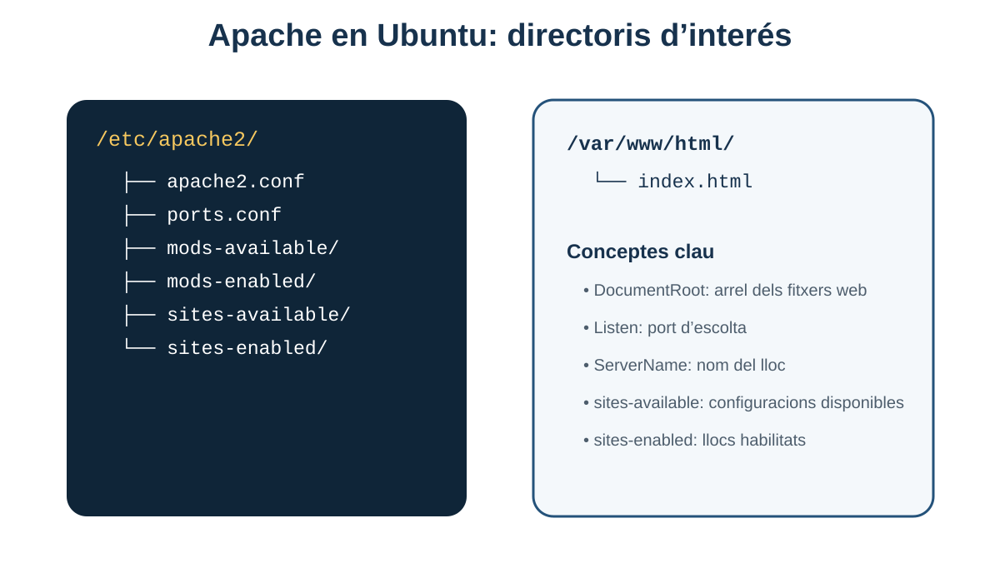
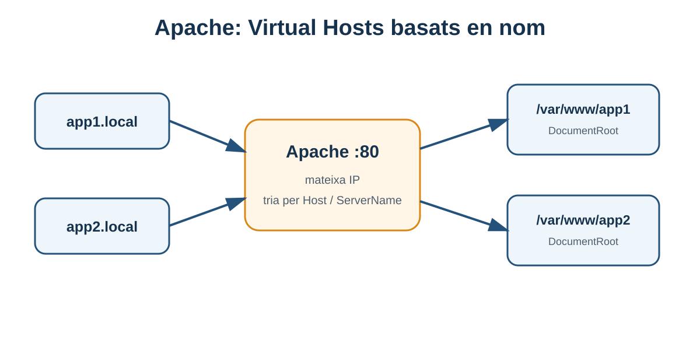

# 5. Instal·lació i configuració d'Apache HTTP Server

**Criteri relacionat: RA1.c**

En els blocs anteriors hem parlat de “servidor web” de manera conceptual. Ara instal·larem i configurarem un producte concret: **Apache HTTP Server**.

L'objectiu no és només aconseguir veure la pàgina *It works!*. Has d'entendre:

- quin servei has instal·lat;
- en quin port escolta;
- on està la configuració;
- on es guarda el contingut;
- com es defineixen diferents llocs web;
- on mirar quan alguna cosa falla.

## 5.1 Servidors web habituals

El material base presenta diverses solucions.

### Nginx

Servidor web de codi obert molt utilitzat també com:

- proxy invers;
- balancejador de càrrega;
- caché HTTP.

### Apache HTTP Server

Servidor web lliure i multiplataforma desenvolupat per la comunitat de l'Apache Software Foundation.

És especialment interessant per a la unitat perquè permet estudiar de manera clara:

- fitxers de configuració;
- mòduls;
- Virtual Hosts;
- logs;
- permisos;
- proxy invers.

### Cloudflare

Cloudflare és sobretot una plataforma de xarxa, CDN, proxy i seguretat distribuïda. En estadístiques de tecnologies web pot aparéixer com a tecnologia frontal, però conceptualment no és el mateix tipus de producte local que instal·larem amb `apt install apache2`.

### LiteSpeed

Servidor web propietari amb compatibilitat amb nombroses configuracions de l'ecosistema Apache.

!!! note "Les quotes de mercat canvien"
    El material original inclou estadístiques d'ús. Són útils per veure que no hi ha un únic servidor web dominant en tots els contextos, però no cal memoritzar percentatges, ja que evolucionen amb el temps.

## 5.2 Què instal·lem realment quan instal·lem Apache?

En Ubuntu/Debian el paquet principal és:

```bash
apache2
```

Quan l'instal·lem obtenim, entre altres coses:

- el programa servidor;
- un servei gestionat per `systemd`;
- estructura de configuració en `/etc/apache2`;
- directori web inicial en `/var/www/html`;
- configuració del lloc per defecte;
- logs en `/var/log/apache2`.

```text
Ubuntu Server
│
├── servei apache2
├── /etc/apache2/        configuració
├── /var/www/html/       contingut web
└── /var/log/apache2/    registres
```

## 5.3 Entorn de laboratori

El material base planteja una màquina virtual amb **Ubuntu Server 24**.

Abans de començar comprova:

- la VM està arrancada;
- té xarxa;
- coneixes el teu usuari;
- tens permisos `sudo`;
- el host pot comunicar-se amb la VM.

### Comprovar IP

```bash
ip addr
```

o:

```bash
ip a
```

Busca la interfície de xarxa principal, no la de loopback `127.0.0.1`.

Exemple:

```text
inet 192.168.1.50/24
```

Eixa IP ens permetrà provar Apache des d'un altre equip de la xarxa.

## 5.4 Instal·lació d'Apache

### 1. Actualitzar índex de paquets

```bash
sudo apt update
```

### 2. Instal·lar Apache

```bash
sudo apt install apache2
```

### 3. Comprovar l'estat

```bash
systemctl status apache2
```

Hauríem de veure el servei com a actiu.

```text
active (running)
```

!!! tip "`systemctl` és una ferramenta general"
    No és exclusiva d'Apache. La utilitzarem per gestionar molts serveis del sistema.

## 5.5 Ordres bàsiques de servei

```bash
sudo systemctl status apache2
sudo systemctl start apache2
sudo systemctl stop apache2
sudo systemctl restart apache2
sudo systemctl reload apache2
```

### `restart` vs `reload`

- `restart`: para i torna a iniciar el servei.
- `reload`: demana al servei que recarregue configuració sense una parada completa, si el servei ho suporta.

Després de canvis de configuració, sol ser preferible validar primer i després fer `reload`.

## 5.6 Primera prova

Des de la mateixa VM:

```text
http://localhost
```

o:

```text
http://127.0.0.1
```

Des del teu ordinador:

```text
http://IP_DE_LA_VM
```

Exemple:

```text
http://192.168.1.50
```

Si apareix la pàgina per defecte d'Apache, podem concloure que:

1. Apache està executant-se;
2. escolta en el port HTTP esperat;
3. la xarxa permet arribar a la VM;
4. el navegador ha rebut una resposta HTTP.

Aquesta comprovació és més informativa que simplement veure `active (running)`.

## 5.7 En quin port escolta Apache?

Per defecte, HTTP utilitza el port **80**.

Podem pensar:

```text
Navegador
   │
   │ TCP/HTTP port 80
   ▼
192.168.1.50:80
   │
   ▼
Apache
```

La configuració de ports en Ubuntu es troba principalment en:

```text
/etc/apache2/ports.conf
```

Exemple conceptual:

```apache
Listen 80
```

## 5.8 DocumentRoot

El **DocumentRoot** és el directori des del qual un Virtual Host serveix fitxers.

En la configuració inicial d'Ubuntu és habitual:

```text
/var/www/html
```

Podem inspeccionar-lo:

```bash
ls -la /var/www/html
```

Allí trobarem la pàgina inicial instal·lada pel paquet.

### Prova senzilla

Crea un fitxer:

```bash
sudo nano /var/www/html/prova.html
```

Contingut:

```html
<!doctype html>
<html lang="ca">
<head>
  <meta charset="utf-8">
  <title>Prova Apache</title>
</head>
<body>
  <h1>Apache funciona</h1>
</body>
</html>
```

Després:

```text
http://IP_DE_LA_VM/prova.html
```

### Què ha passat?

```text
GET /prova.html
      │
      ▼
DocumentRoot = /var/www/html
      │
      ▼
/var/www/html/prova.html
```

Aquesta relació **URL → ruta física** és essencial.

## 5.9 Estructura de configuració en Ubuntu/Debian



Una estructura simplificada és:

```text
/etc/apache2/
├── apache2.conf
├── ports.conf
├── mods-available/
├── mods-enabled/
├── sites-available/
├── sites-enabled/
├── conf-available/
└── conf-enabled/
```

### `apache2.conf`

Fitxer principal de configuració. Inclou o carrega altres fragments.

### `ports.conf`

Ports on escolta Apache.

### `sites-available`

Configuracions de llocs disponibles.

### `sites-enabled`

Llocs activats.

### `mods-available` i `mods-enabled`

Mòduls disponibles i activats.

### `conf-available` i `conf-enabled`

Fragments de configuració addicionals.

!!! info "Available vs enabled"
    En Ubuntu, moltes configuracions es guarden en `*-available` i s'activen mitjançant enllaços simbòlics en `*-enabled`. Això permet habilitar/deshabilitar sense eliminar el fitxer original.

## 5.10 El lloc per defecte

La configuració inicial sol estar en:

```text
/etc/apache2/sites-available/000-default.conf
```

Un exemple simplificat:

```apache
<VirtualHost *:80>
    DocumentRoot /var/www/html
</VirtualHost>
```

Significa:

- aquest Virtual Host escolta peticions al port 80;
- serveix contingut des de `/var/www/html`.

## 5.11 Directives bàsiques

El material base introdueix diverses directives.

| Directiva | Funció |
|---|---|
| `ServerName` | Nom principal amb què identifiquem el lloc/servidor. |
| `ServerRoot` | Arrel de la instal·lació/configuració del servidor. |
| `Listen` | IP/port on Apache escolta. |
| `TimeOut` | Temps màxim d'espera per determinades operacions. |
| `KeepAlive` | Permet reutilitzar una connexió per a múltiples peticions. |
| `DocumentRoot` | Arrel del contingut d'un lloc. |
| `DirectoryIndex` | Fitxers que es busquen quan es demana un directori. |

!!! note "Sobre `NameVirtualHost`"
    Aquesta directiva apareix en materials clàssics d'Apache. En **Apache 2.4** els Virtual Hosts basats en nom es configuren directament amb blocs `<VirtualHost>` i `ServerName`; `NameVirtualHost` és una directiva antiga que ja no forma part del flux normal de configuració modern.

## 5.12 Virtual Hosts

Un **Virtual Host** permet que un únic Apache servisca diversos llocs.

Exemple:

```text
app1.local ──┐
             ├──> Apache 192.168.1.50
app2.local ──┘
```

Apache mira el `Host` de la petició HTTP i tria la configuració corresponent.



### Preparar dos directoris

```bash
sudo mkdir -p /var/www/app1
sudo mkdir -p /var/www/app2
```

### Crear una pàgina en cada lloc

```bash
echo '<h1>APP 1</h1>' | sudo tee /var/www/app1/index.html
echo '<h1>APP 2</h1>' | sudo tee /var/www/app2/index.html
```

### Configuració d'`app1`

```bash
sudo nano /etc/apache2/sites-available/app1.conf
```

```apache
<VirtualHost *:80>
    ServerName app1.local
    DocumentRoot /var/www/app1

    <Directory /var/www/app1>
        Require all granted
    </Directory>

    ErrorLog ${APACHE_LOG_DIR}/app1-error.log
    CustomLog ${APACHE_LOG_DIR}/app1-access.log combined
</VirtualHost>
```

### Configuració d'`app2`

```apache
<VirtualHost *:80>
    ServerName app2.local
    DocumentRoot /var/www/app2

    <Directory /var/www/app2>
        Require all granted
    </Directory>

    ErrorLog ${APACHE_LOG_DIR}/app2-error.log
    CustomLog ${APACHE_LOG_DIR}/app2-access.log combined
</VirtualHost>
```

## 5.13 Activar i desactivar llocs

Activar:

```bash
sudo a2ensite app1.conf
sudo a2ensite app2.conf
```

Desactivar:

```bash
sudo a2dissite 000-default.conf
```

Abans de recarregar:

```bash
sudo apache2ctl configtest
```

Resposta esperada:

```text
Syntax OK
```

Després:

```bash
sudo systemctl reload apache2
```

!!! danger "No reinicies a cegues"
    Si has escrit una configuració incorrecta, validar-la abans de recarregar ajuda a evitar deixar el servei fora de funcionament.

## 5.14 Resoldre noms en un laboratori

Si `app1.local` no existeix en cap DNS, el teu ordinador no sabrà quina IP té.

Per a un laboratori podem afegir una entrada al fitxer `hosts` del client.

En Linux:

```text
/etc/hosts
```

Exemple:

```text
192.168.1.50 app1.local app2.local
```

Ara el navegador pot resoldre:

```text
http://app1.local
http://app2.local
```

Aquest exercici connecta directament amb el bloc de DNS.

## 5.15 `DirectoryIndex`

Quan demanes:

```text
http://app1.local/
```

no has escrit cap fitxer concret. Apache pot buscar noms definits com a índex, per exemple:

```text
index.html
index.php
```

Aquesta idea està controlada per `DirectoryIndex`.

Per això `/` pot acabar servint un `index.html` sense que aparega en la URL.

## 5.16 Permisos de fitxers

Apache necessita poder **llegir** el contingut que ha de servir.

Un problema de permisos pot provocar un `403 Forbidden` o errors als logs.

Comprova:

```bash
ls -ld /var/www/app1
ls -l /var/www/app1
```

No resolgues problemes de permisos amb:

```bash
chmod -R 777 ...
```

sense entendre què estàs fent.

!!! warning "777 no és una solució professional"
    Donar permisos totals a tothom pot ocultar el problema i introduir riscos. Cal identificar quin usuari/grup necessita llegir o escriure i concedir només els permisos necessaris.

## 5.17 Logs d'Apache

Directori habitual:

```text
/var/log/apache2/
```

Fitxers comuns:

```text
access.log
error.log
```

### Access log

Registra peticions.

Exemple conceptual:

```text
192.168.1.20 - - [12/Sep/2026:10:15:01] "GET / HTTP/1.1" 200 1024
```

Podem identificar:

- client;
- data;
- mètode i ruta;
- codi d'estat;
- mida de resposta.

### Error log

Conté errors i avisos del servidor.

Per veure les últimes línies:

```bash
sudo tail -n 50 /var/log/apache2/error.log
```

En temps real:

```bash
sudo tail -f /var/log/apache2/error.log
```

!!! tip "Primer lloc on mirar"
    Si Apache està actiu però la web no funciona com esperes, els logs solen donar més informació que provar canvis aleatoris.

## 5.18 Mòduls d'Apache

Apache amplia funcionalitat mitjançant mòduls.

Llistar mòduls carregats:

```bash
apache2ctl -M
```

Activar un mòdul:

```bash
sudo a2enmod NOM
```

Desactivar:

```bash
sudo a2dismod NOM
```

En altres blocs podem necessitar, per exemple, mòduls relacionats amb proxy o SSL.

## 5.19 Proxy invers cap a una aplicació

Apache no ha de servir sempre un fitxer. Pot enviar una petició a un backend.

Arquitectura:

```text
Client ──> Apache :80/443 ──> Aplicació :8080
```

Això permet exposar una URL pública normal encara que el backend escolte en un port intern diferent.

Exemple conceptual, que aprofundirem amb Tomcat:

```apache
ProxyPass        /app http://127.0.0.1:8080/app
ProxyPassReverse /app http://127.0.0.1:8080/app
```

## 5.20 HTTPS: visió inicial

En producció és habitual que Apache gestione HTTPS en el port 443.

Conceptualment necessitem:

- mòdul SSL/TLS;
- certificat;
- clau privada;
- Virtual Host per al port 443.

No desenvoluparem encara tota la gestió de certificats, però has d'identificar on encaixa:

```text
Client HTTPS
    │
    ▼
Apache :443
    │ trànsit intern segons arquitectura
    ▼
Aplicació
```

## 5.21 Diagnòstic sistemàtic

Suposa que `http://app1.local` no funciona.

### 1. El nom resol?

```bash
ping app1.local
```

o consulta el fitxer `hosts`.

### 2. Hi ha connectivitat amb la IP?

```bash
ping 192.168.1.50
```

### 3. Apache està actiu?

```bash
systemctl status apache2
```

### 4. Escolta en el port?

```bash
sudo ss -ltnp | grep ':80'
```

### 5. La configuració és vàlida?

```bash
sudo apache2ctl configtest
```

### 6. El Virtual Host està habilitat?

```bash
ls -l /etc/apache2/sites-enabled/
```

### 7. El `DocumentRoot` existeix?

```bash
ls -la /var/www/app1
```

### 8. Hi ha permisos?

```bash
namei -l /var/www/app1/index.html
```

### 9. Què diuen els logs?

```bash
sudo tail -n 50 /var/log/apache2/error.log
```

Aquesta forma ordenada de treballar és una competència molt més valuosa que memoritzar “la comanda que ho arregla”.

## 5.22 Errors HTTP habituals en Apache

### 403 Forbidden

Possibles causes:

- permisos;
- `Require`;
- accés a un directori no autoritzat;
- configuració del Virtual Host.

### 404 Not Found

Possibles causes:

- ruta incorrecta;
- `DocumentRoot` equivocat;
- fitxer absent;
- Virtual Host diferent del que creies.

### 500 Internal Server Error

Pot aparéixer per:

- configuració o aplicació;
- errors d'un mòdul;
- `.htaccess` incorrecte si està habilitat;
- backend que falla.

### No hi ha connexió

Si el navegador diu que no pot connectar-se i no hi ha codi HTTP, pensa abans en:

- servei aturat;
- port tancat;
- IP incorrecta;
- firewall;
- xarxa.

## 5.23 Mini pràctica guiada

L'objectiu és que acabes amb dos Virtual Hosts.

### Pas 1

Instal·la Apache i comprova la pàgina inicial.

### Pas 2

Crea:

```text
/var/www/alumnat
/var/www/professorat
```

### Pas 3

Afig un `index.html` diferent a cada directori.

### Pas 4

Configura:

```text
alumnat.local
professorat.local
```

### Pas 5

Afig les entrades necessàries al `hosts` del client.

### Pas 6

Accedeix als dos noms i comprova que Apache selecciona el Virtual Host correcte.

### Pas 7

Localitza en el log les peticions que acabes de fer.

## 5.24 Què has de saber abans de continuar

- [ ] Instal·lar `apache2` en Ubuntu.
- [ ] Gestionar el servei amb `systemctl`.
- [ ] Identificar el port 80.
- [ ] Localitzar `/var/www/html`.
- [ ] Localitzar `/etc/apache2`.
- [ ] Diferenciar `sites-available` i `sites-enabled`.
- [ ] Interpretar `ServerName`, `Listen`, `DocumentRoot` i `DirectoryIndex`.
- [ ] Crear i activar un Virtual Host.
- [ ] Validar configuració amb `apache2ctl configtest`.
- [ ] Localitzar i interpretar els logs bàsics.
- [ ] Aplicar un procés ordenat de diagnòstic.

## 5.25 Autoavaluació

1. Quina diferència hi ha entre `/etc/apache2` i `/var/www/html`?
2. Què fa `DocumentRoot`?
3. Per què dos dominis diferents poden apuntar a la mateixa IP i mostrar webs distintes?
4. Quina diferència hi ha entre `sites-available` i `sites-enabled`?
5. Per què convé executar `apache2ctl configtest` abans d'un `reload`?
6. Què indica un `403` respecte d'un `404`?
7. On miraries si Apache està actiu però retorna un error inesperat?
8. Què aporta un proxy invers?
9. Per què `chmod -R 777` no és una solució recomanable?
10. Quin fitxer/directiva està relacionada amb el port d'escolta?

<details>
<summary><strong>Orientació de les respostes</strong></summary>

1. `/etc/apache2` conté configuració; `/var/www/html` és un directori de contingut web per defecte.
2. Defineix l'arrel física del contingut d'un Virtual Host.
3. Apache usa el nom `Host`/`ServerName` per seleccionar el Virtual Host.
4. Available guarda configuracions disponibles; enabled conté les activades.
5. Per detectar errors de sintaxi abans d'intentar recarregar el servei.
6. 403 = recurs/accés prohibit; 404 = recurs no trobat.
7. En els logs, especialment `error.log`, a més de revisar el Virtual Host.
8. Rebre peticions en un frontal i enviar-les a un backend intern.
9. Dona permisos excessius i pot introduir riscos.
10. `ports.conf` i la directiva `Listen`.

</details>

---

!!! success "Idea clau del bloc"
    Saber Apache significa saber seguir el recorregut **petició → Virtual Host → DocumentRoot o proxy → resposta**, i saber mirar configuració i logs quan el recorregut es trenca.

[Anterior: requisits del desplegament](04-requisits-desplegament.md) · [Índex de la UP1](index.md) · [Següent: servidor d'aplicacions Tomcat](06-servidor-aplicacions-tomcat.md)
