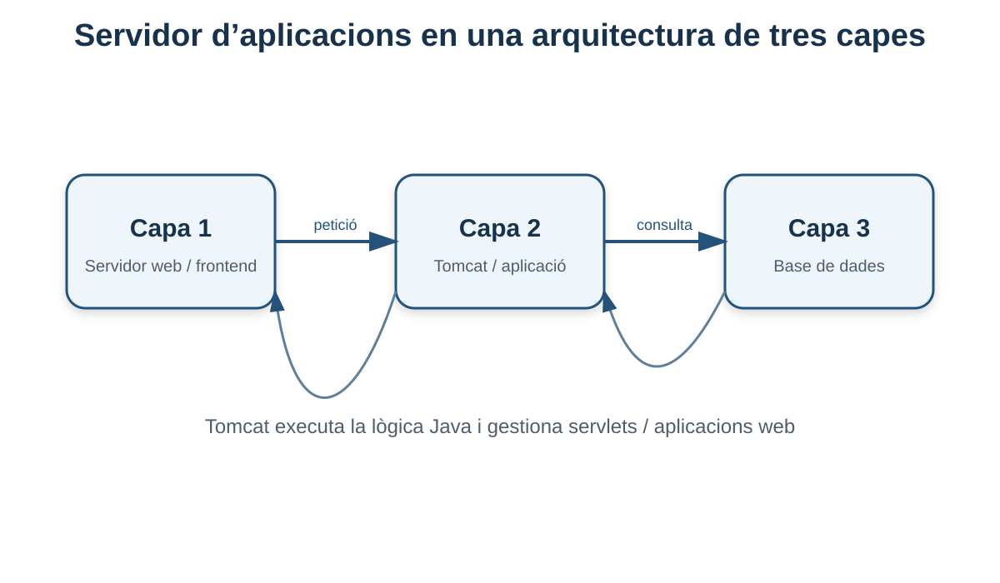
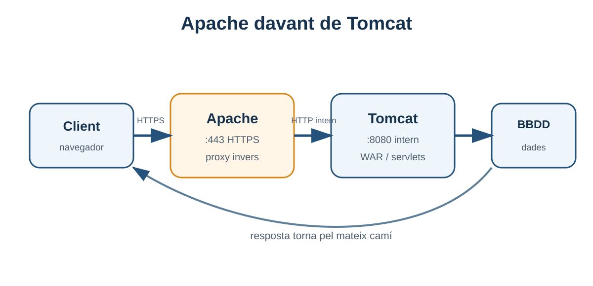

# 6. Servidors d'aplicacions i Apache Tomcat

**Criteri relacionat: RA1.d**

Fins ara Apache HTTP Server ha sigut la nostra porta d'entrada a la web. Però una aplicació dinàmica necessita alguna cosa més que servir fitxers: necessita un entorn capaç d'**executar codi de servidor**.

En aquest bloc treballarem el concepte de **servidor d'aplicacions** i instal·larem **Apache Tomcat**, orientat a aplicacions web Java.

## 6.1 Què és un servidor d'aplicacions?

Un **servidor d'aplicacions** proporciona un entorn per executar i administrar aplicacions de servidor.

Habitualment assumeix tasques com:

- executar components de l'aplicació;
- gestionar peticions dinàmiques;
- controlar el cicle de vida de les aplicacions;
- gestionar sessions;
- oferir connectors de xarxa;
- proporcionar integració amb APIs del runtime;
- facilitar logs i administració.

En una arquitectura de tres nivells podem situar-lo entre la capa web i les dades.



```text
Nivell 1                Nivell 2                 Nivell 3
WEB                      APLICACIÓ                 DADES

Navegador → Apache → Tomcat / lògica → PostgreSQL
```

## 6.2 Per què separar servidor web i servidor d'aplicacions?

No sempre és obligatori, però la separació pot tindre avantatges.

### Servidor web

Pot concentrar-se en:

- HTTP/HTTPS;
- contingut estàtic;
- certificats TLS;
- redireccions;
- logs d'accés;
- proxy invers.

### Servidor d'aplicacions

Pot concentrar-se en:

- executar el codi;
- sessions;
- lògica de negoci;
- recursos de l'aplicació;
- desplegament d'artefactes.

```text
Internet
   │
   ▼
Apache :443
   │
   ▼
Tomcat :8080
   │
   ▼
Aplicació Java
   │
   ▼
BBDD
```

!!! note "No és una regla universal"
    Moltes aplicacions modernes incorporen un servidor HTTP dins del mateix runtime i poden executar-se sense Apache davant. En aquesta unitat separem els rols perquè és una manera molt clara d'entendre l'arquitectura.

## 6.3 Exemples de servidors d'aplicacions

El material base esmenta, entre altres:

- JBoss / WildFly;
- Oracle WebLogic;
- IBM WebSphere;
- GlassFish;
- Apache Tomcat;
- Apache Geronimo.

No és necessari memoritzar la llista. L'important és entendre que diferents ecosistemes i organitzacions poden utilitzar productes diferents.

## 6.4 Què és Apache Tomcat?

**Apache Tomcat** és un servidor web i, sobretot, un **contenidor de servlets** per a aplicacions Java. Implementa diverses especificacions de l'ecosistema Jakarta utilitzades en aplicacions web Java.

Per a aquesta UP podem pensar en Tomcat com:

> **l'entorn que rep peticions i executa una aplicació web Java desplegada.**

Tomcat pot escoltar directament HTTP, habitualment en el port **8080** en la configuració inicial.

## 6.5 Tomcat no és exactament el mateix que un servidor Jakarta EE complet

A nivell introductori sovint es parla de Tomcat com a “servidor d'aplicacions”. És una simplificació útil per al mòdul, però tècnicament Tomcat està centrat en tecnologies web/servlets i no implementa necessàriament tota la plataforma Jakarta EE que sí poden oferir productes com WildFly o GlassFish.

!!! tip "Què has de recordar"
    Per al nostre objectiu: **Tomcat executa aplicacions web Java i gestiona servlets**, mentre Apache HTTP Server és el servidor web frontal que hem treballat al bloc anterior.

## 6.6 Requisit: Java

Tomcat necessita una màquina virtual Java.

Instal·larem el JDK disponible per defecte en Ubuntu:

```bash
sudo apt update
sudo apt install default-jdk
```

Comprovació:

```bash
java -version
```

També podem comprovar la ruta de Java:

```bash
readlink -f $(which java)
```

### `JAVA_HOME`

Moltes eines Java utilitzen la variable `JAVA_HOME` per saber on està instal·lat el runtime/JDK.

En l'entorn del material base:

```bash
export JAVA_HOME=/usr/lib/jvm/default-java/
```

## 6.7 Instal·lació manual de Tomcat

El material base utilitza una versió concreta de Tomcat 10.1. Com que les versions evolucionen, el número exacte pot canviar en la pràctica del curs.

Per entendre el procediment utilitzarem una variable:

```bash
TOMCAT_VERSION=10.1.45
```

### 1. Instal·lar eines necessàries

```bash
sudo apt install wget
```

### 2. Descarregar Tomcat

El material utilitza un mirror d'Apache/RedIRIS. La URL exacta depén de la versió disponible.

Patró:

```bash
wget URL_DEL_PAQUET/apache-tomcat-${TOMCAT_VERSION}.tar.gz
```

!!! warning "No copies una URL antiga sense comprovar-la"
    Les versions desapareixen dels mirrors principals quan són substituïdes. Si el professor indica una versió nova, utilitza la URL corresponent.

### 3. Descomprimir

```bash
tar xvzf apache-tomcat-${TOMCAT_VERSION}.tar.gz
```

### 4. Preparar `/opt/tomcat`

```bash
sudo mkdir -p /opt/tomcat
sudo mv apache-tomcat-${TOMCAT_VERSION} /opt/tomcat/
```

Ara tindrem una ruta semblant a:

```text
/opt/tomcat/apache-tomcat-10.1.45
```

## 6.8 `CATALINA_HOME`

Tomcat usa el nom **Catalina** per a diversos components interns. La variable `CATALINA_HOME` apunta al directori principal de la instal·lació.

```bash
export CATALINA_HOME=/opt/tomcat/apache-tomcat-${TOMCAT_VERSION}
```

El material base proposa afegir `JAVA_HOME` i `CATALINA_HOME` a:

```text
~/.bashrc
```

Exemple:

```bash
export JAVA_HOME=/usr/lib/jvm/default-java/
export CATALINA_HOME=/opt/tomcat/apache-tomcat-10.1.45
```

Recarregar:

```bash
source ~/.bashrc
```

Comprovar:

```bash
echo $JAVA_HOME
echo $CATALINA_HOME
```

## 6.9 Estructura de directoris de Tomcat

Dins de `CATALINA_HOME` trobarem directoris importants.

```text
$CATALINA_HOME/
├── bin/
├── conf/
├── lib/
├── logs/
├── temp/
├── webapps/
└── work/
```

### `bin/`

Scripts d'arrancada i parada.

Exemples:

```text
startup.sh
shutdown.sh
catalina.sh
```

### `conf/`

Configuració de Tomcat.

Fitxers importants:

```text
server.xml
tomcat-users.xml
web.xml
context.xml
```

### `webapps/`

Aplicacions web desplegades.

### `logs/`

Registres.

### `lib/`

Biblioteques disponibles per a Tomcat.

### `temp/` i `work/`

Fitxers temporals i treball intern.

!!! tip "Per diagnosticar Tomcat"
    Memoritzar `conf/`, `webapps/` i `logs/` és especialment útil: **configuració, aplicacions i errors**.

## 6.10 Permisos dels scripts

El material base configura permisos d'execució:

```bash
chmod +x "$CATALINA_HOME/bin/startup.sh"
chmod +x "$CATALINA_HOME/bin/shutdown.sh"
chmod +x "$CATALINA_HOME/bin/catalina.sh"
```

Si la instal·lació ja conserva els permisos originals, pot no ser necessari, però és important entendre què significa `+x`: permet executar el script.

## 6.11 Arrancar i parar Tomcat

### Iniciar

```bash
$CATALINA_HOME/bin/startup.sh
```

### Parar

```bash
$CATALINA_HOME/bin/shutdown.sh
```

Per veure Tomcat en primer pla i observar missatges, també és molt útil:

```bash
$CATALINA_HOME/bin/catalina.sh run
```

Aquesta forma és especialment convenient per aprendre i diagnosticar.

## 6.12 Comprovar el port 8080

Tomcat sol escoltar inicialment en:

```text
8080
```

Podem comprovar-ho:

```bash
ss -ltnp | grep 8080
```

Des del mateix servidor:

```text
http://localhost:8080
```

Des del host:

```text
http://IP_DE_LA_VM:8080
```

Si apareix la pàgina de Tomcat, hem verificat:

- Java funciona;
- Tomcat ha arrancat;
- el connector HTTP escolta;
- el client pot arribar al port.

## 6.13 `server.xml` i el connector HTTP

Un dels fitxers més importants és:

```text
$CATALINA_HOME/conf/server.xml
```

Allí es defineixen connectors i altres elements del servidor.

Un connector HTTP pot aparéixer conceptualment així:

```xml
<Connector port="8080"
           protocol="HTTP/1.1"
           connectionTimeout="20000" />
```

No és necessari modificar-lo ara. Has d'entendre la relació:

```text
Connector port="8080" → Tomcat escolta en 8080
```

## 6.14 Què és una aplicació web en Tomcat?

Tomcat desplega aplicacions web dins de `webapps`.

Exemple:

```text
$CATALINA_HOME/webapps/
├── ROOT/
├── docs/
├── examples/
├── manager/
└── host-manager/
```

Cada aplicació s'associa a un **context path**.

Exemple:

```text
webapps/dawshop
```

podria estar disponible com:

```text
http://servidor:8080/dawshop
```

## 6.15 Què és un fitxer WAR?

Un **WAR (Web Application Archive)** és un paquet utilitzat per distribuir aplicacions web Java.

Exemple:

```text
dawshop.war
```

Si el despleguem en:

```text
$CATALINA_HOME/webapps/dawshop.war
```

Tomcat pot desplegar-lo com una aplicació amb context:

```text
/dawshop
```

Per tant:

```text
http://IP:8080/dawshop
```

!!! info "Artefacte de desplegament"
    El WAR connecta amb el bloc anterior: és un exemple d'**artefacte** que representa una versió de l'aplicació preparada per a ser desplegada.

## 6.16 Desplegament automàtic i context path

La relació simplificada és:

```text
fitxer                    URL
------------------------------------------------
ROOT.war          →       /
dawshop.war       →       /dawshop
intranet.war      →       /intranet
```

Aquesta convenció ajuda a entendre què estàs publicant quan copies un WAR.

## 6.17 Tomcat Manager

El material base mostra les eines web de gestió de Tomcat.

### Server Status

Permet consultar informació com:

- versió de Tomcat;
- JVM;
- sistema operatiu;
- connectors;
- estat de recursos.

### Manager App

Permet gestionar aplicacions desplegades:

- llistar;
- iniciar;
- parar;
- recarregar;
- desplegar;
- retirar desplegament.

### Host Manager

Permet administrar hosts virtuals de Tomcat.

!!! warning "No són pàgines públiques"
    Són interfícies d'administració. En un entorn real s'han de protegir i, si no són necessàries, és millor limitar-ne l'exposició.

## 6.18 Usuaris i rols de gestió

El fitxer principal és:

```text
$CATALINA_HOME/conf/tomcat-users.xml
```

El material treballa amb rols com:

```xml
<role rolename="admin-gui"/>
<role rolename="manager-gui"/>
```

I un usuari:

```xml
<user username="adminlab"
      password="CONTRASENYA_FORTA"
      roles="admin-gui,manager-gui"/>
```

### Per què hi ha rols diferents?

Per aplicar **autorització**: no totes les credencials han de poder fer totes les operacions.

Açò connecta amb el principi de mínim privilegi del bloc anterior.

## 6.19 Restricció per adreça IP

Les aplicacions `manager` i `host-manager` solen limitar des d'on es pot accedir.

El material base mostra l'edició de:

```text
$CATALINA_HOME/webapps/manager/META-INF/context.xml
$CATALINA_HOME/webapps/host-manager/META-INF/context.xml
```

mitjançant `RemoteAddrValve`.

### Exemple del material per permetre qualsevol IP

```xml
<Valve className="org.apache.catalina.valves.RemoteAddrValve"
       allow="^.*$" />
```

!!! danger "No uses `allow=^.*$` en producció"
    Eixa expressió permet qualsevol origen i és útil només per entendre el mecanisme en un **laboratori controlat**. En un sistema real, les interfícies d'administració s'han de restringir a IPs o xarxes de gestió concretes i protegir adequadament.

Exemple conceptual més restrictiu per a una xarxa privada:

```xml
<Valve className="org.apache.catalina.valves.RemoteAddrValve"
       allow="192\.168\.1\..*" />
```

## 6.20 Logs de Tomcat

Els logs solen estar en:

```text
$CATALINA_HOME/logs/
```

Per exemple:

```bash
ls -lh "$CATALINA_HOME/logs"
```

Un fitxer important pot ser:

```text
catalina.out
```

segons la forma d'arrancada i la configuració.

Per seguir-lo:

```bash
tail -f "$CATALINA_HOME/logs/catalina.out"
```

### Què buscar?

- errors d'arrancada;
- port ocupat;
- excepcions Java;
- aplicació que no es desplega;
- dependències que falten;
- errors de connexió a BBDD.

## 6.21 Error típic: port 8080 ocupat

Si un altre procés ja utilitza 8080, Tomcat no podrà escoltar allí.

Comprova:

```bash
sudo ss -ltnp | grep ':8080'
```

Si hi ha un altre procés, tens opcions:

- parar-lo si no és necessari;
- canviar el port del servei;
- revisar si Tomcat ja estava arrancat.

!!! warning "No mates processos aleatòriament"
    Identifica primer quin procés usa el port i per què.

## 6.22 Error típic: `JAVA_HOME` incorrecte

Comprova:

```bash
echo $JAVA_HOME
ls -la "$JAVA_HOME"
java -version
```

Si el valor no apunta a una instal·lació Java vàlida, els scripts poden fallar.

## 6.23 Error típic: 404 en una aplicació

Si Tomcat respon però:

```text
http://IP:8080/dawshop
```

retorna 404, comprova:

1. existeix el WAR/directori?
2. s'ha desplegat correctament?
3. hi ha errors en logs?
4. el context path és realment `/dawshop`?
5. l'aplicació ha arrancat?

Un `404` és diferent de “no hi ha connexió”: Tomcat ha respost, però no ha trobat el recurs/context.

## 6.24 Apache davant de Tomcat

Fins ara podem accedir directament:

```text
http://192.168.1.50:8080/dawshop
```

Però en una arquitectura més realista podem voler:

```text
https://dawshop.local/
```

amb Apache com a frontal.

```text
Navegador
   │
   │ 80/443
   ▼
Apache HTTP Server
   │
   │ proxy intern
   ▼
Tomcat :8080
   │
   ▼
DAWShop
```



## 6.25 Proxy invers amb Apache

Una forma senzilla és usar `mod_proxy` i `mod_proxy_http`.

Activar mòduls:

```bash
sudo a2enmod proxy
sudo a2enmod proxy_http
```

Exemple de Virtual Host:

```apache
<VirtualHost *:80>
    ServerName dawshop.local

    ProxyPreserveHost On
    ProxyPass        / http://127.0.0.1:8080/dawshop/
    ProxyPassReverse / http://127.0.0.1:8080/dawshop/

    ErrorLog ${APACHE_LOG_DIR}/dawshop-error.log
    CustomLog ${APACHE_LOG_DIR}/dawshop-access.log combined
</VirtualHost>
```

Validar:

```bash
sudo apache2ctl configtest
```

Recarregar:

```bash
sudo systemctl reload apache2
```

Ara el client parla amb Apache i Apache parla amb Tomcat.

## 6.26 Per què pot ser útil aquesta arquitectura?

### URL més neta

No exposem necessàriament `:8080`.

### HTTPS centralitzat

Apache pot gestionar el certificat frontal.

### Logs frontals

Totes les peticions públiques passen per un punt comú.

### Ocultar el backend

Tomcat pot escoltar només en una interfície interna segons la configuració.

### Múltiples aplicacions

Apache pot dirigir diferents dominis/rutes a diferents backends.

## 6.27 Apache i Tomcat: qui fa què?

| Tasca | Apache | Tomcat |
|---|---:|---:|
| Escoltar HTTP/HTTPS públic | ✅ | Pot fer-ho |
| Servir fitxers estàtics | ✅ | Pot fer-ho |
| Virtual Hosts web | ✅ | També té hosts, però diferent ús |
| Proxy invers | ✅ | No és la seua funció principal |
| Executar servlets Java | ❌ | ✅ |
| Desplegar WAR | ❌ | ✅ |
| Manager d'aplicacions Java | ❌ | ✅ |

## 6.28 Executar Tomcat com a servei

En un laboratori és didàctic iniciar-lo amb `startup.sh`. En un entorn real, interessa que el sistema puga:

- iniciar Tomcat en arrancar;
- reiniciar-lo de manera controlada;
- executar-lo amb un usuari dedicat;
- consultar l'estat amb `systemctl`.

Això es pot aconseguir creant una unitat `systemd` específica. No és un requisit central del material base, però és el pas natural després de la instal·lació manual.

Conceptualment:

```text
systemd
  │
  ├── start tomcat
  ├── stop tomcat
  └── status tomcat
```

## 6.29 Seguretat bàsica de Tomcat

### No executar com a root

El procés hauria d'usar un compte amb els permisos mínims necessaris.

### Limitar Manager/Host Manager

No exposar-los a Internet sense necessitat.

### Contrasenyes fortes

Mai credencials trivials com:

```text
admin / admin
```

### Actualitzacions

Mantindre Java i Tomcat actualitzats dins de versions compatibles.

### Ports

Si Apache és el frontal, pot no ser necessari exposar 8080 a tota la xarxa.

### Logs

Revisar errors i accessos d'administració.

## 6.30 Mini pràctica guiada

### Part A. Instal·lació

- [ ] instal·la Java;
- [ ] comprova `java -version`;
- [ ] descarrega i descomprimeix Tomcat;
- [ ] configura `CATALINA_HOME`;
- [ ] inicia Tomcat;
- [ ] accedeix a `:8080`.

### Part B. Estructura

Localitza:

```text
bin/
conf/
logs/
webapps/
```

I explica què conté cadascun.

### Part C. Gestió

En entorn de laboratori:

- crea un usuari de Manager;
- limita l'accés segons les indicacions del professor;
- comprova Server Status;
- localitza les aplicacions desplegades.

### Part D. Desplegament

Desplega un WAR de prova i comprova el context.

### Part E. Integració

Configura Apache perquè una ruta o domini arribe a Tomcat mitjançant proxy invers.

## 6.31 Diagnòstic sistemàtic de Tomcat

Quan no funciona:

### 1. Java

```bash
java -version
```

### 2. Variables

```bash
echo $JAVA_HOME
echo $CATALINA_HOME
```

### 3. Procés

```bash
ps aux | grep tomcat
```

### 4. Port

```bash
ss -ltnp | grep 8080
```

### 5. Prova local

```bash
curl -I http://localhost:8080
```

### 6. Logs

```bash
ls -lh "$CATALINA_HOME/logs"
```

### 7. Aplicació

```bash
ls -la "$CATALINA_HOME/webapps"
```

### 8. Si hi ha Apache davant

Comprova també:

```bash
sudo apache2ctl configtest
sudo tail -f /var/log/apache2/error.log
```

!!! tip "Divideix el problema"
    Primer comprova **Tomcat directament en 8080**. Només quan això funciona, comprova el proxy d'Apache. Així saps en quina capa està el problema.

## 6.32 Errors conceptuals habituals

### “Apache i Tomcat són el mateix”

No. Apache HTTP Server i Apache Tomcat són projectes diferents amb responsabilitats diferents.

### “Si Tomcat està en 8080, eixe port ha de ser públic”

No. Si hi ha un proxy invers, 8080 pot ser només intern.

### “Manager és necessari perquè l'aplicació funcione”

No. És una eina d'administració.

### “Copiar el WAR significa que el desplegament ha anat bé”

No. Tomcat encara ha de desplegar i arrancar l'aplicació sense errors. Cal comprovar logs i resposta HTTP.

### “Un 404 és el mateix que Tomcat apagat”

No. 404 implica que has rebut una resposta HTTP. Si Tomcat està apagat, normalment no podràs establir la connexió.

## 6.33 Què has de saber en acabar

- [ ] Explicar què aporta un servidor d'aplicacions.
- [ ] Diferenciar Apache HTTP Server i Tomcat.
- [ ] Explicar la necessitat del JDK/JVM.
- [ ] Identificar `JAVA_HOME` i `CATALINA_HOME`.
- [ ] Localitzar `bin`, `conf`, `logs` i `webapps`.
- [ ] Iniciar i parar Tomcat.
- [ ] Explicar el port 8080.
- [ ] Explicar què és un WAR i el context path.
- [ ] Identificar Manager, Host Manager i Server Status.
- [ ] Entendre els riscos d'obrir les eines de gestió.
- [ ] Localitzar logs i seguir un procés de diagnòstic.
- [ ] Explicar com Apache pot actuar com a proxy davant de Tomcat.

## 6.34 Autoavaluació

1. Quina responsabilitat principal té Tomcat que no té Apache HTTP Server?
2. Per què Tomcat necessita Java?
3. Què representa `CATALINA_HOME`?
4. On buscaries la configuració principal de Tomcat?
5. On es despleguen normalment els WAR?
6. Quina relació hi ha entre `dawshop.war` i `/dawshop`?
7. Per què `allow="^.*$"` és perillós en una interfície d'administració?
8. Quina diferència hi ha entre provar `localhost:8080` i provar el domini que passa per Apache?
9. Què significa un `502 Bad Gateway` si Apache està fent de proxy cap a Tomcat?
10. Per què és útil revisar Tomcat directament abans de revisar el proxy?

<details>
<summary><strong>Orientació de les respostes</strong></summary>

1. Executar i gestionar aplicacions web Java/servlets.
2. Perquè les aplicacions i el mateix Tomcat s'executen sobre la JVM.
3. El directori principal de la instal·lació de Tomcat.
4. En `$CATALINA_HOME/conf`, especialment `server.xml` i altres fitxers segons la funció.
5. En `$CATALINA_HOME/webapps` en el model de desplegament treballat.
6. El nom del WAR sol determinar el context path de l'aplicació.
7. Perquè permet qualsevol IP/origen que arribe al servei.
8. La primera prova Tomcat directament; la segona afegeix DNS/Apache/proxy a la cadena.
9. Apache respon, però no pot obtindre una resposta vàlida del backend configurat.
10. Per aïllar la capa que falla i evitar diagnosticar diverses peces alhora.

</details>

---

!!! success "Idea clau del bloc"
    En la nostra arquitectura, **Apache és la porta d'entrada i Tomcat és l'entorn d'execució de l'aplicació Java**. Quan entens aquesta separació, els ports, el proxy, els WAR i els logs deixen de ser passos aïllats i formen un únic sistema coherent.

[Anterior: servidor web Apache](05-servidor-web-apache.md) · [Índex de la UP1](index.md) · [Presentació de la UP1](../up1-implantacio-arquitectures.md)
