---
hide:
  - navigation
title: "7. Virtualització de servidors, núvol i contenidors"
description: "Màquines virtuals, cloud, Docker, xarxes, volums, Compose i proves de desplegament en contenidors."
---

# 7. Virtualització de servidors, núvol i contenidors

**Criteri relacionat: RA1.e**

En els blocs anteriors hem desplegat serveis directament sobre un sistema operatiu: Apache s'instal·la en Ubuntu, Tomcat s'executa sobre Java i cada component depén de la configuració de la màquina.

En la pràctica professional és molt habitual introduir una capa d'abstracció entre el maquinari i els serveis. Aquesta capa pot adoptar formes diferents:

- una màquina virtual;
- una instància en el núvol;
- un contenidor;
- una combinació de les anteriors.

L'objectiu no és memoritzar productes comercials. Has d'entendre què s'està virtualitzant, quins recursos s'aïllen, com arriba la xarxa al servei i què cal configurar perquè l'aplicació siga reproduïble.

!!! note "Treball semipresencial"
    Aquest bloc està redactat perquè el pugues estudiar de manera autònoma. Reprodueix les ordres quan tingues un entorn de laboratori disponible i no et limites a llegir-les. En desplegament, moltes idees només s'assimilen quan veus què passa amb processos, ports, xarxes i dades.

## 7.1 Del servidor físic a la infraestructura virtual

Un servidor físic pot executar directament un sistema operatiu i diverses aplicacions:

```text
Maquinari físic
└── Ubuntu Server
    ├── Apache
    ├── Tomcat
    └── PostgreSQL
```

Aquest model és senzill, però presenta problemes quan volem:

- executar sistemes operatius diferents;
- aïllar aplicacions;
- provar configuracions sense afectar altres serveis;
- replicar entorns;
- aprofitar millor CPU i memòria;
- crear o eliminar servidors ràpidament.

La virtualització resol part d'aquests problemes introduint una capa intermèdia.

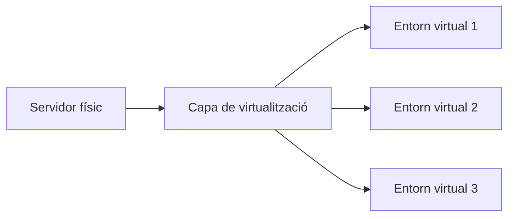

La pregunta important és: quina part del sistema estem virtualitzant i quin grau d'aïllament necessitem?

## 7.2 Què és una màquina virtual?

Una màquina virtual (VM) és un sistema informàtic simulat que disposa de recursos virtuals com:

- CPU virtual;
- memòria RAM;
- disc;
- interfícies de xarxa;
- dispositius;
- firmware virtual.

Dins de la VM instal·lem un sistema operatiu complet, amb el seu propi nucli (kernel).

```text
Servidor físic
│
├── CPU
├── RAM
├── disc
└── xarxa
     │
     ▼
Hipervisor
├── VM 1 → Ubuntu → Apache
├── VM 2 → Ubuntu → PostgreSQL
└── VM 3 → Windows → altra aplicació
```

Cada VM es comporta, des del punt de vista de l'administrador, de manera semblant a un ordinador independent.

## 7.3 L'hipervisor

L'hipervisor és la capa que permet crear i executar màquines virtuals i repartir els recursos físics entre elles.

### Hipervisor de tipus 1

S'executa directament sobre el maquinari:

```text
Maquinari
   │
Hipervisor
 ├── VM
 ├── VM
 └── VM
```

És habitual en centres de dades i infraestructures de servidor.

### Hipervisor de tipus 2

S'executa damunt d'un sistema operatiu host:

```text
Maquinari
   │
Sistema operatiu host
   │
Hipervisor
 ├── VM
 └── VM
```

És el model habitual quan utilitzem eines de laboratori com VirtualBox o VMware Workstation sobre un ordinador personal.

!!! info "La VM que has utilitzat durant el curs"
    Si tens Ubuntu Server dins de VirtualBox, ja estàs treballant amb virtualització. Ubuntu no s'està executant directament sobre el maquinari físic: s'executa dins d'una màquina virtual gestionada per l'hipervisor.

## 7.4 Recursos d'una màquina virtual

Quan creem una VM hem de decidir quins recursos li assignem.

| Recurs | Exemple | Què condiciona |
| --- | --- | --- |
| vCPU | 2 CPU virtuals | Capacitat de processament |
| RAM | 2 GB, 4 GB... | Aplicacions que poden executar-se simultàniament |
| Disc | 20 GB, 40 GB... | Sistema, aplicacions, logs i dades |
| Xarxa | NAT, pont, xarxa interna... | Comunicació amb host, LAN o Internet |
| Sistema operatiu | Ubuntu Server 24.04 | Eines, paquets i compatibilitat |

Assignar més recursos no sempre és millor. Els recursos virtuals provenen d'un host físic limitat.

!!! warning "No confongues reserva amb capacitat infinita"
    Si un ordinador té 16 GB de RAM, crear quatre VM configurades amb 8 GB cadascuna no converteix el host en una màquina de 32 GB. La sobreassignació pot existir en alguns sistemes, però els recursos físics continuen sent finits.

## 7.5 Màquina virtual i snapshot

Alguns hipervisors permeten crear snapshots o punts de l'estat d'una VM. Poden ser molt útils abans d'una pràctica:

```text
VM neta
  │
  ├── snapshot: abans d'Apache
  │
  ├── instal·lació i configuració
  │
  └── error greu
        │
        └── tornar a un estat anterior
```

Però un snapshot no és automàticament un backup complet. Aquesta distinció és important:

- **snapshot:** ajuda a recuperar un estat de la VM;
- **backup:** còpia preparada per recuperar informació davant una pèrdua.

## 7.6 Què significa «núvol»?

El *cloud computing* o computació en el núvol permet accedir sota demanda a recursos informàtics compartits —processament, xarxa, emmagatzematge o aplicacions— que poden aprovisionar-se i alliberar-se ràpidament.

La idea més important és aquesta: en lloc de comprar i preparar físicament un servidor, podem crear recursos virtuals mitjançant una plataforma.

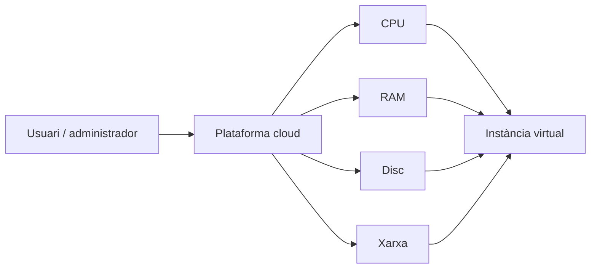

## 7.7 Característiques habituals del cloud

Un entorn cloud sol oferir:

- **autoservei sota demanda:** podem crear recursos quan els necessitem;
- **accés per xarxa;**
- **recursos compartits** entre múltiples clients amb aïllament;
- **elasticitat:** augmentar o reduir capacitat;
- **mesura de l'ús:** recursos consumits, temps, trànsit, etc.

No significa necessàriament que «tot estiga en Internet». També poden existir núvols privats dins d'una organització.

## 7.8 IaaS, PaaS i SaaS

És habitual classificar els serveis cloud segons el nivell que gestiona el proveïdor.

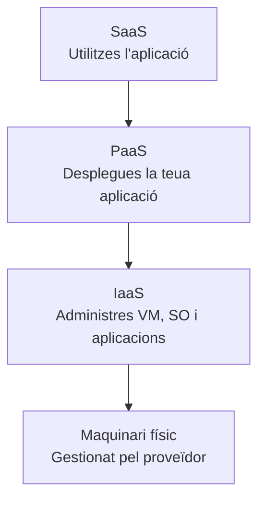

### IaaS — Infrastructure as a Service

El proveïdor ofereix màquines virtuals, xarxes, discos, IP i regles de xarxa. Tu continues administrant el sistema operatiu i les aplicacions.

### PaaS — Platform as a Service

El proveïdor gestiona més capes i tu desplegues l'aplicació sobre una plataforma preparada.

```text
El proveïdor gestiona:
maquinari + virtualització + SO + runtime

Tu gestiones:
aplicació + configuració + dades
```

### SaaS — Software as a Service

Utilitzes una aplicació ja oferida com a servei. No administres el servidor que hi ha davall.

!!! note "Per a RA1.e"
    El que més ens interessa és entendre la relació entre virtualització de servidors en el núvol i contenidors. No necessites dominar tots els serveis d'un proveïdor cloud.

## 7.9 Una VM local i una instància cloud

Una instància IaaS és, en molts casos, una màquina virtual creada sobre infraestructura del proveïdor.

```text
LABORATORI LOCAL                    NÚVOL

Ordinador físic                     Centre de dades
      │                                   │
VirtualBox / hipervisor             Plataforma cloud
      │                                   │
Ubuntu Server                       Instància Ubuntu
      │                                   │
Apache / Tomcat                     Apache / Tomcat
```

Canvia qui controla el maquinari i com aprovisionem els recursos, però molts conceptes són els mateixos: CPU, RAM, disc, sistema operatiu, interfícies de xarxa, ports, serveis, usuaris, actualitzacions i logs.

## 7.10 Què apareix de nou en una VM al núvol?

Quan creem una VM en el núvol, solen aparéixer conceptes addicionals:

### Imatge de sistema

Plantilla a partir de la qual es crea la instància.

```text
Ubuntu Server 24.04
        │
        ▼
   nova instància
```

### Tipus o mida d'instància

Combinació de recursos, per exemple:

```text
2 vCPU · 4 GB RAM · 40 GB disc
```

### Xarxa virtual

La VM forma part d'una xarxa definida dins del proveïdor.

### IP privada i IP pública

Una màquina pot tindre una IP interna per comunicar-se amb altres recursos i una IP pública si ha de ser accessible des d'Internet.

### Regles d'entrada

En molts proveïdors existeix una capa de filtratge semblant conceptualment a un tallafoc:

```text
SSH    22    → només xarxa o administrador autoritzat
HTTP   80    → segons necessitat
HTTPS  443   → segons necessitat
BBDD   3306  → normalment NO pública
```

!!! danger "Crear una VM no implica exposar tots els ports"
    Publicar un servei a Internet és una decisió de seguretat. En un desplegament professional s'ha d'exposar només allò necessari.

## 7.11 Laboratori cloud conceptual

Si el professorat indica una pràctica amb un proveïdor autoritzat, el procés general serà semblant a:

1. seleccionar una imatge d'Ubuntu;
2. triar CPU i RAM;
3. crear o seleccionar una xarxa;
4. configurar les regles d'entrada;
5. associar una clau o mètode segur d'accés;
6. crear la instància;
7. connectar-se;
8. verificar sistema i xarxa;
9. instal·lar el servei;
10. comprovar-lo des d'un client;
11. documentar els recursos;
12. aturar o eliminar allò que ja no siga necessari.


!!! warning "Cost i responsabilitat"
    Alguns serveis cloud poden generar cost. Utilitza únicament comptes, crèdits, laboratoris i proveïdors autoritzats pel professorat. No deixes recursos actius sense necessitat.

## 7.12 De les màquines virtuals als contenidors

Una VM virtualitza un ordinador complet amb el seu propi sistema operatiu. Un contenidor d'aplicació adopta una idea diferent: executa processos aïllats compartint el kernel del host.

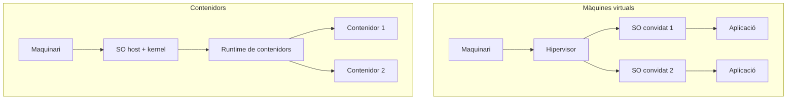

La diferència principal és que cada VM té el seu propi kernel, mentre que els contenidors d'un mateix host comparteixen el kernel del host.

## 7.13 Comparació: VM i contenidor

| Aspecte | Màquina virtual | Contenidor |
| --- | --- | --- |
| Sistema operatiu complet | Sí | No, comparteix kernel |
| Arrancada | Normalment més lenta | Normalment ràpida |
| Consum de recursos | Major | Menor |
| Aïllament | Molt alt | Aïllament de processos |
| Imatge | Disc o plantilla de VM | Imatge de contenidor |
| Ús habitual | SO complets, càrregues heterogènies | Aplicacions i serveis |
| Portabilitat | Bona | Molt alta en entorns compatibles |

No significa que un model substituïsca sempre l'altre. És habitual trobar contenidors executant-se dins d'una màquina virtual:

```text
Servidor físic
   │
   └── VM Ubuntu
          │
          └── Docker
              ├── contenidor web
              ├── contenidor backend
              └── contenidor BBDD
```

## 7.14 Què aporta un contenidor al desplegament?

Recorda el problema clàssic: «En el meu ordinador funciona».

```text
Desenvolupador                 Servidor
Node 22                        Node 20
llibreria X 4.2                llibreria X 3.8
Ubuntu                         Debian
```

Un contenidor ajuda a empaquetar l'aplicació amb el runtime, les llibreries, les dependències, la configuració base i l'estructura necessària. L'objectiu és aconseguir una execució més consistent i reproduïble.

## 7.15 Conceptes fonamentals de Docker

Docker és una plataforma per construir, distribuir i executar contenidors.

| Concepte | Significat |
| --- | --- |
| **Docker Engine** | Gestiona imatges, contenidors, xarxes i volums. |
| **Docker CLI** | Ordre `docker` que utilitzem des del terminal. |
| **Imatge** | Paquet immutable utilitzat com a base per crear contenidors. |
| **Contenidor** | Instància en execució creada a partir d'una imatge. |
| **Registry** | Servei on s'emmagatzemen i distribueixen imatges. |
| **Docker Compose** | Eina declarativa per definir aplicacions formades per diversos contenidors. |

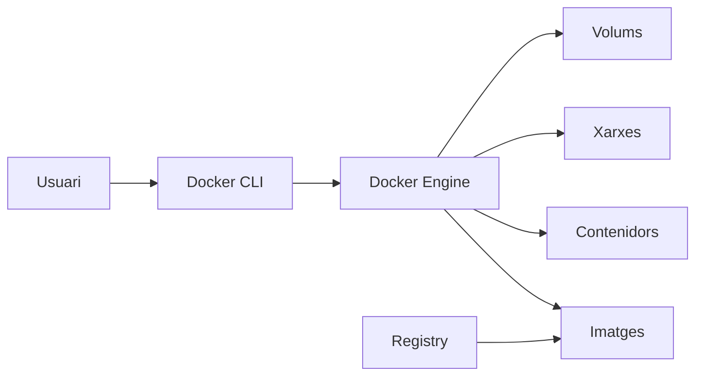

## 7.16 Imatge i contenidor: no són el mateix

Pensa en una imatge com una plantilla:

```text
imatge httpd
      │
      ├── contenidor web-1
      ├── contenidor web-2
      └── contenidor web-3
```

La imatge descriu l'entorn inicial. El contenidor és una instància creada a partir d'ella. Una mateixa imatge pot originar molts contenidors.

!!! tip "Analogia útil"
    **Imatge** ≈ plantilla  
    **Contenidor** ≈ instància creada a partir de la plantilla

## 7.17 Les capes d'una imatge

Les imatges es construeixen per capes. Exemple conceptual:

```text
Capa 5  codi DAWShop
Capa 4  dependències de l'aplicació
Capa 3  runtime
Capa 2  paquets del sistema
Capa 1  imatge base
```

Les capes poden reutilitzar-se entre imatges i faciliten la distribució i la memòria cau. En general, una imatge s'ha de considerar immutable: si necessites canviar-la, construeixes una nova versió.

## 7.18 El cicle de vida d'un contenidor

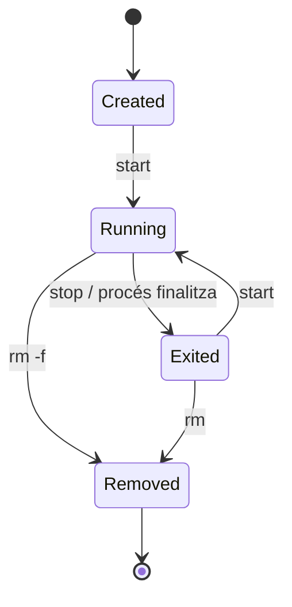

Ordres bàsiques:

```bash
docker ps
docker ps -a
docker start NOM
docker stop NOM
docker rm NOM
docker image ls
docker pull httpd:2.4
```

## 7.19 Instal·lació i verificació de Docker en Ubuntu

Per al nostre laboratori, l'entorn de referència continua sent Ubuntu Server. La documentació oficial de Docker ofereix diferents mètodes; utilitza el repositori oficial quan així ho indique el professorat.

### 1. Comprovar el sistema

```bash
cat /etc/os-release
uname -m
```

### 2. Preparar el repositori oficial

```bash
sudo apt update
sudo apt install ca-certificates curl
sudo install -m 0755 -d /etc/apt/keyrings
sudo curl -fsSL https://download.docker.com/linux/ubuntu/gpg \
  -o /etc/apt/keyrings/docker.asc
sudo chmod a+r /etc/apt/keyrings/docker.asc
```

Després, crea el fitxer del repositori amb la configuració indicada per la documentació oficial i actualitza l'índex:

```bash
sudo apt update
```

### 3. Instal·lar els components

```bash
sudo apt install docker-ce docker-ce-cli containerd.io \
  docker-buildx-plugin docker-compose-plugin
```

### 4. Comprovar el servei

```bash
sudo systemctl status docker
```

!!! note "Windows i macOS"
    En Windows i macOS és habitual utilitzar Docker Desktop. La interfície i els requisits poden canviar entre versions. Verifica sempre el funcionament amb les mateixes idees: versió, motor disponible i execució d'un contenidor de prova.

No consideres acabada la instal·lació només perquè l'instal·lador ha finalitzat:

```bash
docker --version
docker version
docker info
sudo docker run hello-world
```

`docker run hello-world` obliga Docker a buscar la imatge localment, descarregar-la si no existeix, crear un contenidor, executar-lo, mostrar-ne l'eixida i finalitzar.

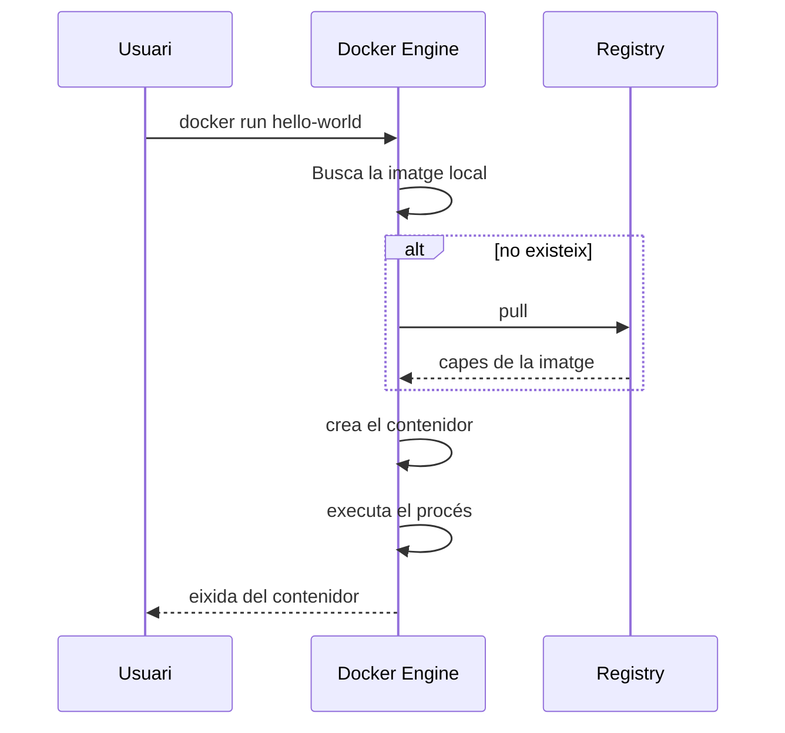

## 7.20 Executar Docker sense `sudo`

En Linux és possible afegir l'usuari al grup `docker`:

```bash
sudo usermod -aG docker $USER
```

Després cal iniciar una nova sessió perquè es reavaluen els grups.

!!! danger "El grup docker té privilegis molt elevats"
    Donar accés al socket de Docker permet realitzar operacions equivalents, en molts escenaris, a disposar de privilegis de root sobre el host. No consideres el grup `docker` un grup ordinari sense implicacions de seguretat.

## 7.21 El primer servidor web en un contenidor

Podem executar Apache HTTP Server utilitzant la imatge oficial `httpd`:

```bash
docker run --name web-prova -d -p 8080:80 httpd:2.4
```

| Fragment | Significat |
| --- | --- |
| `docker run` | Crear i iniciar un contenidor |
| `--name web-prova` | Assignar-li un nom |
| `-d` | Executar en segon pla |
| `-p 8080:80` | Publicar un port |
| `httpd:2.4` | Imatge utilitzada |

Després, obri `http://localhost:8080`.

### Entendre `8080:80`

En `-p 8080:80`, el format és `PORT_HOST:PORT_CONTENIDOR`:

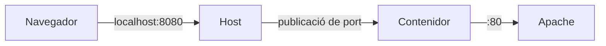

El navegador contacta amb el port 8080 del host, Docker redirigeix el trànsit i Apache rep la petició en el port 80 dins del contenidor.

!!! warning "Publicar no és el mateix que `EXPOSE`"
    El fet que una imatge indique un port esperat no significa necessàriament que siga accessible des de l'exterior. El port s'ha de publicar explícitament quan volem arribar-hi des del host o des d'altres equips.

Si volem limitar la publicació al mateix host:

```bash
docker run --name web-prova -d -p 127.0.0.1:8080:80 httpd:2.4
```

`0.0.0.0:8080` pot acceptar trànsit per diferents interfícies, mentre que `127.0.0.1:8080` només accepta connexions locals.

## 7.22 Fitxers i dades dins del contenidor

Podem entrar de manera interactiva, si la imatge té un shell compatible:

```bash
docker exec -it web-prova sh
pwd
ls -la
exit
```

!!! note "No convertisques el contenidor en una VM"
    En Docker, el patró habitual no és entrar al contenidor i configurar-lo manualment durant mesos. La configuració ha de quedar, sempre que siga possible, declarada en imatges, fitxers, variables, volums i definicions de Compose.

Un contenidor té un sistema de fitxers propi derivat de la imatge. Si escrius dades en la capa modificable del contenidor, aquestes dades estan lligades al seu cicle de vida. Per a dades que han de sobreviure utilitzem volums o *bind mounts*.

### Volums

Un volum és emmagatzematge gestionat per Docker i separat del cicle de vida del contenidor:

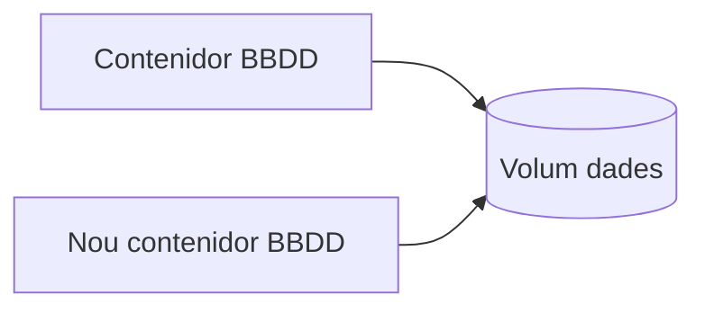

```bash
docker volume create dades_dawshop
docker volume ls
```

!!! success "Idea clau"
    Contenidor reemplaçable; dades persistents fora de la capa efímera del contenidor.

### Bind mounts

Un *bind mount* associa una ruta del host amb una ruta del contenidor. És especialment útil en desenvolupament:

```text
HOST                              CONTENIDOR
/home/alumne/web/       ───────▶  /usr/local/apache2/htdocs/
```

```bash
docker run --name web-prova \
  -d \
  -p 8080:80 \
  -v "$PWD/web:/usr/local/apache2/htdocs:ro" \
  httpd:2.4
```

`:ro` indica un muntatge de només lectura.

| Necessitat | Opció habitual |
| --- | --- |
| Dades d'una BBDD | Volum |
| Editar codi des del host | Bind mount |
| Compartir un fitxer de configuració concret | Bind mount |
| Persistència gestionada per Docker | Volum |

## 7.23 Xarxes de Docker

Docker pot crear xarxes virtuals perquè diversos contenidors es vegen entre ells.

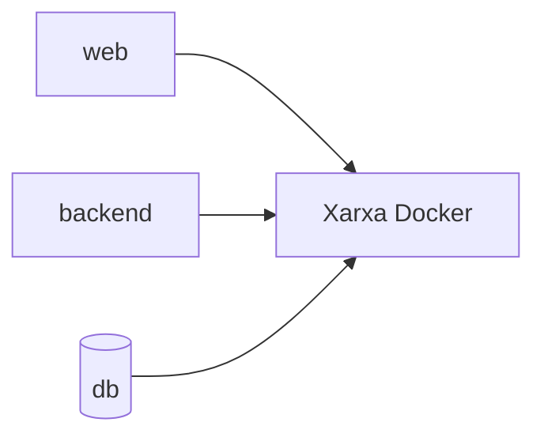

Dins d'una xarxa gestionada per Compose, els serveis poden comunicar-se habitualment utilitzant el nom del servei:

```text
web     → http://backend:8080
backend → db:3306
```

No necessitem publicar el port 3306 al host perquè el backend parle amb `db`.

```text
Navegador host
      │ localhost:8080
      ▼
┌──────────────────────────┐
│ xarxa Docker             │
│                          │
│ web:80 ───────> db:3306 │
└──────────────────────────┘
```

Podem publicar `web:80 → host:8080` i no publicar la base de dades. Això redueix l'exposició innecessària.

## 7.24 Docker Compose

Quan una aplicació necessita diversos serveis, executar una ordre `docker run` per cada contenidor es torna difícil de repetir. Docker Compose permet definir de manera declarativa serveis, imatges, ports, variables, volums, xarxes, dependències i comprovacions de salut en un fitxer YAML, normalment `compose.yaml`.

### Dockerfile i Compose no fan el mateix

És una confusió habitual:

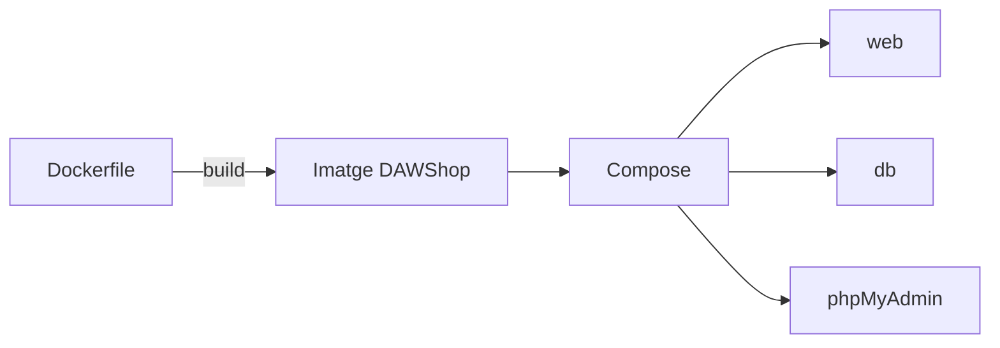

- **Dockerfile:** descriu com construir una imatge.
- **compose.yaml:** descriu com executar un conjunt de serveis.

Poden utilitzar-se junts.

### Estructura bàsica de `compose.yaml`

```yaml
services:
  web:
    image: httpd:2.4
    ports:
      - "8080:80"
```

Ordres bàsiques:

```bash
docker compose config
docker compose up -d
docker compose ps
docker compose logs
docker compose logs web
docker compose logs -f web
docker compose exec web sh
docker compose restart web
docker compose down
```

!!! warning "`down -v` no és innocent"
    `docker compose down -v` elimina també els volums declarats pel projecte. Si el volum conté dades que vols conservar, no utilitzes `-v`.

## 7.25 Una arquitectura web amb Compose

Per a entendre l'activitat de la UP podem imaginar un entorn format per servidor web/PHP, base de dades i phpMyAdmin:

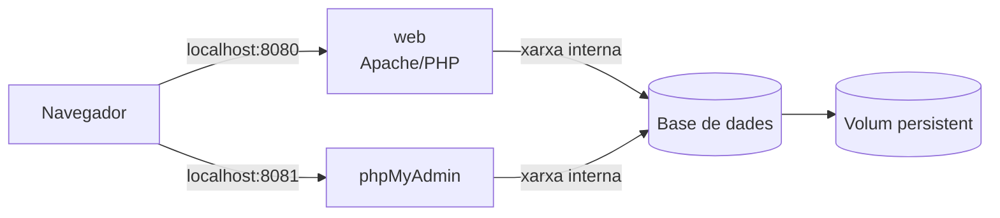

El servei web i phpMyAdmin necessiten un port publicat si volem accedir-hi des del navegador. La base de dades pot quedar només en la xarxa interna i les seues dades han d'estar fora de la capa efímera del contenidor.

### Exemple didàctic de `compose.yaml`

```yaml
services:
  web:
    image: php:8.3-apache
    ports:
      - "8080:80"
    volumes:
      - ./src:/var/www/html
    depends_on:
      - db

  db:
    image: mariadb:11
    environment:
      MARIADB_DATABASE: dawshop
      MARIADB_USER: dawshop
      MARIADB_PASSWORD: ${DB_PASSWORD}
      MARIADB_ROOT_PASSWORD: ${DB_ROOT_PASSWORD}
    volumes:
      - db_data:/var/lib/mysql

  phpmyadmin:
    image: phpmyadmin:5-apache
    ports:
      - "8081:80"
    environment:
      PMA_HOST: db
    depends_on:
      - db

volumes:
  db_data:
```

Un fitxer `.env` de laboratori podria contindre:

```dotenv
DB_PASSWORD=canvia-aquesta-contrasenya
DB_ROOT_PASSWORD=canvia-tambe-aquesta
```

!!! danger "No publiques secrets en Git"
    Un fitxer `.env` amb contrasenyes reals no s'ha de pujar al repositori. En un projecte docent pots usar valors ficticis, però has de mantindre el mateix criteri professional.

En aquest exemple, `web` utilitza el port publicat 8080 i el bind mount `./src`. El servei `db` no publica cap port, però els altres serveis el poden trobar amb el nom `db`. El volum `db_data` conserva les dades i `PMA_HOST: db` indica a phpMyAdmin on trobar la base de dades.

!!! warning "`depends_on` no significa necessàriament «preparat»"
    Compose pot ordenar la creació i l'inici dels serveis, però una base de dades pot estar iniciada i encara no estar preparada per acceptar connexions. És la diferència entre «contenidor iniciat» i «aplicació preparada»; per a això existeixen els *healthchecks*.

## 7.26 Contenidors i seguretat bàsica

Els contenidors no eliminen la necessitat de seguretat:

- utilitza imatges oficials o de publicadors verificats;
- evita `latest` quan necessites reproduïbilitat;
- no publiques ports innecessaris;
- protegeix els secrets i no els poses en imatges, captures, Git o documentació pública;
- actualitza les imatges, perquè la immutabilitat no significa que siguen segures per sempre.

## 7.27 Errors habituals amb Docker

### `Cannot connect to the Docker daemon`

Comprova `sudo systemctl status docker`. Pot significar que el servei està aturat, que falten permisos o que hi ha un problema de context o configuració.

### `permission denied` sobre el socket

Pot indicar que l'usuari no té accés al daemon. No ho «arregles» fent canvis de permisos aleatoris sobre el socket.

### `port is already allocated`

Un altre procés o contenidor ja utilitza el port del host:

```bash
sudo ss -ltnp | grep ':8080'
docker ps
```

### El contenidor desapareix de `docker ps`

`docker ps` mostra principalment contenidors en execució. Consulta també:

```bash
docker ps -a
```

Un contenidor pot haver finalitzat perquè el seu procés principal ha acabat o ha fallat.

### El web no respon

Comprova, per ordre:

1. que el contenidor està en execució;
2. que el port és el publicat;
3. que l'aplicació escolta dins del contenidor;
4. els logs;
5. que la URL és correcta.

### La BBDD no és accessible des d'un altre contenidor

Comprova la xarxa compartida, el nom del servei, el port intern, les credencials, l'estat de preparació i els logs.

## 7.28 Diagnòstic ràpid d'un projecte Compose

```text
1. El Docker Engine funciona?
        │
        ▼
2. El Compose és vàlid?
        │
        ▼
3. Els contenidors estan en execució?
        │
        ▼
4. Els ports són els esperats?
        │
        ▼
5. Els serveis es veuen per la xarxa interna?
        │
        ▼
6. Què diuen els logs?
```

Ordres útils:

```bash
docker version
docker compose config
docker compose ps
docker compose logs --tail=50
```

No canvies cinc coses alhora. Primer localitza la capa que falla.

## 7.29 DAWShop: tres formes d'executar la mateixa arquitectura

```text
Opció A. Tot sobre una VM
Ubuntu VM
├── Apache
├── Tomcat
└── PostgreSQL

Opció B. Serveis en contenidors
Ubuntu
└── Docker
    ├── web
    ├── app
    └── db

Opció C. VM cloud + contenidors
Cloud
└── VM Ubuntu
    └── Docker
        ├── web
        ├── app
        └── db
```

L'aplicació pot ser funcionalment la mateixa, però canvia la manera d'aprovisionar, aïllar, configurar i desplegar la infraestructura.

## 7.30 Mini pràctica guiada: instal·lació de Docker

### Pas 1. Identifica el teu entorn

```bash
cat /etc/os-release
uname -m
```

Documenta el sistema, l'arquitectura i el mètode d'instal·lació indicat pel professorat.

### Pas 2. Verifica versions

```bash
docker --version
docker version
docker compose version
```

### Pas 3. Executa el contenidor de prova

```bash
docker run --rm hello-world
```

Explica el recorregut: Docker busca la imatge, la descarrega si falta, crea el contenidor, executa el procés i aquest finalitza.

### Pas 4. Comprova l'estat

```bash
docker ps
docker ps -a
docker image ls
```

La part important no és només adjuntar captures: és interpretar-les.

## 7.31 Mini pràctica guiada: servidor web en Docker

```bash
docker run --name web-lab -d -p 8080:80 httpd:2.4
docker ps
curl -I http://localhost:8080
docker logs web-lab
docker stop web-lab
curl -I http://localhost:8080
docker start web-lab
curl -I http://localhost:8080
```

Aquest experiment relaciona l'estat del contenidor, el port, la resposta HTTP i els logs.

## 7.32 Mini pràctica guiada: Compose

Crea aquesta estructura:

```text
dawshop-lab/
├── compose.yaml
└── web/
    └── index.html
```

`web/index.html`:

```html
<!doctype html>
<html lang="ca">
<head>
  <meta charset="utf-8">
  <title>DAWShop</title>
</head>
<body>
  <h1>DAWShop en Docker</h1>
</body>
</html>
```

`compose.yaml`:

```yaml
services:
  web:
    image: httpd:2.4
    ports:
      - "8080:80"
    volumes:
      - ./web:/usr/local/apache2/htdocs:ro
```

Arranca i comprova:

```bash
docker compose up -d
```

Obri `http://localhost:8080`, modifica l'HTML en el host i recarrega el navegador. El canvi apareix sense reconstruir la imatge perquè el directori s'ha muntat amb un *bind mount*.

## 7.33 Què has de saber en acabar

- [ ] Explicar què és virtualitzar un servidor.
- [ ] Diferenciar maquinari físic, hipervisor, VM i sistema convidat.
- [ ] Diferenciar una VM local d'una instància IaaS.
- [ ] Explicar IaaS, PaaS i SaaS a nivell bàsic.
- [ ] Diferenciar VM i contenidor.
- [ ] Explicar què són Docker Engine, imatge, contenidor i registry.
- [ ] Verificar una instal·lació de Docker.
- [ ] Interpretar el cicle de vida d'un contenidor.
- [ ] Explicar `HOST_PORT:CONTAINER_PORT`.
- [ ] Diferenciar volum i bind mount.
- [ ] Explicar la xarxa interna entre serveis.
- [ ] Llegir un `compose.yaml` bàsic.
- [ ] Utilitzar `docker compose up`, `ps`, `logs` i `down`.
- [ ] Explicar per què una BBDD no necessita estar publicada per ser accessible des d'un altre contenidor.
- [ ] Identificar riscos bàsics: ports, secrets, imatges i privilegis.

!!! success "Idea clau"
    Una arquitectura es pot executar directament sobre una VM, en contenidors o en una VM cloud que conté Docker. Entendre les capes —host, virtualització, xarxa, procés, dades i servei— és més important que memoritzar una eina concreta.

[Anterior: servidors d'aplicacions i Apache Tomcat](06-servidor-aplicacions-tomcat.md) · [Índex de la UP1](index.md)
