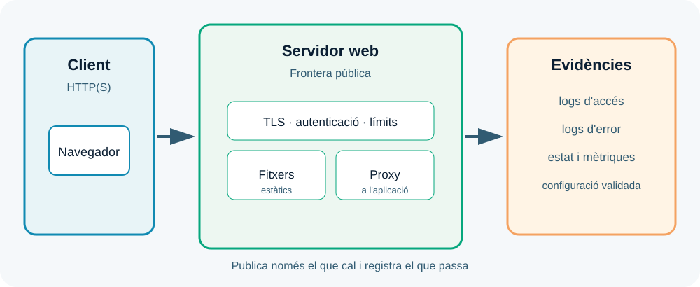

---
hide:
  - navigation
---
# UP2. Configuració i administració de servidors web

## Presentació

En la UP1 vas descriure l'arquitectura. Ara convertiràs el servidor web en una frontera operativa: rebrà peticions, servirà recursos, seleccionarà hosts virtuals, protegirà comunicacions i deixarà rastre del que ocorre.

> **Pregunta guia:** com podem publicar una aplicació web perquè funcione, siga segura i es puga diagnosticar?

## Dades i objectius

| Element | Referència |
| --- | --- |
| Duració de referència | **15 hores al centre** |
| Resultat d'aprenentatge | **RA2** |
| Pes | **20 %** |
| Producte final | Aplicació publicada amb HTTPS, control d'accés i logs |

En acabar hauràs de saber reconéixer els paràmetres principals, activar mòduls, crear hosts virtuals, configurar autenticació, instal·lar certificats, desplegar aplicacions i analitzar logs.

## 1. Què fa un servidor web?

Un servidor web escolta una adreça i un port, rep una petició HTTP i decideix com respondre. Pot llegir un fitxer del sistema, redirigir el client, rebutjar l'accés, servir una resposta emmagatzemada o enviar la petició a un servidor d'aplicacions.

Els servidors web més habituals són Apache HTTP Server i Nginx. El nom de l'eina és secundari: el criteri professional és saber on es troba la configuració, com es valida, com es recarrega, on s'escriuen els logs i com es torna enrere.



La configuració sol separar-se en blocs: procés i recursos, llocs virtuals, mòduls, TLS, autenticació, rutes i logs. Aquesta separació facilita trobar l'error i reduir el nombre de canvis simultanis.

## 2. Paràmetres i mòduls

Abans d'editar, registra:

- versió i paquet instal·lat;
- adreça i port d'escolta;
- usuari i grup del procés;
- directori arrel o artefacte publicat;
- límits de mida, temps i connexions;
- mòduls carregats;
- ubicació i format dels logs.

Un mòdul amplia la funcionalitat del servidor: pot afegir reescriptura d'URLs, compressió, capçaleres, proxy, autenticació o TLS. Activar mòduls sense necessitat augmenta la superfície d'atac i fa més difícil el diagnòstic. Activa només allò que el desplegament necessita i deixa constància del motiu.

La seqüència segura d'un canvi és: fer còpia de la configuració, editar una part, validar la sintaxi, revisar els logs d'error i recarregar el servei. No reinicies a cegues una configuració que encara no has validat.

## 3. Hosts virtuals

Un host virtual permet que el mateix servidor publique diferents llocs segons el nom sol·licitat, el port o l'adreça. En cada host cal definir com a mínim el nom, el directori o servei de destinació, les regles d'accés i els logs.

El nom que escriu el client ha de coincidir amb el nom que el servidor espera. Si el DNS, el host virtual i el certificat no coincideixen, poden aparéixer errors difícils de distingir. En un laboratori pots usar entrades locals o dominis de prova, però mai interceptes trànsit d'altres persones.

## 4. Autenticació i control d'accés

Autenticar és comprovar qui és el client; autoritzar és decidir què pot fer. Un servidor web pot restringir un directori, exigir una credencial, limitar per xarxa o derivar la identitat a l'aplicació.

Aplica el principi de mínim privilegi: un lloc públic no necessita accés d'escriptura al directori complet; un fitxer de configuració no ha de ser descarregable; i un servei intern no ha d'estar publicat perquè sí. Prova tant l'accés permés com el denegat i registra els codis esperats, habitualment 2xx per a èxit i 401/403 per a autenticació o autorització fallida.

## 5. HTTPS i certificats

HTTPS combina HTTP amb TLS. El certificat permet al client validar el nom del servidor i la clau pública; el protocol negocia una clau de sessió i protegeix la comunicació contra lectura o modificació durant el transport.

Per implantar-lo has de decidir el nom, obtenir un certificat adequat, instal·lar la cadena necessària, protegir la clau privada i configurar la renovació. Un certificat autofirmat és útil en un laboratori, però el navegador mostrarà un avís perquè no confia en l'autoritat emissora.

Comprova tres coses per separat: que el certificat inclou el nom correcte, que no està caducat i que la clau privada només és accessible pel procés que la necessita. No copies mai claus privades en un repositori.

## 6. Desplegament i logs

Publicar una aplicació exigeix preparar fitxers, permisos, dependències i configuració per entorn. Separa el codi de la configuració i no introduïsques valors de desenvolupament en producció. Una aplicació publicada ha de tindre una ruta de salut o una prova mínima que no depenga de dades sensibles.

Els logs d'accés expliquen qui ha demanat una ruta, amb quin estat i en quin temps. Els logs d'error expliquen què ha impedit respondre. Quan investigues una incidència, relaciona hora, ruta, codi d'estat, servei implicat i canvi recent. Un log sense data, nivell o context és molt menys útil.

Exemples de comprovació local:

```bash
curl -I http://127.0.0.1:8080
curl -vk https://127.0.0.1:8443
```

## 7. Mètode de diagnòstic

Quan el navegador falla, segueix una seqüència estable:

1. El procés està actiu?
2. Escolta el port i l'adreça esperats?
3. La configuració passa la validació?
4. El client arriba al servei?
5. El host virtual i la ruta coincideixen?
6. TLS valida el nom i la cadena?
7. Els logs indiquen un error d'aplicació o de permisos?

No canvies cinc paràmetres alhora: perdràs la relació entre causa i efecte. Anota hipòtesi, prova, resultat i següent pas.

!!! warning "Exposició controlada"
    Les pràctiques s'han de fer en entorns locals o autoritzats. No òbrigues ports del router ni publiques una configuració de prova amb credencials reals.

## Treball semipresencial

Estudia l'esquema, prepara una taula de paràmetres, reprodueix un servei local i entrega una captura o sortida de cada prova. Completa l'informe amb la configuració abans i després, l'error que has observat i la correcció aplicada.

### Resum de la UP2

Un servidor web és frontera, encaminador, publicador i font d'evidències. Configurar-lo bé significa limitar funcions, protegir el transport, controlar accessos, publicar l'aplicació correcta i poder explicar qualsevol incidència amb els logs.
