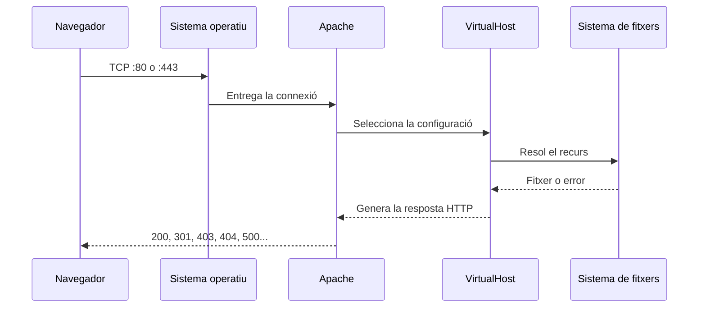

---
hide:
  - navigation
title: "1. Paràmetres del servidor web"
description: "Paràmetres principals d'Apache 2.4 en Ubuntu/Debian."
---
# 1. Paràmetres del servidor web

**Criteri treballat:** CA2.a — reconéixer els paràmetres d'administració més importants del servidor web.

Un servidor web és un programa que **escolta peticions HTTP/HTTPS, decideix com gestionar-les i retorna una resposta**. Apache pot funcionar immediatament després d'instal·lar-lo, però el seu comportament real depén d'un conjunt de directives de configuració.

En Ubuntu/Debian, la configuració d'Apache es reparteix principalment entre:

```text
/etc/apache2/
├── apache2.conf
├── ports.conf
├── sites-available/
├── sites-enabled/
├── mods-available/
├── mods-enabled/
├── conf-available/
└── conf-enabled/
```

Aquesta separació permet organitzar la configuració en peces que es poden activar o desactivar sense convertir un únic fitxer en un bloc difícil de mantindre.

## 1.1. Què passa quan arriba una petició?

Abans d'estudiar directives concretes, convé seguir el recorregut d'una petició. Per exemple, si el navegador demana `index.html` dins de `/productes/`:

```text
http://servidor:80/productes/index.html
                │
                ▼
          Apache escolta :80
                │
                ▼
           <VirtualHost>
                │
                ▼
     DocumentRoot /var/www/daw
                │
                ▼
 <Directory /var/www/daw>
     permisos / opcions
                │
                ▼
 /var/www/daw/productes/index.html
```

El recorregut és una simplificació útil:

- **Port d'escolta:** `Listen 80` fa que Apache accepte connexions HTTP en el port 80. Per HTTPS és habitual usar el 443.
- **`VirtualHost`:** selecciona el lloc que correspon a la combinació d'adreça, port i, normalment, nom sol·licitat (`Host`).
- **`DocumentRoot`:** indica el directori base del lloc. La ruta demanada es combina amb aquest directori.
- **`<Directory>`:** aplica permisos i opcions al directori real del sistema de fitxers. No és una URL.
- **Recurs final:** Apache intenta localitzar i servir el fitxer, executar el tractament corresponent o retornar un error com 403 o 404.

Per exemple, la petició anterior pot acabar en:

```text
/var/www/daw/productes/index.html
```

No n'hi ha prou que el fitxer existisca: Apache també ha de tindre permís per travessar els directoris i servir-lo, i la configuració activa ha de permetre l'accés.

També podem representar el flux amb les capes de xarxa i configuració:



## 1.2. Àmbits de configuració

Una directiva no s'aplica necessàriament a tot Apache. L'àmbit on apareix determina a quines peticions afecta i si Apache permet utilitzar-la:

| Àmbit | On s'escriu | Abast habitual |
|---|---|---|
| Global | `apache2.conf`, `ports.conf` o fitxers de `conf-enabled/` | Tot el servidor: ports, valors generals o mòduls comuns. |
| `<VirtualHost>` | Fitxer d'un lloc en `sites-enabled/` | Només un lloc, port o combinació d'adreça i nom. |
| `<Directory>` | Dins de la configuració del servidor | Un directori real i els recursos que conté. |
| `.htaccess` | Dins del directori publicat | Configuració distribuïda per a aquell directori, si `AllowOverride` ho permet. |

Per exemple, `Timeout` és un paràmetre general, `ServerName` sol identificar un `VirtualHost` i `Require` dins d'un `<Directory>` controla l'accés als fitxers d'aquell directori.

Una mateixa directiva pot tindre àmbits permesos diferents. Apache ho documenta en la seua referència: que una directiva existisca no significa que es puga escriure en qualsevol lloc. Si es posa en un context incorrecte, `apache2ctl configtest` pot informar d'un error de sintaxi o d'un ús no permés.

## 1.3. Configuracions disponibles i actives

Ubuntu/Debian separen el que està instal·lat del que està actiu:

```text
/etc/apache2/sites-available/   configuracions de llocs disponibles
/etc/apache2/sites-enabled/     llocs actius

/etc/apache2/mods-available/    mòduls disponibles
/etc/apache2/mods-enabled/      mòduls actius
```

Els directoris `*-enabled` contenen habitualment **enllaços simbòlics** cap als fitxers de `*-available`. Això permet conservar la configuració i decidir fàcilment quins llocs i mòduls participa en l'execució actual:

```text
sites-available/daw.conf
        │
        │ a2ensite daw
        ▼
sites-enabled/daw.conf -> ../sites-available/daw.conf
```

Les ordres no creen un Virtual Host ni instal·len un mòdul nou; gestionen la connexió entre configuració disponible i configuració activa:

```bash
sudo a2ensite daw
sudo a2dissite daw
sudo a2enmod rewrite
sudo a2dismod rewrite
```

Desactivar un lloc o un mòdul retira l'enllaç de `*-enabled`, però normalment conserva el fitxer original en `*-available`. Després d'aquest tipus de canvi cal validar la configuració i aplicar-la amb una recàrrega.

## 1.4. Exemple complet de `VirtualHost`

El fragment següent mostra com encaixen diverses directives en un lloc senzill. La directiva `Listen` sol estar en `ports.conf`; el `VirtualHost` descriu què fer amb les peticions que arriben al port 80.

```apache
# /etc/apache2/sites-available/daw.conf
<VirtualHost *:80>
    ServerName daw.test
    ServerAlias www.daw.test

    DocumentRoot /var/www/daw
    DirectoryIndex index.html index.php

    <Directory /var/www/daw>
        Options -Indexes
        AllowOverride None
        Require all granted
    </Directory>

    # Publica un directori que està fora del DocumentRoot.
    Alias /recursos/ /srv/daw-recursos/
    <Directory /srv/daw-recursos>
        Options -Indexes
        Require all granted
    </Directory>

    ErrorLog ${APACHE_LOG_DIR}/daw-error.log
    CustomLog ${APACHE_LOG_DIR}/daw-access.log combined
</VirtualHost>
```

Si `daw.test` resol cap a aquest servidor, una petició a `/productes/index.html` buscarà `/var/www/daw/productes/index.html`. En canvi, una petició a `/recursos/logo.svg` buscarà `/srv/daw-recursos/logo.svg` perquè `Alias` modifica el mapa entre URL i sistema de fitxers.

## 1.5. Directives principals

### Escolta i identitat

Apache només pot atendre connexions en els ports que escolta. En Ubuntu/Debian és habitual declarar-los en `/etc/apache2/ports.conf`:

```apache
Listen 80
Listen 443
```

Els ports habituals són 80 per a HTTP i 443 per a HTTPS. Obrir un port en Apache no garanteix que siga accessible des d'una altra màquina: també poden intervindre el tallafoc, el NAT, el router o la xarxa de la màquina virtual.

`ServerName` defineix el nom principal d'un lloc:

```apache
ServerName daw.test
```

`ServerAlias` afegeix altres noms que han de seleccionar el mateix lloc:

```apache
ServerAlias www.daw.test
```

### Mapeig de recursos

`DocumentRoot` és el directori base del lloc:

```apache
DocumentRoot /var/www/daw
```

Si el client demana `/css/app.css`, Apache intentarà servir `/var/www/daw/css/app.css`, sempre que les regles d'accés ho permeten.

Quan es demana un directori sense especificar un fitxer, `DirectoryIndex` defineix l'ordre dels documents que Apache provarà:

```apache
DirectoryIndex index.html index.php
```

`Alias` publica una ruta fora del `DocumentRoot`:

```apache
Alias /imatges/ /srv/recursos/imatges/

<Directory /srv/recursos/imatges>
    Require all granted
</Directory>
```

Cal protegir sempre el directori real amb el seu propi `<Directory>`. Un `Alias` no concedeix per si mateix permisos d'accés.

### Accés i opcions dels directoris

Els blocs `<Directory>` s'apliquen a rutes reals del sistema de fitxers:

```apache
<Directory /var/www/daw>
    Options -Indexes
    AllowOverride None
    Require all granted
</Directory>
```

- `Require all granted` permet l'accés al recurs; `Require all denied` el denega.
- `Require ip 192.168.1.0/24` el limita a una xarxa concreta.
- `Options -Indexes` evita que Apache mostre un llistat quan falta el fitxer índex.
- `AllowOverride None` impedeix que un `.htaccess` modifique aquesta configuració.

Un llistat de directoris pot revelar noms de fitxers, còpies antigues o estructures internes, per això sovint es desactiva amb `Options -Indexes`.

### Temps i connexions persistents

`Timeout` limita el temps que Apache espera en determinades operacions:

```apache
Timeout 60
```

Un valor massa alt pot deixar recursos ocupats durant massa temps; un valor massa baix pot interrompre operacions legítimes lentes.

`KeepAlive` permet reutilitzar una connexió TCP per a diverses peticions del mateix client:

```apache
KeepAlive On
MaxKeepAliveRequests 100
KeepAliveTimeout 5
```

Pot reduir el cost d'obrir connexions repetidament, però també cal controlar el nombre de connexions i els recursos disponibles. La concurrència depén, a més, del MPM actiu (`mpm_event`, `mpm_worker` o `mpm_prefork`):

```bash
apache2ctl -M | grep mpm
```

En Apache 2.4, el límit general de peticions simultànies es denomina `MaxRequestWorkers` en els MPM que l'utilitzen. No significa que augmentar-lo sempre millore el rendiment.

### Logs

Els logs permeten relacionar una petició amb el que ha ocorregut al servidor:

```apache
ErrorLog ${APACHE_LOG_DIR}/daw-error.log
CustomLog ${APACHE_LOG_DIR}/daw-access.log combined
```

- `ErrorLog` registra errors de configuració, permisos, mòduls, fitxers inexistents i fallades internes.
- `CustomLog` registra les peticions, el recurs sol·licitat, el codi HTTP i altres dades segons el format.

En Ubuntu/Debian és habitual consultar-los així:

```bash
sudo tail -f /var/log/apache2/error.log
sudo tail -f /var/log/apache2/access.log
```

## 1.6. Validar i aplicar canvis

El procediment professional és:

1. modificar la configuració;
2. comprovar-la abans d'aplicar-la:

   ```bash
   sudo apache2ctl configtest
   ```

3. si retorna `Syntax OK`, recarregar Apache:

   ```bash
   sudo systemctl reload apache2
   ```

`reload` fa que Apache torne a llegir la configuració i intente continuar atenent el servei sense una interrupció completa. És l'opció habitual després d'un canvi de configuració.

`restart` atura i inicia de nou el servei:

```bash
sudo systemctl restart apache2
```

Pot ser necessari després d'un canvi que no es puga aplicar amb una simple recàrrega, però implica reiniciar el procés i pot provocar una interrupció breu. `restart` no substitueix `configtest`: una configuració incorrecta pot deixar el servei sense iniciar.

Per veure com Apache interpreta els Virtual Hosts actius:

```bash
sudo apache2ctl -S
```

## 1.7. Resum

Quan analitzes un problema d'Apache, segueix el recorregut: port d'escolta, Virtual Host seleccionat, mapeig de la URL al sistema de fitxers, permisos del `<Directory>`, mòduls, resposta i logs.

Has de saber interpretar, com a mínim:

- `Listen`, `ServerName` i `ServerAlias`;
- `DocumentRoot`, `DirectoryIndex` i `Alias`;
- `<Directory>`, `Require`, `Options` i `AllowOverride`;
- `Timeout` i `KeepAlive`;
- `ErrorLog` i `CustomLog`;
- la diferència entre `reload` i `restart`;
- la relació entre `*-available`, `*-enabled` i les ordres `a2en*`/`a2dis*`.

### Comprova que ho entens

1. Quina diferència hi ha entre un `DocumentRoot` i un `Alias`?
2. Per què una petició pot donar 403 encara que el fitxer existisca?
3. Quina diferència d'abast hi ha entre una directiva global, un `<VirtualHost>`, un `<Directory>` i un `.htaccess`?
4. Què canvia conceptualment quan executes `a2ensite`?
5. Per què convé executar `configtest` abans de `reload`?
