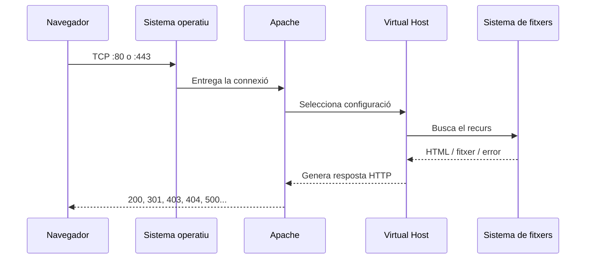
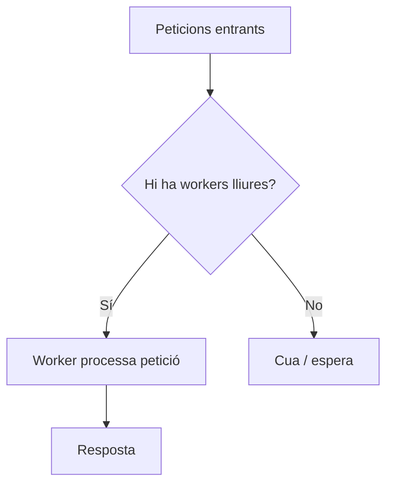

---
hide:
  - navigation
title: "1. Paràmetres del servidor web"
description: "Paràmetres principals d'Apache 2.4 en Ubuntu/Debian."
---
# 1. Paràmetres del servidor web

**Criteri treballat:** CA2.a — reconéixer els paràmetres d'administració més importants del servidor web.

Un servidor web és un programa que **escolta peticions HTTP/HTTPS, decideix com gestionar-les i retorna una resposta**. Apache pot funcionar immediatament després d'instal·lar-lo, però el seu comportament real depén d'un conjunt de directives de configuració.

En Ubuntu/Debian, la configuració d'Apache es reparteix principalment entre:

```text
/etc/apache2/
├── apache2.conf
├── ports.conf
├── sites-available/
├── sites-enabled/
├── mods-available/
├── mods-enabled/
├── conf-available/
└── conf-enabled/
```

Aquesta separació és important: en lloc de concentrar-ho tot en un únic fitxer, Debian/Ubuntu organitzen la configuració en peces que es poden activar o desactivar.

## 1.1. Què passa quan arriba una petició?



Cada etapa està condicionada per paràmetres diferents: ports, nom del servidor, `DocumentRoot`, permisos, mòduls, temps d'espera i logs.

## 1.2. Ports d'escolta

Apache només pot atendre connexions en els ports en què estiga escoltant.

Els ports habituals són:

| Protocol | Port habitual | Ús |
|---|---:|---|
| HTTP | 80 | Comunicació sense TLS |
| HTTPS | 443 | HTTP protegit amb TLS |

En Ubuntu, els ports solen declarar-se en `/etc/apache2/ports.conf`:

```apache
Listen 80
Listen 443
```

Pots comprovar en quins ports està escoltant el sistema amb:

```bash
sudo ss -ltnp | grep apache
```

> **Important**
>
> Obrir un port en Apache no implica necessàriament que siga accessible des de fora. També poden intervindre el tallafoc del sistema, les regles de la xarxa, NAT, el router o la configuració de la màquina virtual.

## 1.3. `DocumentRoot`: d'on ix el contingut

`DocumentRoot` indica el directori base des del qual Apache servirà un lloc web.

```apache
DocumentRoot /var/www/dawshop/public
```

Si arriba una petició per:

```text
http://dawshop.test/css/app.css
```

Apache intentarà resoldre-la, de manera simplificada, com:

```text
/var/www/dawshop/public/css/app.css
```

Canviar `DocumentRoot` sense revisar permisos o directives `<Directory>` és una causa molt habitual d'errors **403 Forbidden**.

Un exemple coherent seria:

```apache
DocumentRoot /var/www/dawshop/public

<Directory /var/www/dawshop/public>
    Options -Indexes
    AllowOverride None
    Require all granted
</Directory>
```

## 1.4. `DirectoryIndex`

Quan l'usuari demana un directori i no especifica fitxer:

```text
https://dawshop.test/
```

Apache necessita saber quin document ha de buscar per defecte.

```apache
DirectoryIndex index.html index.php
```

Per exemple, si volem que `paginasecundaria.html` siga la primera opció:

```apache
DirectoryIndex paginasecundaria.html index.html
```

## 1.5. `ServerName` i identitat del servidor

`ServerName` identifica el nom principal amb què Apache ha d'associar una configuració:

```apache
ServerName dawshop.test
```

En un servidor amb un únic lloc pot semblar poc important, però és essencial quan treballem amb **Virtual Hosts**.

També és habitual usar:

```apache
ServerAlias www.dawshop.test
```

La diferència entre totes dues directives es desenvolupa en l'apartat 3.

## 1.6. `Alias`

`Alias` permet publicar un directori que es troba fora del `DocumentRoot`.

```apache
Alias /imatges/ /srv/recursos/imatges/

<Directory /srv/recursos/imatges>
    Require all granted
</Directory>
```

Amb aquesta configuració:

```text
https://dawshop.test/imatges/logo.png
```

pot correspondre a:

```text
/srv/recursos/imatges/logo.png
```

És útil, però convé utilitzar-lo amb prudència perquè estem exposant recursos ubicats fora de l'arrel normal del web.

## 1.7. Blocs `<Directory>`

Els blocs `<Directory>` apliquen regles sobre directoris reals del sistema de fitxers.

```apache
<Directory /var/www/dawshop/public>
    Options -Indexes
    AllowOverride None
    Require all granted
</Directory>
```

Directives habituals:

- `Require all granted`: permet l'accés.
- `Require all denied`: denega l'accés.
- `Require ip 192.168.1.0/24`: limita per xarxa.
- `Options -Indexes`: evita el llistat automàtic de directoris.
- `AllowOverride None`: impedeix que fitxers `.htaccess` sobreescriguen la configuració.

### Per què `Options -Indexes`?

Si un directori no té un fitxer índex, el llistat de directoris pot revelar noms de fitxers, còpies antigues, recursos interns o estructures que no haurien de ser visibles.

```apache
Options -Indexes
```

redueix aquesta exposició.

## 1.8. Temps d'espera

Un servidor no pot mantindre indefinidament connexions que no progressen. `Timeout` defineix el temps màxim per a determinades operacions.

```apache
Timeout 60
```

Un valor massa gran pot mantindre recursos ocupats durant massa temps; un valor massa baix pot tallar operacions legítimes lentes.

En entorns reals també intervenen directives de **KeepAlive**:

```apache
KeepAlive On
MaxKeepAliveRequests 100
KeepAliveTimeout 5
```

HTTP manté connexions reutilitzables per evitar crear una connexió TCP nova per a cada recurs.

## 1.9. Gestió de concurrència: `MaxRequestWorkers`

Materials antics d'Apache poden parlar de `MaxClients`. En Apache 2.4 la directiva actual és **`MaxRequestWorkers`**.

La manera exacta de gestionar processos i fils depén del MPM actiu (`mpm_event`, `mpm_worker` o `mpm_prefork`).

Comprova'l amb:

```bash
apache2ctl -M | grep mpm
```

Exemple conceptual:

```apache
MaxRequestWorkers 150
```

No significa que "150 sempre siga millor que 100". Augmentar-lo sense tindre memòria i CPU suficients pot empitjorar el servidor.



## 1.10. Logs bàsics

Apache registra, com a mínim, dos tipus de dades molt importants:

```apache
ErrorLog ${APACHE_LOG_DIR}/dawshop-error.log
CustomLog ${APACHE_LOG_DIR}/dawshop-access.log combined
```

- **access log**: peticions rebudes, codi HTTP, IP, recurs, agent...
- **error log**: errors de configuració, permisos, mòduls, fitxers inexistents, fallades internes...

En Ubuntu:

```bash
sudo tail -f /var/log/apache2/error.log
sudo tail -f /var/log/apache2/access.log
```

Els logs es desenvoluparan amb més detall en l'apartat 7.

## 1.11. Capçaleres de seguretat

Amb `mod_headers` podem afegir capçaleres HTTP que reforcen el comportament del navegador.

Exemples senzills:

```apache
Header always set X-Content-Type-Options "nosniff"
Header always set X-Frame-Options "SAMEORIGIN"
Header always set Referrer-Policy "strict-origin-when-cross-origin"
```

Una política moderna de seguretat pot incloure també **Content-Security-Policy (CSP)**, però ha de dissenyar-se segons els recursos que utilitze l'aplicació; copiar una CSP sense entendre-la pot trencar scripts, fonts o imatges legítimes.

## 1.12. Comprovar abans d'aplicar

El procediment recomanat és:

```bash
sudo apache2ctl configtest
```

Si obtens:

```text
Syntax OK
```

pots recarregar:

```bash
sudo systemctl reload apache2
```

`reload` conserva el servei actiu mentre torna a llegir la configuració. `restart` para i inicia de nou el servei, i no sempre és necessari.

Per veure com Apache interpreta els Virtual Hosts:

```bash
sudo apache2ctl -S
```

## 1.13. Resum

Un administrador ha de saber localitzar i interpretar, com a mínim:

- ports d'escolta;
- `DocumentRoot`;
- `DirectoryIndex`;
- `ServerName` i `ServerAlias`;
- regles `<Directory>`;
- `Alias`;
- temps d'espera i connexions persistents;
- límits de concurrència;
- logs;
- capçaleres i paràmetres bàsics de seguretat.

### Comprova que ho entens

1. Quina diferència hi ha entre `DocumentRoot` i `Alias`?
2. Per què canviar el `DocumentRoot` pot provocar un 403?
3. Què aporta `apache2ctl configtest`?
4. Per què no convé augmentar `MaxRequestWorkers` sense analitzar recursos?
5. Quina informació buscaries primer en un error 500?

