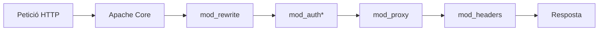
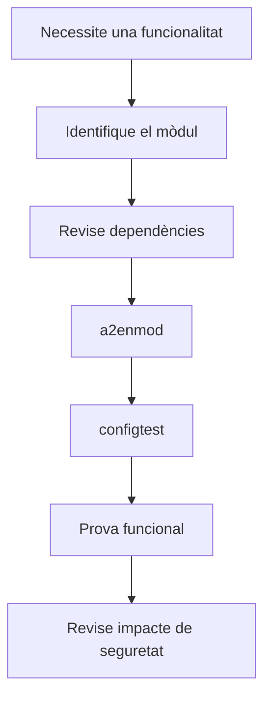

---
hide:
  - navigation
title: "2. Activació i configuració de mòduls d'Apache"
description: "Mòduls d'Apache 2.4, activació, configuració i principi de mínima funcionalitat."
---
# 2. Activació i configuració de mòduls d'Apache

**Criteri treballat:** CA2.b — ampliar la funcionalitat del servidor mitjançant l'activació i configuració de mòduls.

Apache té un nucli que resol funcions bàsiques, però gran part de les seues capacitats s'incorporen mitjançant **mòduls**. Un mòdul és un component que afegeix una funcionalitat concreta al servidor.

Alguns exemples:

- TLS/HTTPS;
- reescriptura d'URL;
- autenticació;
- capçaleres;
- proxy invers;
- compressió;
- memòria cau.

## 2.1. Arquitectura modular



No totes les peticions passen exactament per aquesta seqüència, però el diagrama mostra la idea: **la configuració activa funcionalitats especialitzades sobre el nucli d'Apache**.

## 2.2. Veure els mòduls carregats

```bash
apache2ctl -M
```

Exemple parcial:

```text
ssl_module (shared)
rewrite_module (shared)
headers_module (shared)
proxy_module (shared)
proxy_http_module (shared)
```

Buscar-ne un concret:

```bash
apache2ctl -M | grep ssl
```

## 2.3. Activar i desactivar mòduls

En Ubuntu/Debian:

```bash
sudo a2enmod ssl
sudo a2dismod ssl
```

`a2enmod` crea els enllaços necessaris en `mods-enabled/` a partir dels fitxers disponibles en `mods-available/`.

L'estructura és habitualment:

```text
/etc/apache2/mods-available/ssl.load
/etc/apache2/mods-available/ssl.conf

/etc/apache2/mods-enabled/ssl.load -> ../mods-available/ssl.load
/etc/apache2/mods-enabled/ssl.conf -> ../mods-available/ssl.conf
```

Després d'un canvi:

```bash
sudo apache2ctl configtest
sudo systemctl reload apache2
```

## 2.4. `mod_ssl`

`mod_ssl` habilita el suport TLS necessari per a HTTPS.

```bash
sudo a2enmod ssl
```

La seua configuració es combina amb un Virtual Host del port 443:

```apache
<VirtualHost *:443>
    ServerName dawshop.test

    SSLEngine on
    SSLCertificateFile /etc/ssl/certs/dawshop.crt
    SSLCertificateKeyFile /etc/ssl/private/dawshop.key
</VirtualHost>
```

Activar el mòdul no crea automàticament un certificat: són dos passos diferents.

## 2.5. `mod_rewrite`

`mod_rewrite` permet transformar o redirigir URL aplicant regles.

```bash
sudo a2enmod rewrite
```

Exemple:

```apache
RewriteEngine On
RewriteRule ^productes/([0-9]+)$ /producte.php?id=$1 [L,QSA]
```

Una petició a:

```text
/productes/42
```

pot transformar-se internament en:

```text
/producte.php?id=42
```

També es pot utilitzar per redireccions, però per a redireccions simples és preferible sovint una directiva més clara com `Redirect`.

> **Evita regles màgiques**
>
> `mod_rewrite` és potent, però una configuració difícil d'entendre és difícil de mantindre. Utilitza'l quan realment necessites reescriptura basada en patrons.

## Pràctica UP2.2: `mod_rewrite` en `.htaccess`

Aquesta pràctica comprova la diferència entre **reescriure internament** una
URL i fer una redirecció. La regla següent fa que el client demane
`/about-us`, però Apache servisca el fitxer local `about.html`; la barra d'adreces
no ha de canviar.

### 1. Preparar el lloc i activar el mòdul

```bash
sudo mkdir -p /var/www/daw
echo '<!doctype html><html lang="ca"><meta charset="utf-8"><title>About</title><h1>About DAW</h1></html>' \
  | sudo tee /var/www/daw/about.html

sudo a2enmod rewrite
apache2ctl -M | grep rewrite
```

L'ordre ha de mostrar `rewrite_module (shared)`. Si no apareix, no continues
amb la prova funcional: revisa l'activació i torna a executar `configtest`.

### 2. Permetre `.htaccess` només al lloc de la pràctica

En el Virtual Host que serveix `/var/www/daw`, incorpora el bloc següent:

```apache
DocumentRoot /var/www/daw

<Directory /var/www/daw>
    Options -Indexes
    AllowOverride All
    Require all granted
</Directory>
```

`AllowOverride All` és necessari ací perquè Apache puga llegir les directives
de `.htaccess`. En producció és preferible definir la regla directament en el
Virtual Host i mantindre `AllowOverride None`, però la pràctica vol demostrar
explícitament el mecanisme de `.htaccess`.

### 3. Crear i provar la regla

```bash
sudo tee /var/www/daw/.htaccess >/dev/null <<'EOF'
RewriteEngine On
RewriteRule ^about-us/?$ about.html [L]
EOF

sudo apache2ctl configtest
sudo systemctl reload apache2
curl -i http://localhost/about-us
```

El resultat esperat és una resposta `200` amb el contingut d'`about.html`, no
una resposta `301` ni `302`. Si el lloc se selecciona pel nom, fes la prova
des del client amb:

```bash
curl -i -H 'Host: catadaw1.com' http://IP_VM/about-us
```

### Evidències per a la memòria

- sortida de `apache2ctl -M | grep rewrite`;
- fragment de la configuració amb `AllowOverride All`;
- contingut de `.htaccess`;
- resultat de `apache2ctl configtest`;
- resposta de `curl` o captura del navegador mostrant `/about-us`.

## 2.6. `mod_headers`

Permet crear, modificar o eliminar capçaleres HTTP.

```bash
sudo a2enmod headers
```

Exemple:

```apache
Header always set X-Content-Type-Options "nosniff"
Header always set X-Frame-Options "SAMEORIGIN"
```

També és el mòdul que utilitzarem per habilitar HSTS:

```apache
Header always set Strict-Transport-Security "max-age=31536000"
```

HSTS només s'ha d'activar quan HTTPS funciona correctament.

## 2.7. `mod_proxy` i proxy invers

Apache pot actuar com a porta d'entrada d'una aplicació que realment s'executa en un altre procés o port.

Per exemple, DAWShop podria executar-se en:

```text
http://127.0.0.1:3000
```

però l'usuari accediria a:

```text
https://dawshop.test/
```


Mòduls:

```bash
sudo a2enmod proxy
sudo a2enmod proxy_http
```

Configuració:

```apache
ProxyPass        / http://127.0.0.1:3000/
ProxyPassReverse / http://127.0.0.1:3000/
```

Això permet que Apache gestione TLS, Virtual Hosts i logs mentre l'aplicació s'executa independentment.

## 2.8. `mod_cache`

Permet incorporar memòria cau en Apache. No és una "acceleració automàtica": cal decidir què és segur guardar en caché i durant quant de temps.

En una aplicació dinàmica, emmagatzemar contingut personalitzat sense una política correcta podria arribar a mostrar dades d'un usuari a un altre.

Per això la memòria cau s'ha de configurar coneixent:

- tipus de contingut;
- capçaleres `Cache-Control`;
- autenticació;
- variacions per cookies o capçaleres;
- temps de validesa.

## 2.9. Altres mòduls útils

| Mòdul | Funció |
|---|---|
| `mod_deflate` | Compressió gzip |
| `mod_http2` | Suport HTTP/2 |
| `mod_auth_basic` | HTTP Basic Authentication |
| `mod_authn_file` | Usuaris emmagatzemats en fitxer |
| `mod_status` | Estat intern d'Apache |
| `mod_expires` | Capçaleres d'expiració/caché |
| `mod_proxy_http` | Proxy HTTP |
| `mod_proxy_fcgi` | Proxy FastCGI, habitual amb PHP-FPM |

## 2.10. Seguretat: principi de mínima funcionalitat

Cada mòdul actiu:

- consumeix memòria o CPU;
- incorpora codi;
- afegeix directives;
- pot augmentar la superfície d'atac;
- complica el diagnòstic.

Per tant, la regla no és "activar-ho tot per si de cas", sinó:

> **activar només els mòduls que l'arquitectura necessita.**

Flux recomanat:



## 2.11. Resum

Has de saber:

- què és un mòdul;
- consultar els mòduls actius amb `apache2ctl -M`;
- activar-los amb `a2enmod`;
- desactivar-los amb `a2dismod`;
- entendre el paper de `ssl`, `rewrite`, `headers`, `proxy` i `cache`;
- validar la configuració abans de recarregar;
- evitar funcionalitat innecessària.

### Comprova que ho entens

1. Quina diferència hi ha entre `mod_proxy` i una redirecció HTTP?
2. Per què `proxy` i `proxy_http` poden ser necessaris alhora?
3. Què aporta `mod_headers` a la seguretat?
4. Per què activar mòduls innecessaris és una mala pràctica?
