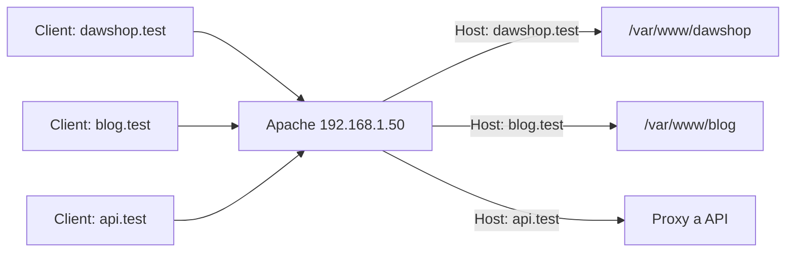
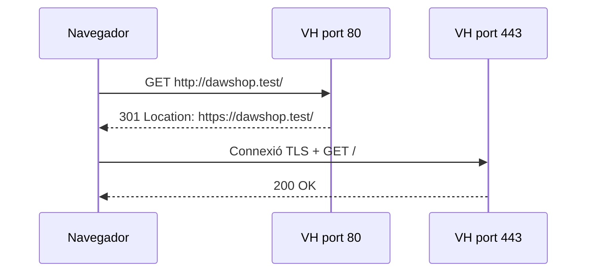

---
hide:
  - navigation
title: "3. Creació i configuració de Virtual Hosts"
description: "Hosts virtuals basats en nom, resolució local, HTTPS i proxy invers amb Apache."
---
# 3. Creació i configuració de Virtual Hosts

**Criteri treballat:** CA2.c — crear i configurar llocs virtuals.

Un **Virtual Host** permet que una mateixa instància d'Apache publique diferents llocs web. És una de les configuracions més habituals en hosting, laboratoris, entorns de proves i servidors corporatius.

## 3.1. Per què funcionen?

Quan un navegador demana:

```text
http://dawshop.test/
```

envia una capçalera HTTP semblant a:

```http
Host: dawshop.test
```

Apache pot utilitzar eixe valor per decidir quin lloc ha de servir.



## 3.2. Tipus de Virtual Host

Podem diferenciar-los per:

- **nom**: diferents dominis sobre la mateixa IP;
- **IP**: cada web està associada a una IP diferent;
- **port**: diferents webs o serveis escolten ports diferents.

En la majoria dels casos web moderns utilitzarem Virtual Hosts **basats en nom**.

## 3.3. Preparar el lloc

Creem l'estructura de DAWShop:

```bash
sudo mkdir -p /var/www/dawshop/public
```

Afegim una pàgina de prova:

```bash
echo '<h1>DAWShop</h1>' | sudo tee /var/www/dawshop/public/index.html
```

Permisos orientatius per a contingut estàtic:

```bash
sudo chown -R www-data:www-data /var/www/dawshop
sudo find /var/www/dawshop -type d -exec chmod 755 {} \;
sudo find /var/www/dawshop -type f -exec chmod 644 {} \;
```

En desenvolupament podries usar una propietat diferent per facilitar l'edició, però en producció convé separar qui **edita/desplega** de l'usuari amb què s'executa Apache.

## 3.4. Crear el Virtual Host

Fitxer:

```bash
sudo nano /etc/apache2/sites-available/dawshop.conf
```

Contingut:

```apache
<VirtualHost *:80>
    ServerName dawshop.test
    ServerAlias www.dawshop.test

    DocumentRoot /var/www/dawshop/public

    <Directory /var/www/dawshop/public>
        Options -Indexes
        AllowOverride None
        Require all granted
    </Directory>

    ErrorLog ${APACHE_LOG_DIR}/dawshop-error.log
    CustomLog ${APACHE_LOG_DIR}/dawshop-access.log combined
</VirtualHost>
```

## 3.5. Activar el lloc

```bash
sudo a2ensite dawshop.conf
```

Opcionalment, desactivar el lloc per defecte:

```bash
sudo a2dissite 000-default.conf
```

Validar:

```bash
sudo apache2ctl configtest
```

Aplicar:

```bash
sudo systemctl reload apache2
```

## 3.6. Resolució de noms en el laboratori

En un entorn real, `dawshop.example.com` es resoldria mitjançant DNS.

En un laboratori podem simular-ho amb el fitxer `hosts`.

Si Apache està en la IP:

```text
192.168.56.20
```

en **l'equip des del qual navegaràs** afegeix:

```text
192.168.56.20 dawshop.test www.dawshop.test
```

En Linux:

```text
/etc/hosts
```

> **Error habitual amb màquines virtuals**
>
> Si navegues des de l'ordinador host cap a una VM, modificar només `/etc/hosts` de la VM no resol el nom en el host. El nom ha de poder resoldre's des del client que fa la petició.

## 3.7. `ServerName` vs `ServerAlias`

```apache
ServerName dawshop.test
ServerAlias www.dawshop.test botiga.dawshop.test
```

- `ServerName`: nom principal o canònic.
- `ServerAlias`: noms alternatius que han de seleccionar el mateix Virtual Host.

Això no crea DNS. Apache només respon correctament **després** que el nom resolga a la IP del servidor.

## 3.8. Diagnòstic amb `apache2ctl -S`

Una de les ordres més útils:

```bash
sudo apache2ctl -S
```

Permet veure:

- Virtual Hosts detectats;
- IP i ports;
- quin és el Virtual Host per defecte;
- `ServerName`;
- fitxer i línia de configuració.

Quan "apareix la web equivocada", aquesta ordre sol ser el primer pas.

## Pràctica UP2.3: `catadaw1.com` i `catadaw2.com`

En aquesta activitat es creen dos llocs estàtics sobre la mateixa màquina i el
mateix port. La selecció no es fa per la carpeta, sinó pel nom que arriba en la
capçalera `Host`.

### 1. Crear els continguts

```bash
sudo mkdir -p /var/www/catadaw1 /var/www/catadaw2
echo '<h1>catadaw1.com</h1>' | sudo tee /var/www/catadaw1/index.html
echo '<h1>catadaw2.com</h1>' | sudo tee /var/www/catadaw2/index.html
sudo chown -R www-data:www-data /var/www/catadaw1 /var/www/catadaw2
sudo find /var/www/catadaw1 /var/www/catadaw2 -type d -exec chmod 755 {} \;
sudo find /var/www/catadaw1 /var/www/catadaw2 -type f -exec chmod 644 {} \;
```

### 2. Definir els dos Virtual Hosts

Fitxer `/etc/apache2/sites-available/catadaw1.com.conf`:

```apache
<VirtualHost *:80>
    ServerName catadaw1.com
    ServerAlias www.catadaw1.com
    DocumentRoot /var/www/catadaw1

    <Directory /var/www/catadaw1>
        Options -Indexes
        AllowOverride None
        Require all granted
    </Directory>

    ErrorLog ${APACHE_LOG_DIR}/catadaw1-error.log
    CustomLog ${APACHE_LOG_DIR}/catadaw1-access.log combined
</VirtualHost>
```

Fitxer `/etc/apache2/sites-available/catadaw2.com.conf`:

```apache
<VirtualHost *:80>
    ServerName catadaw2.com
    ServerAlias www.catadaw2.com
    DocumentRoot /var/www/catadaw2

    <Directory /var/www/catadaw2>
        Options -Indexes
        AllowOverride None
        Require all granted
    </Directory>

    ErrorLog ${APACHE_LOG_DIR}/catadaw2-error.log
    CustomLog ${APACHE_LOG_DIR}/catadaw2-access.log combined
</VirtualHost>
```

Activa'ls i valida la configuració:

```bash
sudo a2ensite catadaw1.com.conf catadaw2.com.conf
sudo apache2ctl configtest
sudo apache2ctl -S
sudo systemctl reload apache2
```

### 3. Resoldre els noms en el client

En el fitxer `/etc/hosts` de l'equip des d'on s'obri el navegador, substitueix
`IP_VM` per la IP real de la màquina virtual:

```text
IP_VM catadaw1.com www.catadaw1.com
IP_VM catadaw2.com www.catadaw2.com
```

Per aïllar si el problema és DNS o Apache, també es poden provar els hosts
directament amb `curl`:

```bash
curl -i -H 'Host: catadaw1.com' http://IP_VM/
curl -i -H 'Host: catadaw2.com' http://IP_VM/
```

La primera resposta ha de contindre `catadaw1.com` i la segona `catadaw2.com`.
La comprovació amb navegador completa la prova de resolució real del client.

### Evidències per a la memòria

- els dos fitxers de `sites-available`;
- l'entrada corresponent del fitxer `/etc/hosts` del client;
- `apache2ctl configtest` amb `Syntax OK`;
- `apache2ctl -S` mostrant els dos noms;
- una prova diferenciada de cada web.

## 3.9. Logs independents per lloc

És recomanable separar logs:

```apache
ErrorLog ${APACHE_LOG_DIR}/dawshop-error.log
CustomLog ${APACHE_LOG_DIR}/dawshop-access.log combined
```

Això evita barrejar peticions de múltiples webs i simplifica el diagnòstic.

## 3.10. Virtual Host HTTPS

Per HTTPS, el Virtual Host escolta el port 443:

```apache
<IfModule mod_ssl.c>
<VirtualHost *:443>
    ServerName dawshop.test
    DocumentRoot /var/www/dawshop/public

    SSLEngine on
    SSLCertificateFile /etc/ssl/certs/dawshop.crt
    SSLCertificateKeyFile /etc/ssl/private/dawshop.key

    ErrorLog ${APACHE_LOG_DIR}/dawshop-ssl-error.log
    CustomLog ${APACHE_LOG_DIR}/dawshop-ssl-access.log combined
</VirtualHost>
</IfModule>
```

Per a la pràctica UP2.5, si s'ha generat el certificat en la carpeta del
laboratori, les rutes queden així:

```apache
SSLCertificateFile /etc/apache2/certs/catadaw1.com.crt
SSLCertificateKeyFile /etc/apache2/certs/catadaw1.com.key
```

El nom del certificat, el `ServerName` i el nom que el client envia amb SNI
han de ser coherents. Després d'afegir o modificar el Virtual Host:

```bash
sudo a2ensite catadaw1.com-ssl.conf
sudo apache2ctl configtest
sudo systemctl reload apache2
curl -k -I https://catadaw1.com/
```

L'opció `-k` només s'utilitza en aquest laboratori perquè el certificat és
autofirmat; en un entorn real s'ha de validar la cadena de confiança.

Necessitem:

```bash
sudo a2enmod ssl
```

i un certificat vàlid o, per a laboratori, un certificat de prova.

## 3.11. Redirigir HTTP a HTTPS

Quan HTTPS ja funciona:

```apache
<VirtualHost *:80>
    ServerName dawshop.test
    Redirect permanent / https://dawshop.test/
</VirtualHost>
```



## 3.12. Virtual Host com a proxy invers

Si DAWShop és una app Node, Java/Tomcat o Python que escolta en un port intern:

```apache
<VirtualHost *:80>
    ServerName app.dawshop.test

    ProxyPreserveHost On
    ProxyPass        / http://127.0.0.1:8080/
    ProxyPassReverse / http://127.0.0.1:8080/
</VirtualHost>
```

Aquesta arquitectura és molt habitual: l'aplicació no s'exposa directament a Internet i Apache actua com a frontend.

## 3.13. Errors habituals

### Veig el lloc per defecte

Revisa:

```bash
apache2ctl -S
```

i comprova que el `Host` sol·licitat coincideix amb `ServerName` o `ServerAlias`.

### Error 403

Comprova:

- permisos del sistema de fitxers;
- blocs `<Directory>`;
- usuari `www-data`;
- `Require all granted`.

### El nom no resol

Comprova DNS o `/etc/hosts` **en el client**.

### La configuració no s'aplica

Comprova:

```bash
sudo a2ensite dawshop.conf
sudo apache2ctl configtest
sudo systemctl reload apache2
```

## 3.14. Resum

Un Virtual Host combina:

```text
nom del lloc
+ port/IP
+ DocumentRoot o backend
+ permisos
+ logs
+ opcionalment TLS
```

### Comprova que ho entens

1. Com pot una sola IP publicar tres dominis?
2. Quina informació usa Apache per distingir Virtual Hosts basats en nom?
3. Per què `/etc/hosts` no substitueix la configuració d'Apache?
4. Què mostra `apache2ctl -S`?
5. Quan té sentit usar un Virtual Host amb `ProxyPass`?
