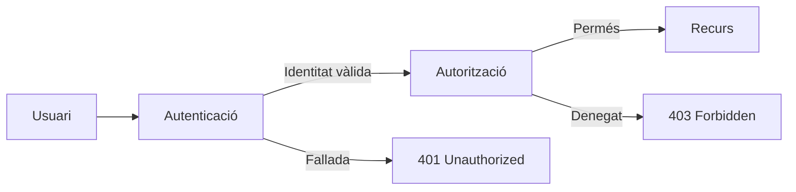
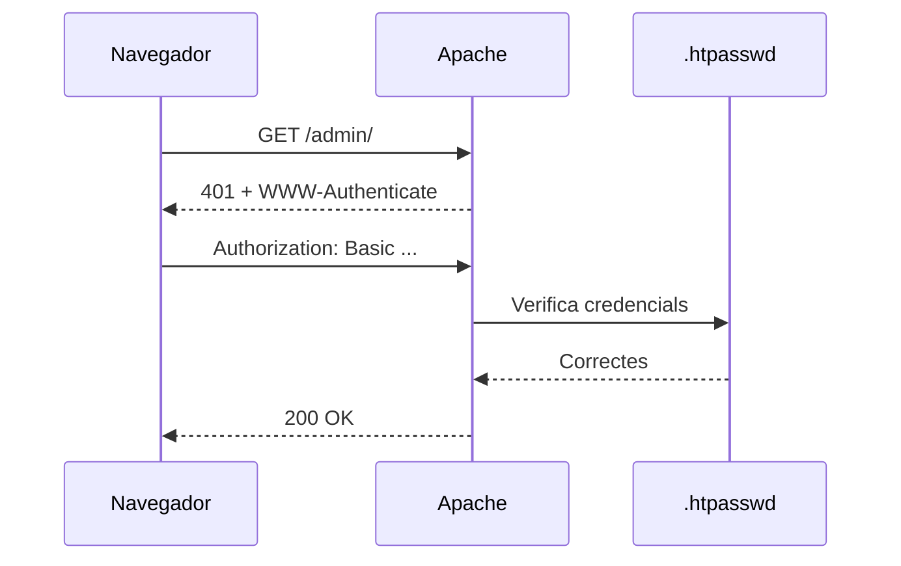
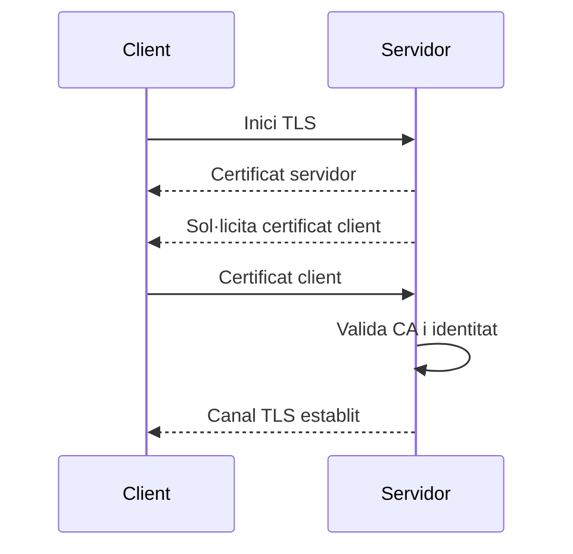
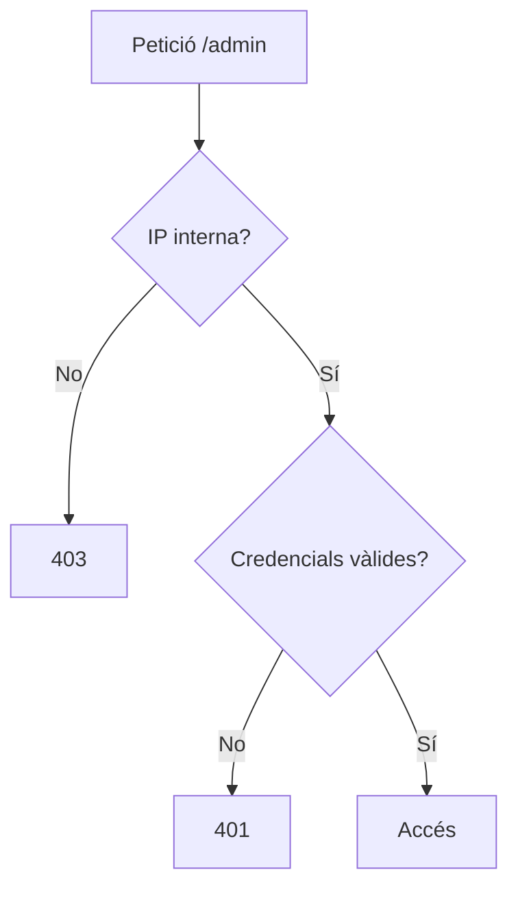
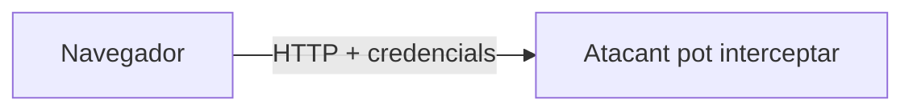
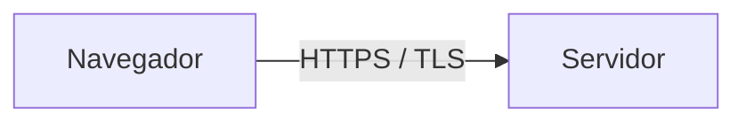

---
hide:
  - navigation
title: "4. Autenticació i control d'accés"
description: "Autenticació, autorització, Basic Auth, JWT, OAuth 2.0, mTLS i ACL."
---
# 4. Autenticació i control d'accés

**Criteri treballat:** CA2.d — configurar mecanismes d'autenticació i control d'accés del servidor.

Seguretat no significa només xifrar la connexió. També hem de decidir:

1. **qui és l'usuari**;
2. **a què pot accedir**.

Aquests conceptes són diferents:

- **autenticació**: demostrar la identitat;
- **autorització**: decidir els permisos després d'identificar l'usuari.



## 4.1. HTTP Basic Authentication

És un mecanisme senzill d'HTTP. El navegador envia usuari i contrasenya codificats en Base64.

> **Base64 no és xifrat.**
>
> Basic Authentication s'ha d'utilitzar sobre **HTTPS** si les credencials travessen una xarxa no confiable.

Instal·la la utilitat `htpasswd`:

```bash
sudo apt install apache2-utils
```

Crear el fitxer i el primer usuari:

```bash
sudo htpasswd -c /etc/apache2/dawshop.htpasswd alumne
```

Afegir un segon usuari **sense `-c`**, perquè `-c` recrearia el fitxer:

```bash
sudo htpasswd /etc/apache2/dawshop.htpasswd professor
```

Configurar un directori:

```apache
<Directory /var/www/dawshop/admin>
    AuthType Basic
    AuthName "DAWShop - zona privada"
    AuthUserFile /etc/apache2/dawshop.htpasswd
    Require valid-user
</Directory>
```

Flux:



## 4.2. Basic Auth: quan és apropiat?

Pot ser útil per:

- una intranet;
- una interfície temporal;
- documentació interna;
- un entorn de preproducció;
- una zona administrativa simple.

No substitueix el sistema d'usuaris d'una aplicació complexa.

## 4.3. Autenticació Digest

HTTP Digest va aparéixer com una alternativa que evitava enviar la contrasenya directament. Encara que històricament és rellevant, **no és l'opció habitual per a aplicacions web modernes**.

En lloc de confiar en Digest, és habitual usar:

- TLS;
- sessions segures;
- OAuth 2.0 + OpenID Connect;
- certificats de client en entorns especials.

## 4.4. Tokens, JWT i OAuth 2.0

### JWT

JWT és un **format de token**, no un sistema complet d'autenticació.

Un JWT sol tindre tres parts:

```text
header.payload.signature
```

Pot transportar claims com:

```json
{
  "sub": "usuari-42",
  "role": "admin",
  "exp": 1790000000
}
```

La signatura permet verificar que el token no ha sigut modificat, però el contingut d'un JWT normal **no està xifrat**.

### OAuth 2.0

OAuth 2.0 és principalment un **marc d'autorització delegada**.

Exemple: DAWShop vol accedir, amb permís de l'usuari, a un recurs proporcionat per un tercer sense conéixer la seua contrasenya.

Per a autenticació sobre OAuth 2.0 se sol utilitzar **OpenID Connect (OIDC)**.

## 4.5. Certificats de client

En sistemes d'alta seguretat, el servidor pot exigir que el client presente un certificat X.509.

Això es coneix habitualment com **mTLS** quan tant client com servidor s'autentiquen amb certificats.



No és habitual per a un web públic general, però sí en APIs internes, infraestructures corporatives o comunicacions entre serveis.

## 4.6. Control d'accés per IP

Apache 2.4 utilitza directives `Require`.

Permetre només una xarxa:

```apache
<Directory /var/www/dawshop/admin>
    Require ip 192.168.1.0/24
</Directory>
```

Permetre localhost:

```apache
Require local
```

Denegar tot:

```apache
Require all denied
```

Permetre tot:

```apache
Require all granted
```

> **Sintaxi antiga**
>
> Materials antics poden mostrar `Order`, `Allow` i `Deny`. Eixa sintaxi correspon a l'antic sistema d'autorització d'Apache 2.2. En Apache 2.4 s'ha de prioritzar `Require`.

## 4.7. Combinar condicions

Apache permet combinar regles.

Per exemple, permetre usuaris autenticats **i** que vinguen de la xarxa interna:

```apache
<Directory /var/www/dawshop/admin>
    AuthType Basic
    AuthName "DAWShop Admin"
    AuthUserFile /etc/apache2/dawshop.htpasswd

    <RequireAll>
        Require valid-user
        Require ip 192.168.1.0/24
    </RequireAll>
</Directory>
```

Conceptualment:



## 4.8. RBAC: control basat en rols

RBAC assigna permisos a **rols** i rols a usuaris.

```text
Jordi   -> admin
Anna    -> editor
Pau     -> lector
```

```text
admin  -> gestionar usuaris, productes, comandes
editor -> gestionar productes
lector -> consultar
```

Avantatge: no cal definir permisos individualment per a cada usuari.

En aplicacions modernes, RBAC se sol implementar en la pròpia aplicació o en un sistema d'identitat, no únicament en Apache.

## 4.9. ACL

Una ACL descriu explícitament quina identitat pot realitzar quina acció sobre un recurs.

Model conceptual:

```text
usuari / grup / rol
        ↓
      recurs
        ↓
acció: llegir / escriure / administrar
```

RBAC i ACL no són exactament el mateix: RBAC centra l'autorització en rols; una ACL està associada més directament als permisos sobre un recurs.

## 4.10. HTTPS i autenticació

Protegir una URL amb contrasenya però usar HTTP és insuficient.



Amb TLS:



El xifrat protegeix el trànsit, però no substitueix l'autenticació ni l'autorització.

## 4.11. 401 vs 403

Aquesta diferència és fonamental:

- **401 Unauthorized**: falta autenticació vàlida o ha fallat.
- **403 Forbidden**: el servidor entén la petició, però l'accés no està autoritzat.

En diagnòstic, confondre'ls pot portar-te a buscar el problema en el lloc equivocat.

## 4.12. Resum

Un desplegament segur separa clarament:

```text
identitat -> autenticació
permisos  -> autorització
canal     -> HTTPS/TLS
```

### Comprova que ho entens

1. Per què Base64 no protegeix una contrasenya?
2. Quina diferència hi ha entre un 401 i un 403?
3. OAuth 2.0 és autenticació o autorització?
4. Què aporta OIDC?
5. Quan tindria sentit usar autenticació amb certificat de client?

