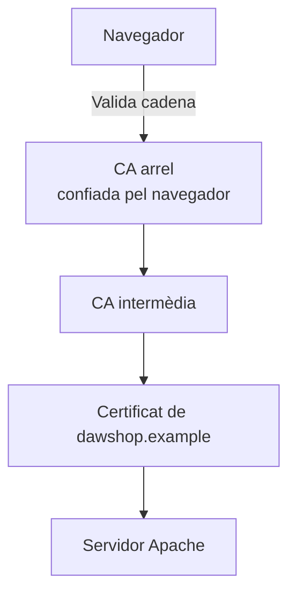
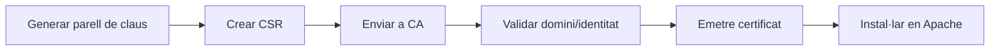
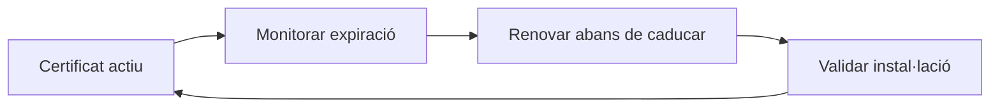

---
hide:
  - navigation
title: "5. Obtenció i instal·lació de certificats digitals"
description: "Claus, CSR, certificats, CA, cadena de confiança, OpenSSL i Certbot."
---
# 5. Obtenció i instal·lació de certificats digitals

**Criteri treballat:** CA2.e — obtindre i instal·lar certificats digitals.

Un certificat digital permet vincular una **identitat** —per exemple, `www.exemple.com`— amb una **clau pública**. És una peça central de HTTPS.

## 5.1. Criptografia asimètrica

En criptografia asimètrica existeix un parell de claus:

```text
clau privada  <->  clau pública
```

- la **clau privada** s'ha de protegir i no s'ha de compartir;
- la **clau pública** es pot distribuir.

Un certificat X.509 conté, entre altres dades:

- subjecte;
- noms de domini;
- clau pública;
- emissor;
- número de sèrie;
- dates de validesa;
- algorismes;
- signatura de l'autoritat emissora.

## 5.2. PKI i cadena de confiança



Normalment una CA arrel no signa directament cada web. Ho fa una CA intermèdia.

El navegador confia en una llista de CA arrel instal·lades en el sistema o en el propi navegador.

## 5.3. DV, OV i EV

Podem classificar certificats segons la validació realitzada:

- **DV (Domain Validation)**: valida el control del domini;
- **OV (Organization Validation)**: incorpora comprovacions de l'organització;
- **EV (Extended Validation)**: procés de validació d'identitat més exhaustiu.

També hi ha diferències per cobertura:

- un sol nom;
- **SAN**, diversos noms en un certificat;
- **wildcard**, com `*.example.com`.

> **Wildcard**
>
> `*.example.com` cobreix habitualment `app.example.com` o `blog.example.com`, però no necessàriament `example.com` ni subdominis de segon nivell com `api.dev.example.com`.

## 5.4. CSR: Certificate Signing Request

Una CSR és una sol·licitud que enviem a una CA. Conté la clau pública i informació necessària perquè la CA emeta el certificat.

Generar clau privada:

```bash
openssl genpkey -algorithm RSA \
  -out dawshop.key \
  -pkeyopt rsa_keygen_bits:2048
```

Generar CSR:

```bash
openssl req -new \
  -key dawshop.key \
  -out dawshop.csr
```

Inspeccionar-la:

```bash
openssl req -in dawshop.csr -noout -text
```

Flux:



## 5.5. Certificat autofirmat

Això **no és una CSR**:

```bash
openssl req -x509 -newkey rsa:2048 \
  -nodes \
  -keyout dawshop.key \
  -out dawshop.crt \
  -days 365
```

L'opció `-x509` genera directament un **certificat autofirmat**.

És útil per:

- laboratoris;
- proves locals;
- entorns on controles manualment la confiança.

El navegador mostrarà una advertència si no confia en l'emissor.

## Pràctica UP2.5: certificat autofirmat per a `catadaw1.com`

La pràctica es realitza en un laboratori, per això es pot utilitzar un
certificat autofirmat. No és equivalent a un certificat emés per una CA
pública: el navegador avisarà que l'emissor no és de confiança fins que el
certificat o la CA del laboratori s'instal·le manualment.

### 1. Comprovar i activar `mod_ssl`

La sintaxi correcta de `find` és:

```bash
find /usr/lib/apache2/modules -type f -name 'mod_ssl.so'
sudo a2enmod ssl
ls -l /etc/apache2/mods-enabled/ssl.load /etc/apache2/mods-enabled/ssl.conf
```

Si el paquet no està instal·lat, en Ubuntu/Debian:

```bash
sudo apt update
sudo apt install apache2 openssl
```

### 2. Generar la clau i el certificat

La carpeta de la pràctica és `/etc/apache2/certs/`. La clau privada no s'ha de
publicar ni incloure en una captura llegible.

```bash
sudo install -d -m 750 /etc/apache2/certs
sudo openssl req -x509 -nodes -newkey rsa:2048 -days 365 \
  -keyout /etc/apache2/certs/catadaw1.com.key \
  -out /etc/apache2/certs/catadaw1.com.crt \
  -subj "/C=ES/ST=Valencia/L=Catadau/O=IES/OU=MRE/CN=catadaw1.com/emailAddress=tu_correo@alu.edu.gva.es" \
  -addext "subjectAltName=DNS:catadaw1.com,DNS:www.catadaw1.com"

sudo chown root:root /etc/apache2/certs/catadaw1.com.key
sudo chmod 600 /etc/apache2/certs/catadaw1.com.key
sudo chmod 644 /etc/apache2/certs/catadaw1.com.crt
sudo ls -l /etc/apache2/certs/
```

Perquè la URL de la pràctica siga `https://catadaw1.com`, el nom del domini
ha d'aparéixer en el certificat, preferiblement en `subjectAltName`. No uses
literalment `Tu nombre` com a únic nom comú: provocaria
`NET::ERR_CERT_COMMON_NAME_INVALID`. Si el professorat exigeix conservar el
nom de l'alumne en el camp de l'organització o del subjecte, mantín el domini
en el SAN.

### 3. Inspeccionar el resultat

```bash
openssl x509 -in /etc/apache2/certs/catadaw1.com.crt \
  -noout -subject -issuer -dates -ext subjectAltName
```

La captura ha de permetre comprovar el domini, l'emissor autofirmat i el
període de validesa, però no ha de revelar el contingut de la clau privada.

## 5.6. Protegir la clau privada

Exemple de permisos:

```bash
sudo chown root:root /etc/ssl/private/dawshop.key
sudo chmod 600 /etc/ssl/private/dawshop.key
```

Si un atacant obté la clau privada, la identitat criptogràfica del servidor queda compromesa.

No s'ha de:

- pujar a Git;
- enviar per correu sense protecció;
- deixar en directoris web;
- compartir entre entorns sense necessitat.

## 5.7. Instal·lar un certificat en Apache

```apache
<VirtualHost *:443>
    ServerName dawshop.example

    SSLEngine on

    SSLCertificateFile /etc/ssl/certs/dawshop.crt
    SSLCertificateKeyFile /etc/ssl/private/dawshop.key

    DocumentRoot /var/www/dawshop/public
</VirtualHost>
```

Activar mòdul:

```bash
sudo a2enmod ssl
```

Validar i recarregar:

```bash
sudo apache2ctl configtest
sudo systemctl reload apache2
```

## 5.8. Comprovar el certificat

Des del navegador pots inspeccionar:

- emissor;
- subjecte;
- noms SAN;
- data de caducitat;
- cadena.

Des del terminal:

```bash
openssl s_client -connect dawshop.example:443 \
  -servername dawshop.example
```

Per veure només dades bàsiques:

```bash
echo | openssl s_client \
  -connect dawshop.example:443 \
  -servername dawshop.example 2>/dev/null \
  | openssl x509 -noout -subject -issuer -dates
```

L'opció `-servername` és important perquè envia SNI i permet seleccionar el certificat correcte en servidors amb múltiples Virtual Hosts HTTPS.

## 5.9. Let's Encrypt i Certbot

Let's Encrypt automatitza l'emissió de certificats validats per domini.

En Ubuntu:

```bash
sudo apt update
sudo apt install certbot python3-certbot-apache
```

Per a un domini que resol correctament al servidor:

```bash
sudo certbot --apache \
  -d dawshop.example \
  -d www.dawshop.example
```

Certbot pot:

1. demostrar el control del domini;
2. sol·licitar el certificat;
3. instal·lar-lo;
4. modificar Apache;
5. preparar la renovació automàtica.

> **Requisit essencial**
>
> Una CA pública ha de poder validar el domini. Un nom purament local com `dawshop.test` no és adequat per a obtenir un certificat públic de Let's Encrypt.

## 5.10. Renovació

Els certificats tenen una validesa limitada. En lloc de dependre d'una persona que recorde una data, el procés ha d'estar automatitzat.

Comprovar Certbot:

```bash
sudo certbot renew --dry-run
```

El principi general és:



## 5.11. Revocació i compromís

Un certificat pot necessitar ser revocat si:

- s'ha exposat la clau privada;
- ha canviat la titularitat;
- s'ha emés incorrectament;
- s'ha compromés la infraestructura.

No és suficient "esperar que caduque" si la clau privada està compromesa.

## 5.12. Errors habituals

### `NET::ERR_CERT_COMMON_NAME_INVALID`

El nom del web no està inclòs correctament en el certificat/SAN.

### Certificat caducat

Cal renovar-lo i comprovar l'automatització.

### Cadena incompleta

El servidor pot no estar enviant correctament els certificats intermedis.

### Certificat correcte, Virtual Host incorrecte

Revisa:

```bash
apache2ctl -S
```

i la configuració SNI/`ServerName`.

## 5.13. Resum

Has de distingir clarament:

```text
clau privada
clau pública
CSR
certificat
CA
cadena de confiança
renovació
revocació
```

### Comprova que ho entens

1. Quina diferència hi ha entre una CSR i un certificat autofirmat?
2. Per què la clau privada no ha de compartir-se?
3. Què és una CA intermèdia?
4. Per què `-servername` és important en `openssl s_client`?
5. Per què és preferible automatitzar la renovació?
