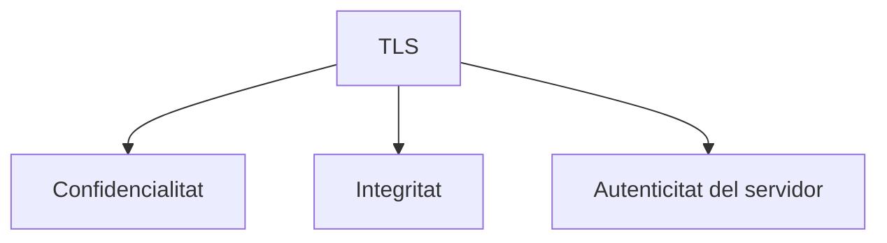
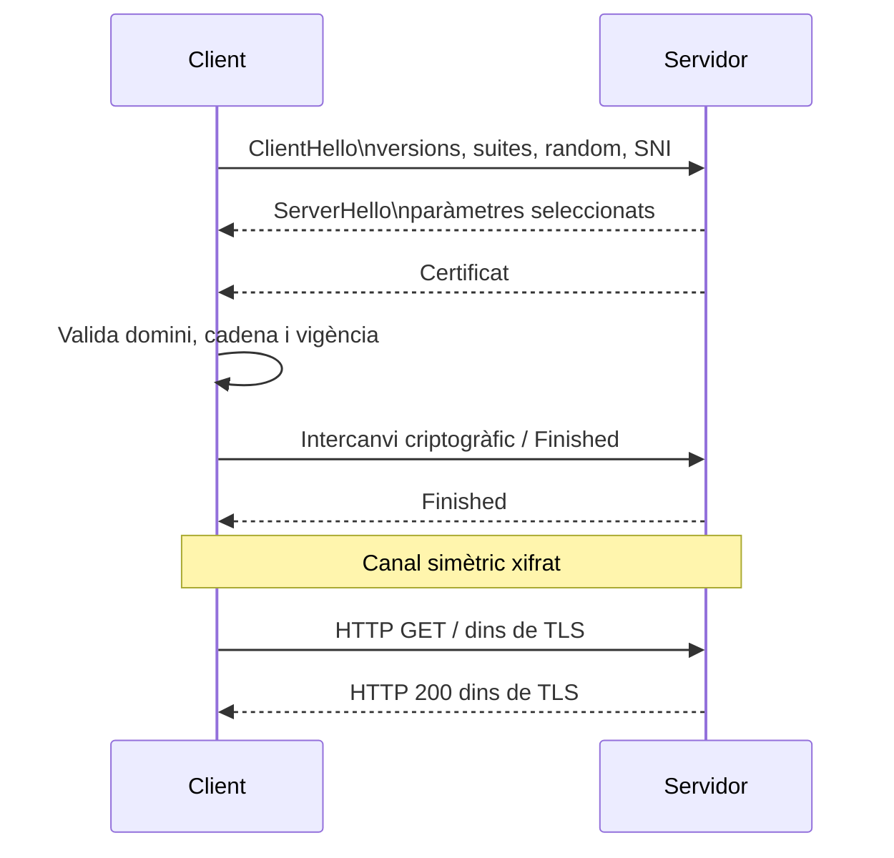
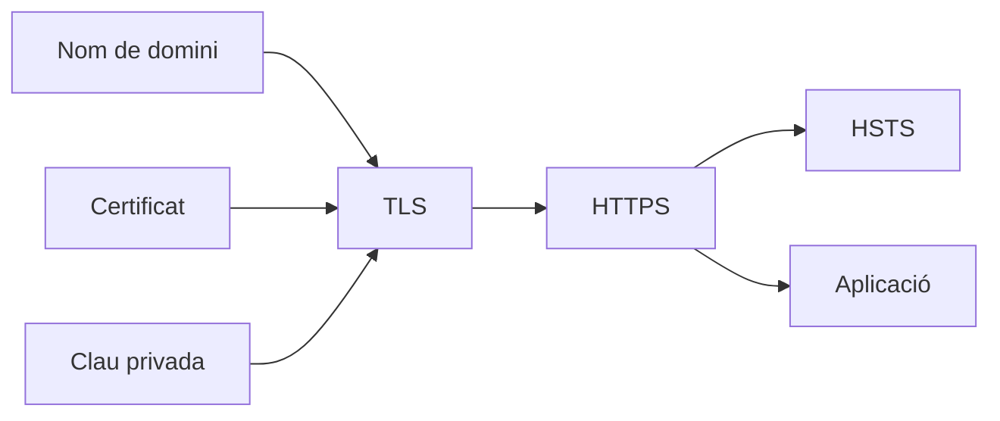

---
hide:
  - navigation
title: "6. Seguretat en les comunicacions web"
description: "HTTP, HTTPS, TLS, SNI, HSTS, mTLS i protecció de les comunicacions."
---
# 6. Seguretat en les comunicacions web

**Criteri treballat:** CA2.f — establir mecanismes per assegurar les comunicacions entre client i servidor.

HTTP, per si mateix, no proporciona confidencialitat davant d'un observador de xarxa. HTTPS resol aquest problema encapsulant HTTP dins de **TLS (Transport Layer Security)**.

## 6.1. Què volem protegir?

Tres propietats bàsiques:

- **confidencialitat**: tercers no han de poder llegir el contingut;
- **integritat**: el trànsit no ha de poder ser modificat sense detecció;
- **autenticitat**: el client ha de poder verificar amb qui està parlant.



## 6.2. HTTP vs HTTPS

Sense TLS:

```text
Navegador ---- HTTP ----> Servidor
```

Un observador en la ruta pot veure o modificar part del trànsit.

Amb HTTPS:

```text
Navegador === TLS ===> Servidor
                |
               HTTP
          dins del canal
```

HTTPS no és un protocol d'aplicació completament diferent: és **HTTP transportat sobre TLS**.

## 6.3. SSL i TLS

SSL és el predecessor històric de TLS. Les versions SSL antigues no s'han d'utilitzar.

En servidors actuals, la referència pràctica és TLS, especialment TLS 1.2 i TLS 1.3 segons compatibilitat.

Exemple restrictiu:

```apache
SSLProtocol -all +TLSv1.2 +TLSv1.3
```

La compatibilitat exacta depén de la versió d'Apache/OpenSSL instal·lada.

## 6.4. El handshake TLS, simplificat

En TLS modern, client i servidor negocien paràmetres criptogràfics, el servidor presenta la seua identitat i es deriven claus de sessió.



### Per què es combina criptografia asimètrica i simètrica?

La criptografia asimètrica és molt útil per establir confiança i acordar secrets, però és costosa per xifrar grans quantitats de dades.

Una vegada establit el canal, TLS usa claus simètriques de sessió molt més eficients.

## 6.5. SNI

En un servidor que allotja múltiples webs HTTPS en la mateixa IP, el client ha d'indicar quin nom vol abans de completar TLS.

Això és **SNI (Server Name Indication)**.

Exemple conceptual:

```text
IP 203.0.113.10
├── botiga.example  -> certificat A
├── blog.example    -> certificat B
└── api.example     -> certificat C
```

SNI permet seleccionar el Virtual Host/certificat adequat.

## 6.6. Integritat en TLS

És habitual explicar la integritat parlant de hash o MAC. En TLS modern, els xifrats autenticats, com els esquemes **AEAD**, protegeixen conjuntament confidencialitat i integritat.

El resultat pràctic és que modificar el trànsit xifrat provoca que la verificació falle.

## 6.7. Autenticació del servidor

El client verifica:

1. que el certificat correspon al nom sol·licitat;
2. que no està fora de validesa;
3. que la cadena porta a una CA de confiança;
4. que la signatura és correcta;
5. que no hi ha errors evidents de política o revocació.

Si `dawshop.example` presenta un certificat només vàlid per a `altresite.example`, el navegador ha de mostrar un error.

## 6.8. mTLS: autenticació també del client

En el web públic normalment només el servidor presenta certificat.

En mTLS:

```text
servidor presenta certificat
+
client presenta certificat
```

Això és útil per a:

- APIs entre empreses;
- microserveis;
- infraestructures internes;
- administració remota d'alta seguretat.

## 6.9. Forçar HTTPS

Quan el Virtual Host 443 funciona, el port 80 pot limitar-se a redirigir:

```apache
<VirtualHost *:80>
    ServerName dawshop.example
    Redirect permanent / https://dawshop.example/
</VirtualHost>
```

Això millora l'experiència, però la primera petició podria haver sigut HTTP. HSTS va un pas més enllà.

## 6.10. HSTS

**HTTP Strict Transport Security** diu al navegador:

> "Durant un temps determinat, no intentes connectar a aquest lloc per HTTP."

Apache:

```apache
Header always set Strict-Transport-Security "max-age=31536000"
```

Amb subdominis:

```apache
Header always set Strict-Transport-Security \
"max-age=31536000; includeSubDomains"
```

> **Precaució**
>
> No actives `includeSubDomains` si algun subdomini legítim encara necessita HTTP. El navegador recordarà la política i podria deixar-lo inaccessible.

HSTS ha d'enviar-se **sobre HTTPS**.

## 6.11. Capçaleres complementàries

TLS protegeix el transport, però no evita vulnerabilitats de l'aplicació.

Podem reforçar el navegador amb capçaleres com:

```apache
Header always set X-Content-Type-Options "nosniff"
Header always set Referrer-Policy "strict-origin-when-cross-origin"
Header always set X-Frame-Options "SAMEORIGIN"
```

Per a controls més fins, CSP:

```apache
Content-Security-Policy
```

Una CSP real ha de construir-se i provar-se per a cada aplicació.

## 6.12. Cookies segures

Una aplicació amb HTTPS també ha de configurar correctament les cookies de sessió.

Conceptes importants:

- `Secure`: només s'envia per HTTPS;
- `HttpOnly`: JavaScript no pot llegir-la directament;
- `SameSite`: limita certs enviaments cross-site.

Exemple conceptual:

```http
Set-Cookie: session=abc123; Secure; HttpOnly; SameSite=Lax
```

## 6.13. HTTPS no ho resol tot

HTTPS **no** evita:

- SQL injection;
- XSS generat per l'aplicació;
- contrasenyes febles;
- permisos mal configurats;
- malware en client o servidor;
- una sessió robada per una vulnerabilitat de l'aplicació;
- exposar secrets en logs.

HTTPS és imprescindible, però és només una capa.

## 6.14. Comprovacions

Revisar resposta:

```bash
curl -I https://dawshop.example
```

Inspeccionar TLS:

```bash
openssl s_client \
  -connect dawshop.example:443 \
  -servername dawshop.example
```

Comprovar redirecció:

```bash
curl -I http://dawshop.example
```

Esperaries un `301` o `308` cap a HTTPS.

## 6.15. Resum



### Comprova que ho entens

1. Quines tres propietats principals aporta TLS?
2. Quina diferència hi ha entre TLS i HTTPS?
3. Per què és necessari SNI?
4. Què aporta HSTS respecte a una simple redirecció?
5. Per què HTTPS no impedeix un SQL injection?

