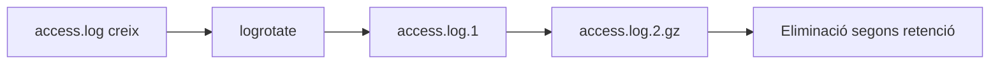
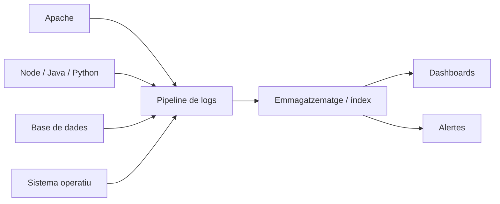
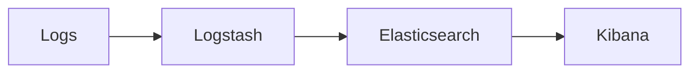
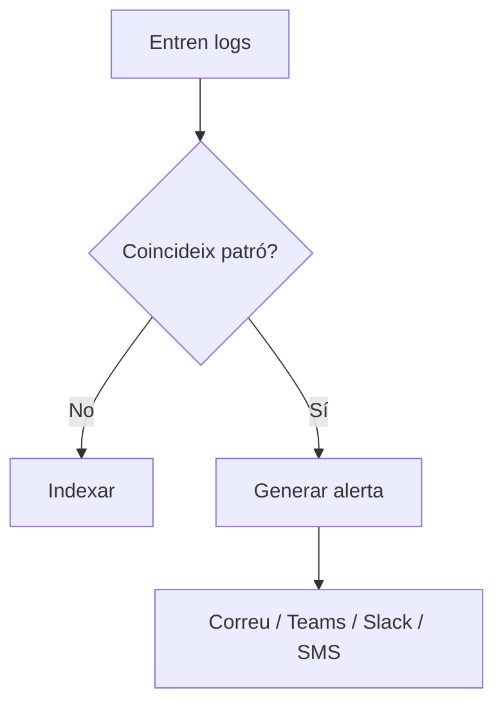
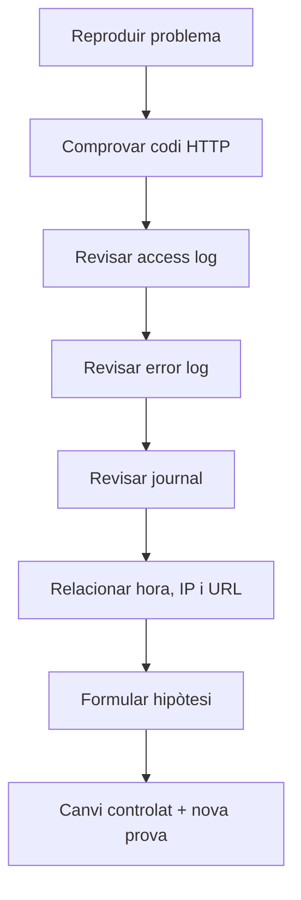

---
hide:
  - navigation
title: "7. Logs, monitorització i anàlisi"
description: "Logs d'Apache, journalctl, logrotate, centralització, monitorització i alertes."
---
# 7. Logs, monitorització i anàlisi

**Criteri treballat:** CA2.j — instal·lar, configurar i utilitzar ferramentes de gestió de logs que permeten monitorització, consolidació i anàlisi.

> En el material de partida apareix una discrepància entre l'etiqueta textual del criteri i la taula visual. En aquest material s'utilitza **CA2.j**, coherent amb el nom del document i amb la taula del criteri.

Un servidor que "funciona" però del qual no podem saber què està passant és difícil d'administrar. Els **logs** són una font bàsica d'observabilitat.

## 7.1. Què és un log?

És un registre cronològic d'esdeveniments.

Pot incloure:

- peticions;
- errors;
- advertiments;
- autenticacions;
- canvis de configuració;
- incidents de seguretat;
- temps de resposta;
- informació de processos.

Exemple Apache access log:

```text
192.168.1.25 - - [02/Oct/2026:12:15:21 +0200] \
"GET /productes HTTP/1.1" 200 5321 \
"https://dawshop.test/" "Mozilla/5.0 ..."
```

Podem extraure:

```text
IP              -> 192.168.1.25
mètode          -> GET
recurs          -> /productes
protocol        -> HTTP/1.1
estat           -> 200
bytes           -> 5321
```

## 7.2. Access log i error log

Configuració:

```apache
ErrorLog ${APACHE_LOG_DIR}/dawshop-error.log
CustomLog ${APACHE_LOG_DIR}/dawshop-access.log combined
```

Seguiment en temps real:

```bash
sudo tail -f /var/log/apache2/dawshop-access.log
```

Errors:

```bash
sudo tail -f /var/log/apache2/dawshop-error.log
```

Últimes 100 línies:

```bash
sudo tail -n 100 /var/log/apache2/dawshop-error.log
```

## 7.3. Codis HTTP i diagnòstic

Els logs d'accés permeten detectar patrons.

| Família | Significat general |
|---|---|
| 2xx | èxit |
| 3xx | redirecció |
| 4xx | problema en la petició / accés / recurs |
| 5xx | error al servidor o backend |

Exemples:

- molts **404**: recursos inexistents, URL incorrectes o bots;
- molts **401**: autenticacions necessàries/fallides;
- molts **403**: regles de permisos;
- molts **500**: errors interns;
- molts **502/503** amb proxy: backend caigut o no disponible.

## 7.4. Cerca bàsica

Errors 500:

```bash
grep '" 500 ' /var/log/apache2/dawshop-access.log
```

Peticions a `/admin`:

```bash
grep ' /admin' /var/log/apache2/dawshop-access.log
```

Comptar 404:

```bash
grep -c '" 404 ' /var/log/apache2/dawshop-access.log
```

Veure IP més repetida, aproximació simple:

```bash
awk '{print $1}' /var/log/apache2/dawshop-access.log \
  | sort | uniq -c | sort -nr | head
```

Aquestes ordres són molt útils per a laboratoris i incidents ràpids.

## 7.5. `journalctl`

Systemd manté el seu propi journal.

Apache:

```bash
sudo journalctl -u apache2
```

Últims missatges:

```bash
sudo journalctl -u apache2 -n 50
```

Seguiment:

```bash
sudo journalctl -u apache2 -f
```

Des d'una hora concreta:

```bash
sudo journalctl -u apache2 --since "1 hour ago"
```

## 7.6. Rotació amb logrotate

Els logs no poden créixer indefinidament.

**logrotate** automatitza:

- rotació;
- compressió;
- retenció;
- eliminació de còpies antigues;
- accions post-rotació.

Configuracions habituals:

```text
/etc/logrotate.conf
/etc/logrotate.d/
```

Veure la configuració d'Apache:

```bash
cat /etc/logrotate.d/apache2
```

Flux:



## 7.7. Syslog / rsyslog

Syslog és un model estàndard per enviar missatges de registre.

En Linux és habitual trobar `rsyslog` o el journal de systemd.

La centralització permet que:

```text
Servidor web 1 ─┐
Servidor web 2 ─┼──> servidor central de logs
Proxy ──────────┤
Base de dades ──┘
```

Això és especialment útil perquè un atacant que comprometa un servidor no puga modificar fàcilment l'única còpia dels seus logs.

## 7.8. Consolidació de logs

Quan una aplicació té múltiples components:



Les eines poden:

1. **recollir**;
2. **parsejar**;
3. **normalitzar**;
4. **indexar**;
5. **buscar**;
6. **visualitzar**;
7. **alertar**.

## 7.9. Graylog

Graylog és una plataforma de gestió centralitzada de logs.

Conceptualment:

```text
fonts -> inputs -> processament -> índex -> cerca/dashboards
```

És adequada per introduir:

- ingestió centralitzada;
- filtres;
- cerques;
- alertes;
- dashboards.

## Pràctica UP2.7: anàlisi amb GoAccess

Per a un únic servidor Apache, **GoAccess** és una opció lleugera que permet
passar dels fitxers de `/var/log/apache2/` a un informe HTML amb mètriques de
peticions, codis HTTP, fitxers, hosts i agents d'usuari. És suficient per a la
pràctica i deixa clar el recorregut complet: instal·lar, llegir, analitzar i
interpretar.

### 1. Localitzar els logs i instal·lar la ferramenta

```bash
ls -lh /var/log/apache2/
sudo apt update
sudo apt install goaccess
goaccess --version
```

Utilitza el log del lloc si existeix (`catadaw1-access.log`) i, si no, el log
global (`access.log`). No assumes el nom: comprova'l amb `ls`.

### 2. Generar l'informe

Per al log global:

```bash
sudo goaccess /var/log/apache2/access.log \
  --log-format=COMBINED \
  -o /tmp/apache2-report.html
```

Per al Virtual Host de `catadaw1.com`:

```bash
sudo goaccess /var/log/apache2/catadaw1-access.log \
  --log-format=COMBINED \
  -o /tmp/catadaw1-report.html
```

Obri l'HTML en el navegador del mateix equip o copia'l a un directori de
proves accessible pel client. L'informe és una evidència, però la memòria ha
d'explicar què significa cada dada i quina decisió se'n deriva.

### 3. Completar l'anàlisi amb consultes reproduïbles

```bash
# Errors del servidor en l'error log
sudo grep -Ei 'error|crit|warn' /var/log/apache2/error.log | tail -n 50

# Codis 4xx i 5xx en l'access log
sudo awk '$9 ~ /^(4|5)/ {count[$9]++} END {for (code in count) print code, count[code]}' \
  /var/log/apache2/access.log | sort -n

# IPs amb més peticions
sudo awk '{print $1}' /var/log/apache2/access.log \
  | sort | uniq -c | sort -nr | head

# Peticions a rutes sensibles o inexistents
sudo grep -E ' /admin|\.env|wp-login|\.git' /var/log/apache2/access.log | tail -n 50
```

Aquestes cerques no demostren per si soles un atac. Un nombre elevat de 404
pot ser un error de l'aplicació, un rastrejador o un escaneig automatitzat;
cal relacionar IP, hora, ruta, codi i freqüència abans d'interpretar-lo.

### 4. Estructura de l'informe

Redacta el resultat amb aquesta seqüència:

1. **Entorn i període analitzat:** servidor, lloc, fitxer i dates.
2. **Errors detectats:** codi, recompte, hora i possible causa.
3. **Comportaments inusuals:** IPs o rutes destacades i evidència concreta.
4. **Impacte:** disponibilitat, rendiment o seguretat afectats.
5. **Recomanacions:** accions prioritzades i manera de verificar-les.
6. **Limitacions:** dades que no es poden concloure amb el període disponible.

No omplis la memòria amb valors inventats: les xifres i conclusions han de
correspondre al log que s'ha analitzat i a una captura o ordre reproduïble.

## 7.10. Elastic Stack

Tradicionalment s'ha parlat d'**ELK**:

- Elasticsearch;
- Logstash;
- Kibana.

Arquitectura clàssica:



- **Logstash**: ingestió i transformació;
- **Elasticsearch**: indexació i cerca;
- **Kibana**: visualització i exploració.

En ecosistemes actuals també poden aparéixer agents com Beats o Elastic Agent.

## 7.11. Splunk

Splunk és una plataforma comercial orientada a ingestió, cerca, correlació, dashboards i alertes.

En aquesta unitat el més important no és memoritzar marques, sinó entendre el patró:

```text
recollir -> centralitzar -> cercar -> correlacionar -> alertar
```

## 7.12. Monitorització en temps real

Exemples d'esdeveniments que podríem alertar:

- augment sobtat de 500;
- 20 intents fallits de login en un minut;
- backend que comença a retornar 502;
- ús de disc elevat per logs;
- latència anormal;
- trànsit des d'una IP inesperada.



## 7.13. Logs i seguretat

Un log pot contindre informació sensible.

No és bona pràctica registrar:

- contrasenyes;
- tokens complets;
- cookies de sessió;
- claus privades;
- números de targeta;
- secrets d'API.

També cal definir:

- qui pot llegir els logs;
- quant de temps es conserven;
- on s'emmagatzemen;
- com es protegeixen;
- si és necessari anonimitzar dades.

La retenció "per si de cas" també té cost i risc.

## 7.14. Correlació

Una petició pot passar per diferents capes:

```text
navegador
 -> reverse proxy
 -> Apache
 -> aplicació
 -> base de dades
```

Per seguir una operació de punta a punta és útil usar un **request ID / correlation ID**.

Exemple:

```text
X-Request-ID: 7f83f0c2...
```

Si Apache i l'aplicació registren el mateix identificador, podem reconstruir el camí d'una petició concreta.

## 7.15. Un procediment de diagnòstic

Suposa que l'usuari diu:

> "DAWShop dona error quan intente entrar a /admin."

Procediment:



Exemple:

```bash
curl -I https://dawshop.test/admin/
```

Si retorna `403`, buscarem regles d'autorització. Si retorna `500`, l'error log és prioritari.

## 7.16. Resum

La gestió professional de logs té quatre capes:

1. **generació**;
2. **retenció/rotació**;
3. **centralització**;
4. **anàlisi i alertes**.

### Comprova que ho entens

1. Quina diferència hi ha entre access log i error log?
2. Per què cal rotar els logs?
3. Què aporta centralitzar-los?
4. Quina diferència hi ha entre guardar logs i monitoritzar?
5. Per què no s'han de registrar tokens o contrasenyes?
6. Com ajudaria un `X-Request-ID` en una arquitectura amb proxy i backend?
