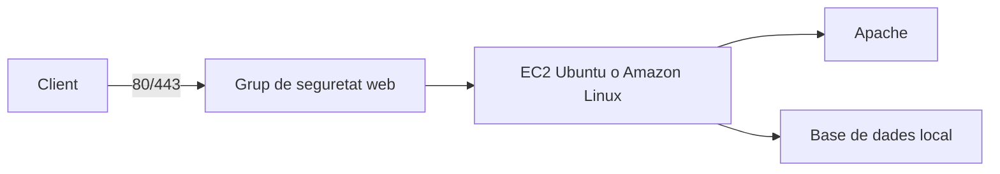
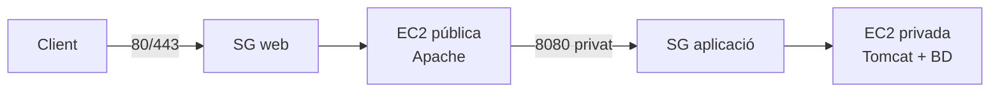

---
hide:
  - navigation
title: "9. Projecte AWS i CE2.h"
description: "Guia teòrica i pràctica per desplegar una aplicació en una VPC d'AWS amb Apache, Tomcat i base de dades."
---
# 9. Projecte AWS i CE2.h

**Activitat relacionada:** Ajustos de la implementació de l'aplicació en el
servidor web — **CE2.h**.

El projecte trasllada els conceptes del laboratori a una infraestructura de
núvol. L'objectiu no és només crear instàncies EC2, sinó justificar:

- quina arquitectura s'ha triat;
- quines xarxes i rutes necessita;
- quins serveis queden exposats;
- com es comuniquen les capes;
- com es comprova que l'aplicació funciona;
- com es protegeix i es desmunta l'entorn.

## 9.1. Els dos escenaris del projecte

### Escenari 1: una sola instància

Una VPC conté una instància EC2 amb Apache i la base de dades.



És el disseny més senzill per a un laboratori, però les capes comparteixen
recursos i un error o compromís de la instància afecta tota l'aplicació.
La base de dades no ha de publicar els seus ports a Internet: ha d'escoltar
només en `localhost` o estar permesa únicament des de l'aplicació.

### Escenari 2: dues capes

La VPC conté una instància pública amb Apache i una instància privada amb
Tomcat i la base de dades.



Aquest escenari separa la superfície pública de la lògica i les dades. Apache
actua com a reverse proxy i Tomcat no necessita ser accessible des d'Internet.

## 9.2. Dissenyar la xarxa abans de crear recursos

Una proposta senzilla per al laboratori és:

| Recurs | Exemple | Funció |
|---|---|---|
| VPC | `10.20.0.0/16` | xarxa privada del projecte |
| Subxarxa pública | `10.20.1.0/24` | Apache o punt d'entrada |
| Subxarxa privada | `10.20.2.0/24` | Tomcat i base de dades en l'escenari 2 |
| Taula pública | ruta local + `0.0.0.0/0` a IGW | sortida i entrada d'Internet per al frontend |
| Taula privada | ruta local; NAT només si cal eixida | serveis que no han de rebre connexions entrants |

Els blocs CIDR són una proposta, no valors obligatoris. No han de solapar-se
amb la xarxa des de la qual es farà l'administració si es preveu una VPN o una
connexió entre xarxes.

Cada subxarxa s'associa a una taula de rutes. Una subxarxa és pública quan la
seua taula té una ruta cap a un Internet Gateway i els recursos tenen una
adreça pública o reben trànsit a través d'un servei d'entrada. Un Internet
Gateway adjunt a la VPC, per si sol, no exposa una instància: també cal la ruta,
la configuració de la instància i les regles del grup de seguretat.

Per a una subxarxa privada que necessite descarregar actualitzacions sense
acceptar connexions iniciades des d'Internet, es pot utilitzar un NAT Gateway.
És un recurs amb cost; en un laboratori s'ha d'activar només si és necessari i
eliminar-lo en acabar.

## 9.3. Seqüència de creació

### 1. Preparar la documentació

Abans d'obrir la consola, anota:

- regió d'AWS i zona horària;
- CIDR de la VPC i de cada subxarxa;
- sistema operatiu de cada EC2;
- ports que necessita cada capa;
- noms dels grups de seguretat;
- domini o adreça amb què es provarà l'aplicació;
- persona responsable d'eliminar els recursos.

No inclogues claus privades, contrasenyes, tokens ni credencials d'AWS en la
memòria ni en les captures.

### 2. Crear la VPC i les subxarxes

En la consola de VPC:

1. crea la VPC amb el CIDR planificat;
2. crea la subxarxa pública i, en l'escenari 2, la subxarxa privada;
3. crea i adjunta l'Internet Gateway;
4. crea la taula de rutes pública i associa-la a la subxarxa pública;
5. afegeix la ruta `0.0.0.0/0` cap a l'Internet Gateway;
6. associa la subxarxa privada a una taula sense ruta directa a l'Internet Gateway;
7. afegeix NAT només si la instància privada necessita eixida a Internet.

Comprova sempre la columna d'associacions de les taules de rutes. Una ruta
correcta en una taula que no està associada a la subxarxa no produeix cap efecte.

### 3. Definir grups de seguretat

Els grups de seguretat funcionen com un tallafoc virtual associat a la
instància o a la interfície de xarxa. Són stateful: la resposta a un trànsit
permés es permet automàticament. Això no s'ha de confondre amb les Network ACL,
que treballen a nivell de subxarxa i són stateless.

#### Grup `sg-web`

| Direcció | Protocol/port | Origen o destí | Motiu |
|---|---|---|---|
| Entrada | TCP 80 | `0.0.0.0/0` | HTTP, si s'utilitza o redirigeix a HTTPS |
| Entrada | TCP 443 | `0.0.0.0/0` | HTTPS |
| Entrada | TCP 22 | només IP de l'administrador | SSH restringit |
| Eixida | segons necessitat | preferiblement limitada | actualitzacions i dependències |

#### Grup `sg-app` de l'escenari 2

| Direcció | Protocol/port | Origen o destí | Motiu |
|---|---|---|---|
| Entrada | TCP 8080 | `sg-web` | Apache arriba a Tomcat |
| Entrada | TCP 22 | només IP de l'administrador o bastió | administració |
| Eixida | TCP del motor de BD | `sg-app` o localhost | accés a dades |

#### Grup `sg-db` si la base de dades té un host separat

Només permet el port real del motor —per exemple, `5432` per PostgreSQL o
`3306` per MariaDB/MySQL— des del grup de l'aplicació, mai des de tota Internet.

En l'activitat indicada la base de dades comparteix la segona EC2 amb Tomcat;
en aquest cas és preferible que el motor escolte en la interfície privada o en
`localhost`, segons com estiga configurada l'aplicació.

### 4. Llançar les instàncies EC2

Per a cada instància documenta:

- AMI i versió del sistema;
- tipus d'instància;
- subxarxa i si té IP pública;
- grup de seguretat;
- clau d'accés, sense publicar-la;
- nom i tags;
- rol IAM, si l'aplicació necessita accedir a serveis AWS.

En l'escenari 2, només la instància Apache hauria de tindre exposició pública
directa. La instància de Tomcat i la base de dades han de romandre en la
subxarxa privada.

## 9.4. Configurar Apache com a frontend

En la instància pública:

```bash
sudo apt update
sudo apt install apache2
sudo a2enmod proxy proxy_http headers rewrite ssl
sudo apache2ctl configtest
```

En Amazon Linux, adapta la instal·lació al gestor de paquets i a la distribució
que haja triat el grup.

Virtual Host orientatiu per a l'escenari 2:

```apache
<VirtualHost *:80>
    ServerName aplicacio.exemple

    ProxyPreserveHost On
    ProxyPass        / http://IP_PRIVADA_APP:8080/
    ProxyPassReverse / http://IP_PRIVADA_APP:8080/

    RequestHeader set X-Forwarded-Proto "http"
    ErrorLog ${APACHE_LOG_DIR}/projecte-error.log
    CustomLog ${APACHE_LOG_DIR}/projecte-access.log combined
</VirtualHost>
```

En producció, completa'l amb HTTPS i redirecció HTTP→HTTPS. No uses la IP
pública de la instància d'aplicació en `ProxyPass`: Apache ha d'arribar al
servei per la IP privada o pel nom intern adequat.

Proves des de la instància web:

```bash
curl -I http://IP_PRIVADA_APP:8080/
sudo apache2ctl configtest
sudo systemctl reload apache2
curl -I http://localhost/
```

La primera prova aïlla la connectivitat web→aplicació; la segona comprova el
recorregut complet a través d'Apache.

## 9.5. Configurar Tomcat i la base de dades

En la instància privada:

1. instal·la Java i Tomcat segons la versió que requerisca l'aplicació;
2. desplega el WAR o l'aplicació;
3. comprova que Tomcat escolta només on toca, habitualment en `8080`;
4. crea la base de dades, l'usuari i l'esquema;
5. guarda la configuració sensible fora del repositori;
6. inicia els serveis amb `systemctl` i revisa els logs.

Comandes de diagnòstic:

```bash
sudo systemctl status tomcat
sudo ss -ltnp | grep -E '8080|5432|3306'
curl -I http://localhost:8080/
sudo journalctl -u tomcat -n 50 --no-pager
```

La base de dades no ha de ser accessible des de l'ordinador personal. La prova
correcta és que l'aplicació puga consultar-la des de la xarxa autoritzada i que
un origen no autoritzat no puga obrir el port.

## 9.6. Matriu de proves del CE2.h

| ID | Prova | Ordre o evidència | Resultat esperat |
|---|---|---|---|
| P01 | VPC i subxarxes | captura de la topologia | CIDR i associacions coherents |
| P02 | Rutes públiques | taula pública | `0.0.0.0/0` cap a IGW |
| P03 | Aïllament privat | taula privada i SG | no hi ha entrada pública a Tomcat/BD |
| P04 | Apache | `systemctl status apache2` | servei actiu |
| P05 | Proxy | `curl -I http://IP_PRIVADA_APP:8080/` | resposta des de la xarxa privada |
| P06 | Aplicació pública | navegador o `curl` al domini | resposta HTTP funcional |
| P07 | Logs | `/var/log/apache2/` i Tomcat | es pot seguir una petició o error |
| P08 | Seguretat | taula de SG sense `0.0.0.0/0` en SSH/BD | exposició mínima |
| P09 | Neteja | inventari final | recursos aturats o eliminats |

No basta una captura de `Instance running`: cal demostrar el camí de la
petició i relacionar cada resultat amb una capa concreta.

## 9.7. Escenari 1 versus escenari 2

| Aspecte | Escenari 1 | Escenari 2 |
|---|---|---|
| Complexitat | baixa | mitjana |
| Nombre d'EC2 | 1 | 2 |
| Separació de capes | limitada | clara |
| Cost potencial | menor | major |
| Diagnòstic de xarxa | més senzill | requereix rutes i SG entre capes |
| Recomanació didàctica | si el temps o el crèdit són limitats | si es vol demostrar arquitectura de dues capes |

L'escenari 2 és més adequat per explicar l'arquitectura, però només és millor
si les regles, les rutes i les proves queden documentades. Afegir instàncies no
és, per si mateix, una millora.

## 9.8. Entrega i retirada de recursos

La memòria final ha d'incloure:

- portada i membres;
- escenari triat i justificació;
- diagrama de VPC, subxarxes, instàncies i fluxos;
- taules de rutes i grups de seguretat;
- configuració d'Apache i, si escau, del proxy a Tomcat;
- instal·lació de l'aplicació i de la base de dades;
- matriu de proves amb resultats reals;
- incidències i solucions;
- mesures de seguretat;
- inventari i retirada dels recursos del laboratori.

Quan acabe la pràctica, atura o elimina EC2, NAT Gateway, Elastic IP i altres
recursos que ja no siguen necessaris. Revisa també els volums i les instantànies:
aturar una instància no implica necessàriament eliminar tots els costos.

### Referències oficials

- [Planificar una VPC](https://docs.aws.amazon.com/vpc/latest/userguide/vpc-getting-started.html)
- [Taules de rutes de subxarxes](https://docs.aws.amazon.com/vpc/latest/userguide/subnet-route-tables.html)
- [Grups de seguretat d'EC2](https://docs.aws.amazon.com/AWSEC2/latest/UserGuide/ec2-security-groups.html)
- [NAT Gateway i subxarxes privades](https://docs.aws.amazon.com/vpc/latest/userguide/vpc-nat.html)
