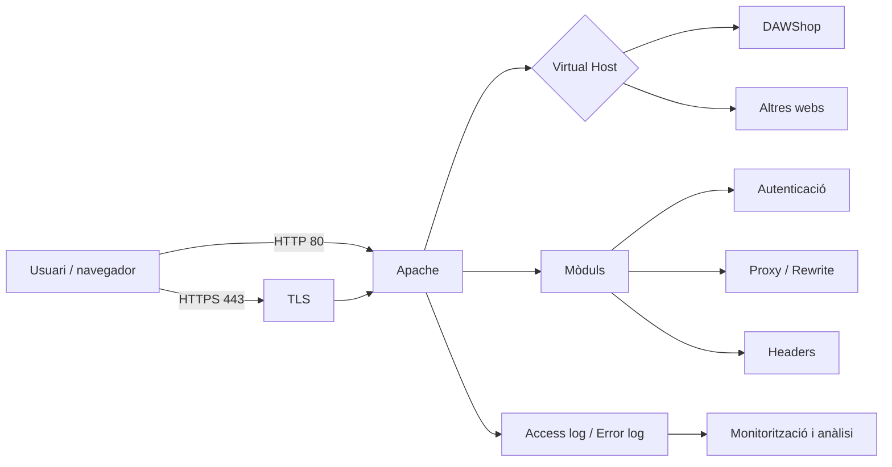
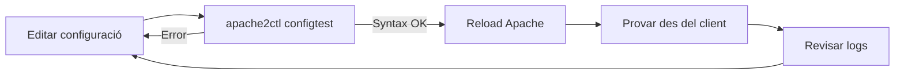

---
hide:
  - navigation
title: "UP2. Configuració i seguretat del servidor web"
description: "Material autosuficient del RA2 sobre paràmetres, mòduls, Virtual Hosts, autenticació, certificats, TLS, logs, Docker i desplegament cloud amb Apache."
---
# UP2. Configuració i seguretat del servidor web

Aquesta unitat desenvolupa el **RA2: implantar aplicacions web en servidors web, avaluant i aplicant criteris de configuració per al seu funcionament segur**.

El fil conductor serà **DAWShop**, una aplicació web que volem publicar en un servidor Ubuntu amb Apache. Al llarg de la unitat passarem d'un Apache instal·lat amb la configuració bàsica a un servidor capaç d'allotjar diferents llocs, protegir recursos, servir HTTPS i generar informació útil per al diagnòstic i la monitorització.

> **Enfocament semipresencial**
>
> El material està pensat perquè es puga seguir de manera autònoma. En cada apartat trobaràs explicacions, exemples reals d'Apache, diagrames, comprovacions i preguntes d'autoavaluació. Els comandaments estan plantejats per a **Ubuntu/Debian amb Apache 2.4**.

## Continguts

1. [Paràmetres del servidor web](01-parametres-servidor.md)
2. [Activació i configuració de mòduls](02-moduls-apache.md)
3. [Creació i configuració de Virtual Hosts](03-virtual-hosts.md)
4. [Autenticació i control d'accés](04-autenticacio-control-acces.md)
5. [Obtenció i instal·lació de certificats digitals](05-certificats-digitals.md)
6. [Seguretat en les comunicacions web](06-seguretat-comunicacions.md)
7. [Logs, monitorització i anàlisi](07-logs-monitoratge.md)
8. [Mòduls d'Apache en Docker](08-moduls-apache-docker.md)
9. [Projecte AWS i CE2.h](09-projecte-aws-ce2h.md)

## Pràctiques i recorregut de treball

Les activitats de la unitat parteixen d'un laboratori amb Ubuntu i Apache,
afegeixen dos llocs virtuals i acaben amb mòduls en Docker. El projecte CE2.h
trasllada després els mateixos principis a una infraestructura AWS. La taula
indica on trobar la teoria necessària i quina evidència mínima s'ha de
conservar.

| Activitat | Producte tècnic | Teoria que cal aplicar | Evidència mínima |
|---|---|---|---|
| UP2.2 | `mod_rewrite` i `.htaccess` per a `/about-us` | [Mòduls d'Apache](02-moduls-apache.md#pràctica-up22-mod_rewrite-en-htaccess) | `apache2ctl -M`, configuració, `configtest` i resposta de la URL |
| UP2.3 | `catadaw1.com` i `catadaw2.com` | [Virtual Hosts](03-virtual-hosts.md#pràctica-up23-catadaw1com-i-catadaw2com) | fitxers dels llocs, `/etc/hosts`, `apache2ctl -S` i una prova per domini |
| UP2.4 | Autenticació Basic amb `.htpasswd` | [Autenticació i control d'accés](04-autenticacio-control-acces.md#pràctica-up24-basic-auth-a-catadaw1com) | mòduls, fitxer de credencials, `401` sense credencials i `200` amb credencials |
| UP2.5 i UP2.6 | HTTPS, redirecció i capçaleres | [Certificats](05-certificats-digitals.md#pràctica-up25-certificat-autofirmat-per-a-catadaw1com) i [comunicacions](06-seguretat-comunicacions.md#pràctica-up25-i-up26-https-i-capçaleres) | certificat/clau, `curl -I`, capçaleres i avís del certificat autofirmat |
| UP2.7 | Gestió i anàlisi de logs | [Logs i monitorització](07-logs-monitoratge.md#pràctica-up27-anàlisi-amb-goaccess) | instal·lació de GoAccess, informe, errors, patrons i recomanacions |
| UP2.8 | Un mòdul d'Apache en Docker | [Apache en Docker](08-moduls-apache-docker.md) | Dockerfile/Compose, mòdul actiu, prova funcional i demostració |
| Projecte CE2.h | Infraestructura d'una aplicació en AWS | [Projecte AWS](09-projecte-aws-ce2h.md) | diagrama, VPC, subxarxes, rutes, grups de seguretat i proves entre capes |

> **Regla d'evidència**
>
> Una captura només demostra allò que es pot llegir en ella. Acompanya cada
> captura amb el comandament o fitxer que s'està comprovant i una frase que
> explique el resultat. No inventes resultats: si una prova encara no s'ha
> executat, deixa-la com a pendent.

## Entorn de laboratori comú

Perquè les activitats siguen reproduïbles, utilitzarem aquestes convencions:

| Element | Valor de laboratori |
|---|---|
| IP de la màquina virtual | `IP_VM` — substitueix-la per la IP real |
| Primer lloc | `catadaw1.com`, document root `/var/www/catadaw1` |
| Segon lloc | `catadaw2.com`, document root `/var/www/catadaw2` |
| Configuració Apache | `/etc/apache2/sites-available/` |
| Mòduls actius | `/etc/apache2/mods-enabled/` |
| Logs | `/var/log/apache2/` |

Quan un exemple use `IP_VM`, no el copies literalment: consulta la IP amb
`ip -br address` i modifica el fitxer `/etc/hosts` del client des del qual
faràs la petició.

## Visió global



## Una idea important abans de començar

Configurar un servidor web no consisteix simplement a "fer que funcione". Un desplegament professional ha de buscar simultàniament:

- **funcionalitat**, perquè l'aplicació siga accessible;
- **seguretat**, reduint superfície d'atac i protegint les comunicacions;
- **mantenibilitat**, amb una configuració clara i comprovable;
- **observabilitat**, perquè els errors i incidents es puguen detectar;
- **rendiment**, evitant configuracions que malgasten recursos.

Al llarg de la unitat aplicarem sempre el mateix cicle de treball:



> **Regla de treball**
>
> Abans de recarregar Apache, executa habitualment:
>
> ```bash
> sudo apache2ctl configtest
> ```
>
> Si la sintaxi és correcta:
>
> ```bash
> sudo systemctl reload apache2
> ```
