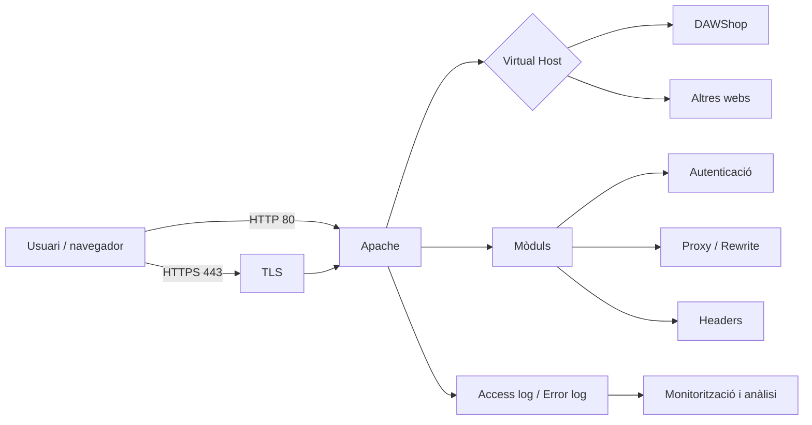
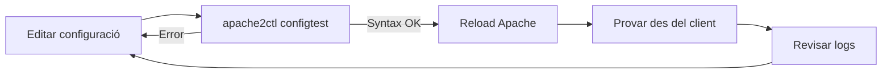

---
hide:
  - navigation
title: "UP2. Configuració i seguretat del servidor web"
description: "Material autosuficient del RA2 sobre paràmetres, mòduls, Virtual Hosts, autenticació, certificats, TLS i logs d'Apache."
---
# UP2. Configuració i seguretat del servidor web

Aquesta unitat desenvolupa el **RA2: implantar aplicacions web en servidors web, avaluant i aplicant criteris de configuració per al seu funcionament segur**.

El fil conductor serà **DAWShop**, una aplicació web que volem publicar en un servidor Ubuntu amb Apache. Al llarg de la unitat passarem d'un Apache instal·lat amb la configuració bàsica a un servidor capaç d'allotjar diferents llocs, protegir recursos, servir HTTPS i generar informació útil per al diagnòstic i la monitorització.

> **Enfocament semipresencial**
>
> El material està pensat perquè es puga seguir de manera autònoma. En cada apartat trobaràs explicacions, exemples reals d'Apache, diagrames, comprovacions i preguntes d'autoavaluació. Els comandaments estan plantejats per a **Ubuntu/Debian amb Apache 2.4**.

## Continguts

1. [Paràmetres del servidor web](01-parametres-servidor.md)
2. [Activació i configuració de mòduls](02-moduls-apache.md)
3. [Creació i configuració de Virtual Hosts](03-virtual-hosts.md)
4. [Autenticació i control d'accés](04-autenticacio-control-acces.md)
5. [Obtenció i instal·lació de certificats digitals](05-certificats-digitals.md)
6. [Seguretat en les comunicacions web](06-seguretat-comunicacions.md)
7. [Logs, monitorització i anàlisi](07-logs-monitoratge.md)

## Visió global



## Una idea important abans de començar

Configurar un servidor web no consisteix simplement a "fer que funcione". Un desplegament professional ha de buscar simultàniament:

- **funcionalitat**, perquè l'aplicació siga accessible;
- **seguretat**, reduint superfície d'atac i protegint les comunicacions;
- **mantenibilitat**, amb una configuració clara i comprovable;
- **observabilitat**, perquè els errors i incidents es puguen detectar;
- **rendiment**, evitant configuracions que malgasten recursos.

Al llarg de la unitat aplicarem sempre el mateix cicle de treball:



> **Regla de treball**
>
> Abans de recarregar Apache, executa habitualment:
>
> ```bash
> sudo apache2ctl configtest
> ```
>
> Si la sintaxi és correcta:
>
> ```bash
> sudo systemctl reload apache2
> ```

