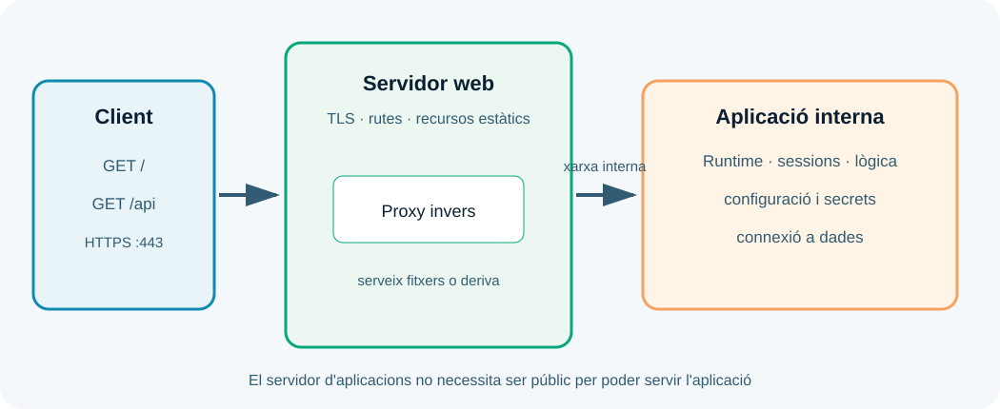

---
hide:
  - navigation
---
# UP3. Administració de servidors d'aplicacions

## Presentació

El servidor web pot servir un fitxer, però una aplicació dinàmica necessita executar codi, gestionar sessions, consultar dades i generar respostes. Aquesta UP estudia el servidor d'aplicacions i la cooperació segura amb el servidor web.

> **Pregunta guia:** com despleguem la lògica d'una aplicació perquè siga segura, observable i capaç de respondre amb estabilitat?

## Dades i objectius

| Element | Referència |
| --- | --- |
| Duració de referència | **15 hores al centre** |
| Resultat d'aprenentatge | **RA3** |
| Pes | **20 %** |
| Producte final | Aplicació dinàmica desplegada i verificada |

Hauràs de descriure serveis, fitxers de configuració i biblioteques, connectar el servidor d'aplicacions amb el servidor web, configurar seguretat, fer proves de rendiment i documentar l'administració.

## 1. El paper del servidor d'aplicacions

El servidor d'aplicacions proporciona el runtime on s'executa la lògica dinàmica. Pot carregar un artefacte, crear processos o workers, gestionar sessions, aplicar dominis de seguretat, obrir connexions a dades i generar contingut.

La forma concreta depén de la plataforma: PHP pot executar-se amb PHP-FPM, una aplicació Python pot usar un servidor WSGI, i una aplicació Java pot desplegar-se en un contenidor o servidor compatible. Els noms canvien, però les preguntes d'administració són les mateixes: què executa, amb quin usuari, amb quina configuració i darrere de quin servidor web?



El servidor web acostuma a ser la frontera pública. El servidor d'aplicacions escolta en una xarxa o port intern i només rep les rutes que necessita. Aquesta separació permet centralitzar TLS, limitar exposició i servir recursos estàtics de manera eficient.

## 2. Components i configuració

Un desplegament dinàmic sol incloure:

- codi font o artefacte empaquetat;
- runtime i biblioteques;
- fitxers de configuració;
- variables d'entorn;
- connexions a bases de dades o APIs;
- gestor del procés;
- servidor web o proxy invers;
- logs i comprovacions de salut.

La configuració ha d'estar separada del codi quan depén de l'entorn. No escrigues contrasenyes en el repositori ni en les imatges. Usa variables d'entorn o un gestor de secrets i documenta només noms i exemples ficticis.

## 3. Cooperar amb el servidor web

Quan el servidor web deriva una petició, ha de saber a quin servei intern enviar-la, quins encapçalaments conservar i com tractar un error o un temps d'espera. La configuració ha de distingir recursos estàtics, rutes dinàmiques, càrrega de fitxers i peticions de salut.

Una errada freqüent és crear un bucle de proxy: el servidor web envia a un nom que torna a resoldre contra ell mateix. Una altra és perdre l'esquema original o l'adreça del client perquè no s'han configurat correctament les capçaleres de proxy. Documenta quines capçaleres utilitza l'aplicació i no confies en una capçalera d'identitat que qualsevol client puga injectar directament.

## 4. Seguretat del servidor d'aplicacions

Executa el servei amb un usuari sense privilegis d'administració i limita l'accés al sistema de fitxers. Protegeix les sessions amb temps d'expiració, cookies adequades i invalidació quan l'usuari tanca sessió. Valida entrades en l'aplicació, limita càrregues i no mostres traces internes al client.

La seguretat també és operativa: fixa versions, actualitza dependències, elimina components que no uses, restringeix els ports i registra errors sense incloure tokens ni dades personals. El servidor d'aplicacions no hauria de ser l'únic lloc on es comprova la identitat: coordina autenticació, autorització i permisos de dades.

## 5. Desplegament d'un artefacte

Un procés reproduïble pot seguir aquestes fases:

1. Construir l'artefacte a partir d'una versió identificada.
2. Instal·lar dependències amb versions controlades.
3. Injectar configuració de l'entorn sense secrets en el codi.
4. Iniciar el procés amb un usuari i límits coneguts.
5. Comprovar la ruta de salut i els logs.
6. Connectar el servidor web i repetir les proves des del punt de vista del client.
7. Registrar la versió desplegada i la manera de recuperar l'anterior.

Evita substituir fitxers directament mentre el servei està en ús si això pot deixar una versió parcial. En entorns més avançats, prepara una nova instància i canvia el trànsit quan les proves siguen correctes.

## 6. Rendiment i diagnòstic

El rendiment no és només el temps de resposta: inclou errors, consum de CPU i memòria, saturació de connexions, temps de consulta i capacitat de recuperar-se. Defineix una prova, una càrrega i un llindar abans de mesurar.

Per diagnosticar, separa: servidor web, procés d'aplicació, base de dades i xarxa. Compara el temps d'una resposta estàtica amb una dinàmica. Revisa si la petició arriba a l'aplicació, si l'aplicació consulta dades i si el retard es concentra en una dependència.

```bash
curl -i http://127.0.0.1:8080/health
curl -w '\nTemps: %{time_total}s\n' -o /dev/null http://127.0.0.1:8080/
```

## Treball semipresencial

Prepara un diagrama, una fitxa de configuració i una matriu de proves. En el laboratori, desplega una aplicació mínima i provoca de forma segura una ruta inexistent o una dependència desconnectada. Explica quina capa ha fallat, quina evidència ho demostra i com recuperaries el servei.

!!! warning "Secrets i dades"
    No inclogues tokens, cadenes de connexió ni dades personals en captures o repositoris. Usa valors ficticis i fitxers locals exclosos per Git.

### Resum de la UP3

El servidor d'aplicacions executa la lògica i gestiona el seu entorn. Un desplegament de qualitat separa la frontera pública de la lògica, protegeix processos i sessions, fixa la configuració, mesura el comportament i deixa una ruta clara de recuperació.
