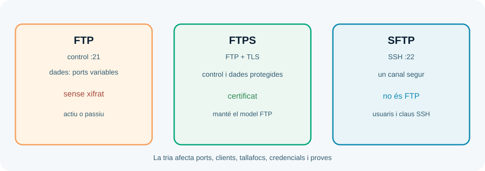

---
hide:
  - navigation
---
# UP4. Instal·lació i administració de servidors de transferència d'arxius

## Presentació

Les aplicacions web necessiten moure artefactes, imatges, còpies o fitxers de configuració. Un servei de transferència ben administrat defineix qui pot entrar, què pot fer, per quina xarxa i amb quin protocol.

> **Pregunta guia:** com transferim arxius sense donar més accés del necessari i com comprovem que el servei està disponible?

## Dades i objectius

| Element | Referència |
| --- | --- |
| Duració de referència | **14 hores al centre** |
| Resultat d'aprenentatge | **RA4** |
| Pes | **20 %** |
| Producte final | Servei FTP/SFTP amb usuaris, permisos i proves |

Hauràs de configurar usuaris i grups, distingir modes actiu i passiu, utilitzar clients de terminal i gràfics, aplicar transferència segura i documentar el servei.

## 1. FTP, FTPS i SFTP

FTP és un protocol de transferència amb un canal de control i un o més canals de dades. El mode actiu i el passiu determinen qui inicia el canal de dades. FTPS és FTP protegit amb TLS. SFTP és un protocol de transferència que funciona sobre SSH; no és simplement «FTP amb una S». Confondre'ls porta a configurar ports i clients incorrectes.

Per a un desplegament nou, SFTP o FTPS solen ser preferibles a FTP sense xifrat perquè protegeixen credencials i contingut en trànsit. La decisió també depén de la compatibilitat amb clients, el tallafocs i el servei que ja existisca.

## 2. Usuaris, grups, permisos i quotes

Defineix els accessos a partir de rols: publicador, lector, operador o servei automatitzat. Cada compte ha de tenir només el directori i les operacions necessàries. Evita comptes compartits perquè dificulten la traçabilitat.

Els permisos del sistema de fitxers i els permisos del servidor són capes diferents. Un usuari pot autenticar-se correctament i, tanmateix, no tenir dret a llegir o escriure una ruta. Prova lectura, escriptura, creació, eliminació i canvi de directori de manera controlada.

Una quota limita espai o nombre de fitxers. És útil per impedir que un compte o un procés ompliga el disc. Documenta el límit, el comportament quan s'assoleix i qui pot revisar l'ús.

## 3. Modes actiu i passiu

En mode actiu, el servidor inicia la connexió de dades cap al client. En mode passiu, el client inicia aquesta connexió cap a un port que el servidor anuncia. Els tallafocs i NAT fan que el mode passiu siga habitual en molts entorns, però necessita un rang de ports ben definit.

Quan una transferència falla, no assumes que és la credencial: comprova autenticació, canal de control, canal de dades, rang de ports, permisos i ruta. Un client gràfic pot amagar detalls; repeteix sempre la prova amb un client de terminal i conserva el log.

## 4. Servei segur i integració amb el web

Protegeix el servei amb TLS o SFTP, desactiva comptes innecessaris, limita xarxes, aplica polítiques de contrasenya o claus i registra connexions. La clau privada ha de quedar fora del repositori i amb permisos restrictius.

En el desplegament web, el servei de transferència pot rebre un artefacte, una imatge o contingut estàtic. No dones a l'usuari de transferència accés d'administració del servidor. Separa directoris de recepció, validació i publicació, especialment si el fitxer serà executat o servit directament.

## 5. Proves i disponibilitat

Una bateria de proves ha d'incloure connexió permesa, connexió rebutjada, autenticació incorrecta, lectura autoritzada, escriptura autoritzada, operació no autoritzada, transferència d'un fitxer de prova i recuperació després de reiniciar el servei.

Registra client, protocol, port, usuari fictici, ruta, mida, resultat i incidència. Comprova que el servei no expose llistats o directoris més amplis dels necessaris.

## Treball semipresencial

Construeix una matriu de permisos per a tres rols, compara FTP, FTPS i SFTP i prepara una prova de transferència local. Documenta el problema més probable si el login funciona però la transferència queda bloquejada.

!!! warning "Dades i credencials"
    Usa comptes de laboratori i fitxers ficticis. No transferisques dades personals ni credencials reals, i no publiques un servei de transferència en Internet sense autorització.

### Resum de la UP4

Administrar transferència d'arxius és controlar protocol, canals, usuaris, permisos, quotes, seguretat i proves. La disponibilitat no significa només que el procés estiga actiu: cal que els clients autoritzats puguen completar l'operació esperada.
