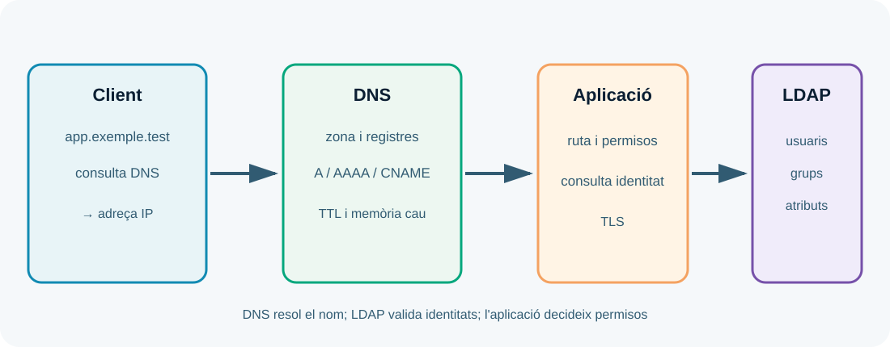

---
hide:
  - navigation
---
# UP5. Serveis de xarxa implicats en el desplegament

## Presentació

Una aplicació pot estar perfectament configurada i continuar sent inaccessible si el nom no resol, el directori no autentica o un servei de xarxa apunta a l'entorn equivocat. Aquesta UP relaciona DNS, resolució de noms, serveis de directori i autenticació centralitzada amb el desplegament web.

> **Pregunta guia:** com fem que els serveis de xarxa troben l'aplicació i validen els usuaris correctament?

## Dades i objectius

| Element | Referència |
| --- | --- |
| Duració de referència | **11 hores al centre** |
| Resultat d'aprenentatge | **RA5** |
| Pes | **15 %** |
| Producte final | Configuració DNS/directori documentada i verificada |

Hauràs de descriure la jerarquia de noms, identificar registres, adaptar un servidor DNS, entendre l'estructura d'un directori, configurar OpenLDAP i relacionar-lo amb l'autenticació d'una aplicació.

## 1. DNS i noms jeràrquics

DNS és un sistema distribuït i jeràrquic. Un client consulta un resolutor; aquest pot usar memòria cau o preguntar servidors autoritatius. La resposta conté un registre i un temps de vida (TTL), no necessàriament una connexió directa amb el servidor web.



Els registres més habituals són:

| Registre | Funció | Exemple de laboratori |
| --- | --- | --- |
| A | Nom a adreça IPv4. | `app.exemple.test → 192.0.2.20` |
| AAAA | Nom a adreça IPv6. | `app.exemple.test → 2001:db8::20` |
| CNAME | Àlies cap a un altre nom. | `www → app.exemple.test` |
| MX | Servidors de correu del domini. | No necessari per publicar una web. |
| TXT | Informació textual o verificacions. | Depén del servei que la demane. |

No uses un CNAME on el servei necessita una adreça literal, i no afegis registres perquè sí. Documenta zona, servidor autoritatiu, TTL i data de canvi.

## 2. Procés de resolució i diagnòstic

Quan el navegador no troba una aplicació, separa aquestes preguntes:

1. El client usa el resolutor correcte?
2. El nom existeix en la zona esperada?
3. La resposta és autoritativa o ve de memòria cau?
4. L'adreça apunta a l'entorn correcte?
5. El servei escolta en l'adreça i el port corresponents?
6. El host virtual i el certificat coincideixen amb el nom?

Eines com `getent hosts`, `dig` o `nslookup` ajuden a observar la resolució. Un canvi DNS pot tardar a veure's per la memòria cau; el TTL no força tots els clients a oblidar una resposta immediatament.

## 3. Serveis de directori

Un directori organitza identitats i atributs en una estructura jeràrquica. LDAP usa una base distingida, entrades, atributs i esquemes. Una entrada pot representar una persona, un grup o un servei. El directori no és necessàriament una base de dades de l'aplicació: la seua funció és proporcionar identitat i informació organitzada.

Una estructura simplificada podria ser:

```text
dc=exemple,dc=test
├── ou=persones
│   ├── uid=aina
│   └── uid=bruno
└── ou=grups
    └── cn=publicadors
```

La configuració ha de definir base, servidor, port, esquema, usuari de consulta, filtres i atributs que identifiquen la persona. No guardes una contrasenya d'administració en el codi ni uses el compte de directori amb més privilegis dels necessaris.

## 4. Autenticació centralitzada

Autenticar contra LDAP implica cercar l'usuari, comprovar la credencial i recuperar grups o atributs. L'aplicació ha de convertir aquests grups en permisos propis. Que una persona existisca al directori no significa que tinga accés a totes les funcions de l'aplicació.

Protegeix la comunicació amb TLS quan les credencials travessen la xarxa. Valida el certificat, limita el compte de cerca, aplica temps d'espera i registra errors sense escriure contrasenyes. Prepara un pla de contingència si el directori no respon: denegar amb seguretat és preferible a donar accés per error.

## 5. Contenidors i serveis de xarxa

En un laboratori pots executar DNS i LDAP en contenidors. Això facilita reproduir versions i aïllar dades, però obliga a documentar xarxes, volums, ports, persistència i ordre d'arrencada. Un contenidor eliminat pot perdre el directori si no hi ha un volum.

## Treball semipresencial

Dibuixa el flux DNS–servidor web–aplicació–directori, prepara una taula de registres i descriu tres proves: resolució correcta, nom que no existeix i autenticació amb usuari sense permisos. Explica quina capa falla en cada cas.

!!! warning "Entorns autoritzats"
    No canvies DNS d'un domini real ni proves autenticació contra directoris que no siguen teus. Utilitza zones i comptes de laboratori.

### Resum de la UP5

DNS localitza serveis; el directori organitza identitats; l'aplicació transforma identitats en permisos. El desplegament és fiable quan noms, adreces, ports, certificats, filtres i proves apunten al mateix entorn i estan documentats.
