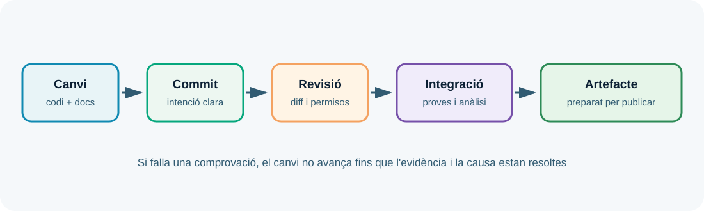

---
hide:
  - navigation
---
# UP6. Documentació, control de versions i integració contínua

## Presentació

Un servei desplegat però no documentat depén de la memòria de qui el va configurar. En aquesta UP aprendràs a convertir codi, configuració, proves i decisions en un historial consultable i en una documentació que una altra persona puga mantindre.

> **Pregunta guia:** com fem que un canvi siga explicable, revisable i repetible?

## Dades i objectius

| Element | Referència |
| --- | --- |
| Duració de referència | **11 hores al centre** |
| Resultat d'aprenentatge | **RA6** |
| Pes | **15 %** |
| Producte final | Repositori amb documentació i comprovació automàtica |

Hauràs d'identificar eines de documentació, utilitzar formats i plantilles, treballar amb Git i GitHub, protegir el repositori i entendre el paper de la integració contínua.

## 1. Documentar per a qui mantindrà el servei

La documentació tècnica ha de respondre preguntes concretes: què fa el projecte, quins requisits té, com s'instal·la, com s'executa, com es prova, quines variables necessita, com es publica i què fer quan falla.

Un README inicial pot incloure:

- objectiu i límits del projecte;
- arquitectura i dependències;
- prerequisits i versions;
- instal·lació i configuració;
- ordres de desenvolupament i desplegament;
- proves i resultat esperat;
- incidències conegudes i recuperació;
- fonts, llicència i contacte tècnic.

Documenta el que és estable i marca el que depén de l'entorn. Una captura sola es queda obsoleta ràpidament; un procediment amb versions i resultats es pot revisar.

## 2. Formats i generadors

Markdown és adequat per a README, guies i decisions curtes. Els generadors de documentació poden convertir comentaris, tipus i estructures del codi en referència navegable. No substitueixen l'explicació del sistema: generen detalls del component, però no saben sempre per què s'ha triat una arquitectura.

Les plantilles ajuden a mantindre coherència. Una incidència documentada hauria d'incloure data, impacte, símptoma, hipòtesi, proves, causa, correcció i prevenció. Una decisió d'arquitectura hauria d'incloure context, opcions, decisió i conseqüències.

## 3. Git com a historial de decisions

Git registra instantànies del projecte. Un commit ha de representar un canvi coherent i tenir un missatge que explique la intenció. La seqüència habitual és:

```bash
git status
git diff
git add README.md
git commit -m "Documenta la comprovació del desplegament"
git log --oneline
```

No uses `git add .` sense revisar què inclous. El repositori no ha d'emmagatzemar `.env`, claus privades, contrasenyes, fitxers temporals ni logs amb dades personals. El `.gitignore` redueix errors, però cal revisar el diff abans de publicar.

## 4. Branques i repositoris remots

Una branca permet treballar un canvi sense alterar immediatament la versió principal. En un equip, una proposta de canvi ha d'explicar objectiu, impacte i proves. El repositori remot és una còpia col·laborativa, no un lloc per guardar secrets.

Protegeix la branca principal, revisa canvis i assigna permisos segons la responsabilitat. Si un secret ha arribat al repositori, eliminar-lo de l'últim fitxer no és suficient: cal revocar-lo o substituir-lo i revisar l'historial.

## 5. Integració contínua

La integració contínua executa comprovacions automàtiques quan hi ha un canvi: instal·lar dependències, analitzar el codi, executar proves, construir un artefacte o validar documentació.



Un pipeline útil és ràpid, repetible i informatiu. Ha de fallar amb un missatge accionable, conservar els logs necessaris i no imprimir secrets. No confongues «el pipeline ha passat» amb «el servei és correcte»: la integració verifica un conjunt de controls, no totes les propietats del sistema.

## 6. Accessibilitat i seguretat

La documentació ha de ser llegible amb diferents dispositius i tecnologies d'assistència: títols jeràrquics, enllaços descriptius, taules senzilles, text alternatiu en imatges i contrast suficient. No uses una captura com a única explicació d'una ordre o d'un valor.

En el control de versions, aplica mínim privilegi, autenticació multifactor quan estiga disponible, revisió de dependències i protecció de secrets. Separa el que cal compartir del que només necessita el servei en temps d'execució.

## Treball semipresencial

Transforma una pràctica de desplegament en una guia reproduïble. Crea un README, registra els canvis amb commits petits, afegeix un `.gitignore`, revisa el diff i dissenya una comprovació automàtica que detecte almenys un error real.

### Resum de la UP6

Documentar és fer transferible el coneixement. Git conserva la història, GitHub facilita la col·laboració i la integració contínua automatitza controls. La qualitat depén que els tres elements siguen reproduïbles, segurs i comprensibles.
