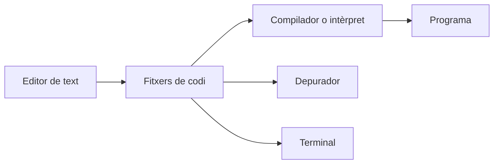
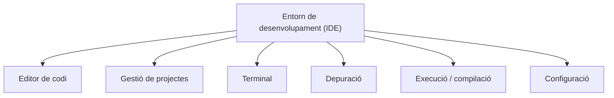
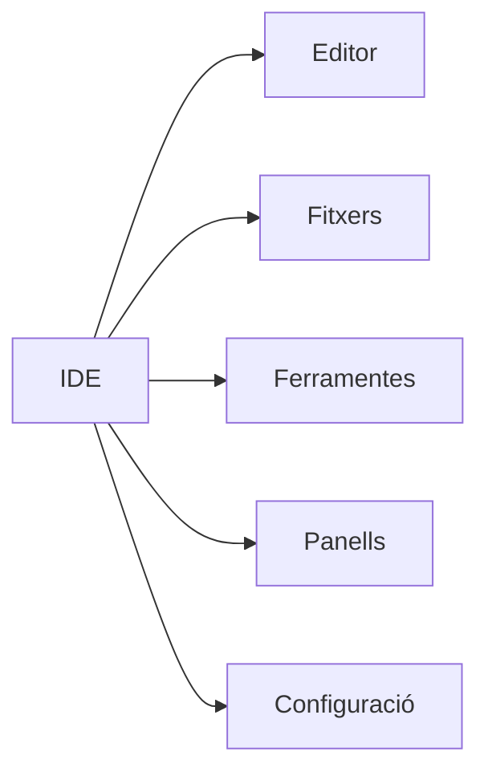
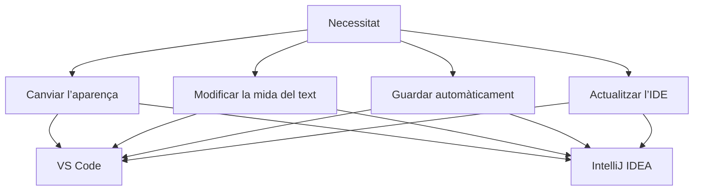

---
hide:
  - navigation
---
# 1. L’IDE com a entorn de treball

Quan desenvolupem programari podem utilitzar moltes ferramentes diferents: editors de text, compiladors, terminals, depuradors i gestors de projectes.

Un **entorn integrat de desenvolupament** o **IDE** (*Integrated Development Environment*) agrupa moltes d’aquestes ferramentes en una mateixa aplicació.

!!! info "IDE"
    Un **IDE** és una aplicació que proporciona ferramentes per facilitar el desenvolupament de programari des d’un mateix entorn de treball.

Alguns exemples habituals són:

- **Visual Studio Code**
- **IntelliJ IDEA**
- Visual Studio
- Eclipse
- NetBeans
- Android Studio

En aquest curs treballarem principalment amb **Visual Studio Code** i **IntelliJ IDEA**.

---

## 1.1. Per què utilitzem un IDE?

En teoria podríem desenvolupar un programa utilitzant diferents ferramentes independents:

Un IDE intenta reunir aquestes ferramentes dins d’una mateixa interfície:

Això permet que el desenvolupador puga realitzar moltes tasques sense canviar constantment d’aplicació.

!!! example "Exemple"
    Des de Visual Studio Code podem editar fitxers, navegar entre carpetes, utilitzar un terminal, buscar informació dins del projecte i configurar el nostre entorn des de la mateixa aplicació.

---

## 1.2. Les parts principals d’un IDE

Encara que cada IDE té una interfície diferent, molts comparteixen una estructura semblant.

### Editor

És la zona principal on escrivim i modifiquem els fitxers.

### Explorador del projecte

Permet navegar per les carpetes i fitxers que formen el projecte.

### Barra d’activitats o ferramentes

Dona accés a diferents funcionalitats de l’entorn.

### Panells auxiliars

Poden mostrar informació com:

- terminal;
- problemes;
- resultats de cerques;
- eixida de processos.

### Configuració

Permet modificar el comportament i l’aparença de l’entorn.

!!! note "Imatge recomanada"
    Afegeix una captura de Visual Studio Code amb fletxes que indiquen la barra d’activitats, l’explorador, l’editor, el panell inferior i la barra d’estat. Una captura pròpia evita dependre d’imatges externes.

---

## 1.3. No tots els IDE són iguals

Visual Studio Code i IntelliJ IDEA poden utilitzar-se per desenvolupar programari, però tenen filosofies diferents.

### Visual Studio Code

Visual Studio Code és un editor molt configurable que pot ampliar les seues funcionalitats segons les necessitats del desenvolupador.

Destaca per:

- una interfície relativament lleugera;
- gran capacitat de personalització;
- compatibilitat amb molts llenguatges;
- gran quantitat de funcionalitats que poden incorporar-se progressivament.

### IntelliJ IDEA

IntelliJ IDEA és un entorn de desenvolupament especialment orientat a projectes de programari i proporciona moltes ferramentes integrades.

Destaca per:

- una integració molt completa de ferramentes;
- gestió avançada de projectes;
- assistència al desenvolupament;
- moltes funcionalitats disponibles directament des de l’IDE.

!!! question "Quin és millor?"
    No existeix un IDE perfecte per a totes les situacions. L’elecció dependrà del llenguatge, del projecte, de les ferramentes necessàries i de les preferències del desenvolupador.

---

## 1.4. Conceptes comuns, interfícies diferents

Aprendre un IDE **no consisteix a memoritzar la posició dels botons**.

Les aplicacions evolucionen, les interfícies canvien i cada IDE organitza les seues opcions d’una manera diferent. El més important és reconéixer els conceptes.

Per exemple:

Dos IDE poden oferir la mateixa funcionalitat però:

- utilitzar noms diferents;
- situar-la en menús diferents;
- oferir opcions diferents.

Per això és important aprendre a **buscar i interpretar configuracions**, no simplement memoritzar passos.

## Resum

Un **IDE** integra diferents ferramentes necessàries durant el desenvolupament de programari. Visual Studio Code i IntelliJ IDEA comparteixen conceptes, però difereixen en el grau d’integració i en la manera d’organitzar les opcions.

!!! success "Idea clau"
    Aprendre a utilitzar un IDE no significa memoritzar els seus menús. Significa entendre què necessitem i saber configurar la ferramenta perquè s’adapte al nostre treball.

[Següent: instal·lació](02-instal·lacio.md) · [Índex de la UP1](index.md)
