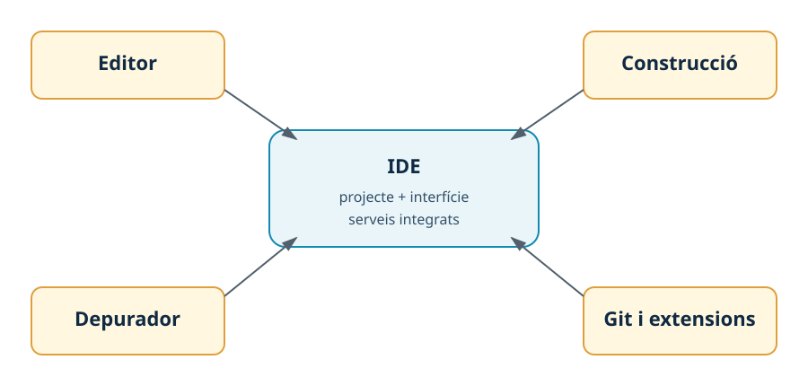

---
hide:
  - navigation
---
# 1. L’IDE com a entorn de treball

## Introducció

Un editor permet escriure fitxers de text. Un **entorn integrat de desenvolupament** o **IDE** (*Integrated Development Environment*) afegeix serveis que ajuden a comprendre, construir, executar i mantindre un projecte. La diferència no és només visual: un IDE coneix l’estructura del projecte i pot coordinar el compilador, el gestor de dependències, el depurador i el control de versions.

En aquesta UP compararem **Visual Studio Code (VS Code)**, lleuger i extensible, amb **IntelliJ IDEA**, orientat a projectes Java i a una anàlisi profunda del codi.

## Components fonamentals

*Figura. Un IDE coordina serveis del projecte i ferramentes externes; no les substitueix necessàriament.*

| Component | Funció | VS Code | IntelliJ IDEA |
| --- | --- | --- | --- |
| Editor i navegació | Escriure, buscar símbols i entendre fitxers relacionats. | Nucli lleuger amb extensions. | Anàlisi profunda integrada. |
| Model del projecte | Conéixer carpetes, mòduls, dependències i versions. | Carpeta oberta o projecte Maven/Gradle. | Projecte i mòduls amb suport Maven/Gradle. |
| Construcció | Coordinar compilació, proves i empaquetament. | Tasques, terminal o extensió. | Maven/Gradle i configuracions d’execució. |
| Depuració | Executar pas a pas, consultar variables i punts d’interrupció. | Adaptador o extensió de llenguatge. | Depurador Java integrat. |
| Extensions o plugins | Afegir suport per a llenguatges i serveis. | Extensions del Marketplace. | Plugins del repositori de JetBrains. |
| Control de versions | Consultar i registrar canvis. | Git i extensió de control de versions. | Git integrat en l’IDE. |

Un IDE també pot incloure terminal, explorador de dependències, formatador, analitzadors estàtics i eines de refactorització. La responsabilitat final continua sent de la persona desenvolupadora: ha d’entendre què executa l’IDE i poder repetir les ordres fora de la interfície.

## Llicències i edicions

Els termes **lliure**, **de codi obert**, **gratuït** i **propietari** descriuen aspectes diferents. La llicència del producte no determina automàticament la llicència de cada extensió o plugin. En un entorn professional cal registrar la font oficial, la versió i la modalitat d’ús autoritzada.

| Producte | Característica rellevant | Què cal documentar |
| --- | --- | --- |
| VS Code | Editor distribuït per Microsoft amb un ecosistema extensible; també existeixen distribucions basades en el mateix codi. | Distribució instal·lada, versió, font, llicència i extensions. |
| IntelliJ IDEA | IDE de JetBrains amb funcionalitats bàsiques i funcionalitats avançades segons l’edició o la llicència disponible. | Edició o modalitat activa, versió, plugins i autorització d’ús. |

No instal·les versions modificades d’origen dubtós ni copies claus de llicència. Si el centre proporciona una llicència educativa, indica-la en la documentació sense incloure cap credencial.

## Com triar un IDE

La tria depén del problema. Per a un projecte Java gran poden pesar la navegació entre classes, les inspeccions i la refactorització. Per a una combinació de llenguatges, scripts i configuracions pot resultar útil la flexibilitat de VS Code. En tots dos casos cal valorar el JDK, Maven o Gradle, el depurador, Git, el consum de recursos, les actualitzacions i la facilitat de reproducció.

Una comparació professional utilitza evidències: una versió detectada, una compilació correcta, una tasca executada o una incidència recuperada. No és suficient afirmar que un IDE és «més complet».

!!! question "Comprovació"
    Si VS Code no reconeix una classe Java, quines tres peces comprovaries abans de canviar d’IDE? Una resposta raonable inclou el JDK, el projecte o gestor de dependències i les extensions de Java.

## Resum

Un IDE integra editor, model de projecte, construcció, execució, depuració i extensions. VS Code prioritza l’extensibilitat; IntelliJ IDEA ofereix una experiència especialment integrada per a Java. La comparació ha d’incloure funcionalitat, llicència, recursos i possibilitat de repetir la configuració.

[Següent: instal·lació](02-instal·lacio.md) · [Índex de la UP1](index.md)
