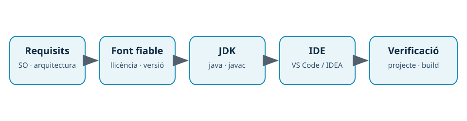

---
hide:
  - navigation
---
# 2. Instal·lació i verificació

## Introducció

Instal·lar un IDE no és només executar un instal·lador. Cal preparar els prerequisits, triar una font fiable, conéixer la llicència, confirmar l’arquitectura del sistema i verificar que el projecte pot compilar. Una instal·lació professional queda descrita perquè una altra persona puga repetir-la.

En el laboratori treballarem amb VS Code i IntelliJ IDEA i utilitzarem **Java amb un JDK LTS**. La versió concreta del JDK i de cada IDE serà la que haja fixat el centre o la imatge de laboratori; no s’ha d’assumir que tots els equips tenen la mateixa.

## Prerequisits i ordre de preparació



*Figura. La verificació del sistema i del JDK precedeix la configuració del projecte.*

Abans d’instal·lar:

1. Identifica el sistema operatiu, l’arquitectura i els permisos disponibles.
2. Descarrega el paquet des del lloc oficial o des del repositori autoritzat pel centre.
3. Consulta l’edició, la llicència i els requisits.
4. Instal·la o selecciona el JDK i anota el seu camí.
5. Instal·la l’IDE i comprova que s’obri sense errors.
6. Obri un projecte mínim i construeix-lo; aquesta és la verificació funcional.

El JDK inclou el compilador `javac`, la màquina virtual `java` i ferramentes de desenvolupament. Un IDE pot detectar diversos JDK, però l’elecció de l’IDE i la del gestor de construcció han de coincidir amb el projecte.

## Verificació des del terminal

En un terminal nou, executa ordres de consulta com aquestes:

```bash
java --version
javac --version
mvn --version
```

La primera línia comprova el runtime, la segona el compilador i la tercera Maven, si el projecte l’utilitza. Si `java` funciona però `javac` no existeix, probablement només hi ha un runtime instal·lat o el `PATH` no està configurat per al JDK.

Un projecte Java mínim pot tindre aquesta estructura:

```text
salut-java/
├── pom.xml
└── src/main/java/ca/exemple/App.java
```

```java title="src/main/java/ca/exemple/App.java"
package ca.exemple;

public class App {
    public static void main(String[] args) {
        System.out.println("Entorn verificat");
    }
}
```

Construeix-lo amb:

```bash
mvn clean package
java -cp target/classes ca.exemple.App
```

`mvn clean` elimina artefactes anteriors del projecte. Usa’l només dins del projecte de pràctiques, perquè pot esborrar el directori `target/` i els resultats que hi haja guardats.

## Verificació dins de cada IDE

En VS Code, obri la carpeta del projecte, comprova la versió en la informació de l’aplicació i revisa quin JDK mostra el paquet d’extensions de Java. En IntelliJ IDEA, importa el projecte com a Maven o Gradle, revisa el **Project SDK** i comprova el perfil de construcció. En tots dos casos:

- el projecte es reconeix sense errors de dependències;
- l’editor mostra la classe i els imports correctament;
- la construcció genera l’artefacte esperat;
- l’execució mostra `Entorn verificat`;
- la versió, el JDK i qualsevol incidència queden anotats.

## Errors habituals

| Símptoma | Causa probable | Comprovació |
| --- | --- | --- |
| `java` no es troba | `PATH` incorrecte o JDK absent. | `command -v java` i `java --version`. |
| `javac` no es troba | Només s’ha instal·lat un JRE/runtime. | `javac --version` i camí del JDK. |
| Imports en roig | Projecte no importat o dependències no resoltes. | Reimportar Maven/Gradle i revisar el gestor. |
| La construcció funciona al terminal però no a l’IDE | L’IDE usa un altre JDK. | Comparar el JDK del terminal amb el del projecte. |
| No es pot instal·lar el producte | Permisos o paquet incompatible. | Arquitectura, permisos i font de descàrrega. |

## Resum

Una instal·lació fiable combina font oficial, llicència documentada, JDK coherent i una prova funcional. La versió que mostra l’IDE no és suficient: cal demostrar que un projecte compila i s’executa.

[Anterior: què és un IDE](01-entorn.md) · [Següent: mòduls](03-moduls.md) · [Índex](index.md)
