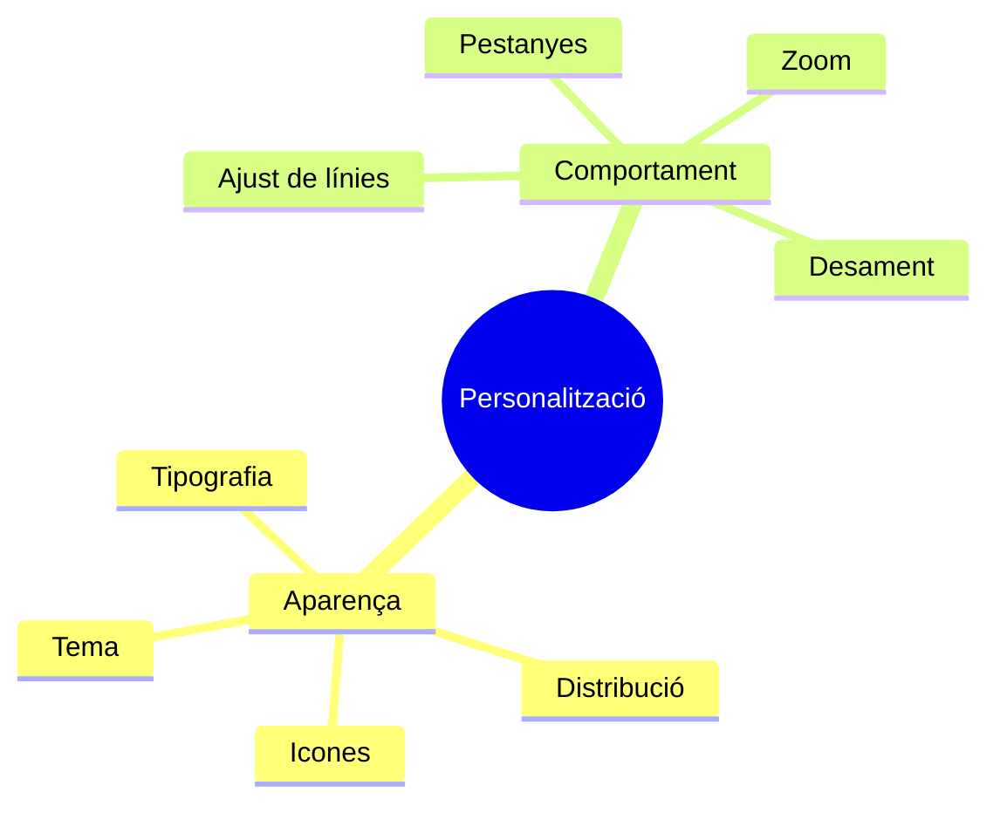
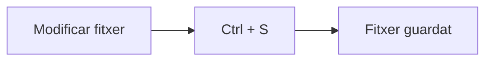
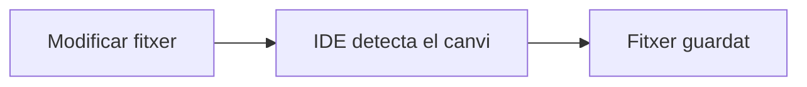
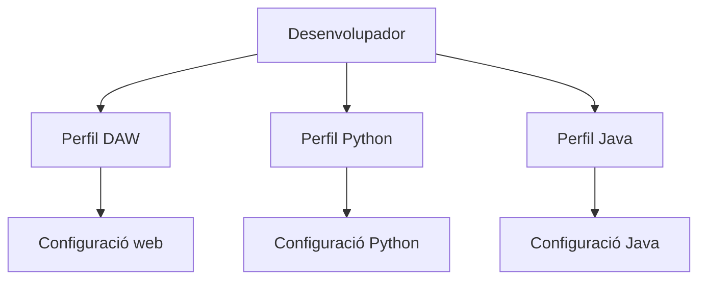
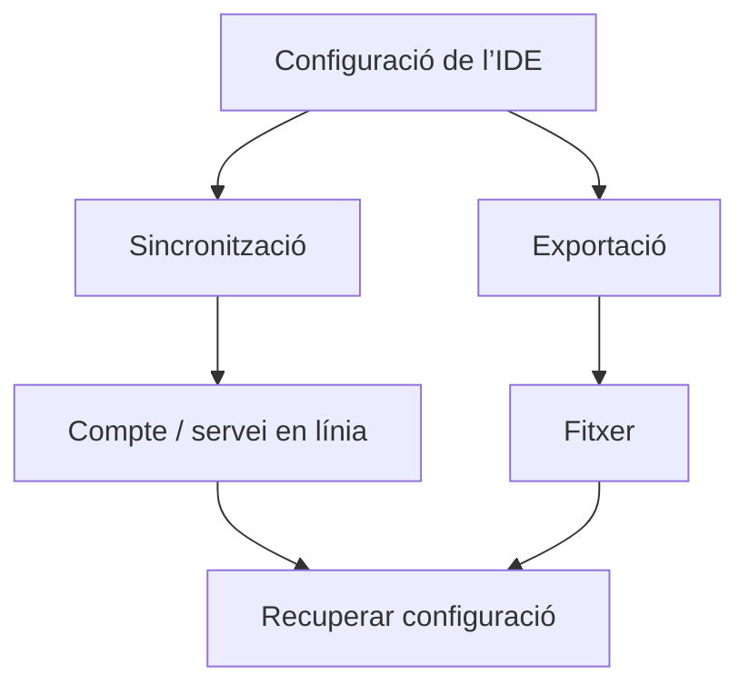

---
hide:
  - navigation
---
# 4. Personalització i automatització

Cada desenvolupador passa moltes hores davant de l’editor. Per això els IDE permeten adaptar l’entorn a les preferències de cada persona.

En aquest bloc distingirem entre modificar **com veiem l’entorn**, configurar **com es comporta** i automatitzar accions senzilles.

---

## 4.1. Personalitzar l’entorn

Podem distingir dos grans tipus de personalització:



La personalització modifica l’entorn de treball, però no modifica el programa que estem desenvolupant.

---

## 4.2. Aparença

Entre altres coses podem configurar:

- tema clar o fosc;
- colors de la interfície;
- icones;
- mida de la font;
- tipus de lletra;
- posició dels diferents panells.

### Tema

Els IDE solen permetre utilitzar diferents temes visuals:

- tema clar;
- tema fosc;
- temes d’alt contrast.

!!! tip
    No existeix un tema universalment millor. L’important és disposar d’un entorn còmode i amb suficient contrast per poder treballar durant períodes prolongats.

!!! note "Imatge recomanada"
    Mostra dues captures menudes del mateix editor, una amb tema clar i una amb tema fosc. Utilitza el mateix fitxer en les dues captures perquè quede clar que només canvia l’aparença.

### Mida de la font i zoom

La mida adequada del text pot dependre de:

- la resolució de la pantalla;
- la distància a la pantalla;
- el dispositiu utilitzat;
- les preferències de l’usuari.

Molts editors permeten modificar-la temporalment mitjançant una combinació com **Ctrl + roda del ratolí**.

Aquesta opció resulta especialment útil quan:

- compartim pantalla;
- utilitzem un projector;
- canviem de monitor;
- necessitem ampliar temporalment el text.

### Distribució de la interfície

Els diferents elements de la interfície també poden reorganitzar-se. Per exemple, podem modificar:

- la posició de la barra lateral;
- la visibilitat del minimapa;
- els panells inferiors;
- les barres de ferramentes.

```text
┌───────────┬───────────────────────────────────┐
│           │                                   │
│ Explorador│              Editor               │
│           │                                   │
│           │                                   │
├───────────┴───────────────────────────────────┤
│                  Terminal                     │
└───────────────────────────────────────────────┘
```

L’objectiu és aprofitar millor l’espai disponible.

---

## 4.3. Configurar el comportament de l’editor

La personalització no afecta només l’aparença. També podem modificar **com es comporta l’editor mentre treballem**.

### Ajust de línies

Una línia de text pot ser més llarga que l’espai visible de l’editor.

Sense ajust de línies:

```text
Aquesta és una línia molt llarga que continua fora de la zona visible de l’editor ------------------->
```

Amb **Word Wrap**:

```text
Aquesta és una línia molt llarga que
continua automàticament en la línia
visual següent.
```

!!! note
    L’ajust de línies modifica la manera de **visualitzar** el contingut. No necessàriament introdueix un salt de línia real dins del fitxer.

### Pestanyes

Quan obrim diversos fitxers, normalment apareixen en forma de pestanyes.

Els IDE permeten decidir aspectes com:

- quantes pestanyes mostrar;
- què ocorre quan obrim molts fitxers;
- si una pestanya es reutilitza;
- com s’organitzen els editors oberts.

Aquestes configuracions poden facilitar el treball amb projectes que contenen molts fitxers.

---

## 4.4. Automatitzar accions quotidianes

Una de les funcions d’un entorn de desenvolupament és reduir tasques repetitives.

!!! info "Automatització"
    Automatitzar significa configurar una acció perquè el sistema la realitze per nosaltres quan es complisca una determinada condició.

Un exemple molt senzill és el desament d’un fitxer.

### Sense automatització



### Amb desament automàtic



### Desament automàtic

Normalment guardem un fitxer manualment amb **Ctrl + S**, però molts editors poden guardar els canvis automàticament.

Segons l’IDE, podem trobar comportaments com:

- guardar després d’un període de temps;
- guardar quan canviem de finestra;
- guardar quan l’editor perd el focus.

No sempre existeix una configuració millor que les altres. La decisió dependrà de la manera de treballar de cada desenvolupador.

### Automatitzar no significa programar

En aquest moment del curs treballarem únicament amb automatitzacions senzilles del propi IDE. Més endavant podrem trobar automatitzacions relacionades amb la compilació, les proves, el format del codi, la construcció de projectes o el desplegament.

!!! warning
    Primer aprendrem a programar i, quan aparega una necessitat real, incorporarem les ferramentes que ens ajuden a resoldre-la.

---

## 4.5. Perfils de configuració

Imaginem que utilitzem el mateix editor per a diferents tipus de treball:



No sempre voldrem utilitzar exactament la mateixa configuració.

!!! info "Perfil"
    Un perfil és un conjunt de configuracions de l’entorn que podem guardar i recuperar.

Un perfil pot conservar, depenent de l’IDE:

- configuracions;
- preferències;
- dreceres;
- elements de la interfície;
- altres característiques de l’entorn.

### Per què són útils?

Els perfils permeten:

- **separar entorns** segons el tipus de projecte;
- **provar configuracions** sense modificar l’entorn habitual;
- **recuperar l’entorn** que ja havíem preparat;
- **treballar en diferents ordinadors** amb configuracions semblants.

---

## 4.6. Sincronitzar o exportar la configuració

Preparar un entorn de desenvolupament pot requerir temps. Si canviem d’ordinador, seria poc pràctic haver de recordar totes les configuracions manualment.

Hi ha dues estratègies habituals:



### Sincronització

La configuració s’associa normalment a un compte i pot recuperar-se en un altre dispositiu.

**Avantatge:** comoditat.

**Consideració:** necessita utilitzar un compte.

### Exportació

La configuració es guarda en un fitxer que podem conservar o traslladar.

**Avantatge:** no necessita vincular necessàriament un compte.

**Consideració:** nosaltres hem de guardar i gestionar el fitxer.

!!! example "En classe"
    Crearem un perfil anomenat **DAW** i comprovarem que podem abandonar temporalment el perfil i tornar posteriorment a la nostra configuració.

## Resum

Personalitzar un IDE permet adaptar-ne l’aparença i el comportament. Els perfils i les opcions de sincronització o exportació ajuden a conservar el treball, mentre que les automatitzacions redueixen tasques repetitives.

!!! success "Idea clau"
    Una bona configuració no és la mateixa per a tothom: és la que podem explicar, utilitzar còmodament i recuperar quan la necessitem.

[Anterior: mòduls](03-moduls.md) · [Següent: actualitzacions](05-actualitzacions.md) · [Índex](index.md)
