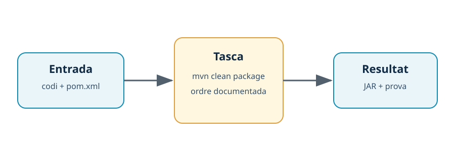

---
hide:
  - navigation
---
# 4. Personalització i automatització

## Introducció

Personalitzar un IDE té sentit quan redueix errors o fa més ràpid un flux repetitiu. Canviar colors és una preferència; configurar el format, l’ús del JDK o una tasca de construcció és una decisió de treball que convé poder compartir.



*Figura. Una tasca documentada converteix una seqüència de passos en una acció verificable.*

## Configuració per capes

VS Code combina configuració d’usuari, configuració de l’espai de treball i configuració específica de llançament o tasques. IntelliJ IDEA separa, entre altres, la configuració global, la configuració del projecte, els perfils d’execució i els estils de codi. La configuració del projecte és preferible quan ha de compartir-se amb l’equip.

Un fitxer `.editorconfig` pot establir regles comunes per a editors diferents:

```ini
root = true

[*]
charset = utf-8
end_of_line = lf
insert_final_newline = true
indent_style = space
indent_size = 4

[*.java]
ij_java_align_multiline_parameters = false
```

No totes les propietats són compatibles amb tots els editors; comprova el resultat i evita duplicar regles contradictòries.

## Tasques automatitzades en VS Code

Una tasca pot encapsular una ordre que l’equip executa sovint. Aquest exemple construeix el projecte Maven:

```json title=".vscode/tasks.json"
{
  "version": "2.0.0",
  "tasks": [
    {
      "label": "Construir Java",
      "type": "shell",
      "command": "mvn clean package",
      "group": "build",
      "problemMatcher": []
    }
  ]
}
```

La tasca no amaga el procés: el `README` ha d’explicar què fa i quins prerequisits té. `mvn clean package` crea artefactes nous, per tant s’ha d’executar dins del repositori de pràctiques i no en una carpeta que continga treball no desat.

## Configuracions d’execució en IntelliJ IDEA

IntelliJ IDEA permet crear una configuració d’execució amb la classe principal, el mòdul, els arguments i les variables d’entorn. Perquè siga reproduïble, la part essencial ha de quedar en Maven o Gradle i en la documentació. Les configuracions locals no han de contenir contrasenyes ni rutes absolutes de l’ordinador.

Una automatització útil té entrada, procés i resultat:

| Element | Exemple | Com es verifica |
| --- | --- | --- |
| Entrada | Codi font i `pom.xml`. | Fitxers presents i versions anotades. |
| Procés | `mvn clean package`. | Ordre i eixida guardades. |
| Resultat | `target/*.jar` o classes compilades. | Fitxer existent i programa executable. |

## Perfils i bones pràctiques

Un perfil permet canviar extensions, tema i configuracions segons el projecte. Mantín separat el perfil personal del perfil que compartiràs amb l’equip. Versiona únicament configuracions útils i evita incloure carpetes de caché o fitxers amb secrets.

!!! tip "Regla de reproducció"
    Si una altra persona no pot repetir una tasca llegint el nom de l’ordre, els prerequisits i el resultat esperat, encara no està prou automatitzada.

## Resum

La personalització ha de servir al flux de treball i l’automatització ha de produir un resultat observable. Perfils, `.editorconfig`, tasques i configuracions d’execució són útils quan no substitueixen la documentació del projecte ni amaguen prerequisits.

[Anterior: mòduls](03-moduls.md) · [Següent: actualitzacions](05-actualitzacions.md) · [Índex](index.md)
