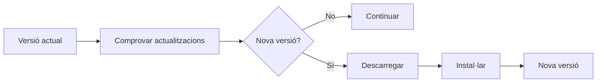

---
hide:
  - navigation
---
# 5. Actualitzar l’entorn de desenvolupament

Els IDE són programes que evolucionen constantment.

Una actualització pot incorporar:

- correccions d’errors;
- millores de rendiment;
- noves funcionalitats;
- millores de compatibilitat;
- correccions de seguretat.

Actualitzar és una acció habitual, però convé entendre quin comportament té configurat l’IDE i triar una opció adequada al nostre context.

---

## 5.1. Com es poden gestionar?

Segons l’aplicació podem trobar diferents comportaments.

### Actualització automàtica

L’aplicació gestiona gran part del procés automàticament.

**Avantatge:** mantenim l’entorn al dia sense haver de comprovar-lo manualment.

**Consideració:** una nova versió pot canviar el comportament de l’entorn quan encara no l’hem provada.

### Avís d’actualització

L’IDE detecta una nova versió i informa l’usuari.

**Avantatge:** podem decidir quan instal·lar-la.

**Consideració:** si ignorem els avisos, podem quedar-nos amb una versió antiga.

### Actualització manual

L’usuari decideix quan comprovar i instal·lar les actualitzacions.

**Avantatge:** permet controlar completament el moment del canvi.

**Consideració:** requereix recordar les comprovacions i actuar amb regularitat.

!!! tip
    El més important no és memoritzar el nom exacte de cada opció, sinó saber **localitzar i interpretar el sistema d’actualitzacions de l’entorn que utilitzem**.

---

## 5.2. Una actualització responsable

En un entorn professional, abans d’actualitzar convé:

1. comprovar quina versió tenim instal·lada;
2. consultar què canvia en la nova versió;
3. revisar si és compatible amb el sistema i el projecte;
4. conservar la configuració o el perfil de treball;
5. provar que l’IDE continua funcionant després del canvi.

No cal actualitzar totes les ferramentes al mateix temps. Si canviem una peça cada vegada, serà més fàcil identificar l’origen d’una incidència.

!!! warning "No confongues actualitzar i arreglar"
    Una actualització no ha de servir per ocultar un problema. Si alguna cosa deixa de funcionar, conserva el missatge d’error i identifica quin canvi l’ha provocat abans de modificar més opcions.

## Resum

Les actualitzacions poden millorar la seguretat, el rendiment i la compatibilitat de l’IDE. Cal conéixer si l’entorn actualitza automàticament, avisa o espera una acció manual, i comprovar que el nostre entorn continua funcionant després del canvi.

!!! success "Idea clau"
    Mantindre un IDE actualitzat és important, però també ho és poder explicar què s’ha actualitzat i comprovar que el nostre entorn continua sent útil.

[Anterior: personalització](04-personalitzacio-automatitzacio.md) · [Següent: codi font i execució](06-executables.md) · [Índex](index.md)
