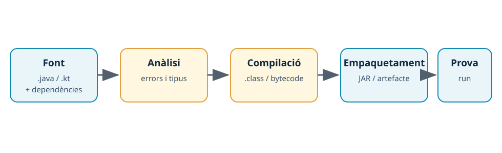

---
hide:
  - navigation
---
# 6. Del codi font a l’executable

## Introducció

Un fitxer font no és encara el producte que s’executa. L’IDE coordina una cadena de ferramentes: analitza el codi, resol dependències, compila, empaqueta i executa o entrega un artefacte. Comprendre aquesta cadena permet interpretar errors i comparar entorns amb criteris objectius.



*Figura. La construcció transforma codi font i dependències en un artefacte que es pot verificar.*

## Java: compilació i JAR

En Java, `javac` transforma els fitxers `.java` en **bytecode** `.class`, que s’executa en la màquina virtual de Java. Maven ordena les fases i empaqueta el resultat en un JAR.

```bash
mvn clean compile
mvn test
mvn package
```

Aquestes ordres corresponen, respectivament, a netejar artefactes previs i compilar, executar proves i empaquetar. El resultat habitual és un fitxer dins de `target/`. Un JAR executable necessita una classe principal declarada o es pot executar indicant el classpath i la classe:

```bash
java -cp target/classes ca.exemple.App
```

La construcció feta amb el terminal i la feta des de VS Code o IntelliJ IDEA haurien d’utilitzar el mateix `pom.xml`, JDK i versió de Maven per ser comparables.

## Kotlin en IntelliJ IDEA

Kotlin també es compila a bytecode de la JVM. En IntelliJ IDEA es pot crear un projecte Kotlin/JVM i construir-lo amb Gradle, sempre que el plugin i el projecte estiguen configurats.

```kotlin title="src/main/kotlin/ca/exemple/Main.kt"
package ca.exemple

fun main() {
    println("Artefacte Kotlin verificat")
}
```

L’IDE permet executar la funció `main` i inspeccionar la configuració, però l’artefacte reproduïble depén del `build.gradle.kts` i del JDK del projecte. En la pràctica es documentarà la comanda de construcció que genere el projecte, sense donar per fet que totes les instal·lacions tenen la mateixa versió de Gradle.

## Mateix codi, dos IDE

Per comparar VS Code i IntelliJ IDEA, obri el mateix repositori Java, no dues còpies amb canvis manuals. Executa en tots dos:

```bash
mvn clean package
java -cp target/classes ca.exemple.App
```

Compara el JDK detectat, la resolució de dependències, els missatges de diagnòstic, el temps aproximat, el nom i la suma de comprovació de l’artefacte. Un resultat diferent no és necessàriament un error: primer cal verificar si les versions o les opcions de construcció són diferents.

| Capa | Pregunta de verificació |
| --- | --- |
| Font | És exactament el mateix commit o conjunt de fitxers? |
| Eines | Coincideixen JDK, Maven/Gradle i plugins necessaris? |
| Procés | S’ha executat la mateixa fase de construcció? |
| Resultat | El programa s’executa i produeix l’eixida esperada? |
| Evidència | S’han conservat ordres, versions i resultats? |

## Errors habituals

- Confondre l’execució des de l’IDE amb una construcció reproduïble.
- Guardar només una captura sense anotar el JDK ni l’ordre.
- Comparar artefactes generats amb projectes o commits diferents.
- Esborrar `target/` o la caché per provar una hipòtesi sense documentar-ho.
- Assumir que un JAR és executable sense classe principal o classpath correctes.

## Resum

La construcció és una cadena de transformacions que l’IDE presenta de manera integrada. Java i Kotlin poden generar bytecode per a la JVM; Maven o Gradle descriuen el procés. Per comparar IDE cal mantindre iguals el codi, les eines, les ordres i les proves.

[Anterior: actualitzacions](05-actualitzacions.md) · [Següent: comparació](07-comparacio.md) · [Índex](index.md)
