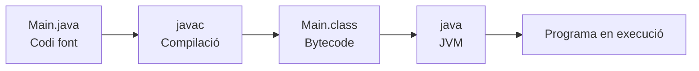

---
hide:
  - navigation
---
# 6. Del codi font al programa en execució

## Relació amb l'activitat 3

En aquesta activitat treballaràs amb dos projectes Java senzills:

- `hola-daw`, creat manualment i executat en Visual Studio Code i des de la terminal;
- `hola-daw-maven`, creat de nou en IntelliJ IDEA amb l'estructura estàndard de Maven.

En tots dos casos escriuràs una classe `Main` amb un mètode `main`. El procés general és el mateix: preparar el codi font, compilar-lo i executar el resultat amb la màquina virtual de Java.



---

## 1. Projecte Java senzill

El primer projecte té aquesta estructura:

```text
hola-daw/
└── src/
    └── Main.java
```

Des de la carpeta `hola-daw`, la compilació es fa amb:

```bash
javac src/Main.java
```

Per defecte, `javac` genera `Main.class` dins de `src`. Aquest fitxer conté el bytecode que la JVM pot executar.

Per executar la classe:

```bash
java -cp src Main
```

- `-cp src` indica on ha de buscar les classes compilades.
- `Main` és el nom de la classe que conté el mètode `main`.

En Visual Studio Code, el botó d'execució coordina aquestes ferramentes. La terminal permet escriure les ordres directament.

---

## 2. Projecte Java amb Maven

El projecte nou d'IntelliJ IDEA té una estructura diferent:

```text
hola-daw-maven/
├── pom.xml
└── src/
    └── main/
        └── java/
            └── Main.java
```

`pom.xml` identifica el projecte i descriu la configuració de Maven. La carpeta `src/main/java` conté el codi font Java.

Des de la carpeta del projecte Maven, les ordres bàsiques són:

```bash
mvn compile
mvn package
```

Després de `mvn compile`, les classes compilades solen aparéixer en `target/classes`. Si `Main.java` no té cap paquet, es pot executar amb:

```bash
java -cp target/classes Main
```

`mvn package` també pot crear un fitxer JAR dins de `target`. Un JAR és un paquet d'aplicació; perquè es puga executar amb `java -jar`, ha de tindre configurada una classe principal.

---

## 3. Què fa cada ferramenta?

| Ferramenta | Funció en la pràctica |
| --- | --- |
| Visual Studio Code | Editar `Main.java` i coordinar-ne l'execució. |
| IntelliJ IDEA | Crear el projecte Maven, editar `Main.java` i executar-lo. |
| `javac` | Compilar el codi font `.java` i generar fitxers `.class`. |
| `java` | Iniciar la JVM i executar una classe compilada. |
| Maven | Organitzar el projecte i automatitzar la compilació i l'empaquetament. |

L'IDE facilita les accions, però les ferramentes del JDK i Maven són les que fan possible el procés.

---

## 4. Aplicació al procés de l'activitat

En l'activitat 3 seguiràs aquesta seqüència:

1. Crear `hola-daw` i escriure `Main.java`.
2. Obrir-lo en Visual Studio Code i executar-lo.
3. Modificar el missatge i tornar a executar-lo.
4. Crear un projecte Maven nou en IntelliJ IDEA.
5. Crear `src/main/java/Main.java` i replicar-hi el contingut.
6. Executar el projecte Maven des d'IntelliJ IDEA.
7. Compilar i executar el projecte original des de la terminal.

Els dos projectes són independents. No cal que compartisquen la mateixa carpeta ni el mateix `pom.xml`: el que es replica és el contingut de `Main.java`.

## Resum

- El codi font és el fitxer `.java` que escrius.
- La compilació genera bytecode `.class`.
- `java` executa les classes amb la JVM.
- Maven organitza un projecte Java i automatitza fases com `compile` i `package`.
- Un IDE presenta aquestes accions en una interfície gràfica, però no substitueix el JDK ni Maven.

[Anterior: actualitzacions](05-actualitzacions.md) · [Següent: comparació](07-comparacio.md) · [Índex](index.md)
