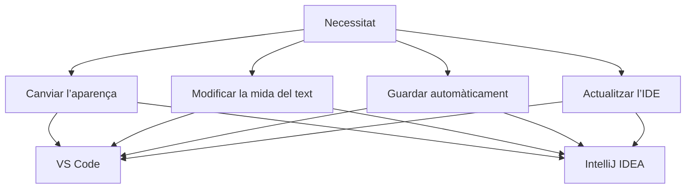
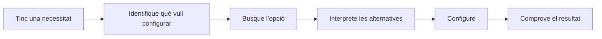

---
hide:
  - navigation
---
# 7. Comparació d’entorns de desenvolupament

Comparar IDE no consisteix a comptar botons. Cal relacionar les característiques amb les necessitats del projecte i entendre que una mateixa funcionalitat pot aparéixer en llocs diferents.

---

## 7.1. Visual Studio Code i IntelliJ IDEA

Visual Studio Code i IntelliJ IDEA poden utilitzar-se per desenvolupar programari, però tenen filosofies diferents.

### Visual Studio Code

Visual Studio Code és un editor molt configurable que pot ampliar les seues funcionalitats segons les necessitats del desenvolupador.

Destaca per:

- una interfície relativament lleugera;
- gran capacitat de personalització;
- compatibilitat amb molts llenguatges;
- funcionalitats que poden incorporar-se progressivament.

### IntelliJ IDEA

IntelliJ IDEA és un entorn de desenvolupament especialment orientat a projectes de programari i proporciona moltes ferramentes integrades.

Destaca per:

- una integració completa de ferramentes;
- gestió avançada de projectes;
- assistència al desenvolupament;
- moltes funcionalitats disponibles directament des de l’IDE.

| Dimensió | Visual Studio Code | IntelliJ IDEA |
| --- | --- | --- |
| Filosofia | Editor lleuger i extensible. | Entorn integrat orientat a projectes. |
| Personalització | Perfils, configuració i extensions. | Perfils, preferències i configuració del projecte. |
| Organització | Carpeta oberta i panells configurables. | Projecte, finestres d’eines i mòduls. |
| Recursos | Pot iniciar ràpidament amb pocs components. | Pot integrar més funcions des del principi. |

!!! question "Quin és millor?"
    No existeix un IDE perfecte per a totes les situacions. L’elecció dependrà del llenguatge, del projecte, de les ferramentes necessàries i de les preferències del desenvolupador.

---

## 7.2. Conceptes comuns, interfícies diferents

Aprendre un IDE **no consisteix a memoritzar la posició dels botons**.

Les aplicacions evolucionen, les interfícies canvien i cada IDE organitza les seues opcions d’una manera diferent. El més important és reconéixer els conceptes.

Dos IDE poden oferir la mateixa funcionalitat però:

- utilitzar noms diferents;
- situar-la en menús diferents;
- oferir opcions diferents.

Per això és important aprendre a **buscar i interpretar configuracions**, no simplement memoritzar passos.

---

## 7.3. La configuració adequada depén del context

No existeix una única configuració correcta per a un IDE. Dos desenvolupadors poden utilitzar configuracions diferents i treballar perfectament.

| Configuració | Desenvolupador A | Desenvolupador B |
| --- | --- | --- |
| Tema | Fosc | Clar |
| Font | 14 px | 16 px |
| Word Wrap | Activat | Desactivat |
| Auto Save | Activat | Desactivat |
| Barra lateral | Esquerra | Dreta |

Les dues configuracions poden ser vàlides. La qüestió important és:

> **Puc explicar per què he configurat així el meu entorn?**

---

## 7.4. Un desenvolupador ha de poder adaptar-se

Durant la vostra carrera professional probablement utilitzareu diferents IDE, llenguatges, sistemes operatius, ferramentes i versions.

Per això l’objectiu no és aprendre una llista de botons de Visual Studio Code, sinó desenvolupar una habilitat més general:

Aquest procés es pot aplicar pràcticament a qualsevol entorn de desenvolupament.

## Resum

VS Code i IntelliJ IDEA comparteixen funcionalitats bàsiques, però difereixen en la seua filosofia i en la manera d’organitzar-les. Una comparació útil parteix d’una necessitat concreta, localitza l’equivalent en cada IDE i comprova el resultat.

!!! success "Idea clau"
    La capacitat professional no és saber on està cada opció en un programa concret, sinó poder trobar-la i interpretar-la en un entorn nou.

!!! question "Comprovació final"
    On buscaries en un IDE que no coneixes una opció per canviar el tema, configurar el desament automàtic o comprovar les actualitzacions? Explica la necessitat, els termes de cerca i com comprovaries el resultat.

[Anterior: executables](06-executables.md) · [Índex de la UP1](index.md)
