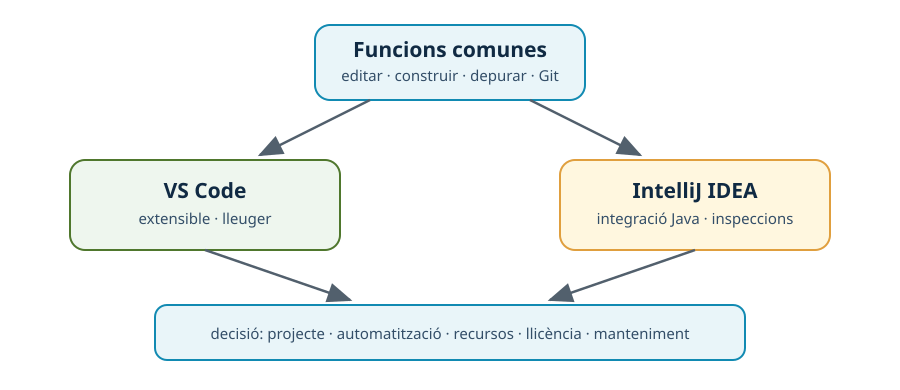

---
hide:
  - navigation
---
# 7. Comparació professional d’IDE

## Introducció

Comparar IDE no consisteix a comptar botons. Cal relacionar les característiques amb les necessitats del projecte i aportar una evidència. Un equip Java pot prioritzar refactorització i depuració; un projecte amb diversos llenguatges pot prioritzar extensibilitat i rapidesa d’inici.

*Figura. La decisió combina funcionalitat, projecte, automatització, operació i llicència.*

## Característiques comunes

VS Code i IntelliJ IDEA comparteixen funcions essencials: edició amb ressaltat i compleció, navegació, integració amb Git, terminal, configuracions d’execució, diagnòstic, extensions o plugins i integració amb ferramentes de construcció. Per això tots dos poden participar en el cicle de vida d’un projecte Java.

## Característiques específiques

| Dimensió | VS Code | IntelliJ IDEA |
| --- | --- | --- |
| Model d’entorn | Nucli menut que s’amplia per extensions. | Plataforma molt integrada amb funcions específiques de llenguatge. |
| Java | Requereix extensions i un JDK configurat. | Suport Java integrat i anàlisi avançada del projecte. |
| Personalització | Perfils, `settings.json`, tasques i extensions. | Perfils, inspeccions, estils i configuracions d’execució. |
| Construcció | Terminal, tasques o integració amb Maven/Gradle. | Finestres i accions integrades amb Maven/Gradle. |
| Recursos | Pot iniciar ràpidament amb pocs components. | Pot requerir més memòria en projectes grans. |
| Llicència i cost | Cal distingir la distribució i les extensions. | Les funcions disponibles depenen de l’edició o llicència. |

Les diferències poden canviar segons la versió, el sistema operatiu i els plugins instal·lats. Per això l’informe ha d’indicar l’entorn concret de la prova.

## Matriu de decisió

Una matriu amb una escala acordada ajuda a evitar conclusions basades només en preferències. Per exemple:

| Criteri | Pes decidit per l’equip | Evidència |
| --- | ---: | --- |
| Construcció i dependències Java | Alt | Construcció Maven correcta. |
| Depuració i navegació | Alt | Punt d’interrupció i salt a una classe. |
| Automatització | Mitjà | Tasca o configuració reproduïble. |
| Consum de recursos | Mitjà | Observació en el mateix projecte. |
| Extensions/plugins i manteniment | Mitjà | Llista, versions i actualització. |
| Llicència i disponibilitat | Alt | Font i modalitat d’ús documentades. |

No hi ha una puntuació universal. El valor professional està en justificar els pesos i relacionar la decisió amb el context.

## Resum

Els dos IDE comparteixen el cicle bàsic d’edició, construcció, execució i depuració, però difereixen en el grau d’integració, l’extensibilitat, el consum, les funcions disponibles i la llicència. Una comparació rigorosa necessita versions, proves i criteris explícits.

!!! question "Comprovació final"
    Si els dos IDE generen un JAR funcional, quines altres dades inclouries per decidir quin és més adequat per a un equip? Com a mínim: temps i ordre de construcció, diagnòstics, depuració, consum, extensions/plugins, manteniment i llicència.

[Anterior: executables](06-executables.md) · [Índex de la UP1](index.md)
