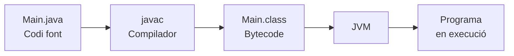
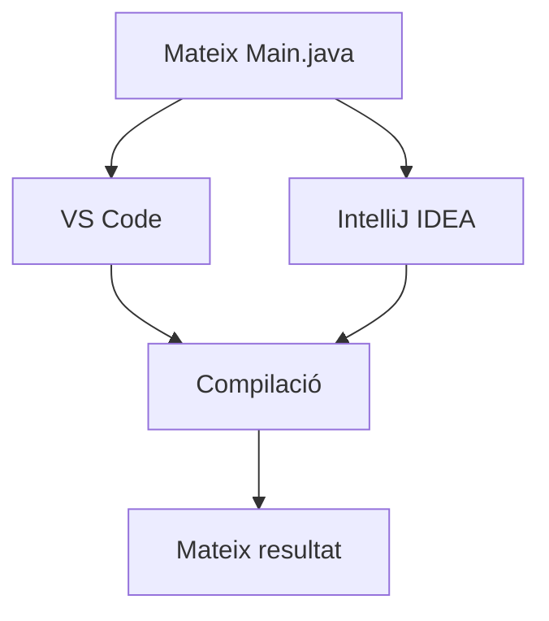

---
hide:
  - navigation
---

# Activitat 3. Migrem un projecte: VS Code vs IntelliJ IDEA

## Finalitat

Ara que ja tenim els entorns instal·lats i configurats, començarem a utilitzar-los sobre un mateix projecte.

En aquesta activitat treballarem amb un projecte Java molt senzill. L'objectiu **no és aprendre Java**, sinó entendre millor què fa un entorn de desenvolupament i comprovar si un mateix projecte pot treballar-se des de diferents IDE.

Treballarem principalment:

- **RA2.f:** generar executables a partir d'un mateix codi font amb diversos entorns de desenvolupament.
- **RA2.g:** identificar les característiques comunes i específiques de diversos entorns de desenvolupament.

També relacionarem la pràctica amb conceptes treballats anteriorment com el **codi font, la compilació, el codi intermedi i la màquina virtual**.

---

## Situació

T'incorpores a un equip de desenvolupament que treballa amb Java.

Un company t'envia un projecte que ha estat treballant amb un IDE diferent del teu. Abans de continuar desenvolupant-lo, vols comprovar si el projecte depén de l'entorn utilitzat o si pot obrir-se i executar-se des d'altres ferramentes.

La teua missió serà:

1. executar el projecte amb Visual Studio Code;
2. identificar què necessita realment Java per executar-lo;
3. obrir **exactament el mateix projecte** amb IntelliJ IDEA;
4. resoldre una incidència relacionada amb l'entorn;
5. comparar els dos IDE i decidir quin utilitzaries en diferents situacions.

!!! question "Pregunta que intentarem respondre"

    **Un programa Java funciona gràcies a l'IDE o gràcies a les ferramentes que hi ha darrere?**

---

## Projecte inicial

El professorat proporcionarà la carpeta següent:

```text
hola-daw/
└── src/
    └── Main.java
```

El fitxer `Main.java` contindrà un programa molt senzill:

```java title="src/Main.java"
public class Main {

    public static void main(String[] args) {

        System.out.println("Entorn de desenvolupament preparat!");
        System.out.println("DAW - IES Mestre Ramon Esteve");

    }

}
```

!!! info "No cal saber Java"
    No és necessari entendre tota la sintaxi del programa.

    En aquesta activitat ens interessa **el procés que segueix l'entorn per aconseguir executar-lo**.

---

## Part 1. Aconsegueix executar el projecte

Obri la carpeta `hola-daw` amb **Visual Studio Code**.

La teua primera missió és molt simple:

> **Aconsegueix executar `Main.java`.**

No tindràs una guia pas a pas.

Hauràs de localitzar les ferramentes necessàries i comprovar si l'entorn està correctament preparat.

El resultat esperat és:

```text
Entorn de desenvolupament preparat!
DAW - IES Mestre Ramon Esteve
```

Quan funcione, investiga el teu entorn i respon:

1. Quin **JDK** està utilitzant Visual Studio Code?
2. On apareix l'eixida del programa?
3. Quina acció has utilitzat per executar-lo?
4. Quina ferramenta creus que s'encarrega realment de compilar el programa?

!!! tip "Una pista"
    Visual Studio Code és l'entorn des del qual treballes, però això no significa necessàriament que siga ell qui compile Java.

---

## Part 2. Què ocorre quan premem «Run»?

Quan executem un programa Java, l'IDE simplifica un procés en què intervenen diverses ferramentes.

De manera simplificada:



Investiga les carpetes del projecte després d'haver-lo executat.

### Busca evidències

Intenta localitzar algun fitxer `.class` generat durant el procés.

!!! question
    Quina diferència observes entre:

    - `Main.java`
    - `Main.class`

No cal analitzar el contingut intern dels fitxers. Ens interessa entendre **quin paper té cadascun dins del procés**.

---

## Prova fora de l'IDE

Ara obrirem una terminal.

Situa't en la carpeta del projecte i prova:

```bash
javac src/Main.java
```

Si la compilació és correcta, executa:

```bash
java -cp src Main
```

Hauries d'obtindre el mateix resultat:

```text
Entorn de desenvolupament preparat!
DAW - IES Mestre Ramon Esteve
```

Ara respon:

> **Necessitem Visual Studio Code perquè aquest programa funcione?**

Justifica breument la resposta.

---

## Part 3. Migrem el projecte

Ara arriba la part principal de l'activitat.

Tanca Visual Studio Code i obri **exactament la mateixa carpeta `hola-daw`** amb IntelliJ IDEA.

!!! warning "Important"
    No crees un projecte Java nou.

    No copies `Main.java` dins d'un altre projecte.

    Has de treballar sobre **la mateixa carpeta que utilitzaves en Visual Studio Code**.

La teua missió és:

> **Aconseguir executar `Main.java` des d'IntelliJ IDEA sense modificar el seu codi.**

Per aconseguir-ho hauràs de localitzar:

- l'estructura del projecte;
- el fitxer `Main.java`;
- el JDK utilitzat;
- l'opció d'execució;
- la zona on apareix el resultat.

El resultat ha de tornar a ser:

```text
Entorn de desenvolupament preparat!
DAW - IES Mestre Ramon Esteve
```



!!! question "Pregunta clau"
    **Ha sigut necessari modificar `Main.java` perquè funcione en IntelliJ IDEA?**

    Què et diu això sobre la relació entre **el codi font i l'IDE**?

---

## Part 4. Analitza el canvi d'entorn

Ara que has executat el mateix projecte en dos IDE diferents, analitza què ha canviat i què s'ha mantingut.

Completa:

| Element                      | Ha canviat? | Explicació breu |
| ---------------------------- | :---------: | --------------- |
| Codi font `Main.java`        |             |                 |
| IDE                          |             |                 |
| Forma d'executar el programa |             |                 |
| Ubicació de l'eixida         |             |                 |
| JDK                          |             |                 |
| Resultat del programa        |             |                 |

Després respon:

### Quines ferramentes tenen en comú?

Indica almenys **tres funcionalitats** que has trobat tant en Visual Studio Code com en IntelliJ IDEA.

Per exemple:

- explorador del projecte;
- editor;
- terminal;
- execució;
- configuració del JDK;
- depurador.

### I quina diferència és la més important?

Indica una diferència entre els dos entorns que t'haja cridat especialment l'atenció.

No ens interessa tant una diferència estètica com una diferència relacionada amb **la manera de treballar**.

---

## Part 5. Incidència: el projecte no funciona

En un entorn professional, moltes vegades el problema no està en el codi.

Imagina que un company intenta executar el projecte i obté:

```text
java: command not found
```

o que el seu IDE mostra un missatge semblant a:

```text
No JDK configured
```

Analitza la situació.

### Respon

1. Quin creus que és el problema?
2. Quina és la primera comprovació que faries?
3. Quina ferramenta falta o està mal configurada?
4. Instal·lar un altre IDE solucionaria necessàriament el problema? Per què?

---

## Repte addicional

El professorat pot introduir una incidència real en algun dels entorns.

Per exemple:

- JDK incorrecte;
- JDK no detectat;
- carpeta `src` no reconeguda correctament;
- projecte obert des d'una carpeta incorrecta;
- configuració d'execució no vàlida.

En aquest cas hauràs de:

```text
Detectar el problema
        ↓
Investigar la causa
        ↓
Aplicar una solució
        ↓
Comprovar que funciona
```

No es donarà directament la solució.

!!! tip
    L'objectiu no és provar opcions aleatòriament.

    Intenta entendre **què necessita el projecte per funcionar** abans de modificar la configuració.

---

## Part 6. Quin IDE utilitzaries?

Ara imagina que has de començar tres projectes diferents.

Per a cada situació, selecciona l'IDE que utilitzaries:

- **Visual Studio Code**
- **IntelliJ IDEA**

La resposta ha d'estar justificada a partir de característiques que hages observat durant la pràctica.

---

## Cas A. Projecte Java gran

Treballaràs durant diversos mesos en una aplicació Java amb moltes classes, proves, dependències i diferents membres de l'equip.

**IDE triat:**

```text
Visual Studio Code / IntelliJ IDEA
```

**Justificació:**

```text


```

---

## Cas B. Desenvolupament web

Treballaràs habitualment amb:

```text
HTML
CSS
JavaScript
JSON
Python
scripts
```

i canviaràs sovint entre diferents tecnologies.

**IDE triat:**

```text
Visual Studio Code / IntelliJ IDEA
```

**Justificació:**

```text


```

---

## Cas C. Equip amb recursos limitats

Treballaràs en un portàtil amb recursos limitats i principalment desenvoluparàs projectes senzills amb diferents llenguatges.

**IDE triat:**

```text
Visual Studio Code / IntelliJ IDEA
```

**Justificació:**

```text


```

!!! info
    No existeix necessàriament una única resposta correcta.

    L'important és que la decisió estiga **justificada amb característiques reals dels entorns**.

---

# Lliurament

No cal elaborar un informe extens.

Prepara un document breu amb les següents evidències i conclusions.

## 1. Execució en VS Code

Inclou **una captura** on es veja el projecte executant-se correctament en Visual Studio Code.

Afig una frase explicant què acredita la captura.

---

## 2. Execució en IntelliJ IDEA

Inclou **una captura** on es veja **el mateix projecte** executant-se correctament en IntelliJ IDEA.

Afig una frase explicant què acredita la captura.

---

## 3. Anàlisi del procés

Completa:

| Pregunta                                           | Resposta |
| -------------------------------------------------- | -------- |
| Quin JDK has utilitzat?                            |          |
| Què compila `Main.java`?                           |          |
| Quin fitxer es genera després de la compilació?    |          |
| Què executa el bytecode Java?                      |          |
| Ha calgut modificar `Main.java` per canviar d'IDE? |          |

---

## 4. Incidència

Descriu breument:

```text
Problema:
_________________________________________________

Possible causa:
_________________________________________________

Comprovació o solució:
_________________________________________________
```

---

## 5. Comparació final

Indica:

### Tres funcionalitats comunes

1.
2.
3.

### Una diferència important

```text


```

---

## 6. Elecció de l'IDE

Inclou les decisions justificades dels casos:

- projecte Java gran;
- desenvolupament web;
- equip amb recursos limitats.

---

# Avaluació

| Aspecte                    | Assoliment alt                                                                                                                      | Assoliment mitjà                                                                                            | Assoliment baix                                                                               |
| -------------------------- | ----------------------------------------------------------------------------------------------------------------------------------- | ----------------------------------------------------------------------------------------------------------- | --------------------------------------------------------------------------------------------- |
| **Execució del projecte**  | Executa correctament el mateix projecte en els dos IDE sense modificar innecessàriament el codi font.                               | Executa el projecte en els dos entorns amb alguna ajuda o presenta alguna dificultat menor de configuració. | No aconsegueix executar correctament el projecte en un o els dos entorns.                     |
| **Comprensió del procés**  | Relaciona correctament codi font, compilació, bytecode, JDK/JVM i execució.                                                         | Comprén el procés general però presenta alguna imprecisió.                                                  | Mostra confusió entre els principals elements del procés.                                     |
| **Diagnòstic de l'entorn** | Identifica correctament la causa de la incidència i proposa o aplica una solució raonada.                                           | Identifica parcialment el problema o necessita ajuda per arribar a la solució.                              | No identifica la causa del problema o aplica canvis sense relacionar-los amb la incidència.   |
| **Comparació dels IDE**    | Identifica característiques comunes i diferències significatives entre els dos entorns.                                             | Identifica les principals característiques però amb alguna justificació superficial.                        | La comparació és incompleta o mostra confusió entre els dos IDE.                              |
| **Elecció de ferramentes** | Selecciona un IDE adequat per als diferents escenaris i justifica les decisions amb característiques observades durant la pràctica. | Les decisions són raonables però alguna justificació és poc concreta.                                       | Les decisions no estan justificades o no es relacionen amb les característiques dels entorns. |

---

## Abans d'entregar

Comprova que:

- [ ] Has executat el projecte en Visual Studio Code.
- [ ] Has identificat el JDK utilitzat.
- [ ] Has relacionat `Main.java`, `Main.class` i la JVM.
- [ ] Has executat el programa també des de la terminal.
- [ ] Has obert **la mateixa carpeta** amb IntelliJ IDEA.
- [ ] Has executat el projecte en IntelliJ sense copiar el codi a un projecte nou.
- [ ] Has comparat què canvia i què es manté entre els dos IDE.
- [ ] Has analitzat la incidència proposada.
- [ ] Has identificat almenys tres funcionalitats comunes.
- [ ] Has justificat quin IDE utilitzaries en els tres casos plantejats.
- [ ] Has inclòs només les evidències necessàries.

[[Anterior: posar a punt l'entorn](https://chatgpt.com/g/g-p-6a6e0b0272708191a4eaa0d3537e1f61-ies-mestre-ramon-esteve/c/activitat-2-configuracio.md)](activitat-2-configuracio.md) · [[Autoavaluació](https://chatgpt.com/g/g-p-6a6e0b0272708191a4eaa0d3537e1f61-ies-mestre-ramon-esteve/c/autoavaluacio.md)](autoavaluacio.md) · [[Índex](https://chatgpt.com/g/g-p-6a6e0b0272708191a4eaa0d3537e1f61-ies-mestre-ramon-esteve/index.md)](../index.md)
