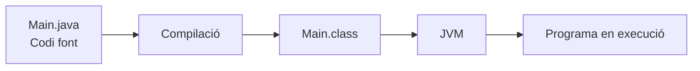
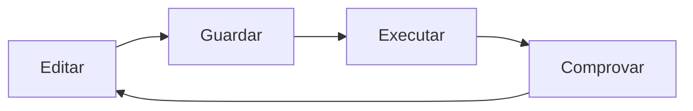
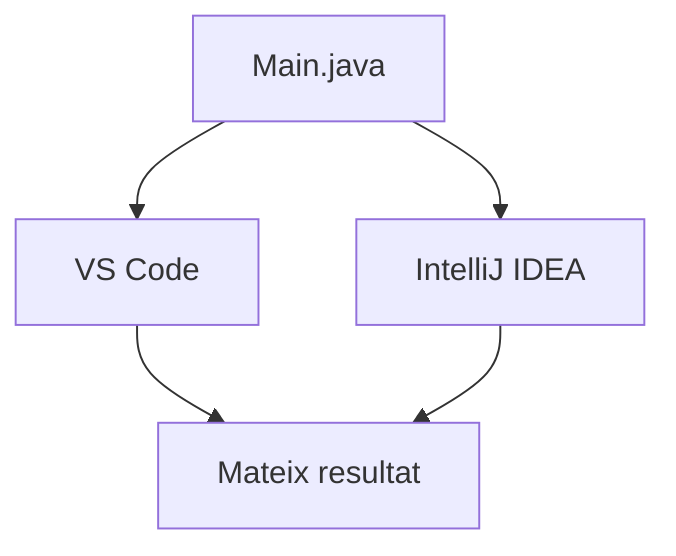

---
hide:
  - navigation
---
# Activitat 3. Un mateix projecte, dos IDE

## Finalitat

Ara que ja tenim els entorns instal·lats i configurats, començarem a utilitzar-los sobre un projecte real.

L’objectiu no és aprendre Java encara, sinó observar **què necessita un IDE per treballar amb un llenguatge**, executar un projecte ja preparat i comparar com resolen la mateixa tasca Visual Studio Code i IntelliJ IDEA.

Treballarem principalment:

- **RA2.b:** afegir i eliminar mòduls de l’entorn.
- **RA2.g:** identificar característiques comunes i específiques de diversos IDE.
- **RA2.f:** començar a observar com un mateix codi font pot treballar-se des de diferents entorns.

---

## Situació

T’incorpores a un equip de desenvolupament i et proporcionen un projecte Java ja creat.

No has d’escriure el programa des de zero.

La teua tasca és:

1. comprovar que el teu entorn està preparat;
2. executar el projecte;
3. identificar quines ferramentes de l’IDE ho fan possible;
4. obrir el mateix projecte amb un altre IDE;
5. comparar l’experiència.

El professorat facilitarà una carpeta molt simple:

```text
hola-daw/
└── src/
    └── Main.java
```

Per exemple:

```java title="src/Main.java"
public class Main {
    public static void main(String[] args) {
        System.out.println("Entorn de desenvolupament preparat!");
        System.out.println("DAW - IES Mestre Ramon Esteve");
    }
}
```

!!! info "No cal dominar Java encara"
    No és necessari entendre tota la sintaxi del programa. Ens interessa el procés que segueix l’entorn per treballar amb ell.

---

## Part 1. Què tenim instal·lat?

Abans d’executar res, obri el gestor d’extensions de Visual Studio Code.

Localitza les extensions relacionades amb Java que ja tens instal·lades.

Per a **dues d’elles**, completa:

| Extensió | Desenvolupador | Per a què creus que serveix? |
| --- | --- | --- |
| | | |
| | | |

No busques una descripció tècnica extensa. Amb una frase és suficient.

Per exemple:

> Permet que VS Code reconega i execute projectes Java.

Les extensions Java són una ampliació de les capacitats de l’IDE:

```text
VS Code
   +
extensions Java
   ↓
Entorn capaç de treballar amb Java
```

Cal distingir aquest concepte del de dependència:

```text
EXTENSIÓ / PLUGIN
Amplia les capacitats de l’IDE.

DEPENDÈNCIA
Forma part del projecte o és utilitzada pel programa.
```

De moment treballarem només amb el primer concepte.

---

## Part 2. Executa el projecte amb VS Code

Obri la carpeta `hola-daw` amb Visual Studio Code.

Sense modificar inicialment el programa:

1. localitza el fitxer `Main.java`;
2. identifica com pots executar-lo;
3. executa’l;
4. localitza on apareix el resultat.

Hauries d’obtindre una eixida semblant a:

```text
Entorn de desenvolupament preparat!
DAW - IES Mestre Ramon Esteve
```

Després respon:

- On apareix l’eixida del programa?
- Quina acció has utilitzat per executar-lo?
- Creus que VS Code podria executar aquest programa sense les ferramentes de Java que té instal·lades?

La tercera pregunta és especialment important.

---

## Part 3. Del codi font a l’execució

El professorat explicarà breument el procés que té lloc quan executem el programa:



A continuació, investiga si pots localitzar algun fitxer generat pel procés.

L’objectiu és començar a relacionar:

**codi font → ferramenta → execució**

No cal entrar encara en els detalls de la programació ni de la construcció de projectes.

---

## Part 4. Fes un canvi mínim

Ara modifica el codi de manera controlada.

Canvia:

```java
System.out.println("DAW - IES Mestre Ramon Esteve");
```

per:

```java
System.out.println("DAW - Nom Cognom");
```

Torna a executar-lo i comprova el resultat.

Aquest és el cicle de treball que repetirem moltes vegades durant el curs:



---

## Part 5. El mateix projecte en IntelliJ IDEA

Ara tanca Visual Studio Code i obri **exactament la mateixa carpeta** amb IntelliJ IDEA.

Hauràs d’aconseguir que el programa torne a mostrar:

```text
Entorn de desenvolupament preparat!
DAW - Nom Cognom
```

No es donaran tots els passos exactes. Localitza:

- l’estructura del projecte;
- el fitxer `Main.java`;
- la configuració o detecció del JDK;
- el botó o l’opció d’execució;
- la zona on apareix l’eixida.



!!! question "Pregunta clau"
    Ha sigut necessari modificar el codi perquè funcione en un IDE diferent? No: el mateix codi font pot obrir-se i executar-se en els dos entorns.

---

## Part 6. Què tenen en comú?

Compara els dos entorns i indica on has localitzat cada funcionalitat:

| Funcionalitat | VS Code | IntelliJ IDEA |
| --- | --- | --- |
| Explorador del projecte | | |
| Editor de codi | | |
| Executar el programa | | |
| Mostrar l’eixida | | |
| Terminal integrada | | |
| Configurar Java/JDK | | |
| Extensions o plugins | | |

No cal explicar-ho tot. Per cada fila pots indicar simplement on has localitzat la funcionalitat o escriure una frase curta.

Després respon:

1. Quines funcionalitats tenen en comú els dos IDE?
2. Quina diferència t’ha cridat més l’atenció?
3. Quin paper creus que tenen les extensions o plugins dins d’un IDE?

---

## Part 7. Afig i elimina una funcionalitat

**No toques les extensions de Java.**

En canvi:

1. obri el gestor d’extensions o plugins;
2. instal·la una extensió indicada pel professorat;
3. comprova quin canvi produeix;
4. desinstal·la-la;
5. comprova que la funcionalitat desapareix.

L’extensió ha de ser **totalment prescindible**. Pot afegir una funcionalitat visual o modificar temporalment alguna característica de l’entorn, però no ha de ser necessària per treballar durant el curs.

!!! warning "No desinstal·les les extensions de Java"
    Les extensions de Java són necessàries per a aquesta pràctica. La prova d’alta i baixa es farà amb una extensió addicional i recuperable.

Aquesta prova permet demostrar el **RA2.b** sense posar en risc la configuració de Java.

---

# Lliurament

L’activitat ha de ser més lleugera que l’anterior. No cal elaborar un informe extens.

## 1. Extensions Java

| Extensió | Funció |
| --- | --- |
| | |
| | |

## 2. Comparació dels IDE

Inclou la taula comparativa de la Part 6.

## 3. Preguntes

Respon aquestes quatre preguntes:

1. Quin paper tenen les extensions de Java instal·lades en VS Code?
2. Ha sigut necessari modificar `Main.java` per utilitzar IntelliJ IDEA? Per què?
3. Indica dues funcionalitats comunes entre els dos IDE.
4. Quina diferència has observat entre VS Code i IntelliJ IDEA?

## 4. Evidències

Inclou només **tres captures de pantalla**:

- el programa executat en VS Code;
- el mateix programa executat en IntelliJ IDEA;
- l’extensió o plugin temporal instal·lat.

La desinstal·lació es pot comprovar mitjançant observació o amb una quarta captura, si el professorat ho indica.

!!! warning
    Les captures han de mostrar únicament la informació necessària i han d’anar acompanyades d’una frase que explique què acrediten.

---

# Avaluació

| Aspecte | Assoliment alt | Assoliment mitjà | Assoliment baix |
| --- | --- | --- | --- |
| **Extensions i plugins** | Identifica correctament la funció de les extensions Java i instal·la i elimina una extensió addicional comprovant el canvi. | Realitza les operacions, però mostra alguna dificultat per explicar la seua funció. | No identifica la funció dels mòduls o no aconsegueix instal·lar o eliminar l’extensió. |
| **Execució en VS Code** | Obri, executa i modifica correctament el projecte proporcionat. | Executa el projecte amb alguna ajuda o presenta alguna dificultat menor. | No aconsegueix executar correctament el projecte. |
| **Execució en IntelliJ IDEA** | Obri i executa el mateix projecte en IntelliJ sense modificar-ne innecessàriament el codi. | Aconsegueix executar-lo amb alguna ajuda. | No aconsegueix executar el projecte. |
| **Comparació dels IDE** | Identifica correctament les principals funcionalitats comunes i diferències dels dos entorns. | Identifica la major part de les funcionalitats, amb alguna imprecisió. | La comparació és incompleta o mostra confusió entre els dos entorns. |
| **Evidències i conclusions** | Les evidències demostren clarament el treball i les respostes mostren comprensió del procés. | Les evidències són suficients però alguna resposta és superficial. | Falten evidències o les respostes no permeten comprovar la comprensió. |

---

## Abans d’entregar

Comprova que:

- [ ] Has identificat dues extensions Java de VS Code.
- [ ] Has executat el projecte en VS Code.
- [ ] Has localitzat l’eixida del programa.
- [ ] Has localitzat algun fitxer generat durant el procés.
- [ ] Has fet el canvi mínim en `Main.java`.
- [ ] Has executat el mateix projecte en IntelliJ IDEA.
- [ ] Has comparat les funcionalitats bàsiques dels dos IDE.
- [ ] Has instal·lat i eliminat una extensió temporal.
- [ ] No has modificat ni desinstal·lat les extensions de Java.
- [ ] Has preparat les evidències demanades.

[Anterior: posar a punt l’entorn](activitat-2-configuracio.md) · [Autoavaluació](autoavaluacio.md) · [Índex](../index.md)
