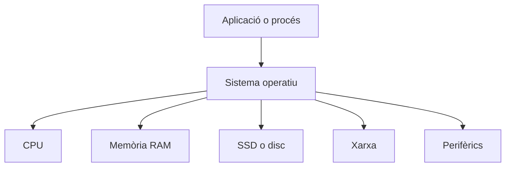
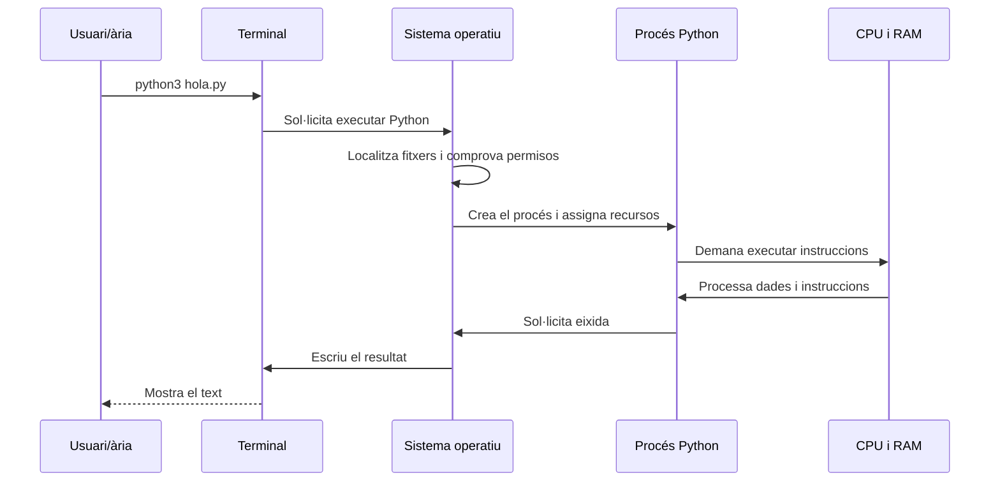

---
hide:
  - navigation
---

<!--
RA1
CA treballats: a.
-->

# Del programa al sistema informàtic

Quan escrivim `print("Hola")` o obrim un navegador, el resultat pareix immediat. Tanmateix, el programa necessita emmagatzematge, memòria, processador i serveis del sistema operatiu. Entendre aquesta relació ajuda a interpretar errors, consum de recursos i diferències entre executar un programa en local o en un servidor.

## Què és un programa informàtic?

Un **programa informàtic** és un conjunt ordenat d'instruccions i dades que indica a un sistema com ha de resoldre una tasca. Un navegador, un servidor web, un script que canvia el nom de molts fitxers i un videojoc són programes, encara que tinguen formes i dimensions molt diferents.

En l'ús habitual, anomenem **aplicació** un programa —o conjunt de programes— que ofereix una funcionalitat a una persona usuària. Un servidor web pot ser una aplicació encara que no tinga una finestra gràfica; un script també pot ser un programa encara que dure menys d'un segon.

El processador no entén directament Java, Python ni JavaScript. La CPU executa instruccions del seu conjunt d'instruccions, representades en codi màquina. Les ferramentes que estudiarem en [Del codi font a l'execució](03-codi-execucio.md) transformen o processen el codi que escrivim fins a fer possible l'execució.

## Programa i procés

Un **programa** és el conjunt d'instruccions i recursos emmagatzemats. Un **procés** és una instància d'un programa que està en execució i a la qual el sistema operatiu ha assignat recursos.

Per exemple, podem tindre un únic programa `firefox` instal·lat en el disc i diversos processos relacionats amb el navegador: una finestra, una pestanya o un procés auxiliar. De la mateixa manera, un servidor pot executar diverses instàncies del mateix programa per atendre més peticions.

!!! warning "No confongues"
    El fitxer del programa no és el procés. El fitxer és persistent; el procés té un estat temporal, memòria i recursos mentre s'executa.

Aquesta distinció serà útil quan estudiem servidors, contenidors i desplegaments. Un contenidor no és simplement un fitxer de codi: conté o utilitza processos aïllats amb recursos i configuració pròpia.

## Emmagatzematge: on descansa el programa

Inicialment, el programa es troba en un SSD o un altre dispositiu d'emmagatzematge. Allí pot conservar-se encara que apaguem l'ordinador: és **persistència**. En un projecte podem trobar codi font (`hola.py`), un executable, fitxers de configuració, imatges o altres recursos.

Quan demanem executar-lo, el sistema no treballa permanentment sobre el disc. Ha de localitzar el fitxer, comprovar permisos i carregar la informació necessària en memòria principal.

## Memòria RAM: el lloc de treball temporal

La **memòria RAM** és volàtil: el seu contingut es perd quan el sistema s'apaga. Durant l'execució, conté instruccions del programa i dades com variables, objectes, textos o resultats intermedis.

El sistema operatiu reserva una zona d'adreces per al procés i controla quanta memòria pot utilitzar. Els llenguatges i els seus entorns poden organitzar-la en zones diferents, però en aquesta unitat no cal entrar en el detall de *heap* i *stack*. La idea essencial és que el programa necessita memòria per treballar i que eixa memòria pertany al procés mentre està actiu.

## Processador: executar instruccions

El processador o **CPU** executa instruccions seguint, de manera simplificada, aquest cicle:

```text
Fetch → Decode → Execute
```

1. *Fetch*: recupera una instrucció de memòria.
2. *Decode*: interpreta quina operació representa.
3. *Execute*: realitza l'operació i actualitza l'estat del programa.

El programa escrit per una persona pot contindre una suma, una comparació o una crida a una funció, però abans d'arribar a la CPU ha d'haver-se convertit al format que la plataforma pot executar. El camí concret depén del llenguatge i de la seua implementació.

## El sistema operatiu com a intermediari

El **sistema operatiu** coordina les aplicacions i el maquinari. Una aplicació no sol accedir directament al disc, a la xarxa o a la impressora: sol·licita un servei al sistema operatiu mitjançant les seues interfícies.



Entre les funcions del sistema operatiu trobem:

- crear, planificar i finalitzar processos;
- reservar i protegir memòria;
- gestionar fitxers i permisos;
- oferir comunicació de xarxa;
- coordinar teclat, pantalla, càmera o altres dispositius.

Per això el mateix programa pot comportar-se de manera diferent si canvien el sistema operatiu, els permisos, la memòria disponible o les biblioteques instal·lades.

## Perifèrics i entrada/eixida

Considera aquest programa Python:

```python
nom = input("Nom: ")
print("Hola", nom)
```

El programa no llig el teclat ni dibuixa directament sobre la pantalla. El recorregut conceptual és:

```text
teclat → sistema operatiu → programa → sistema operatiu → pantalla
```

`input` demana dades d'entrada i `print` envia dades d'eixida. El sistema operatiu tradueix aquestes operacions en accions sobre dispositius i canals d'entrada/eixida.

## Què passa quan executem `python3 hola.py`?

Suposem que `hola.py` conté un programa senzill i que l'usuari escriu aquesta ordre en la terminal.



El recorregut es pot descriure així:

1. L'usuari dona l'ordre a la terminal.
2. El sistema operatiu localitza l'intèrpret `python3` i el fitxer indicat, i comprova que es poden executar.
3. Crea un procés i reserva els recursos necessaris.
4. Carrega en memòria les instruccions i les dades que calen.
5. La CPU executa el codi a través de l'entorn de Python.
6. Quan el programa necessita escriure, demana el servei corresponent al sistema operatiu.
7. La terminal mostra el resultat i el procés finalitza, alliberant els seus recursos.

!!! note "Una simplificació útil"
    El recorregut anterior amaga molts detalls, com la planificació de la CPU, les memòries cau i les crides al sistema. És prou precís per entendre la relació entre programa, procés, SO i maquinari sense estudiar arquitectura de computadors a baix nivell.

## Idees clau

- Un programa és un conjunt persistent d'instruccions; un procés és una instància en execució.
- El programa sol trobar-se en un SSD i necessita carregar instruccions i dades en la RAM.
- La CPU executa instruccions en codi màquina, no directament el text de Java o Python.
- El sistema operatiu gestiona processos, memòria, fitxers, xarxa i perifèrics.
- L'entrada i l'eixida passen habitualment pel sistema operatiu.
- Executar un programa és un recorregut coordinat entre usuari, ferramentes, SO, memòria, CPU i dispositius.

## Continua

Ara que sabem què ocorre en el sistema durant l'execució, veurem les diferents maneres d'escriure programes amb [Llenguatges de programació](02-llenguatges-programacio.md).
