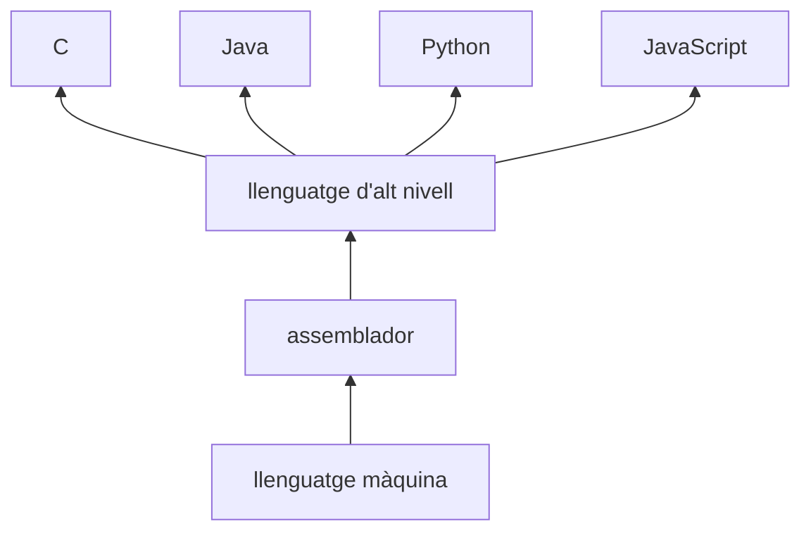

---
hide:
  - navigation
---

<!--
RA1
CA treballats: e.
-->

# Llenguatges de programació

Un equip no tria un llenguatge perquè n'hi haja un de millor en tots els casos. C, Java, Python i JavaScript permeten construir programes, però ofereixen abstraccions, ecosistemes i formes d'execució diferents. Conéixer aquestes diferències ajuda a justificar decisions tècniques.

## Tres capes de llenguatge

El **llenguatge màquina** està format per instruccions codificades per a una família concreta de processadors. És el format que la CPU pot executar directament, però resulta molt poc pràctic per a les persones.

L'**assemblador** utilitza mnemònics que representen instruccions de la CPU. És més llegible que el codi màquina, però continua estant molt lligat a l'arquitectura i obliga a controlar molts detalls.

Els **llenguatges d'alt nivell** ofereixen construccions més pròximes a la manera de pensar un problema: funcions, classes, mòduls, excepcions o col·leccions. C és d'alt nivell encara que permet un control més pròxim de la memòria i el maquinari que Java o Python.

La paraula *nivell* descriu l'abstracció, no la qualitat. Un llenguatge més pròxim al maquinari no és automàticament millor; és més adequat per a uns requisits concrets.

## Compilat i interpretat: models, no etiquetes absolutes

En el model clàssic, un **compilador** transforma el codi font en un altre format abans de l'execució. En el model clàssic, un **intèrpret** llig o processa el codi durant l'execució. Aquestes idees són útils, però les implementacions modernes combinen compilació, interpretació, optimització i memòria cau.

Per exemple:

- C es compila habitualment a codi màquina natiu per a una plataforma.
- Java es compila normalment a *bytecode*, que després gestiona la JVM.
- CPython transforma internament el codi en *bytecode* i el processa amb una màquina virtual.
- Els motors moderns de JavaScript interpreten i també compilen parts del programa amb JIT (*Just-In-Time*).

!!! warning "No confongues"
    «Compilat» i «interpretat» descriu sobretot com una implementació executa el llenguatge. No és una propietat absoluta que permeta classificar per sempre tot el que es fa amb un llenguatge.

## Paradigmes de programació

Un **paradigma** és una manera d'organitzar i expressar la solució.

### Imperatiu i procedimental

El programa descriu instruccions i canvis d'estat en un ordre. La programació procedimental agrupa aquestes instruccions en procediments o funcions. Un script Python que llig un fitxer, el transforma i el guarda segueix habitualment aquest estil.

### Orientat a objectes

Organitza el programa al voltant d'objectes que combinen dades i operacions. Java l'utilitza de manera central, mentre que Python i JavaScript també ofereixen mecanismes orientats a objectes.

### Funcional

Prioritza funcions, composició i transformacions de dades, i intenta reduir els canvis d'estat inesperats. Java, Python i JavaScript tenen funcions d'ordre superior i construccions funcionals, encara que no siguen llenguatges exclusivament funcionals.

### Declaratiu

Descriu què volem obtindre més que no cada pas per obtindre-ho. Una consulta SQL que demana les reserves d'un client és un exemple declaratiu: el motor decideix el pla d'execució.

Molts llenguatges són **multiparadigma**. Un projecte JavaScript pot combinar funcions, objectes i fluxos declaratius; la pregunta important és quin estil fa més clara i mantenible la solució.

## Tipatge

El **tipatge estàtic** comprova els tipus principalment abans d'executar, sovint durant la compilació. Java i C són exemples habituals. El compilador pot detectar que intentem passar un text a una funció que espera un enter.

En el **tipatge dinàmic**, part de la informació dels tipus es comprova durant l'execució. Python i JavaScript són habitualment dinàmics. Això facilita experimentar, però fa especialment important escriure proves i controlar les dades d'entrada.

Les expressions «fort» i «feble» són més ambigües perquè depenen de quines conversions permet el llenguatge i de com es defineixen. No les tractarem com una escala universal. Per comparar projectes, és més útil preguntar quan es comproven els tipus, quines conversions automàtiques hi ha i quines garanties ofereixen les ferramentes.

## Com triem un llenguatge?

Imagina diversos escenaris:

- Per a una part d'un sistema operatiu o un microcontrolador, C pot ser adequat pel control de recursos i el rendiment.
- Per a un backend empresarial, Java pot aportar un ecosistema ampli, biblioteques i ferramentes de construcció madures.
- Per a automatització, scripts i ciència de dades, Python sol permetre avançar ràpidament gràcies al seu ecosistema.
- Per a la lògica que executa el navegador, JavaScript és essencial; també es pot utilitzar en servidor amb Node.js.
- En una aplicació mòbil o multiplataforma, la decisió dependrà del sistema objectiu, el framework i les capacitats de l'equip.

La decisió ha de considerar l'ecosistema, el rendiment requerit, la plataforma, les biblioteques, la facilitat de manteniment, l'experiència de l'equip, la seguretat i la vida prevista del projecte. Una reserva web pot combinar JavaScript en la interfície, Java o Python en el servidor i SQL per consultar les dades.

## Comparació orientativa

| Llenguatge | Tipatge habitual | Paradigmes habituals | Execució habitual | Usos freqüents |
| --- | --- | --- | --- | --- |
| C | Estàtic | Imperatiu, procedimental | Compilació a codi natiu | Sistemes, dispositius, biblioteques de baix nivell |
| Java | Estàtic | Orientat a objectes, funcional | Bytecode i JVM | Backend, aplicacions empresarials, Android històric |
| Python | Dinàmic | Imperatiu, orientat a objectes, funcional | Bytecode i màquina virtual de Python | Automatització, dades, backend, docència |
| JavaScript | Dinàmic | Imperatiu, funcional, orientat a objectes | Motor amb interpretació i JIT | Navegador, frontend i Node.js |

La taula resumeix usos habituals, no limita el que es pot fer. La tecnologia disponible i les necessitats del projecte poden canviar la decisió.

## Idees clau

- Els llenguatges són capes d'abstracció sobre el maquinari.
- C és un llenguatge d'alt nivell, però més pròxim al maquinari que Java o Python.
- Compilat i interpretat són models útils, però una implementació moderna pot combinar tècniques.
- Els paradigmes descriuen maneres d'organitzar solucions; molts llenguatges són multiparadigma.
- Java té tipatge estàtic; Python i JavaScript, dinàmic; C, estàtic.
- La tria depén dels requisits, l'ecosistema, la plataforma i l'equip, no d'una classificació universal de llenguatges.

## Continua

El llenguatge permet escriure la solució, però encara falta saber com arriba a la CPU. Això és el que estudiarem en [Del codi font a l'execució](03-codi-execucio.md).
