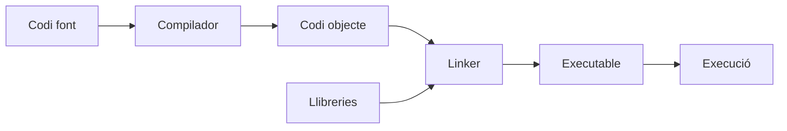
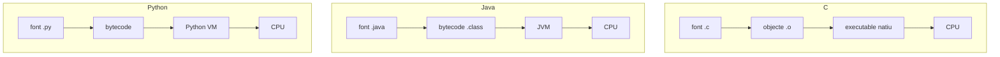

---
hide:
  - navigation
---

<!--
RA1
CA treballats: c i d. Reforç de CA a i e.
-->

# Del codi font a l'execució

Quan guardes un fitxer `Hola.java`, encara no tens un programa que la CPU puga executar directament. Entre el text que manté el desenvolupador i l'execució intervenen compiladors, enllaçadors, formats intermedis, màquines virtuals i el sistema operatiu. Distingir aquests passos evita confusions molt habituals.

## Codi font

El **codi font** és el text escrit i mantingut pel desenvolupador. Expressa la solució amb les regles d'un llenguatge i pot estar repartit en molts fitxers:

```text
hola.c       → font C
Hola.java    → font Java
hola.py      → font Python
app.js       → font JavaScript
```

El codi font és llegible per a les persones, es versiona amb Git i es revisa en l'equip. No és sinònim de programa en execució: és una entrada per a les ferramentes que preparen o processen el programa.

## Codi objecte

En una compilació nativa, el compilador pot transformar cada fitxer de codi font en **codi objecte**. Aquest codi ja conté instruccions de baix nivell per a una arquitectura, però encara pot tindre referències a funcions o llibreries que no s'han resolt.

Els fitxers solen tindre extensions com `.o` en sistemes Unix o `.obj` en altres entorns.

!!! warning "No confongues"
    El **codi objecte** és un artefacte intermedi d'una compilació. No té relació amb els objectes de la programació orientada a objectes.

## Enllaç o *linking*

El **linker** o enllaçador combina fitxers objecte i llibreries per resoldre referències i construir un executable. Una funció com `printf` pot estar definida en una llibreria que el programa necessita utilitzar.



El procés real pot incloure enllaç estàtic o dinàmic, diferents formats i opcions de plataforma. En aquesta unitat ens interessa la responsabilitat de cada peça, no memoritzar totes les opcions del linker.

## Codi executable

Un **codi executable** és un programa preparat perquè el sistema operatiu el carregue i el pose en execució. En una compilació nativa, conté codi màquina destinat a una arquitectura i un sistema concret. Un executable construït per a Linux i una arquitectura determinada no té per què funcionar en Windows o en un processador diferent.

### Exemple amb C

```c
#include <stdio.h>

int main() {
    printf("Hola món\n");
    return 0;
}
```

Conceptualment, podem fer:

```bash
gcc -c hola.c        # genera hola.o
gcc hola.o -o hola   # enllaça i genera l'executable hola
./hola               # executa el programa
```

La primera ordre compila sense enllaçar. La segona utilitza `gcc` com a driver per enllaçar el fitxer objecte amb les llibreries necessàries. La tercera demana al sistema operatiu que carregue l'executable.

## Codi intermedi i màquines virtuals

Un executable natiu està molt lligat a la plataforma. El **codi intermedi** intenta separar el codi font de la CPU concreta. El compilador produeix un format intermedi i una **màquina virtual** s'encarrega de carregar-lo i executar-lo en cada sistema compatible.

```text
codi font
    ↓
compilador
    ↓
codi intermedi
    ↓
màquina virtual
    ↓
codi màquina / CPU
```

La portabilitat no és màgia: cal disposar de la màquina virtual, les llibreries i una implementació compatible. També pot haver-hi diferències de sistema de fitxers, permisos o versions.

## Java i la JVM

En Java, `javac` transforma el codi font en **bytecode**, normalment en un fitxer `.class`. El bytecode és codi intermedi destinat a la **JVM** (*Java Virtual Machine*), no codi objecte natiu de la CPU.

```text
Hola.java
   ↓ javac
Hola.class
   ↓
bytecode
   ↓
JVM
   ↓
execució en la plataforma
```

Les ordres bàsiques són:

```bash
javac Hola.java
java Hola
```

`javac` compila i `java` inicia la JVM per executar la classe. La JVM proporciona serveis com la càrrega de classes, la gestió de memòria i la comprovació de formats. Les JVM modernes poden aplicar **JIT** (*Just-In-Time*): compilen a codi natiu, durant l'execució, les parts que s'utilitzen molt.

La frase «write once, run anywhere» expressa la intenció de portar el mateix bytecode a diverses plataformes, però no és una garantia absoluta. El programa encara depén de la versió de Java, les llibreries, la configuració i els serveis externs.

## Python i CPython

Dir simplement que Python «s'interpreta línia a línia» és una simplificació massa pobra. En la implementació habitual, **CPython**, el fitxer `.py` es transforma de manera simplificada en bytecode i una màquina virtual de Python el processa.

```text
hola.py
   ↓ compilació interna
bytecode
   ↓
màquina virtual de Python
   ↓
execució
```

La carpeta `__pycache__` i els fitxers `.pyc` poden fer observable una part d'aquest procés. La implementació, la versió i la manera d'executar poden afectar què es genera i quan. El model no significa que Python siga portable sense cap dependència: també necessita l'intèrpret i les biblioteques adequades.

## JavaScript i JIT

En un navegador, el motor JavaScript rep el codi de la pàgina i el prepara per executar-lo. En Node.js, un motor semblant treballa fora del navegador. Els motors moderns combinen interpretació, anàlisi, optimització i compilació JIT de fragments que s'executen repetidament.

Per tant, JavaScript no s'ha de presentar només com un llenguatge «interpretat». La implementació decideix quina estratègia és més adequada per al codi i el context.

## Tres camins d'execució



## Compilador, intèrpret i màquina virtual

- Un **compilador** tradueix el codi font a un altre format abans o durant una fase de construcció.
- Un **intèrpret** processa instruccions per executar-les en un entorn d'execució.
- Una **màquina virtual** ofereix un entorn que rep codi intermedi i coordina la seua execució sobre un sistema real.

Una implementació pot combinar els tres papers. El que importa és descriure el recorregut concret: font, transformació, artefacte resultant, entorn d'execució i plataforma.

## Idees clau

- El codi font és el text que escriu i manté el desenvolupador.
- El codi objecte és un resultat intermedi habitual de la compilació nativa i pot necessitar enllaç.
- L'executable està preparat per ser carregat pel sistema operatiu, normalment per a una plataforma concreta.
- El bytecode és codi intermedi destinat a una màquina virtual; no s'ha d'anomenar codi objecte indistintament.
- Java segueix habitualment el camí `font → javac → bytecode → JVM`.
- CPython i els motors JavaScript moderns també utilitzen processos interns més complexos que la dicotomia compilat/interpretat.

## Continua

Ja podem seguir el recorregut complet, des d'una necessitat fins a una aplicació mantinguda, en [Cicle de desenvolupament del programari](04-cicle-desenvolupament.md).
