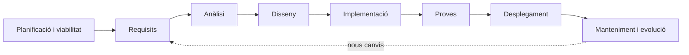
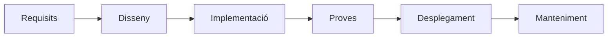

---
hide:
  - navigation
---

<!--
RA1
CA treballats: b.
-->

# Cicle de desenvolupament del programari

Programar és només una part del desenvolupament. Una aplicació de reserves necessita entendre el problema, acordar què ha de fer, dissenyar una solució, escriure-la, provar-la, desplegar-la i mantindre-la. Veure el conjunt ajuda a entendre per què existeixen tantes ferramentes i perfils en un equip.

## Del problema al producte

Una empresa demana: «Necessitem una aplicació web per gestionar reserves». Aquesta frase encara no és un projecte executable. Cal concretar qui reservarà, quines dades es guardaran, què passarà si dues persones trien la mateixa plaça i com es protegiran les dades.

La pregunta professional és: **com transformem una necessitat en un producte que es puga utilitzar i evolucionar?**

## Fases habituals

### 1. Planificació i viabilitat

Es delimita el problema, el temps, el pressupost, els riscos i els recursos. L'estudi de viabilitat pregunta si la solució és tècnicament possible, assumible econòmicament i adequada per a l'organització.

### 2. Recollida i anàlisi de requisits

Els **requisits funcionals** descriuen què ha de fer el sistema: crear una reserva, cancel·lar-la, consultar disponibilitat o enviar una confirmació.

Els **requisits no funcionals** descriuen propietats o restriccions: temps de resposta, seguretat, accessibilitat, compatibilitat, disponibilitat o capacitat.

En l'anàlisi es busca entendre el problema i les regles del negoci sense decidir encara tots els detalls tècnics. Un requisit ambigu com «l'aplicació ha de ser ràpida» s'ha de convertir en una condició observable.

### 3. Disseny

El disseny decideix com s'organitzarà la solució: arquitectura, dades, interfícies, components i comunicacions. Per a la plataforma de reserves podríem separar una interfície web, una API, una base de dades i un servei de notificacions.

En altres unitats relacionarem aquests elements amb UML, però ara ens interessa la funció del disseny: reduir decisions improvisades abans i durant la implementació.

### 4. Implementació

És la construcció de la solució mitjançant codi, configuració i recursos. Inclou aplicar convencions, treballar en un **repositori**, revisar canvis i preparar els artefactes que després es provaran.

Implementar no és només «escriure línies». També implica triar noms clars, dividir responsabilitats, gestionar errors i deixar un historial que permeta entendre què ha canviat.

### 5. Proves

Les proves comproven que el sistema respon als requisits i que els canvis no han trencat comportaments anteriors. De manera introductòria:

- les proves unitàries comproven peces xicotetes i aïllades;
- les proves d'integració comproven la relació entre components;
- les proves de sistema o funcionals comproven el comportament de l'aplicació completa des d'un punt de vista proper a l'usuari.

Les proves s'estudiaran amb més profunditat en una UP posterior, però ja podem veure que no són l'últim tràmit: influeixen en el disseny i en la confiança del desplegament.

### 6. Desplegament

**Desplegar** és portar l'aplicació a un entorn on puga ser utilitzada: un servidor de proves, una màquina virtual, un contenidor o una plataforma al núvol. Cal preparar configuració, dependències, dades, permisos, xarxa i una manera de comprovar el resultat.

### 7. Documentació

La documentació explica com instal·lar, configurar, utilitzar i mantindre el sistema. Pot incloure un README, decisions tècniques, un contracte d'API, instruccions de desplegament o una guia de resolució d'incidències.

### 8. Manteniment i evolució

Després del desplegament, el programari continua viu. El manteniment inclou corregir errors, adaptar-se a canvis de sistema o normativa, millorar el comportament i afegir funcionalitats. Una incidència registrada pot convertir-se en una tasca del següent cicle.

## Un procés iteratiu

El model seqüencial és útil per visualitzar les fases:

Però en un projecte real és habitual descobrir durant les proves que una decisió no funciona o que les persones usuàries necessiten una altra cosa. Per això les fases poden repetir-se i solapar-se. Un primer increment de la plataforma podria permetre crear i consultar reserves; un altre podria afegir cancel·lacions i notificacions.

## Artefactes de cada fase

| Fase | Exemples d'artefactes |
| --- | --- |
| Planificació i requisits | Abast, requisits, històries d'usuari, criteris d'acceptació |
| Anàlisi i disseny | Arquitectura, esquemes de dades, diagrames, *mockups* |
| Implementació | Codi font, configuració, commits, paquets |
| Proves | Casos de prova, resultats, informes d'incidències |
| Desplegament | *Build*, imatge de contenidor, configuració i registre de versions |
| Manteniment | Issues, correccions, documentació actualitzada i noves versions |

Els artefactes fan visible el treball i permeten que una altra persona repetisca o revise el procés.

## Idees clau

- El desenvolupament inclou molt més que implementar codi.
- Les fases habituals són planificació, requisits, anàlisi, disseny, implementació, proves, desplegament, documentació i manteniment.
- Els requisits funcionals descriuen comportaments; els no funcionals, propietats i restriccions.
- El cicle no sempre és lineal: el feedback pot fer tornar a requisits o disseny.
- Cada fase produeix artefactes que ajuden a comunicar, provar i mantindre el sistema.

## Continua

Per fer possible aquest cicle, l'equip necessita un conjunt coordinat d'[Ferramentes de desenvolupament](05-ferramentes-desenvolupament.md).
