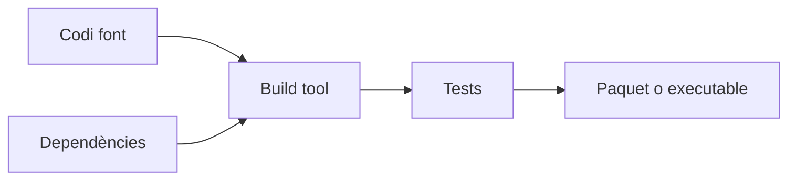
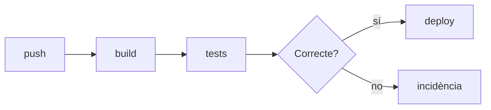
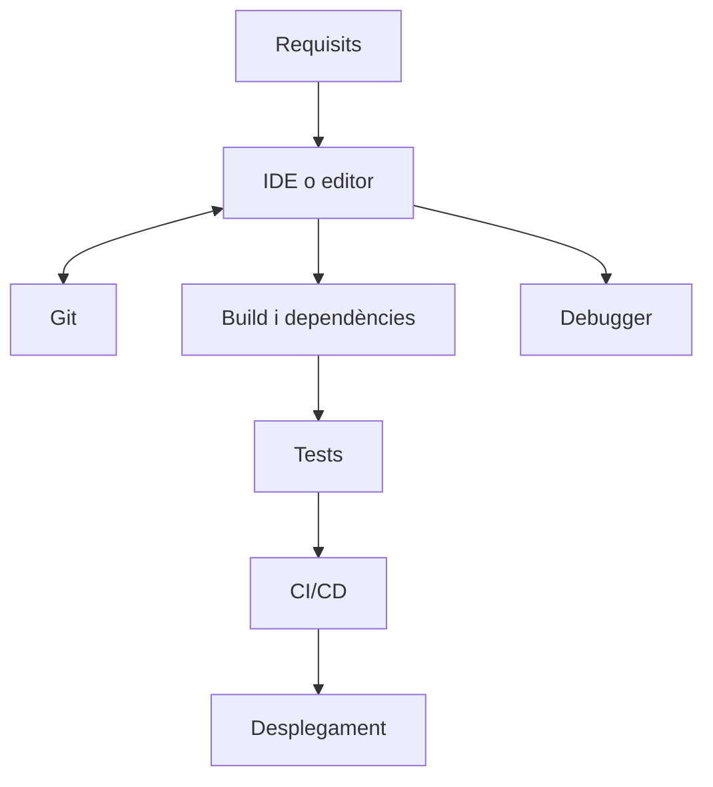

---
hide:
  - navigation
---

<!--
RA1
CA treballats: f. Reforç de CA b, c i d.
-->

# Ferramentes de desenvolupament

En un projecte professional, el codi és només una part de l'ecosistema. L'equip edita, construeix, prova, depura, documenta, versiona i desplega. Conéixer la funció de cada ferramenta és més útil que memoritzar una llista de marques.

<!-- IMATGE SUGGERIDA:
Captura o il·lustració d'un IDE amb editor, terminal, panell de proves i debugger visibles.
Objectiu didàctic: mostrar que un IDE integra diverses ferramentes en un mateix entorn.
-->

## De l'editor a l'ecosistema

Un **editor de text** permet modificar fitxers. Un **editor de codi** afegeix ressaltat de sintaxi, indentació, cerca i navegació. Un **IDE** (*Integrated Development Environment*) integra aquestes funcions amb compilació o *build*, depuració, proves, terminal, extensions i gestió del projecte.

VS Code, IntelliJ IDEA, Eclipse i PyCharm són exemples d'entorns amb funcions diferents i ampliables. Un IDE no substitueix el sistema operatiu, el JDK, l'intèrpret de Python, Git ni les dependències: els coordina i els fa més accessibles.

## Funcions habituals d'un IDE

En un mateix entorn podem trobar:

- editor, ressaltat de sintaxi i autocompletat;
- navegació entre fitxers, funcions i usos;
- refactorització amb canvis controlats;
- compilació i tasques de *build*;
- terminal integrada;
- *debugger* amb punts d'interrupció i execució pas a pas;
- integració amb Git;
- extensions o plugins;
- execució i visualització de proves.

La UP1 ja ha tractat la instal·lació i configuració d'IDE. En aquesta UP ens interessa entendre com encaixa l'IDE en el cicle complet.

## Compiladors i intèrprets

Les ferramentes de llenguatge preparen o executen el codi. `gcc` pot compilar C i enllaçar-lo; `javac` genera bytecode Java; `java` inicia la JVM; `python` inicia l'entorn de Python; Node.js executa JavaScript fora del navegador.

El botó «Run» d'un IDE no fa desaparèixer aquests components. Normalment executa ordres semblants a les de la terminal, amb una configuració concreta. Per diagnosticar un error és útil saber quina orde real s'ha executat i amb quin entorn.

## *Build tools* i gestors de dependències

Un sistema de construcció o **build tool** automatitza tasques repetitives: compilar, copiar recursos, executar proves i empaquetar. Maven i Gradle són habituals en Java; npm gestiona projectes i paquets JavaScript; pip instal·la paquets Python.

Una **dependència** és codi extern que el projecte necessita. El gestor pot descarregar-la, registrar-ne la versió i integrar-la en la construcció. Això fa reproduïble el projecte, però també exigeix revisar versions, llicències i riscos de seguretat.

## Control de versions

**Git** registra l'evolució del projecte. Un **repositori** conté el codi i el seu historial; un **commit** representa un conjunt coherent de canvis; una **branca** permet treballar en una línia de desenvolupament; un repositori remot facilita compartir el treball.

El control de versions permet revisar qui va canviar què, comparar versions i recuperar un estat anterior. No és només una còpia de seguretat: és una ferramenta de coordinació i traçabilitat.

## Proves i *debugger*

JUnit, pytest i Jest són exemples de ferramentes de proves. Automatitzar proves permet repetir-les després d'un canvi i detectar regressions amb rapidesa.

El **debugger** ajuda a observar una execució concreta. Un *breakpoint* pausa el programa; l'execució pas a pas permet seguir les instruccions; la inspecció de variables mostra valors; la *call stack* indica quines funcions han conduït fins al punt actual.

!!! tip "En la pràctica"
    Si un programa falla només amb certes dades, no comences afegint `print` a tot arreu. Reprodueix el cas, posa un breakpoint prop de l'error i observa les dades i la pila de crides.

## Documentació i coordinació

Un projecte professional sol incloure un `README` amb objectiu, requisits i instruccions. També pot incloure comentaris justificats, documentació d'API, Javadoc o una guia de desplegament.

La gestió de tasques connecta el treball tècnic amb les prioritats del projecte. GitHub Issues, Trello i Jira poden registrar errors, funcionalitats, responsables i estat. Una ferramenta no substitueix la comunicació: l'equip ha d'acordar què significa una tasca acabada.

## CI/CD

La integració i el lliurament continus automatitzen comprovacions quan es puja codi a un repositori.

**CI/CD** no vol dir necessàriament desplegar automàticament a producció en cada commit. Pot significar construir i provar sempre, i deixar el desplegament pendent d'una aprovació o d'altres controls.

## Una visió integrada

### La ferramenta adequada per a cada situació

- El programa falla amb unes dades concretes: debugger, logs i proves de regressió.
- Dos desenvolupadors modifiquen el mateix projecte: Git, branques i revisió de canvis.
- Cal instal·lar una llibreria: gestor de dependències i fitxer de configuració del projecte.
- Volem evitar que un canvi trenque el que ja funcionava: proves automatitzades i CI.
- Necessitem generar un executable o paquet: compilador o build tool amb una configuració reproduïble.

La millor ferramenta és la que resol el problema amb un procediment comprensible i repetible, no necessàriament la més complexa.

## Idees clau

- Un IDE integra ferramentes, però no és tot l'entorn d'execució.
- Compiladors, intèrprets i màquines virtuals transformen o executen el codi.
- Els build tools automatitzen compilació, proves, dependències i empaquetatge.
- Git aporta historial, branques i coordinació del treball.
- El debugger permet observar una execució; les proves permeten comprovar comportaments repetibles.
- La documentació, la gestió de tasques i CI/CD connecten el codi amb l'equip i el desplegament.

## Continua

Les ferramentes fan possible el treball, però encara cal decidir com s'organitza. En [Metodologies àgils de desenvolupament](06-metodologies-agils.md) veurem com planificar i adaptar el projecte.
