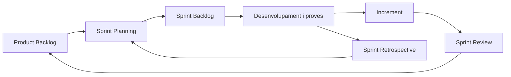

---
hide:
  - navigation
---

<!--
RA1
CA treballats: g. Reforç de CA b.
-->

# Metodologies àgils de desenvolupament

Els projectes de programari treballen amb informació incompleta i necessitats que canvien. Una aplicació de reserves pot començar amb una idea i, després de veure un primer prototip, descobrir que el negoci necessita cancel·lacions, llistes d'espera o integració amb un calendari. Agile apareix per gestionar aquest aprenentatge, no per eliminar la planificació.

## El problema de predir-ho tot al principi

Imagina que l'equip tanca tots els requisits durant sis mesos i només mostra el producte al final. Si les persones usuàries detecten aleshores que el flux de reserva és confús, corregir-lo serà car perquè moltes decisions ja depenen d'aquell disseny.

El problema no és planificar. El problema és tractar les primeres hipòtesis com si foren coneixement definitiu i retardar el feedback fins al final.

## Model seqüencial o en cascada

En un model en cascada, les fases s'organitzen principalment en seqüència: requisits, disseny, implementació, proves i desplegament. Pot ser útil quan els requisits són estables, hi ha molta regulació o cal una documentació i una planificació formal.

Les limitacions apareixen quan el canvi és probable: el feedback arriba tard, els errors de les primeres decisions es descobreixen quan corregir-los és més car i el producte pot deixar de reflectir la necessitat real.

No és correcte presentar la cascada com a «incorrecta». És un enfocament amb avantatges i riscos diferents dels d'un enfocament iteratiu.

## Filosofia Agile

Agile és una família de principis i maneres de treballar que prioritza:

- lliurar valor en increments menuts;
- obtindre feedback freqüent de les persones interessades;
- col·laborar entre negoci i equip tècnic;
- adaptar el pla quan apareix informació nova;
- mantindre una comunicació clara i un programari que es puga provar.

Els quatre valors del Manifest Àgil es poden resumir així: es prioritzen les persones i les interaccions per damunt dels processos rígids; el programari que funciona per damunt de la documentació excessiva; la col·laboració amb el client per damunt de la negociació tancada; i la resposta al canvi per damunt de seguir un pla immutable. Els elements de la dreta continuen tenint valor: simplement no són la prioritat superior.

## Iteratiu i incremental

Una **iteració** és un període de treball en què l'equip planifica, construeix, prova i revisa. Un **increment** és una part del producte que aporta funcionalitat utilitzable.

En una aplicació de tasques, els increments podrien ser:

```text
Increment 1 → crear tasques
Increment 2 → marcar tasques com a completades
Increment 3 → comptes d'usuari
Increment 4 → compartir tasques
```

Cada increment hauria de deixar el producte en un estat comprensible i verificable. Iterar no significa lliurar treball inacabat sense criteri; significa aprendre i afegir valor en passos controlats.

## Scrum

**Scrum** és un marc de treball àgil. No és sinònim d'Agile: Agile és el conjunt més ampli de principis, i Scrum és una manera concreta d'organitzar part del treball.

### Responsabilitats

- **Product Owner**: maximitza el valor del producte i ordena les prioritats del Product Backlog.
- **Scrum Master**: ajuda a entendre i aplicar Scrum, facilita la millora i elimina impediments quan és possible.
- **Developers**: creen l'increment, incloent-hi anàlisi, codi, proves i les tasques necessàries per aconseguir un resultat de qualitat.

### Artefactes

- **Product Backlog**: llista ordenada de necessitats, millores i problemes coneguts.
- **Sprint Backlog**: objectiu i treball seleccionat per al Sprint.
- **Increment**: resultat integrat que compleix la definició de fet acordada.

### Esdeveniments

Un **Sprint** és un període de duració fixa. En el *Sprint Planning* es decideix l'objectiu i el treball inicial; en el *Daily Scrum* l'equip inspecciona el progrés; en la *Sprint Review* mostra el resultat i recull feedback; en la *Sprint Retrospective* revisa com ha treballat i acorda millores.



Scrum no obliga totes les empreses a reunir-se igual ni resol per si sol els problemes de requisits, qualitat o comunicació. El marc necessita criteri i adaptació al context.

## Històries d'usuari

Una història d'usuari és una forma breu de comunicar una necessitat:

```text
Com a [tipus d'usuari]
vull [funcionalitat]
per a [benefici].
```

Per exemple:

```text
Com a client
vull cancel·lar una reserva
per a poder alliberar la plaça si finalment no puc assistir.
```

La història ajuda a parlar del valor i pot acompanyar-se de criteris d'acceptació. No és una especificació completa: cal aclarir permisos, errors, dades, límits i comportaments alternatius.

## Kanban

**Kanban** visualitza el treball i busca un flux sostenible. Un tauler senzill pot tindre aquestes columnes:

```text
| Pendent | En curs | Revisió | Fet |
```

L'equip limita el treball en curs (*Work In Progress*, WIP) per evitar començar massa coses i acabar-ne poques. Quan una tasca passa a revisió, es prioritza desbloquejar eixa columna abans d'afegir nou treball.

## Scrum i Kanban

| Aspecte | Scrum | Kanban |
| --- | --- | --- |
| Ritme | Sprints amb duració definida | Flux continu |
| Planificació | Treball seleccionat per a l'Sprint | Entrada segons capacitat i prioritats |
| Canvis | Normalment es protegeix l'objectiu del Sprint | Es poden introduir quan hi ha capacitat o una política acordada |
| Control principal | Objectiu i increment del Sprint | Límit de treball en curs i temps de flux |

No cal proclamar un guanyador. Scrum pot ajudar un equip que necessita un ritme i esdeveniments clars; Kanban pot encaixar millor en suport, manteniment o treball que arriba de manera contínua. També es poden combinar pràctiques.

## Quan té sentit Agile?

Els enfocaments àgils solen aportar valor en productes digitals en evolució, startups, aplicacions web i equips que necessiten validar sovint amb persones usuàries. Són especialment útils quan l'equip pot entregar increments i obtindre feedback real.

No són suficients per si sols en sistemes crítics, entorns amb regulació forta, contractes molt rígids o projectes amb dependències externes importants. En aquests casos cal combinar iteracions amb documentació, traçabilitat, aprovacions, controls de qualitat i gestió formal del risc.

## Com treballa realment un equip?

```text
necessitat
    ↓
backlog
    ↓
selecció de treball
    ↓
desenvolupament
    ↓
proves
    ↓
feedback
    ↓
nou increment
```

El cicle connecta tota la UP: la necessitat es concreta en requisits; el llenguatge i el codi implementen la solució; les ferramentes permeten construir-la, provar-la i versionar-la; el sistema informàtic l'executa; i el feedback inicia una nova decisió.

## Idees clau

- Agile respon a la incertesa amb iteracions, feedback, col·laboració i valor incremental.
- La cascada pot ser adequada amb requisits estables o controls formals; no és universalment incorrecta.
- Iterar és repetir un cicle de treball; incrementar és afegir valor utilitzable al producte.
- Scrum és un marc àgil i Kanban és una manera de gestionar el flux; cap dels dos és sinònim de tota la filosofia Agile.
- Les històries d'usuari faciliten la conversa, però no substitueixen els criteris d'acceptació i els requisits detallats.
- El mètode s'ha d'adaptar al producte, l'equip, la regulació i el risc.

## Tanca la unitat

Has recorregut el camí complet: de la necessitat i el backlog al codi, les ferramentes, l'execució i el feedback. Pots tornar a l'[índex de la UP2](index.md) i utilitzar-lo per repassar els conceptes en ordre.
