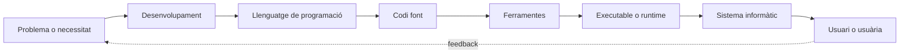

---
hide:
  - navigation
---

<!--
RA1
CA treballats: a, b, c, d, e, f i g.
-->

# UP2. Desenvolupament de programari

## Una visió global

Quan una persona obri una aplicació web, només veu el resultat final: una pàgina, un formulari o una resposta. Darrere d'eixe resultat hi ha un recorregut complet. Una necessitat es concreta en requisits; els requisits es transformen en codi; el codi passa per ferramentes de desenvolupament i, finalment, el sistema operatiu coordina la seua execució en el processador i la memòria.

```text
Necessitat
    ↓
Desenvolupament
    ↓
Codi font
    ↓
Ferramentes
    ↓
Compilació / interpretació
    ↓
Execució
    ↓
CPU + memòria + sistema operatiu
```

Aquest procés no és una cadena purament tècnica. També cal decidir què es construirà, com es comprovarà, com es compartirà el codi i com s'organitzarà el treball de l'equip. Les metodologies tradicionals i àgils ofereixen maneres diferents de planificar i adaptar aquest recorregut.



## Què aprendrem?

En acabar aquesta unitat hauràs de poder:

- entendre què ocorre quan executes un programa i com intervenen el sistema operatiu, la memòria, el processador i els perifèrics;
- diferenciar el codi font, el codi objecte, el codi executable i el codi intermedi;
- explicar per què Java utilitza una màquina virtual i comparar-ho amb els models habituals de C, Python i JavaScript;
- classificar llenguatges segons l'abstracció, els paradigmes, el tipatge i la manera habitual d'executar-los;
- reconéixer les fases que transformen una necessitat en una aplicació desplegada i mantinguda;
- identificar la funció d'un IDE, un compilador, un gestor de dependències, Git, un debugger i una pipeline de CI/CD;
- entendre per què un equip pot organitzar-se amb enfocaments iteratius i àgils, i quan convé combinar-los amb més planificació i controls.

## Itinerari de la unitat

1. [Del programa al sistema informàtic](01-programa-sistema.md): què passa en executar una aplicació.
2. [Llenguatges de programació](02-llenguatges-programacio.md): diferents maneres d'expressar solucions.
3. [Del codi font a l'execució](03-codi-execucio.md): compilació, codi intermedi i màquines virtuals.
4. [Cicle de desenvolupament del programari](04-cicle-desenvolupament.md): fases i artefactes d'un projecte.
5. [Ferramentes de desenvolupament](05-ferramentes-desenvolupament.md): l'ecosistema que ajuda l'equip.
6. [Metodologies àgils de desenvolupament](06-metodologies-agils.md): planificació, feedback i adaptació.

El fil conductor serà una aplicació web de **gestió de reserves**. Ens permetrà relacionar requisits, codi, proves, desplegament i treball d'equip sense tractar cada concepte com una definició aïllada.

!!! tip "En la pràctica"
    Quan analitzes una aplicació, pregunta't sempre tres coses: quin problema resol, quines ferramentes s'han utilitzat i què passa en el sistema quan l'aplicació s'executa.

[Començar per programa i sistema informàtic](01-programa-sistema.md)
