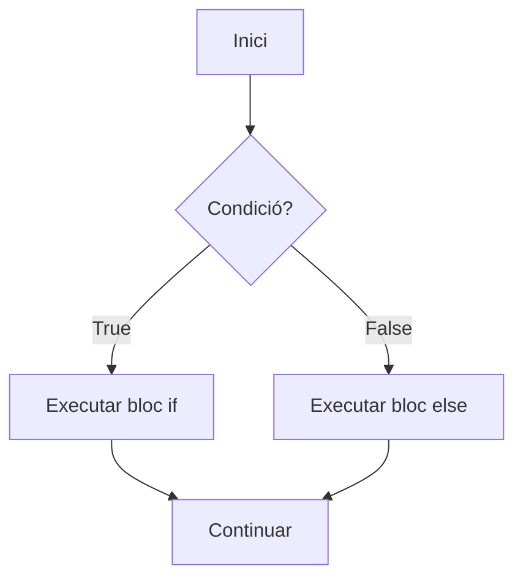

---
hide:
  - navigation
---
# 1. Estructures de selecció

!!! info "Criteris d'avaluació treballats"
    - **RA3.a** — S'ha escrit i provat codi que faça ús d'estructures de selecció.

Les estructures de selecció permeten que un programa trie entre diferents camins d'execució. En lloc d'executar sempre les mateixes instruccions, el programa avalua una condició i actua segons el resultat.

## Flux d'execució

Per defecte, Python executa les instruccions de dalt cap avall i una vegada cada una. Una selecció altera aquest recorregut: algunes instruccions només s'executen quan es compleix una condició.

```python
temperatura = 31

if temperatura > 30:
    print("Activa la refrigeració")

print("Lectura finalitzada")
```

La primera instrucció `print()` només s'executa si `temperatura > 30`. La segona s'executa sempre.



### Blocs i indentació

En Python, la indentació forma part de la sintaxi. Una capçalera acabada en dos punts (`:`) obri un bloc, i totes les instruccions del bloc han de tindre la mateixa indentació. La convenció habitual és utilitzar quatre espais i no barrejar espais amb tabuladors.

```python
temperatura = 31

if temperatura > 30:
    print("Temperatura elevada")
    print("Activa la refrigeració")

print("Lectura finalitzada")
```

Les dues primeres crides a `print()` pertanyen al `if`; l'última queda fora perquè torna al marge inicial. Una indentació incorrecta pot produir `IndentationError` o, pitjor encara, un programa vàlid que execute una instrucció en un bloc diferent del que pretenies.

## Expressions booleanes

Una expressió booleana és una expressió que produeix `True` o `False`. Python utilitza aquests dos valors per prendre decisions.

```python
servidor_actiu = True
connexions = 4

print(servidor_actiu)       # True
print(connexions > 0)       # True
print(connexions == 10)     # False
```

### Operadors de comparació

| Operador | Significat | Exemple |
| --- | --- | --- |
| `==` | igual que | `estat == "OK"` |
| `!=` | diferent de | `opcio != "eixir"` |
| `<` | menor que | `edat < 18` |
| `>` | major que | `preu > 100` |
| `<=` | menor o igual que | `nota <= 10` |
| `>=` | major o igual que | `nota >= 5` |

```python
nota = 7.5

print(nota >= 5)   # True
print(nota == 10)  # False
print(nota < 0)    # False
```

No confongues `=` amb `==`: `=` assigna un valor a una variable i `==` compara dos valors.

!!! warning "Error habitual"
    `if edat = 18:` és incorrecte perquè una assignació no pot ocupar el lloc d'una condició. Escriu `if edat == 18:` si vols comparar.

### Comparacions encadenades

Python permet escriure intervals de manera directa. La comparació següent comprova els dos límits sense repetir la variable:

```python
nota = 7.5

if 0 <= nota <= 10:
    print("Nota vàlida")
```

És equivalent a `nota >= 0 and nota <= 10`. Escriu els límits en l'ordre natural de lectura i evita cadenes massa llargues.

### Pertinença i identitat

`in` i `not in` comproven si un valor pertany a una seqüència o col·lecció. `is` comprova identitat, no igualtat; en aquest nivell s'utilitza sobretot amb `None`.

```python
rol = "editor"
rols_permesos = ["administrador", "editor"]
token = None

if rol in rols_permesos:
    print("Rol autoritzat")

if token is None:
    print("No hi ha cap token")
```

Utilitza `==` per comparar valors (`opcio == "eixir"`) i `is None` o `is not None` per comprovar l'absència d'un valor.

### Valors *truthy* i *falsy*

Una condició no necessita produir explícitament `True` o `False`. Python considera falsos, entre altres, `False`, `None`, zero, la cadena buida i les col·leccions buides. La resta de valors solen considerar-se certs.

```python
nom = ""

if not nom:
    print("El nom està buit")
```

Aquesta forma és clara per comprovar si una cadena o una col·lecció està buida. Quan el significat puga ser ambigu, escriu una comparació explícita.

### Operadors lògics

Els operadors lògics combinen expressions booleanes.

| Operador | És cert quan... | Exemple |
| --- | --- | --- |
| `and` | totes les condicions són certes | `edat >= 18 and te_targeta` |
| `or` | almenys una condició és certa | `dia == "dissabte" or dia == "diumenge"` |
| `not` | nega el resultat | `not compte_bloquejat` |

```python
edat = 20
te_credencial = True

if edat >= 18 and te_credencial:
    print("Accés autoritzat")
```

Agrupa les condicions amb parèntesis quan això faça més clara la intenció. `not` s'aplica abans que `and`, i `and` abans que `or`, però no depengues només de la prioritat: els parèntesis eviten lectures ambigües.

```python
dia = "dissabte"
te_reserva = False

pot_entrar = (dia == "dissabte" or dia == "diumenge") and te_reserva
```

Python pot deixar d'avaluar una part d'una expressió quan el resultat ja és conegut. Per exemple, en `condicio_a and condicio_b`, si `condicio_a` és falsa, no necessita comprovar `condicio_b`.

Aquest comportament, anomenat **avaluació de curtcircuit**, també permet protegir una operació:

```python
divisor = 0

if divisor != 0 and 100 / divisor > 10:
    print("Resultat superior a 10")
```

Com que `divisor != 0` és fals, Python no avalua la divisió i evita un `ZeroDivisionError`. L'ordre de les condicions és important: posa primer la comprovació que fa segura la següent expressió.

## L'estructura `if`

`if` executa un bloc només quan la seua condició és certa.

```python
edat = 20

if edat >= 18:
    print("Major d'edat")
```

La sintaxi necessita dos punts (`:`) al final de la capçalera i indentació en el bloc. Per convenció, s'utilitzen quatre espais.

### Exemple contextualitzat: permisos d'accés

```python
rol = "administrador"

if rol == "administrador":
    print("Pots gestionar els usuaris")
```

Si `rol` té un altre valor, el programa no mostra cap missatge. Això és correcte quan només interessa actuar en el cas autoritzat.

## `if-else`

`else` defineix el camí alternatiu, que s'executa quan la condició de `if` és falsa.

```python
edat = 16

if edat >= 18:
    print("Pot accedir")
else:
    print("No pot accedir")
```

Cada execució tria exactament un dels dos blocs.

## `if-elif-else`

Quan hi ha més de dues alternatives, `elif` permet provar condicions addicionals. Python comprova les condicions en ordre i executa el primer bloc que resulta cert.

```python
nota = 7.5

if nota < 5:
    qualificacio = "Suspés"
elif nota < 7:
    qualificacio = "Aprovat"
elif nota < 9:
    qualificacio = "Notable"
else:
    qualificacio = "Excel·lent"

print(qualificacio)
```

Amb `nota = 7.5`, la primera condició és falsa, la segona també, la tercera és certa i ja no es comprova `else`. Ordenar els intervals de menor a major fa visible que no hi ha solapaments.

### Intervals i condicions ben ordenades

```python
percentatge = 82

if percentatge < 0 or percentatge > 100:
    print("Percentatge no vàlid")
elif percentatge >= 90:
    print("Nivell alt")
elif percentatge >= 60:
    print("Nivell mitjà")
else:
    print("Nivell inicial")
```

La validació de l'interval va abans de classificar el valor. Si només escrivírem `if percentatge >= 60`, un valor com `140` quedaria classificat com a nivell alt encara que fora incorrecte.

## Condicions niades

Una condició niada és un `if` dins d'un altre bloc condicional. És útil quan la segona decisió només té sentit després de la primera.

```python
usuari_actiu = True
rol = "tècnic"

if usuari_actiu:
    if rol == "tècnic":
        print("Pot consultar els registres")
    else:
        print("Pot consultar el seu perfil")
else:
    print("El compte està desactivat")
```

No abuses del niament. Sovint pots expressar una regla amb una condició combinada o amb una guarda primerenca.

```python
if not usuari_actiu:
    print("El compte està desactivat")
elif rol == "tècnic":
    print("Pot consultar els registres")
else:
    print("Pot consultar el seu perfil")
```

La segona versió té menys nivells i manté l'ordre de les decisions.

## Expressions condicionals

Una expressió condicional tria un valor en una sola línia. Té la forma `valor_si_certa if condició else valor_si_falsa`.

```python
edat = 17
missatge = "major" if edat >= 18 else "menor"
print(missatge)
```

Utilitza-la per a decisions curtes. Si calen diverses instruccions o condicions, és més llegible un `if-else` normal.

## `match-case`

`match` és adequat quan cal comparar un mateix valor amb diversos patrons. Cada `case` descriu una alternativa.

```python
opcio = "consultar"

match opcio:
    case "consultar":
        print("Mostrant dades")
    case "actualitzar":
        print("Actualitzant dades")
    case "eixir":
        print("Tancant el programa")
    case _:
        print("Opció desconeguda")
```

El cas `_` és el comodí: coincideix amb qualsevol valor que no haja coincidit abans. Col·loca'l al final perquè, si apareix abans, impediria arribar als casos posteriors.

### Alternatives amb `|`

El símbol `|` permet agrupar diversos patrons en un mateix cas.

```python
dia = "diumenge"

match dia:
    case "dissabte" | "diumenge":
        print("Cap de setmana")
    case "dilluns" | "dimarts" | "dimecres" | "dijous" | "divendres":
        print("Dia laborable")
    case _:
        print("Dia no reconegut")
```

`match` resulta especialment clar per a opcions, estats o ordres discretes. `if` és més flexible per a intervals i condicions que combinen variables.

### Guardes en `match-case`

Una guarda afegeix una condició a un patró. Només s'executa el cas si coincideix el patró i la guarda és certa.

```python
estat = "reserva"
places = 2

match estat:
    case "reserva" if places > 0:
        print("Reserva disponible")
    case "reserva":
        print("No queden places")
    case "cancel·lada":
        print("La reserva està cancel·lada")
    case _:
        print("Estat desconegut")
```

Les guardes són útils quan el patró identifica el cas general i una condició addicional decideix el comportament concret.

## Programa integrador 1: control d'accés

Aquest programa combina comparacions, operadors lògics, alternatives i un nombre màxim d'intents. El `while` s'explicarà amb detall en la pàgina següent; ací interessa observar com les seleccions descriuen el resultat de cada intent.

```python
USUARI_CORRECTE = "tecnic"
CONTRASENYA_CORRECTA = "Python3!"
MAXIM_INTENTS = 3

intents = 0
autenticat = False

while intents < MAXIM_INTENTS and not autenticat:
    usuari = input("Usuari: ")
    contrasenya = input("Contrasenya: ")
    intents += 1

    if usuari == USUARI_CORRECTE and contrasenya == CONTRASENYA_CORRECTA:
        autenticat = True
        print("Accés autoritzat")
    elif usuari != USUARI_CORRECTE or contrasenya != CONTRASENYA_CORRECTA:
        intents_restants = MAXIM_INTENTS - intents
        if intents_restants > 0:
            print(f"Dades incorrectes. Queden {intents_restants} intents.")
        else:
            print("Compte bloquejat temporalment")
```

La condició d'accés exigeix que les dues dades siguen correctes (`and`). El segon cas informa d'un intent incorrecte i calcula els intents restants. En un sistema real no guardaries una contrasenya en text pla; ací només s'utilitza per estudiar el control de flux.

### Comprova-ho

Amb `nota = 8.9`, quin bloc s'executa en l'exemple de qualificacions? I amb `nota = 10`? Comprova que el cas `else` només correspon a valors iguals o superiors a 9.

## Pràctica curta

1. **Prediu.** Indica el resultat de `bool(0)`, `bool("0")`, `bool([])` i `bool([0])` abans d'executar-lo.
2. **Detecta.** Explica per què `if nota >= 5` no ha d'aparéixer abans de `elif nota >= 9` si classifiques de major a menor.
3. **Completa.** Escriu una condició que accepte una edat entre 18 i 65 anys i un document que no siga una cadena buida.
4. **Construeix.** Demana un tipus de reserva (`normal`, `reduïda` o `gratuïta`) i mostra el preu corresponent amb `match-case`.

## Errors habituals

### Incorrecte i correcte: comparació

```python
# Incorrecte
if edat = 18:
    print("Té 18 anys")

# Correcte
if edat == 18:
    print("Té 18 anys")
```

`=` assigna; `==` compara.

### Altres errors freqüents

- Oblidar els dos punts: `if actiu` necessita acabar en `:`.
- Indentar amb un nombre diferent d'espais dins del mateix bloc.
- Posar el cas comodí `_` abans dels casos específics.
- Ordenar malament els intervals: un `if nota >= 5` abans de `if nota >= 9` absorbiria també les notes altes.
- Repetir una condició ja coberta per un cas anterior.
- Escriure `if valor == True` quan n'hi ha prou amb `if valor:`.

!!! note "Recorda"
    Una bona condició explica la regla del negoci o del problema. Si necessites un comentari llarg per entendre-la, separa-la en variables amb noms significatius.

## Resum

- Les comparacions produeixen booleans.
- La indentació delimita els blocs i forma part de la sintaxi de Python.
- Els valors buits solen ser *falsy*; `in` comprova pertinença i `is None`, absència.
- `if`, `elif` i `else` permeten descriure alternatives ordenades.
- `and`, `or` i `not` combinen condicions i utilitzen avaluació de curtcircuit.
- Les condicions niades són útils, però cal evitar un niament innecessari.
- `match-case` és una bona opció per a casos discrets i pot incorporar guardes.

[Índex de la UP3](index.md) · [Activitat 1. Condicions](activitats/activitat-1-condicions.md) · [Següent: estructures de repetició](02-estructures-repeticio.md)
