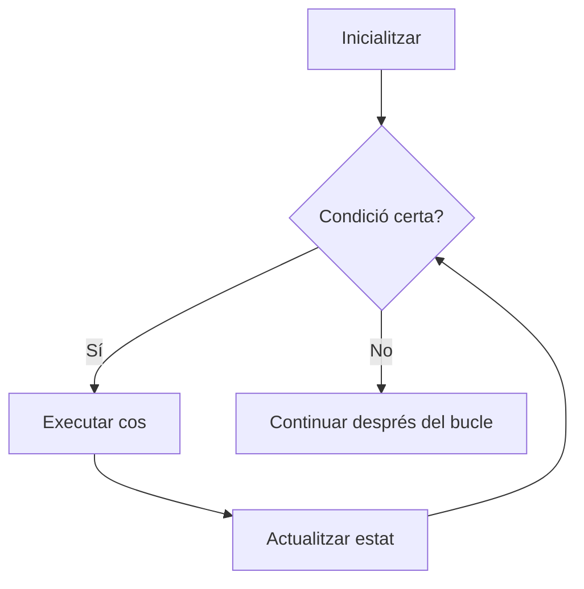

---
hide:
  - navigation
---
# 2. Estructures de repetició

!!! info "Criteris d'avaluació treballats"
    - **RA3.b** — S'han utilitzat estructures de repetició.

Una iteració és una execució repetida d'un bloc de codi. Els bucles eviten copiar la mateixa instrucció moltes vegades i permeten processar una quantitat variable de dades.

## El bucle `while`

`while` repeteix un bloc mentre una condició siga certa.

```python
comptador = 1

while comptador <= 3:
    print(comptador)
    comptador += 1
```

La seqüència bàsica és:

1. inicialitzar les variables que utilitzarà el bucle;
2. comprovar la condició de continuació;
3. executar el cos;
4. actualitzar l'estat;
5. tornar a comprovar la condició.



### Inicialització, condició i actualització

Cada `while` ha de deixar clara la seua variable de control.

```python
numero = 1                 # inicialització

while numero <= 5:         # condició de continuació
    print(numero)
    numero += 1             # actualització
```

Si oblides l'actualització, la condició pot continuar sent certa indefinidament.

```python
# No l'executes: és un bucle infinit.
numero = 1
while numero <= 5:
    print(numero)
```

Un bucle infinit pot bloquejar el programa o produir una quantitat enorme d'eixida. Si és intencionat, com en un servidor o un menú, ha d'existir una manera clara d'abandonar-lo.

## Comptadors i acumuladors

Un comptador augmenta o disminueix per saber quantes vegades ocorre alguna cosa. Un acumulador combina diversos valors, habitualment amb una suma.

```python
quantitat = 0
suma = 0

while quantitat < 4:
    valor = int(input("Introdueix un valor: "))
    suma += valor
    quantitat += 1

print(f"Suma: {suma}")
print(f"Mitjana: {suma / quantitat}")
```

`quantitat` és el comptador d'entrades processades i `suma` és l'acumulador. Inicialitza l'acumulador abans del bucle i actualitza'l en cada iteració.

## Valors sentinella

Un sentinella és un valor especial que indica que l'usuari vol acabar. No forma part de les dades reals.

```python
suma = 0
quantitat = 0

valor = input("Valor enter o 'fi': ")
while valor != "fi":
    suma += int(valor)
    quantitat += 1
    valor = input("Valor enter o 'fi': ")

if quantitat > 0:
    print(f"Mitjana: {suma / quantitat}")
else:
    print("No s'han introduït valors")
```

La conversió a `int` es fa només després de comprovar el sentinella. Si la férem abans, `int("fi")` produiria un `ValueError`.

### El patró `while True`

Quan la condició d'eixida es descobreix enmig del procés, un bucle intencionadament infinit amb un `break` clar pot ser més llegible.

```python
while True:
    resposta = input("Confirma la reserva (s/n): ").lower()

    if resposta in ("s", "n"):
        break

    print("Resposta no vàlida")

print(f"Resposta registrada: {resposta}")
```

Aquest patró és adequat si el punt d'eixida és visible i fàcil d'explicar. No l'utilitzes per ocultar una condició que podria aparéixer directament en la capçalera del `while`.

## El bucle `for`

`for` recorre els elements d'una seqüència, com una cadena o una llista, un per un.

```python
servidors = ["web-01", "web-02", "bd-01"]

for servidor in servidors:
    print(f"Revisant {servidor}")
```

En cada iteració, la variable `servidor` pren el valor del següent element. Usa `for` quan vols visitar una seqüència o quan coneixes el conjunt que vols recórrer.

Un objecte **iterable** és qualsevol objecte que pot proporcionar els seus elements un darrere de l'altre. Les cadenes, les llistes i els objectes produïts per `range()` són iterables. Un `for` demana successivament cada element; no necessita gestionar manualment una posició.

### Cadenes

Una cadena és una seqüència de caràcters.

```python
nom = "Python"

for caracter in nom:
    print(caracter)
```

### Llistes

```python
alumnes = ["Aina", "Biel", "Carla"]

for alumne in alumnes:
    print(f"Present: {alumne}")
```

### Posició i valor amb `enumerate()`

Quan necessites alhora la posició i el contingut, `enumerate()` evita mantindre un comptador manual.

```python
participants = ["Aina", "Biel", "Carla"]

for posicio, participant in enumerate(participants, start=1):
    print(f"{posicio}. {participant}")
```

### Recórrer dades relacionades amb `zip()`

`zip()` combina elements que ocupen la mateixa posició en diverses seqüències. El recorregut acaba quan s'esgota la seqüència més curta.

```python
participants = ["Aina", "Biel", "Carla"]
reserves = [2, 1, 3]

for participant, places in zip(participants, reserves):
    print(f"{participant}: {places} places")
```

Utilitza `zip()` només quan les seqüències representen dades paral·leles i has comprovat que les longituds són coherents.

## `range()`

`range()` genera una seqüència de nombres, molt útil per a repetir una acció un nombre determinat de vegades.

```python
for numero in range(1, 6):
    print(numero)
```

El límit final de `range` no està inclòs: `range(1, 6)` produeix 1, 2, 3, 4 i 5.

| Forma | Valors d'exemple | Ús |
| --- | --- | --- |
| `range(fi)` | `0, 1, ..., fi - 1` | repetir `fi` vegades |
| `range(inici, fi)` | des de `inici` fins a `fi - 1` | definir inici i final |
| `range(inici, fi, pas)` | avançar segons `pas` | salts o recorreguts inversos |

```python
for posicio in range(3):
    print(posicio)          # 0, 1, 2

for hora in range(8, 12):
    print(f"Franja: {hora}:00")

for numero in range(0, 11, 2):
    print(numero)           # 0, 2, 4, 6, 8, 10
```

### Recorregut descendent

Per baixar, usa un pas negatiu i un límit final que també queda exclòs.

```python
for compte_enrere in range(5, 0, -1):
    print(compte_enrere)
print("Inici")
```

El resultat és 5, 4, 3, 2 i 1.

## `for` o `while`?

| Situació | Estructura habitual | Motiu |
| --- | --- | --- |
| Recórrer tots els elements d'una llista | `for` | la seqüència marca el recorregut |
| Repetir exactament 10 vegades | `for` amb `range` | el nombre d'iteracions és conegut |
| Demanar una dada fins que siga correcta | `while` | no saps quants intents caldran |
| Mostrar un menú fins que l'usuari trie eixir | `while` | la condició d'eixida depén de l'usuari |

Un `while` pot substituir un `for`, però sovint obliga a gestionar manualment una posició o un comptador. Tria la construcció que expresse millor la intenció.

## Bucles niats

Un bucle niat és un bucle dins d'un altre. El bucle interior es completa per a cada iteració de l'exterior.

```python
for fila in range(1, 4):
    for columna in range(1, 4):
        print(f"({fila}, {columna})")
```

Aquest exemple genera les nou coordenades d'una graella de tres files i tres columnes.

### Taula de multiplicar

```python
taula = 7

for factor in range(1, 11):
    print(f"{taula} x {factor} = {taula * factor}")
```

### Files i columnes

```python
files = 2
columnes = 4

for fila in range(files):
    linia = ""
    for columna in range(columnes):
        linia += f"[{fila},{columna}] "
    print(linia)
```

En cada fila es construeix una línia i el bucle interior afegeix les columnes. En estructures grans, cal vigilar el cost de combinar bucles, perquè un bucle dins d'un altre pot executar moltes vegades el cos interior.

## Patrons habituals

### Comptar elements que compleixen una condició

```python
notes = [4, 7, 8, 3, 6]
aprovats = 0

for nota in notes:
    if nota >= 5:
        aprovats += 1

print(f"Aprovats: {aprovats}")
```

### Trobar el màxim sense funcions avançades

```python
temperatures = [18, 24, 21, 29, 23]
maxima = temperatures[0]

for temperatura in temperatures[1:]:
    if temperatura > maxima:
        maxima = temperatura

print(f"Màxima: {maxima} °C")
```

La inicialització amb el primer element evita començar amb un valor màgic que podria no servir per a totes les dades.

## Error *off-by-one*

Un error *off-by-one* ocorre quan el bucle fa una iteració de més o de menys. És freqüent confondre el límit inclòs amb el límit exclòs.

```python
# Imprimeix del 1 al 10, tots dos inclosos.
for numero in range(1, 11):
    print(numero)
```

`range(1, 10)` acabaria en 9. Quan dissenyes un recorregut, escriu primer quins valors esperes i comprova el primer i l'últim.

## Programa integrador 2: menú interactiu

El menú següent mostra un patró habitual: `while` manté el programa actiu, `if/elif` tria l'operació, i `try/except` controla entrades numèriques. Les excepcions s'estudien en profunditat en el bloc següent.

```python
saldo = 100.0
opcio = ""

while opcio != "4":
    print("\n1. Consultar saldo")
    print("2. Ingressar diners")
    print("3. Retirar diners")
    print("4. Eixir")
    opcio = input("Tria una opció: ")

    if opcio == "1":
        print(f"Saldo actual: {saldo:.2f} €")
    elif opcio == "2":
        try:
            quantitat = float(input("Quantitat a ingressar: "))
            if quantitat <= 0:
                print("La quantitat ha de ser positiva")
            else:
                saldo += quantitat
                print("Ingrés realitzat")
        except ValueError:
            print("Escriu una quantitat numèrica")
    elif opcio == "3":
        try:
            quantitat = float(input("Quantitat a retirar: "))
            if quantitat <= 0:
                print("La quantitat ha de ser positiva")
            elif quantitat > saldo:
                print("Saldo insuficient")
            else:
                saldo -= quantitat
                print("Retirada realitzada")
        except ValueError:
            print("Escriu una quantitat numèrica")
    elif opcio == "4":
        print("Fins després")
    else:
        print("Opció no vàlida")
```

El bucle acaba perquè l'usuari introdueix `4`, i la condició es comprova de nou abans de començar una altra iteració. Observa que l'opció introduïda és text: per a un menú, comparar amb cadenes evita una conversió innecessària.

### Pensa abans d'executar

En `for numero in range(2, 9, 2)`, quantes iteracions hi ha i quins valors pren `numero`? Escriu-los abans d'obrir Python.

### Taula de traça

Per entendre un bucle, registra l'estat després de cada iteració. En el programa següent:

```python
suma = 0

for valor in [3, 5, 2]:
    suma += valor
```

| Iteració | `valor` | `suma` abans | `suma` després |
| ---: | ---: | ---: | ---: |
| 1 | 3 | 0 | 3 |
| 2 | 5 | 3 | 8 |
| 3 | 2 | 8 | 10 |

Una taula de traça ajuda a detectar inicialitzacions incorrectes, actualitzacions oblidades i errors d'una iteració de més o de menys.

## Pràctica curta

1. **Prediu.** Escriu els valors generats per `range(10, 3, -2)`.
2. **Detecta.** Localitza per què un `while` que demana una contrasenya no acaba encara que l'usuari l'escriga correctament.
3. **Completa.** Recorre una llista de preus amb `enumerate()` i mostra una numeració que comence en 1.
4. **Construeix.** Llig reserves fins que l'usuari escriga `fi`; mostra quantes reserves s'han introduït i el total de places.

## Errors habituals

- Posar l'actualització de la variable fora del `while` i provocar un bucle infinit.
- Utilitzar `range(1, 10)` esperant que incloga el 10.
- Reutilitzar un acumulador sense reinicialitzar-lo quan comença un càlcul nou.
- Dividir per un comptador que pot quedar a zero quan no hi ha dades.
- Modificar la llista que s'està recorrent sense entendre com canvia el recorregut.
- Fer servir dos bucles niats quan una sola passada seria suficient.

!!! note "Recorda"
    Abans d'executar un bucle, identifica la variable que canvia, la condició que el deté i el nombre de vegades que esperes que s'execute.

## Resum

- `while` és adequat quan la continuació depén d'una condició.
- `for` és adequat per recórrer iterables o repetir un nombre conegut de vegades.
- Comptadors compten; acumuladors combinen valors.
- `range` té el límit final exclòs.
- `enumerate()` aporta posició i valor; `zip()` recorre seqüències relacionades.
- Els bucles niats modelen files i columnes, però augmenten el nombre d'iteracions.

[Anterior: estructures de selecció](01-estructures-seleccio.md) · [Índex de la UP3](index.md) · [Activitat 2. Bucles](activitats/activitat-2-bucles.md) · [Següent: sentències de salt](03-sentencies-salt.md)
