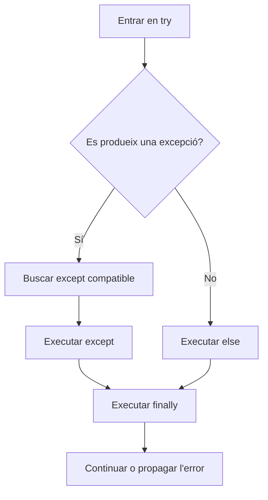

# 4. Control d'excepcions

!!! info "Criteris d'avaluació treballats"
    - **RA3.d** — S'ha escrit codi utilitzant control d'excepcions.

Un programa pot ser sintàcticament correcte i, tanmateix, fallar quan s'executa. El control d'excepcions permet detectar determinats errors en temps d'execució, informar-ne i decidir com continuar o finalitzar.

## Tres tipus d'errors

### Error de sintaxi

Python no pot interpretar el programa perquè incompleix les regles del llenguatge.

```python
# Falta el dos punts: Python no pot analitzar la instrucció.
if edat >= 18
    print("Major")
```

Els errors de sintaxi s'han de corregir abans que el programa comence a executar-se.

### Error en temps d'execució

La sintaxi és vàlida, però falla una operació mentre el programa s'executa.

```python
dividend = 10
divisor = 0
resultat = dividend / divisor  # ZeroDivisionError
```

Una excepció és la manera que té Python d'indicar aquest tipus de situació.

### Error lògic

El programa s'executa i no genera una excepció, però calcula o mostra un resultat incorrecte.

```python
preu = 80
descompte = 20

# Error lògic: s'està sumant el descompte en lloc de restar-lo.
preu_final = preu + descompte
print(preu_final)  # 100, però probablement esperàvem 60
```

Un `try-except` no soluciona els errors lògics. Cal provar el programa i revisar l'algoritme.

## Excepcions habituals

| Excepció | Quan apareix habitualment |
| --- | --- |
| `ValueError` | el tipus és correcte però el valor no es pot convertir o no és acceptable |
| `TypeError` | una operació combina tipus incompatibles |
| `ZeroDivisionError` | es divideix per zero |
| `IndexError` | s'accedeix a una posició inexistent d'una seqüència |
| `KeyError` | es demana una clau que no existeix en un diccionari |
| `FileNotFoundError` | s'intenta obrir un fitxer inexistent |

```python
int("abc")                 # ValueError
"3" + 2                    # TypeError
["a"][4]                   # IndexError
{"nom": "Aina"}["edat"]   # KeyError
```

## `try` i `except`

Posa dins de `try` les instruccions que poden fallar i tracta l'excepció en `except`.

```python
text = input("Escriu un enter: ")

try:
    nombre = int(text)
    print(f"Has escrit {nombre}")
except ValueError:
    print("L'entrada no és un enter vàlid")
```

Si `int(text)` funciona, `except` no s'executa. Si produeix `ValueError`, Python salta al bloc corresponent en lloc d'acabar el programa amb un missatge tècnic.

### Captura una excepció concreta

Captura la classe d'excepció que realment esperes. No uses `except:` per amagar qualsevol problema.

```python
try:
    nombre = int(input("Nombre: "))
    resultat = 100 / nombre
except ValueError:
    print("Has d'escriure un enter")
except ZeroDivisionError:
    print("El nombre no pot ser zero")
else:
    print(f"Resultat: {resultat}")
```

Els blocs `except` es proven en ordre. Un `except Exception` massa prompte també atraparia excepcions més específiques, per això les subclasses concretes han d'anar abans.

### Consultar l'objecte de l'error

`as` dona un nom a l'objecte de l'excepció.

```python
try:
    quantitat = float(input("Quantitat: "))
except ValueError as error:
    print(f"No s'ha pogut convertir l'entrada: {error}")
```

Per a un usuari final, mostra un missatge comprensible. Durant el desenvolupament, l'objecte pot ajudar a diagnosticar el problema, però no convé exposar detalls interns o dades sensibles.

## Per què evitar `except:`?

Un `except:` sense tipus pot capturar qualsevol cosa, fins i tot interrupcions que haurien d'arribar al sistema. A més, pot convertir un error de programació en un comportament silenciós.

```python
# Massa ampli: amaga errors no previstos.
try:
    resultat = calcular_resultat()
except:
    print("Alguna cosa ha fallat")
```

És millor capturar el cas que pots tractar.

```python
try:
    resultat = 100 / divisor
except ZeroDivisionError:
    print("No es pot dividir per zero")
```

`Exception` és una classe base útil quan necessites capturar diverses excepcions no previstes en una frontera concreta de l'aplicació. No la uses com a substitut habitual de les classes específiques.

## `else`

El `else` de `try` s'executa només si el bloc `try` ha acabat sense excepcions. És un bon lloc per a codi que depén que l'operació protegida haja funcionat.

```python
try:
    edat = int(input("Edat: "))
except ValueError:
    print("Edat no numèrica")
else:
    print(f"Edat introduïda: {edat}")
```

Mantindre el `try` xicotet evita capturar accidentalment errors produïts per altres instruccions.

## `finally`

`finally` s'executa tant si hi ha excepció com si no. Serveix per a accions de neteja que sempre s'han de realitzar.

```python
print("Inici de l'operació")

try:
    resultat = 20 / 4
    print(resultat)
except ZeroDivisionError:
    print("Divisor incorrecte")
finally:
    print("Operació finalitzada")
```

En aquesta unitat encara no cal estudiar la gestió avançada de fitxers, però el mateix patró s'utilitza per tancar recursos o restaurar un estat.

## Flux complet de `try-except-else-finally`



```python
try:
    valor = int(input("Enter: "))
except ValueError:
    print("Conversió incorrecta")
else:
    print(f"Conversió correcta: {valor}")
finally:
    print("Aquesta línia apareix sempre")
```

L'ordre és `try` → `except` si hi ha error o `else` si no n'hi ha → `finally` en tots dos casos.

## Validació d'entrada amb excepcions

La conversió de text a nombre pot fallar, per això és habitual envoltar-la amb `try-except`.

```python
edat = -1

while edat < 0 or edat > 120:
    try:
        edat = int(input("Edat entre 0 i 120: "))
        if edat < 0 or edat > 120:
            print("L'edat està fora de l'interval")
    except ValueError:
        print("Escriu un nombre enter")

print(f"Edat acceptada: {edat}")
```

Ací hi ha dos tipus de problema diferents: `ValueError` indica que l'entrada no és un enter, i la condició indica que l'enter està fora de l'interval. Tots dos casos demanen una nova entrada.

### Combinar `while`, `try`, `except` i `break`

Quan el valor és correcte, `break` pot acabar el bucle de validació.

```python
while True:
    try:
        quantitat = float(input("Quantitat positiva: "))
        if quantitat <= 0:
            print("La quantitat ha de ser positiva")
            continue
        break
    except ValueError:
        print("Escriu una quantitat numèrica")

print(f"Quantitat acceptada: {quantitat}")
```

La combinació és útil, però cada camí ha de ser visible: `continue` rebutja dades no vàlides i `break` confirma que el valor ja és acceptable.

## Llançar excepcions amb `raise`

`raise` permet indicar que una dada o un estat incompleix una regla.

```python
edat = 15

if edat < 16:
    raise ValueError("L'edat mínima és 16 anys")
```

No has d'utilitzar sempre `raise` per a una entrada d'usuari; sovint és millor mostrar un missatge i tornar a demanar la dada. `raise` és adequat quan una funció no pot complir el seu contracte i vol informar el codi que l'ha cridada.

```python
def calcular_descompte(preu, percentatge):
    if preu < 0:
        raise ValueError("El preu no pot ser negatiu")
    if not 0 <= percentatge <= 100:
        raise ValueError("El percentatge ha d'estar entre 0 i 100")
    return preu * (1 - percentatge / 100)


try:
    total = calcular_descompte(80, 15)
except ValueError as error:
    print(f"Dada incorrecta: {error}")
else:
    print(f"Total: {total:.2f} €")
```

Les excepcions pròpies del domini s'expliquen en [Excepcions pròpies](05-excepcions-propies.md).

## Programa integrador 3: operació bancària robusta

Aquest programa combina selecció, repetició, conversió d'entrada, `raise`, una excepció pròpia i `else`.

```python
class SaldoInsuficientError(Exception):
    """Indica que una retirada supera el saldo disponible."""


def retirar(saldo, quantitat):
    if quantitat <= 0:
        raise ValueError("La quantitat ha de ser positiva")
    if quantitat > saldo:
        raise SaldoInsuficientError("No hi ha saldo suficient")
    return saldo - quantitat


saldo = 250.0

while True:
    try:
        quantitat = float(input("Quantitat a retirar (0 per acabar): "))
        if quantitat == 0:
            break
        saldo = retirar(saldo, quantitat)
    except ValueError as error:
        print(f"Entrada incorrecta: {error}")
    except SaldoInsuficientError as error:
        print(f"Operació rebutjada: {error}")
    else:
        print(f"Retirada acceptada. Saldo: {saldo:.2f} €")

print("Operació finalitzada")
```

La funció `retirar` no sap com es mostrarà l'error: llança una excepció expressiva. El programa principal decideix com informar l'usuari i continua oferint operacions. Una entrada `0` és el sentinella de finalització i no és una retirada.

## Errors habituals

- Envoltar tot el programa en un `try` massa gran.
- Capturar `Exception` o `except:` sense saber quin problema es tracta.
- Utilitzar `except` per ocultar un error lògic.
- Posar en `finally` una instrucció que depén que l'operació haja funcionat.
- Convertir una entrada abans de comprovar si és un sentinella de text.
- Llançar una excepció per controlar cada pas normal d'un menú.

!!! tip "Bona pràctica"
    Captura l'excepció més específica que pugues, mostra un missatge útil i conserva la informació tècnica necessària per depurar durant el desenvolupament.

## Resum

- Els errors de sintaxi, d'execució i lògics es detecten en moments diferents.
- `try` delimita el codi que pot fallar; `except` tracta un error concret.
- `else` s'executa quan no hi ha excepció i `finally`, sempre.
- `raise` comunica que una operació no pot continuar amb les dades rebudes.
- Les excepcions formen part del disseny d'un programa robust, no són només missatges de l'intèrpret.
