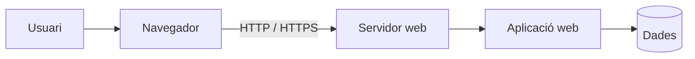

---
hide:
  - navigation
---
# 1. Aplicacions web i aplicacions d'escriptori

Utilitzem aplicacions informàtiques constantment, però no totes funcionen de la mateixa manera.

Una primera classificació important és diferenciar entre:

- **aplicacions d'escriptori**;
- **aplicacions web**.

---

## 1.1. Aplicacions d'escriptori

Una aplicació d'escriptori és un programa que instal·lem directament en el nostre sistema operatiu.

Alguns exemples són:

- LibreOffice;
- VLC;
- Thunderbird;
- Visual Studio Code;
- GIMP.

Normalment, el programa s'executa utilitzant els recursos del nostre ordinador:

- processador;
- memòria RAM;
- disc;
- sistema operatiu.


### Avantatges

- Pot funcionar sense connexió a Internet.
- Pot aprofitar directament els recursos de l'equip.
- Sol oferir una integració major amb el sistema operatiu.

### Inconvenients

- Cal instal·lar-la en cada equip.
- Pot requerir actualitzacions individuals.
- Pot haver-hi incompatibilitats entre sistemes operatius.

---

## 1.2. Aplicacions web

Una aplicació web és una aplicació que s'executa principalment en un **servidor** i a la qual accedim utilitzant un navegador.

Alguns exemples són:

- Gmail;
- Outlook Web;
- Google Drive;
- Moodle;
- Nextcloud;
- Roundcube.

L'usuari normalment només necessita:

- un navegador;
- connexió amb el servidor.



---

## 1.3. Client i servidor

Moltes aplicacions web utilitzen una arquitectura **client-servidor**.

### Client

És l'aplicació que utilitza l'usuari.

En una aplicació web, habitualment és el **navegador**.

### Servidor

És l'equip que proporciona el servei.

Pot executar:

- el servidor web;
- l'aplicació;
- una base de dades;
- altres serveis necessaris.

Per exemple:

```text
Navegador
    │
    │ HTTPS
    ▼
Servidor web
    │
    ▼
Aplicació
    │
    ▼
Base de dades
```

---

## 1.4. Aplicació web o aplicació d'escriptori?

Algunes aplicacions ofereixen les dues possibilitats.

Per exemple, per consultar el correu electrònic podem utilitzar:

| Aplicació | Tipus |
|---|---|
| Thunderbird | Escriptori |
| Microsoft Outlook | Escriptori |
| Gmail | Web |
| Outlook Web | Web |
| Roundcube | Web |

En tots els casos podem acabar accedint al mateix servidor de correu.

El que canvia és **el client utilitzat per l'usuari**.

---

## 1.5. Avantatges de les aplicacions web

Les aplicacions web presenten alguns avantatges importants.

### Accés des de diferents dispositius

Podem accedir-hi des de:

- ordinadors;
- portàtils;
- tauletes;
- telèfons.

Només necessitem un navegador compatible.

### Actualització centralitzada

L'administrador actualitza l'aplicació al servidor.

Els usuaris no han d'actualitzar el programa individualment.

### Menys instal·lacions als clients

Normalment no és necessari instal·lar programari específic en cada ordinador.

---

## 1.6. Inconvenients

També existeixen alguns inconvenients.

### Dependència de la xarxa

Si no podem comunicar-nos amb el servidor, no podrem utilitzar l'aplicació.

### Dependència del servidor

Si el servidor falla, tots els usuaris poden perdre temporalment l'accés.

### Seguretat

Com que l'aplicació està disponible a través de la xarxa, cal protegir:

- l'accés;
- les contrasenyes;
- les comunicacions;
- les dades.

Per aquest motiu s'utilitza habitualment **HTTPS**.

---

## 1.7. Aplicacions web de productivitat

Existeixen moltes aplicacions web orientades al treball quotidià.

### Correu electrònic

- Gmail
- Outlook Web
- Roundcube

### Calendari

- Google Calendar
- Outlook Calendar
- Nextcloud Calendar

### Fitxers

- Google Drive
- OneDrive
- Nextcloud Files

### Ofimàtica

- Microsoft 365
- Google Docs
- OnlyOffice

En aquesta unitat ens centrarem en les aplicacions web de **correu** i **calendari**.
