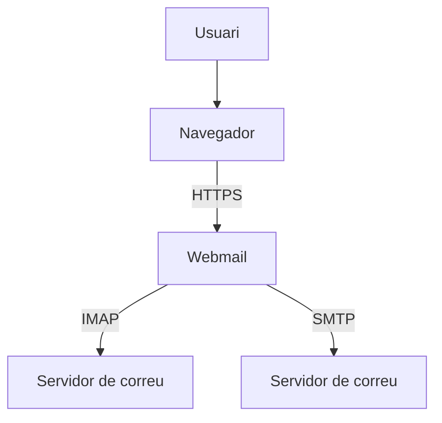
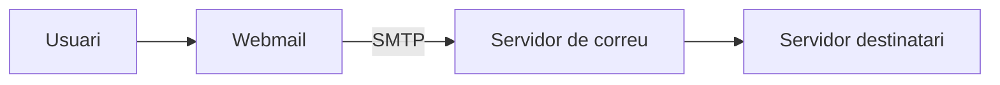
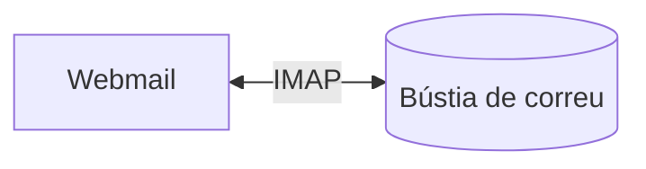
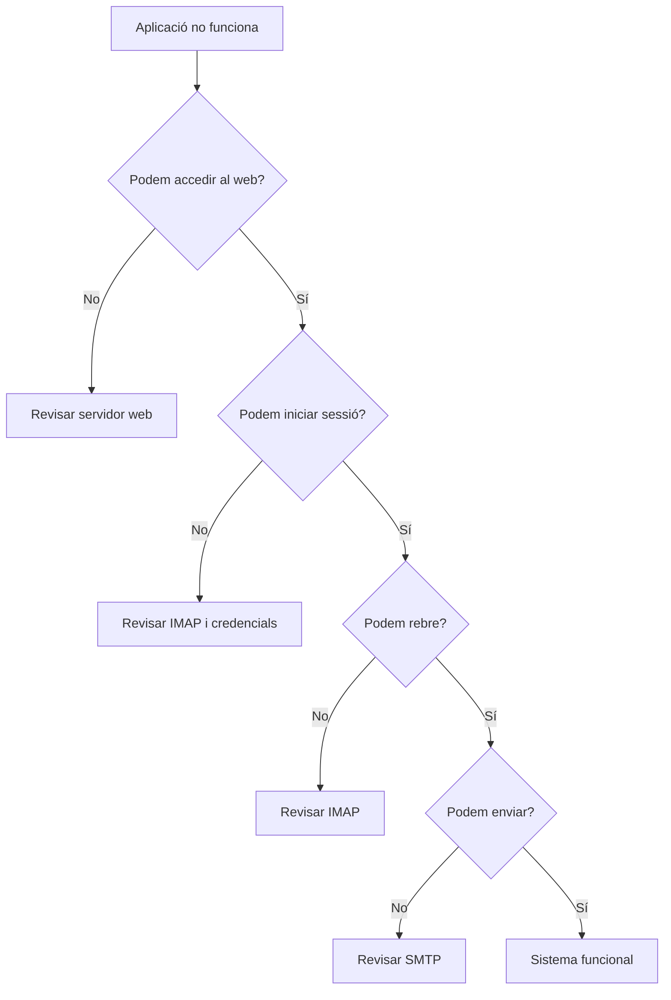

# 2. Correu electrònic i webmail

El correu electrònic és un dels serveis més utilitzats d'Internet.

Però quan enviem un correu des del navegador intervenen diferents aplicacions i protocols.

Per entendre com funciona un **webmail**, primer necessitem conéixer els components principals del sistema.

---

## 2.1. Què és un webmail?

Un **webmail** és una aplicació web que permet gestionar el correu electrònic utilitzant un navegador.

Alguns exemples són:

- Gmail;
- Outlook Web;
- Roundcube.

Un webmail no és necessàriament el servidor que emmagatzema o envia els correus.

La seua funció principal és proporcionar una **interfície web** a l'usuari.



---

## 2.2. Components d'un sistema de correu

En un sistema de correu electrònic podem trobar diversos components.

### Client de correu

És l'aplicació que utilitza l'usuari.

Pot ser:

- una aplicació d'escriptori, com Thunderbird;
- una aplicació web, com Roundcube.

### Servidor de correu

Gestiona l'enviament i l'emmagatzematge dels missatges.

### Webmail

Proporciona una interfície web per accedir al correu.

---

## 2.3. SMTP

**SMTP** significa:

> Simple Mail Transfer Protocol

És el protocol utilitzat principalment per **enviar correu electrònic**.

Quan enviem un missatge:



Alguns ports habituals d'SMTP són:

| Port | Ús habitual |
|---:|---|
| 25 | Comunicació entre servidors |
| 465 | SMTP amb TLS |
| 587 | Enviament autenticat de correu |

En una aplicació de correu per a usuaris és habitual utilitzar el port **587**.

---

## 2.4. IMAP

**IMAP** significa:

> Internet Message Access Protocol

Permet consultar i gestionar els missatges emmagatzemats al servidor.

Per exemple, permet:

- consultar correus;
- crear carpetes;
- marcar missatges com a llegits;
- eliminar missatges;
- moure missatges entre carpetes.



Ports habituals:

| Port | Ús |
|---:|---|
| 143 | IMAP |
| 993 | IMAP amb TLS |

Actualment és habitual utilitzar **IMAPS sobre el port 993**.

---

## 2.5. SMTP i IMAP no fan el mateix

És important no confondre'ls.

| Protocol | Funció principal |
|---|---|
| SMTP | Enviar correus |
| IMAP | Consultar i gestionar els correus |

Una forma senzilla de recordar-ho és:

```text
          SMTP
Usuari ----------> Servidor
        ENVIA

          IMAP
Usuari <---------> Servidor
       CONSULTA
```

---

## 2.6. Què és POP3?

Existeix també el protocol **POP3**.

Tradicionalment s'utilitzava per descarregar els missatges del servidor al dispositiu de l'usuari.

Actualment, per treballar des de diversos dispositius, és habitual utilitzar **IMAP**.

En aquesta unitat treballarem principalment amb:

- SMTP;
- IMAP.

---

## 2.7. Roundcube

**Roundcube** és una aplicació de webmail de codi obert.

Permet accedir al correu electrònic utilitzant un navegador.

Algunes de les seues funcionalitats són:

- lectura de missatges;
- enviament de correu;
- carpetes;
- contactes;
- fitxers adjunts;
- cerca;
- identitats;
- signatures.

---

## 2.8. Roundcube no és el servidor de correu

Aquesta diferència és especialment important.

Roundcube **no envia directament els correus a Internet ni manté les bústies dels usuaris**.

Roundcube es connecta als serveis del servidor de correu.

```text
                     ┌──────────────┐
                     │   Navegador  │
                     └──────┬───────┘
                            │ HTTPS
                            ▼
                     ┌──────────────┐
                     │  Roundcube   │
                     └──────┬───────┘
                       ┌────┴────┐
                       │         │
                      IMAP      SMTP
                       │         │
                       ▼         ▼
                  ┌──────────────────┐
                  │ Servidor correu  │
                  └──────────────────┘
```

Per tant, si Roundcube està instal·lat però no té configurats correctament IMAP i SMTP, no podrà treballar amb el correu.

---

## 2.9. Configuració bàsica d'un webmail

Per connectar una aplicació web a un servidor de correu necessitarem dades semblants a aquestes:

```text
Servidor IMAP:
mail.empresa.local

Port:
993

Seguretat:
TLS

Servidor SMTP:
mail.empresa.local

Port:
587

Autenticació:
Sí
```

Els valors dependran de la configuració del servidor.

---

## 2.10. Autenticació

Per accedir al correu, normalment l'usuari haurà d'identificar-se mitjançant:

- nom d'usuari o adreça de correu;
- contrasenya.

Per exemple:

```text
Usuari:
joan@empresa.local

Contrasenya:
********
```

El webmail utilitza aquestes credencials per autenticar l'usuari contra el servidor de correu.

---

## 2.11. Comptes i identitats

Cal diferenciar dos conceptes.

### Compte de correu

Representa la bústia que existeix al servidor.

Per exemple:

```text
maria@empresa.local
```

### Identitat

És la informació que es mostra quan enviem un correu.

Pot incloure:

- nom;
- adreça;
- organització;
- signatura.

Per exemple:

```text
Maria Garcia
Servei tècnic
maria@empresa.local
```

---

## 2.12. Signatures

Una signatura és un text que s'afegeix automàticament als missatges.

Per exemple:

```text
Maria Garcia
Departament de suport

Empresa Exemple
suport@empresa.local
```

Les signatures són habituals en entorns professionals.

---

## 2.13. Verificació del funcionament

Una vegada configurat el webmail, cal comprovar que realment funciona.

Una verificació mínima hauria d'incloure:

### Accés

Comprovar que podem:

- obrir l'aplicació;
- iniciar sessió.

### Enviament

Enviar un missatge a un altre usuari.

### Recepció

Comprovar que el destinatari rep el missatge.

### Resposta

Respondre el correu.

### Fitxers adjunts

Enviar un document adjunt.

---

## 2.14. Diagnòstic de problemes

Durant la configuració poden aparéixer errors.

Alguns dels més habituals són:

### No podem iniciar sessió

Possibles causes:

- usuari incorrecte;
- contrasenya incorrecta;
- servidor IMAP incorrecte;
- servidor no disponible.

### Podem llegir correus però no enviar

Probablement existeix un problema amb SMTP.

Cal comprovar:

- servidor SMTP;
- port;
- TLS;
- autenticació.

### Podem enviar però no rebre

Cal revisar la configuració IMAP.

---

## 2.15. Estratègia de diagnòstic

Quan una aplicació no funciona, és important no canviar configuracions a l'atzar.

Podem seguir aquest procediment:



L'objectiu és localitzar **en quin punt del sistema apareix el problema**.
