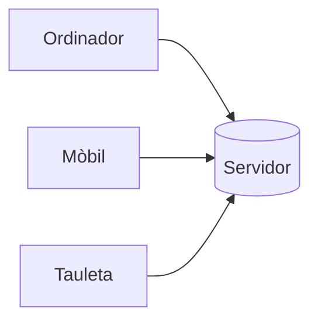
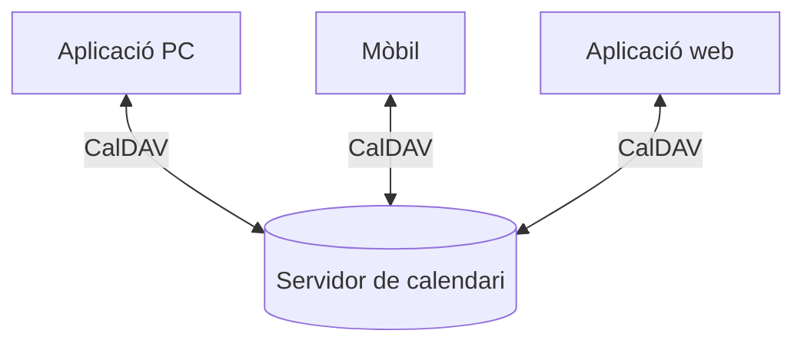

---
hide:
  - navigation
---
# 3. Calendaris web

Un calendari web és una aplicació que permet gestionar informació relacionada amb el temps i l'organització personal o professional.

Pot utilitzar-se per gestionar:

- cites;
- reunions;
- recordatoris;
- calendaris compartits;
- esdeveniments;
- tasques.

Alguns exemples són:

- Google Calendar;
- Outlook Calendar;
- Nextcloud Calendar.

---

## 3.1. Calendari local i calendari web

Un calendari local emmagatzema la informació principalment en un dispositiu.

Un calendari web manté les dades en un servidor.



Això permet consultar el mateix calendari des de diferents dispositius.

---

## 3.2. Avantatges d'un calendari web

### Accés des de diferents dispositius

Podem consultar el calendari des de:

- ordinador;
- mòbil;
- tauleta.

### Informació sincronitzada

Quan modifiquem una cita, el canvi pot aparéixer en tots els dispositius.

### Compartició

Podem compartir calendaris amb:

- companys;
- departaments;
- grups de treball.

### Coordinació

Podem utilitzar-lo per organitzar reunions i activitats entre diversos usuaris.

---

## 3.3. Esdeveniments

La unitat bàsica d'un calendari és l'**esdeveniment**.

Normalment podem indicar:

- títol;
- data;
- hora;
- duració;
- ubicació;
- descripció.

Per exemple:

```text
Reunió equip tècnic

Data:
21/10/2026

Hora:
10:00 - 11:00

Ubicació:
Sala de reunions

Descripció:
Revisió de les incidències de la setmana.
```

---

## 3.4. Recordatoris

Un calendari pot avisar-nos abans que comence un esdeveniment.

Per exemple:

```text
Reunió: 10:00

Recordatori:
15 minuts abans
```

Els avisos poden presentar-se mitjançant:

- notificacions;
- correu electrònic;
- aplicacions mòbils.

---

## 3.5. Esdeveniments recurrents

Algunes activitats es repeteixen periòdicament.

Per exemple:

> reunió d'equip cada dilluns a les 9:00.

En lloc de crear manualment totes les reunions, podem crear un **esdeveniment recurrent**.

Algunes recurrències habituals són:

- diària;
- setmanal;
- mensual;
- anual.

---

## 3.6. Calendaris múltiples

Un mateix usuari pot tindre diversos calendaris.

Per exemple:

```text
Maria
│
├── Personal
├── Empresa
├── Projecte DAW
└── Vacances
```

Això permet separar diferents tipus d'activitats.

---

## 3.7. Calendaris compartits

Una de les funcionalitats més interessants és poder compartir calendaris.

Per exemple, un departament podria disposar d'un calendari:

```text
Calendari: Servei tècnic

Joan ────┐
Maria ───┼──> Calendari compartit
Pau ─────┘
```

Els permisos poden ser diferents.

Un usuari podria tindre permís per:

- només consultar;
- crear esdeveniments;
- modificar esdeveniments;
- administrar el calendari.

---

## 3.8. Invitacions

Quan creem una reunió podem convidar altres usuaris.

Per exemple:

```text
Reunió de projecte

Organitzador:
maria@empresa.local

Participants:
joan@empresa.local
pau@empresa.local
```

Els participants poden acceptar o rebutjar la invitació.

---

## 3.9. Tasques

Algunes plataformes també permeten gestionar **tasques**.

Una tasca pot tindre:

- títol;
- data límit;
- prioritat;
- estat;
- descripció.

Per exemple:

```text
Tasques

☑ Actualitzar servidor web
☐ Revisar còpies de seguretat
☐ Configurar nou usuari
```

Les tasques no són exactament iguals que els esdeveniments.

Un esdeveniment normalment ocorre en una data i hora concretes.

Una tasca representa **una activitat que hem de completar**.

---

## 3.10. CalDAV

**CalDAV** és un protocol que permet accedir i sincronitzar calendaris emmagatzemats en un servidor.

Permet que diferents aplicacions treballen amb el mateix calendari.



D'aquesta manera, el calendari no depén necessàriament d'una única aplicació.

---

## 3.11. Nextcloud Calendar

Nextcloud és una plataforma web de col·laboració.

Entre les seues aplicacions podem trobar:

- fitxers;
- contactes;
- calendaris;
- tasques;
- notes;
- altres extensions.

**Nextcloud Calendar** permet gestionar calendaris directament des del navegador.

Algunes funcionalitats són:

- crear calendaris;
- crear esdeveniments;
- configurar recordatoris;
- crear recurrències;
- compartir calendaris;
- convidar usuaris.

---

## 3.12. Aplicacions modulars

Una característica interessant de plataformes com Nextcloud és que les funcionalitats poden instal·lar-se com a **aplicacions addicionals**.

Per exemple:

```text
Nextcloud
│
├── Files
├── Calendar
├── Contacts
├── Tasks
└── Notes
```

L'administrador pot activar només les funcionalitats que necessita l'organització.

Aquesta arquitectura facilita ampliar una aplicació web sense haver d'instal·lar un sistema completament diferent.

---

## 3.13. Exemple d'ús en una empresa

Imaginem un petit servei tècnic.

L'empresa podria utilitzar un calendari compartit per registrar:

| Hora | Activitat |
|---|---|
| 09:00 | Instal·lació d'un ordinador |
| 10:30 | Reunió amb client |
| 12:00 | Manteniment del servidor |
| 16:00 | Revisió de còpies de seguretat |

Tots els tècnics podrien consultar el calendari.

Alguns podrien també afegir o modificar activitats.

---

## 3.14. Correu i calendari

En moltes plataformes, el correu i el calendari estan relacionats.

Per exemple, podem rebre un correu amb una invitació:

```text
Maria t'ha convidat a:

Reunió del projecte
22 d'octubre
10:00 - 11:00
```

L'usuari pot:

- acceptar;
- rebutjar;
- afegir l'esdeveniment al calendari.

Aquesta integració és habitual en eines de productivitat modernes.
