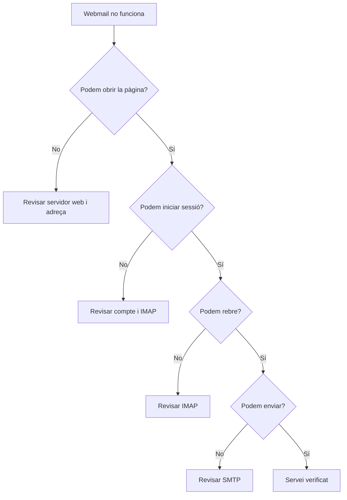

---
hide:
  - navigation
---
# Activitat 1. Webmail de l'empresa

## Situació professional

L'empresa disposa d'un servidor de correu preparat, però necessita una interfície web perquè els usuaris puguen consultar i enviar missatges des del navegador. El teu encàrrec és desplegar **Roundcube**, integrar-lo amb el servidor de correu i comprovar que el servei funciona.

El servidor de correu serà proporcionat i estarà preparat pel professorat. No cal configurar Postfix, Dovecot, DNS ni altres serveis de correu des de zero: en aquesta activitat treballarem l'aplicació web i la seua integració.

## Objectiu

Desplegar i configurar un webmail, gestionar un compte d'usuari i verificar l'accés, l'enviament i la recepció de correu.

En finalitzar l'activitat hauràs de ser capaç de:

- diferenciar un client de correu d'escriptori d'un webmail;
- explicar la funció bàsica d'IMAP i SMTP;
- desplegar una aplicació web de correu;
- configurar la connexió amb els serveis IMAP i SMTP;
- gestionar la identitat i el compte d'un usuari;
- comprovar el funcionament mitjançant proves i evidències;
- diagnosticar una incidència senzilla de configuració.

## Criteris d'avaluació treballats

| Criteri | Descripció | Pes sobre RA5 |
|---|---|---:|
| **RA5.a** | Descriure diferents aplicacions web i d'escriptori. | 10 % |
| **RA5.b** | Instal·lar aplicacions per proporcionar accés web al servidor de correu electrònic. | 20 % |
| **RA5.c** | Configurar les aplicacions per integrar-les amb un servidor de correu. | 10 % |
| **RA5.d** | Gestionar els comptes d'usuari. | 20 % |
| **RA5.e** | Verificar l'accés al correu electrònic. | 20 % |
|  | **Total de l'activitat** | **80 %** |

## Materials i dades de partida

El professorat proporcionarà:

- l'entorn de pràctiques o servidor web on desplegar Roundcube;
- l'adreça del servidor de correu;
- les dades dels serveis IMAP i SMTP;
- un compte de proves per a cada alumne o parella;
- les instruccions d'accés a l'entorn.

Exemple de configuració:

```text
IMAP: mail.empresa.local
Port: 993
TLS: Sí

SMTP: mail.empresa.local
Port: 587
TLS: Sí
```

No publiques contrasenyes ni altres credencials en el lliurament.

## Tasca

### 1. Comparació inicial

Abans de començar, respon breument:

1. Quina diferència hi ha entre Thunderbird i Roundcube?
2. Quin programa actua com a client en cada cas?
3. Quin protocol s'utilitza habitualment per enviar correu?
4. Quin protocol permet consultar i gestionar la bústia del servidor?
5. Quins avantatges aporta accedir al correu des d'un navegador?

Compara, com a mínim, aquestes aplicacions:

| Aplicació | Tipus | Accés principal | Servei amb què treballa |
|---|---|---|---|
| Thunderbird | Escriptori | Programa instal·lat | Servidor de correu |
| Gmail o Outlook Web | Web | Navegador | Servei de correu |
| Roundcube | Web | Navegador | Servidor IMAP i SMTP |

### 2. Desplegament de Roundcube

1. Accedeix a l'entorn de pràctiques.
2. Desplega Roundcube seguint les indicacions del professorat.
3. Comprova que l'aplicació web s'inicia sense errors.
4. Obri l'adreça de Roundcube des del navegador.
5. Anota l'adreça utilitzada i la versió de l'aplicació, si és visible.

No cal documentar cada ordre d'instal·lació. Cal demostrar que l'aplicació queda accessible i operativa.

### 3. Configuració dels serveis

Configura Roundcube perquè utilitze les dades proporcionades:

- servidor IMAP;
- port IMAP;
- xifratge o TLS;
- servidor SMTP;
- port SMTP;
- autenticació del compte.

Recorda que Roundcube és el client web. El servidor de correu continua sent el responsable de les bústies i dels serveis de missatgeria.

### 4. Compte i identitat

Accedeix amb el compte de proves i configura:

- el nom que es mostrarà als destinataris;
- l'adreça de correu;
- una signatura professional breu.

No inclogues la contrasenya en cap captura.

### 5. Proves de funcionament

Realitza aquestes proves:

1. Inicia sessió amb el compte proporcionat.
2. Envia un missatge a un company o al compte indicat pel professorat.
3. Comprova que el destinatari rep el missatge.
4. Respon el missatge rebut.
5. Envia un fitxer adjunt de prova que no continga dades personals.
6. Comprova que pots consultar, moure i marcar missatges.

Registra el resultat de cada prova:

| Prova | Resultat | Observacions |
|---|---|---|
| Accés i inici de sessió | Correcte / Incorrecte |  |
| Enviament | Correcte / Incorrecte |  |
| Recepció | Correcte / Incorrecte |  |
| Resposta | Correcte / Incorrecte |  |
| Fitxer adjunt | Correcte / Incorrecte |  |

### 6. Diagnòstic d'una incidència

El professorat et proporcionarà una configuració amb una dada incorrecta. Pot ser, per exemple:

- un port IMAP o SMTP incorrecte;
- el servidor SMTP incorrecte;
- el TLS desactivat o mal seleccionat;
- un usuari incorrecte.

Localitza el problema a partir dels símptomes, corregeix-lo i explica quina prova confirma la solució. No canvies diverses dades alhora sense justificar-ho.

Pots seguir aquest esquema:



## Comprovació final

- [ ] He comparat una aplicació web i una d'escriptori.
- [ ] Roundcube és accessible des del navegador.
- [ ] La connexió IMAP està configurada.
- [ ] La connexió SMTP està configurada.
- [ ] He accedit amb el compte proporcionat.
- [ ] He configurat la identitat i la signatura.
- [ ] He enviat i rebut un missatge.
- [ ] He respost un missatge.
- [ ] He comprovat un fitxer adjunt.
- [ ] He resolt una incidència de configuració.
- [ ] Les evidències no contenen contrasenyes ni dades sensibles.

## Lliurament

Entrega un document breu, preferiblement en PDF, amb:

1. la resposta de la comparació inicial;
2. una captura de Roundcube accessible;
3. una captura de la configuració IMAP i SMTP sense credencials;
4. una captura del compte o la identitat configurada, sense contrasenya;
5. una evidència de l'enviament i la recepció;
6. la taula de proves completada;
7. la incidència detectada, la solució i la prova final.

Cada captura ha d'anar acompanyada d'una frase que indique què acredita. No cal elaborar una memòria llarga ni incloure captures de cada pas.

## Verificació davant del professorat

En una comprovació ràpida hauràs de poder:

- obrir el webmail;
- explicar la diferència entre IMAP i SMTP;
- mostrar una prova d'enviament o recepció;
- indicar quina dada corregiries davant d'un símptoma concret.

## Rúbrica de tres nivells

| Aspecte | Assoliment alt | Assoliment bàsic | En procés |
|---|---|---|---|
| Comparació i conceptes | Diferencia clarament aplicacions web i d'escriptori i explica la funció d'IMAP i SMTP. | Identifica els dos tipus d'aplicació i associa els protocols amb alguna ajuda. | Confón client, servidor, IMAP o SMTP. |
| Desplegament i configuració | Roundcube és accessible i els serveis IMAP/SMTP estan configurats de manera coherent. | L'aplicació funciona, però necessita alguna correcció o explicació addicional. | No aconsegueix fer accessible o configurar l'aplicació. |
| Compte i identitat | Gestiona el compte, configura la identitat i evita exposar credencials. | Completa la configuració amb errors menors o evidències incompletes. | No pot accedir al compte o mostra dades sensibles. |
| Verificació i diagnòstic | Prova enviament, recepció i adjunts, interpreta els símptomes i resol la incidència amb criteri. | Fa les proves principals i resol la incidència amb orientació. | No pot verificar el servei ni localitzar el problema. |
| Evidències | Presenta captures contextualitzades, taula de proves i conclusions breus. | Presenta les evidències essencials amb alguna mancança. | Presenta captures sense context o no lliura les proves necessàries. |

[Següent: agenda web de l'empresa](activitat-2-calendari-web.md) · [Índex de la UP1](../index.md)
